# Measure Lineage and Dependencies

## High-level overview
- Measures are defined across multiple tables, with the bulk of business logic living in the `1_Measures` table and smaller supporting tables providing base aggregations and slicer-driven helper measures.
- Common patterns include base aggregations over fact tables (e.g., `SUM(...)`), helper measures using `SELECTEDVALUE` for parameter selection, and derived measures that calculate variance or time-shifted values using `CALCULATE` and `USERELATIONSHIP`.
- Time-intelligence measures are typically layered on top of base measures, followed by variance/percentage measures that compare current to LY/LW/plan scenarios.

## Dependency diagrams
### Table: 1_Measures
#### Group: Commentary
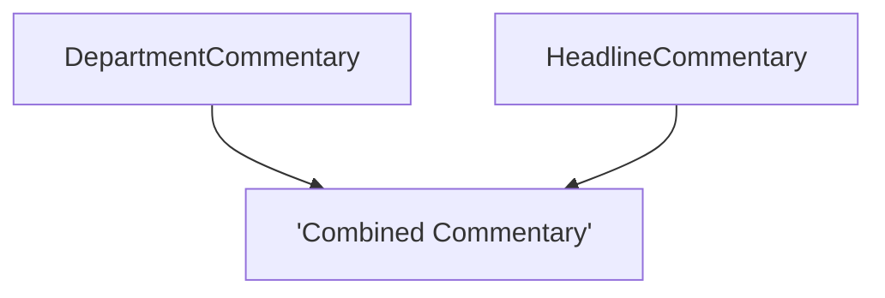

#### Group: Dynamic Labels
```mermaid
graph TD
    tiTimePeriod[tiTimePeriod] --> tiTimeLabel[tiTimeLabel]
    tiWeekNo[tiWeekNo] --> tiTimeLabel[tiTimeLabel]
    tiChannel[tiChannel] --> tiTimeLabelProductChannelSalesTypeSalesRecogType[tiTimeLabelProductChannelSalesTypeSalesRecogType]
    tiProduct[tiProduct] --> tiTimeLabelProductChannelSalesTypeSalesRecogType[tiTimeLabelProductChannelSalesTypeSalesRecogType]
    tiSalesRecogType[tiSalesRecogType] --> tiTimeLabelProductChannelSalesTypeSalesRecogType[tiTimeLabelProductChannelSalesTypeSalesRecogType]
    tiSalesType[tiSalesType] --> tiTimeLabelProductChannelSalesTypeSalesRecogType[tiTimeLabelProductChannelSalesTypeSalesRecogType]
    tiTimeLabel[tiTimeLabel] --> tiTimeLabelProductChannelSalesTypeSalesRecogType[tiTimeLabelProductChannelSalesTypeSalesRecogType]
    tiSalesType[tiSalesType] --> tiSalesMeasureSelection[tiSalesMeasureSelection]
    tiSalesType[tiSalesType] --> tiSalesMeasureSelectionByChannel[tiSalesMeasureSelectionByChannel]
    tiSalesType[tiSalesType] --> tiSalesMeasureSelectionByBU[tiSalesMeasureSelectionByBU]
    tiSalesType[tiSalesType] --> tiSalesMeasureSelectionByWeek[tiSalesMeasureSelectionByWeek]
    tiChannel[tiChannel] --> tiHeadlinesHeader[tiHeadlinesHeader]
    tiProduct[tiProduct] --> tiHeadlinesHeader[tiHeadlinesHeader]
    tiSalesRecogType[tiSalesRecogType] --> tiHeadlinesHeader[tiHeadlinesHeader]
    tiSalesType[tiSalesType] --> tiHeadlinesHeader[tiHeadlinesHeader]
    tiWeekNo[tiWeekNo] --> tiHeadlinesHeader[tiHeadlinesHeader]
    tiWeekNo[tiWeekNo] --> _1Front_Cover_['1Front Cover']
```

#### Group: Intake
```mermaid
graph TD
    R_FPPIntakeValue[R_FPPIntakeValue] --> Rolling_FPPIntakeValue[Rolling_FPPIntakeValue]
    R_FPPIntakeVolume[R_FPPIntakeVolume] --> Rolling_FPPIntakeVolume[Rolling_FPPIntakeVolume]
    R_FPPFwdView[R_FPPFwdView] --> R_FPP_SRIV[R_FPP_SRIV]
    R_FPP_SRIV[R_FPP_SRIV] --> Rolling_FPPSRIV[Rolling_FPPSRIV]
    FPPIntakeValueComp[FPPIntakeValueComp] --> R_FPPIntakeValueComp[R_FPPIntakeValueComp]
    FPPIntakeVolComp[FPPIntakeVolComp] --> R_FPPIntakeVolumeComp[R_FPPIntakeVolumeComp]
    R_FPPIntakeValueComp[R_FPPIntakeValueComp] --> Rolling_FPPIntakeValueComp[Rolling_FPPIntakeValueComp]
    R_FPPIntakeVolumeComp[R_FPPIntakeVolumeComp] --> Rolling_FPPIntakeVolumeComp[Rolling_FPPIntakeVolumeComp]
    Rolling_FPPIntakeValue[Rolling_FPPIntakeValue] --> Rolling_FPPIntakeValuevsComp[Rolling_FPPIntakeValuevsComp]
    Rolling_FPPIntakeValueComp[Rolling_FPPIntakeValueComp] --> Rolling_FPPIntakeValuevsComp[Rolling_FPPIntakeValuevsComp]
    Rolling_FPPIntakeValue[Rolling_FPPIntakeValue] --> Rolling_FPPIntakeValuevsComp_[Rolling_FPPIntakeValuevsComp%]
    Rolling_FPPIntakeValueComp[Rolling_FPPIntakeValueComp] --> Rolling_FPPIntakeValuevsComp_[Rolling_FPPIntakeValuevsComp%]
    Rolling_FPPIntakeVolume[Rolling_FPPIntakeVolume] --> Rolling_FPPIntakeVolumevsComp[Rolling_FPPIntakeVolumevsComp]
    Rolling_FPPIntakeVolumeComp[Rolling_FPPIntakeVolumeComp] --> Rolling_FPPIntakeVolumevsComp[Rolling_FPPIntakeVolumevsComp]
    Rolling_FPPIntakeVolume[Rolling_FPPIntakeVolume] --> Rolling_FPPIntakeVolumevsComp_[Rolling_FPPIntakeVolumevsComp%]
    Rolling_FPPIntakeVolumeComp[Rolling_FPPIntakeVolumeComp] --> Rolling_FPPIntakeVolumevsComp_[Rolling_FPPIntakeVolumevsComp%]
    R_FPPSRIVCompCalc[R_FPPSRIVCompCalc] --> R_FPP_SRIVComp[R_FPP_SRIVComp]
    R_FPP_SRIVComp[R_FPP_SRIVComp] --> Rolling_FPPSRIVComp[Rolling_FPPSRIVComp]
    Rolling_FPPSRIV[Rolling_FPPSRIV] --> Rolling_FPPSRIVvsComp[Rolling_FPPSRIVvsComp]
    Rolling_FPPSRIVComp[Rolling_FPPSRIVComp] --> Rolling_FPPSRIVvsComp[Rolling_FPPSRIVvsComp]
    Rolling_FPPSRIV[Rolling_FPPSRIV] --> Rolling_FPPSRIVvsComp_[Rolling_FPPSRIVvsComp%]
    Rolling_FPPSRIVComp[Rolling_FPPSRIVComp] --> Rolling_FPPSRIVvsComp_[Rolling_FPPSRIVvsComp%]
```

#### Group: Margin
```mermaid
graph TD
    GSM[GSM] --> _GSM_BUD_['GSM BUD']
    GSM[GSM] --> _GSM_FC_['GSM FC']
    GSM[GSM] --> _GSM_Fwd_View_['GSM Fwd View']
    GSM[GSM] --> _GSM_QRF_['GSM QRF']
    GSM[GSM] --> _GSM_vs_BUD___['GSM vs BUD %']
    GSM[GSM] --> _GSM_vs_BUD_['GSM vs BUD']
    GSM[GSM] --> _GSM_vs_FC___['GSM vs FC %']
    GSM[GSM] --> _GSM_vs_FC_['GSM vs FC']
    GSM[GSM] --> _GSM_vs_LE___['GSM vs LE %']
    GSM[GSM] --> _GSM_vs_LE_['GSM vs LE']
    GSM[GSM] --> _GSM_vs_LW___['GSM vs LW %']
    GSM[GSM] --> _GSM_vs_LW_['GSM vs LW']
    GSM[GSM] --> _GSM_vs_LY___['GSM vs LY %']
    GSM[GSM] --> _GSM_vs_LY_['GSM vs LY']
    GSM[GSM] --> _GSM_vs_LY_1___['GSM vs LY-1 %']
    GSM[GSM] --> _GSM_vs_LY_1_['GSM vs LY-1']
    GSM[GSM] --> _GSM_vs_QRF___['GSM vs QRF %']
    GSM[GSM] --> _GSM_vs_QRF_['GSM vs QRF']
    GSM[GSM] --> _RP_GSM_vs_BUD___['RP GSM vs BUD %']
    GSM[GSM] --> _RP_GSM_vs_BUD_['RP GSM vs BUD']
    GSM[GSM] --> Mbr18_BIMPct[Mbr18_BIMPct]
    GSM[GSM] --> Mbr98_CalculatedCOGS[Mbr98_CalculatedCOGS]
    GSM[GSM] --> MbrComp18_GSM[MbrComp18_GSM]
    Markdown[Markdown] --> _Markdown_FC_['Markdown FC']
    Markdown[Markdown] --> _Markdown_QRF_['Markdown QRF']
    Markdown[Markdown] --> _Markdown_vs_BUD___['Markdown vs BUD %']
    Markdown[Markdown] --> _Markdown_vs_BUD_['Markdown vs BUD']
    Markdown[Markdown] --> _Markdown_vs_FC___['Markdown vs FC %']
    Markdown[Markdown] --> _Markdown_vs_FC_['Markdown vs FC']
    Markdown[Markdown] --> _Markdown_vs_LW___['Markdown vs LW %']
    Markdown[Markdown] --> _Markdown_vs_LW_['Markdown vs LW']
    Markdown[Markdown] --> _Markdown_vs_LY___['Markdown vs LY %']
    Markdown[Markdown] --> _Markdown_vs_LY_['Markdown vs LY']
    Markdown[Markdown] --> _Markdown_vs_LY_1___['Markdown vs LY-1 %']
    Markdown[Markdown] --> _Markdown_vs_LY_1_['Markdown vs LY-1']
    Markdown[Markdown] --> _Markdown_vs_QRF___['Markdown vs QRF %']
    Markdown[Markdown] --> _Markdown_vs_QRF_['Markdown vs QRF']
    Markdown[Markdown] --> _Reduced_Markdown_['Reduced Markdown']
    Mbr01_SRIVMainchain[Mbr01_SRIVMainchain] --> Mbr02_SRIVFPP[Mbr02_SRIVFPP]
    Mbr01_SRIVMainchain[Mbr01_SRIVMainchain] --> Mbr03_SRIVRP[Mbr03_SRIVRP]
    Mbr01_SRIVMainchain[Mbr01_SRIVMainchain] --> Mbr06_VAT[Mbr06_VAT]
    Mbr01_SRIVMainchain[Mbr01_SRIVMainchain] --> Mbr11_SaleMDPct[Mbr11_SaleMDPct]
    Mbr01_SRIVMainchain[Mbr01_SRIVMainchain] --> Mbr13_MDPct[Mbr13_MDPct]
    Mbr01_SRIVMainchain[Mbr01_SRIVMainchain] --> Mbr14_DOCPct[Mbr14_DOCPct]
    Mbr01_SRIVMainchain[Mbr01_SRIVMainchain] --> Mbr15_GrossSRIV[Mbr15_GrossSRIV]
    Mbr01_SRIVMainchain[Mbr01_SRIVMainchain] --> Mbr99_GrossSREV[Mbr99_GrossSREV]
    Mbr01_SRIVMainchain[Mbr01_SRIVMainchain] --> MbrMix00_SRIV[MbrMix00_SRIV]
    Mbr01_SRIVMainchain[Mbr01_SRIVMainchain] --> MbrMix01_FPPSales[MbrMix01_FPPSales]
    Mbr02_SRIVFPP[Mbr02_SRIVFPP] --> Mbr04_SRIV[Mbr04_SRIV]
    Mbr02_SRIVFPP[Mbr02_SRIVFPP] --> Mbr07_POS[Mbr07_POS]
    Mbr02_SRIVFPP[Mbr02_SRIVFPP] --> Mbr08_POSPct[Mbr08_POSPct]
    Mbr02_SRIVFPP[Mbr02_SRIVFPP] --> MbrMix01_FPPSales[MbrMix01_FPPSales]
    Mbr03_SRIVRP[Mbr03_SRIVRP] --> Mbr04_SRIV[Mbr04_SRIV]
    Mbr03_SRIVRP[Mbr03_SRIVRP] --> Mbr09_SaleMD[Mbr09_SaleMD]
    Mbr03_SRIVRP[Mbr03_SRIVRP] --> Mbr14_DOCPct2[Mbr14_DOCPct2]
    Mbr04_SRIV[Mbr04_SRIV] --> Mbr05_SREVMainchain[Mbr05_SREVMainchain]
    Mbr05_SREVMainchain[Mbr05_SREVMainchain] --> Mbr18_COGS[Mbr18_COGS]
    Mbr05_SREVMainchain[Mbr05_SREVMainchain] --> Mbr19_GSM[Mbr19_GSM]
    Mbr05_SREVMainchain[Mbr05_SREVMainchain] --> Mbr20_GSMPct[Mbr20_GSMPct]
    Mbr05_SREVMainchainTrue[Mbr05_SREVMainchainTrue] --> Mbr06_VAT[Mbr06_VAT]
```

#### Group: Metadata
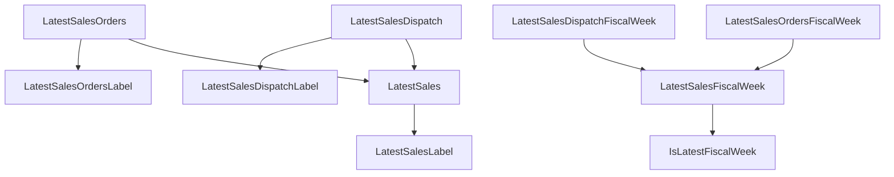

#### Group: P&L
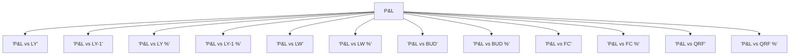

#### Group: Presentation


#### Group: Sales
```mermaid
graph TD
    RBR_ChMx_StrRtn_at_TY_rate[RBR_ChMx_StrRtn_at_TY_rate] --> RBR_ChMx_Tot_Returns[RBR_ChMx_Tot_Returns]
    RBR_ChMx_Str_PN_LY[RBR_ChMx_Str_PN_LY] --> RBR_ChMx_Str_TY_at_LY_Mix[RBR_ChMx_Str_TY_at_LY_Mix]
    RBR_ChMx_Str_PN_LY[RBR_ChMx_Str_PN_LY] --> RBR_ChMx_Web_PN_LY[RBR_ChMx_Web_PN_LY]
    RBR_ChMx_Str_PN_TY[RBR_ChMx_Str_PN_TY] --> RBR_ChMx_Web_PN_TY[RBR_ChMx_Web_PN_TY]
    RBR_ChMx_Str_TY_at_LY_Mix[RBR_ChMx_Str_TY_at_LY_Mix] --> RBR_ChMx_Tot_ReworkedSales[RBR_ChMx_Tot_ReworkedSales]
    RBR_ChMx_Var[RBR_ChMx_Var] --> _ReturnsBridge_Value_['ReturnsBridge Value']
    RBR_ChMx_Var[RBR_ChMx_Var] --> Rbr91_ChannelMix[Rbr91_ChannelMix]
    RBR_ChMx_Var[RBR_ChMx_Var] --> Rbr92_ProductMix[Rbr92_ProductMix]
    RBR_ChMx_Var[RBR_ChMx_Var] --> Rbr93_Rate[Rbr93_Rate]
    RBR_ChMx_Var[RBR_ChMx_Var] --> Rbr98_ProductMix[Rbr98_ProductMix]
    RBR_ChMx_Var[RBR_ChMx_Var] --> Rbr99_ReturnsBridge[Rbr99_ReturnsBridge]
    RBR_ChMx_WebRtn_at_TY_rate[RBR_ChMx_WebRtn_at_TY_rate] --> RBR_ChMx_Tot_Returns[RBR_ChMx_Tot_Returns]
    RBR_ChMx_Web_PN_LY[RBR_ChMx_Web_PN_LY] --> RBR_ChMx_Web_TY_at_LY_Mix[RBR_ChMx_Web_TY_at_LY_Mix]
    RBR_ChMx_Web_TY_at_LY_Mix[RBR_ChMx_Web_TY_at_LY_Mix] --> RBR_ChMx_Tot_ReworkedSales[RBR_ChMx_Tot_ReworkedSales]
    Rbr01_Precalc[Rbr01_Precalc] --> Rbr01_TYMixLYSales[Rbr01_TYMixLYSales]
    Rbr01_TYMixLYSales[Rbr01_TYMixLYSales] --> Rbr02_Precalc[Rbr02_Precalc]
    Rbr01_TYMixLYSales[Rbr01_TYMixLYSales] --> Rbr03_VolumeRR[Rbr03_VolumeRR]
    Rbr01_TYMixLYSales[Rbr01_TYMixLYSales] --> Rbr04_Precalc[Rbr04_Precalc]
    Rbr01_TYMixLYSales[Rbr01_TYMixLYSales] --> Rbr05_RateRR[Rbr05_RateRR]
    Rbr02_Precalc[Rbr02_Precalc] --> Rbr02_TYMixLYSales_x_TYRate[Rbr02_TYMixLYSales_x_TYRate]
    Rbr02_TYMixLYSales_x_TYRate[Rbr02_TYMixLYSales_x_TYRate] --> Rbr03_VolumeRR[Rbr03_VolumeRR]
    Rbr03_VolumeRR[Rbr03_VolumeRR] --> Rbr09_RRVolImpact[Rbr09_RRVolImpact]
    Rbr03_VolumeRR[Rbr03_VolumeRR] --> Rbr10_RRRateImpact[Rbr10_RRRateImpact]
    Rbr04_Precalc[Rbr04_Precalc] --> Rbr04_TYMixLYSales_x_LYRR[Rbr04_TYMixLYSales_x_LYRR]
    Rbr04_TYMixLYSales_x_LYRR[Rbr04_TYMixLYSales_x_LYRR] --> Rbr05_RateRR[Rbr05_RateRR]
    Rbr05_RateRR[Rbr05_RateRR] --> Rbr10_RRRateImpact[Rbr10_RRRateImpact]
    Rbr05_RateRR[Rbr05_RateRR] --> Rbr11_RRMixImpact[Rbr11_RRMixImpact]
    Rbr06_LYSalesExBrands[Rbr06_LYSalesExBrands] --> Rbr08_LYRRExBrands[Rbr08_LYRRExBrands]
    Rbr07_LYReturnsExBrands[Rbr07_LYReturnsExBrands] --> Rbr08_LYRRExBrands[Rbr08_LYRRExBrands]
    Rbr07_Precalc[Rbr07_Precalc] --> Rbr07_LYReturnsExBrands[Rbr07_LYReturnsExBrands]
    Rbr08_LYRRExBrands[Rbr08_LYRRExBrands] --> Rbr09_RRVolImpact[Rbr09_RRVolImpact]
    Rbr08_LYRRExBrands[Rbr08_LYRRExBrands] --> Rbr11_RRMixImpact[Rbr11_RRMixImpact]
    Rbr10_RRRateImpact[Rbr10_RRRateImpact] --> _RR_Other_Impact___['RR Other Impact %']
    Rbr10_RRRateImpact[Rbr10_RRRateImpact] --> _ReturnsBridge_Value_['ReturnsBridge Value']
    Rbr10_RRRateImpact[Rbr10_RRRateImpact] --> Rbr99_ReturnsBridge[Rbr99_ReturnsBridge]
    Rbr11_RRMixImpact[Rbr11_RRMixImpact] --> _RR_Other_Impact___['RR Other Impact %']
    Rbr11_RRMixImpact[Rbr11_RRMixImpact] --> _ReturnsBridge_Value_['ReturnsBridge Value']
    Rbr11_RRMixImpact[Rbr11_RRMixImpact] --> Rbr92_ProductMix[Rbr92_ProductMix]
    Rbr11_RRMixImpact[Rbr11_RRMixImpact] --> Rbr93_Rate[Rbr93_Rate]
    Rbr11_RRMixImpact[Rbr11_RRMixImpact] --> Rbr98_ProductMix[Rbr98_ProductMix]
    Rbr11_RRMixImpact[Rbr11_RRMixImpact] --> Rbr99_ReturnsBridge[Rbr99_ReturnsBridge]
    Returns[Returns] --> _Gross_SRIV_['Gross SRIV']
    Returns[Returns] --> _RR_Vol_1_Total_TY_Sales_['RR Vol 1 Total TY Sales']
    Returns[Returns] --> _RR_Vol_2_SRIV_by_Dept_['RR Vol 2 SRIV by Dept']
    Returns[Returns] --> _RR_Vol_3_PN_of_Sales_['RR Vol 3 PN of Sales']
    Returns[Returns] --> _RR_Vol_4_LY_Sales_['RR Vol 4 LY Sales']
    Returns[Returns] --> _RR_Vol_5_LY_Sales_TY_Mix_['RR Vol 5 LY Sales TY Mix']
    Returns[Returns] --> _RR_Vol_7_returns_rate_['RR Vol 7 returns rate']
    Returns[Returns] --> _RR_VolNewtest_['RR VolNewtest']
    Returns[Returns] --> _Return_rate___['Return rate %']
    Returns[Returns] --> _Returns_Online_['Returns Online']
    Returns[Returns] --> _Returns_Stores_['Returns Stores']
    Returns[Returns] --> _Returns_vs_LW___['Returns vs LW %']
    Returns[Returns] --> _Returns_vs_LW_['Returns vs LW']
    Returns[Returns] --> _Returns_vs_LY___['Returns vs LY %']
    Returns[Returns] --> _Returns_vs_LY_['Returns vs LY']
    Returns[Returns] --> _Returns_vs_LY_1___['Returns vs LY-1 %']
    Returns[Returns] --> _Returns_vs_LY_1_['Returns vs LY-1']
    Returns[Returns] --> RBR_ChMx_Web_PN_TY[RBR_ChMx_Web_PN_TY]
    Returns[Returns] --> Rbr03_VolumeRR[Rbr03_VolumeRR]
```

#### Group: Stock
```mermaid
graph TD
    Stock[Stock] --> _Stock_LY_['Stock LY']
    Stock[Stock] --> _Stock_LY_1_['Stock LY-1']
    Stock[Stock] --> _Stock_vs_LY_['Stock vs LY']
    Stock[Stock] --> _Stock_vs_LY_1_['Stock vs LY-1']
    Stock[Stock] --> _Stock_LW_['Stock LW']
    Stock[Stock] --> _Stock_vs_LW_['Stock vs LW']
    Stock[Stock] --> _Stock_vs_BUD_['Stock vs BUD']
    Stock[Stock] --> _Stock_vs_FC_['Stock vs FC']
    Stock[Stock] --> _Stock_vs_QRF_['Stock vs QRF']
    Stock[Stock] --> _Stock_vs_LY___['Stock vs LY %']
    Stock[Stock] --> _Stock_vs_LY_1___['Stock vs LY-1 %']
    Stock[Stock] --> _Stock_vs_LW___['Stock vs LW %']
    Stock[Stock] --> _Stock_vs_BUD___['Stock vs BUD %']
    Stock[Stock] --> _Stock_vs_FC___['Stock vs FC %']
    Stock[Stock] --> _Stock_vs_QRF___['Stock vs QRF %']
    Stock[Stock] --> _Stock_BU_Mix___['Stock BU Mix %']
```

#### Group: SwitchOnlineMetric
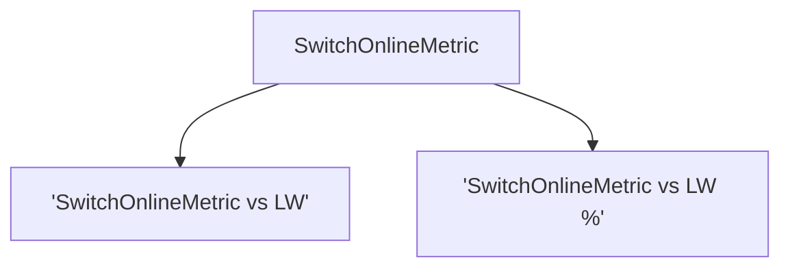

#### Group: Transactions
```mermaid
graph TD
    Transactions[Transactions] --> ABV[ABV]
    Transactions[Transactions] --> _Transactions_vs_LY_['Transactions vs LY']
    Transactions[Transactions] --> _Transactions_vs_LY_1_['Transactions vs LY-1']
    Transactions[Transactions] --> _Transactions_vs_LY___['Transactions vs LY %']
    Transactions[Transactions] --> _Transactions_vs_LY_1___['Transactions vs LY-1 %']
    Transactions[Transactions] --> _Transactions_vs_LW_['Transactions vs LW']
    Transactions[Transactions] --> _Transactions_vs_LW___['Transactions vs LW %']
    Items[Items] --> _Items_LY_['Items LY']
    Items[Items] --> _Items_LY_1_['Items LY-1']
    Items[Items] --> _Items_vs_LY_['Items vs LY']
    Items[Items] --> _Items_vs_LY_1_['Items vs LY-1']
    Items[Items] --> _Items_vs_LY___['Items vs LY %']
    Items[Items] --> _Items_vs_LY_1___['Items vs LY-1 %']
    Items[Items] --> _Items_LW_['Items LW']
    Items[Items] --> _Items_vs_LW_['Items vs LW']
    Items[Items] --> _Items_vs_LW___['Items vs LW %']
    ABV[ABV] --> _ABV_vs_LY_['ABV vs LY']
    ABV[ABV] --> _ABV_vs_LY_1_['ABV vs LY-1']
    ABV[ABV] --> _ABV_vs_LY___['ABV vs LY %']
    ABV[ABV] --> _ABV_vs_LY_1___['ABV vs LY-1 %']
    ABV[ABV] --> _ABV_vs_LW_['ABV vs LW']
    ABV[ABV] --> _ABV_vs_LW___['ABV vs LW %']
    Items[Items] --> _Basket_Size_['Basket Size']
    Transactions[Transactions] --> _Basket_Size_['Basket Size']
    Items[Items] --> ASP[ASP]
    ASP[ASP] --> _ASP_vs_LY_['ASP vs LY']
    ASP[ASP] --> _ASP_vs_LY_1_['ASP vs LY-1']
    ASP[ASP] --> _ASP_vs_LY___['ASP vs LY %']
    ASP[ASP] --> _ASP_vs_LY_1___['ASP vs LY-1 %']
    ASP[ASP] --> _ASP_vs_LW_['ASP vs LW']
    ASP[ASP] --> _ASP_vs_LW___['ASP vs LW %']
    ABV[ABV] --> Trans[Trans]
    ASP[ASP] --> Trans[Trans]
    Items[Items] --> Trans[Trans]
    Transactions[Transactions] --> Trans[Trans]
    Visits[Visits] --> Trans[Trans]
    Trans[Trans] --> _Trans_vs_LY_['Trans vs LY']
    Trans[Trans] --> _Trans_vs_LY_1_['Trans vs LY-1']
    Trans[Trans] --> _Trans_vs_LY___['Trans vs LY %']
    Trans[Trans] --> _Trans_vs_LY_1___['Trans vs LY-1 %']
    Trans[Trans] --> _Trans_vs_LW_['Trans vs LW']
    Trans[Trans] --> _Trans_vs_LW___['Trans vs LW %']
    Traffic[Traffic] --> Visits[Visits]
    Visits[Visits] --> _Visits_vs_LY_['Visits vs LY']
    Visits[Visits] --> _Visits_vs_LY_1_['Visits vs LY-1']
    Visits[Visits] --> _Visits_vs_LW_['Visits vs LW']
    Visits[Visits] --> _Visits_vs_LW___['Visits vs LW %']
    Transactions[Transactions] --> _Conversion___['Conversion %']
    Visits[Visits] --> _Conversion___['Conversion %']
    AOV[AOV] --> _AOV_LW_['AOV LW']
    ABV[ABV] --> _AOV_vs_LW_['AOV vs LW']
    AOV[AOV] --> _AOV_vs_LW___['AOV vs LW %']
    Traffic[Traffic] --> _Traffic_vs_LY_['Traffic vs LY']
    Traffic[Traffic] --> _Traffic_vs_LY_1_['Traffic vs LY-1']
    Traffic[Traffic] --> _Traffic_vs_LY___['Traffic vs LY %']
    Traffic[Traffic] --> _Traffic_vs_LY_1___['Traffic vs LY-1 %']
    AOV[AOV] --> _AOV_LY_['AOV LY']
    AOV[AOV] --> _AOV_LY_1_['AOV LY-1']
    ABV[ABV] --> _AOV_vs_LY_['AOV vs LY']
    ABV[ABV] --> _AOV_vs_LY_1_['AOV vs LY-1']
    AOV[AOV] --> _AOV_vs_LY___['AOV vs LY %']
    AOV[AOV] --> _AOV_vs_LY_1___['AOV vs LY-1 %']
```

#### Group: Ungrouped
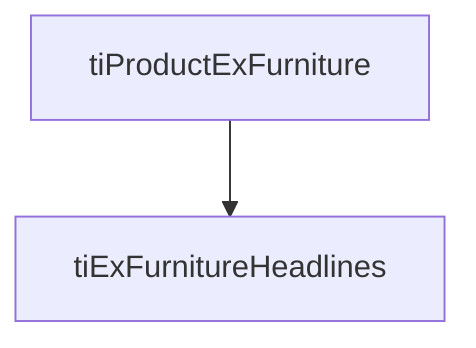

### Table: BudgetVersion


### Table: Calendar


### Table: ChannelControl


### Table: Date Parameter


### Table: ForecastScenarios


### Table: ForecastVersion


### Table: IntakeMeasureSelection


### Table: MarginBridgeComparator


### Table: MarginBridgeVariable
```mermaid
graph TD
    NoDeps[No internal measure dependencies]
```

### Table: MarginBridgeWalk
```mermaid
graph TD
    slctd_MarginBridgeWalk_Step[slctd_MarginBridgeWalk_Step] --> slctd_MarginBridgeColour[slctd_MarginBridgeColour]
```

### Table: MarginMeasureSelection
```mermaid
graph TD
    NoDeps[No internal measure dependencies]
```

### Table: MetricMasterPnL
```mermaid
graph TD
    NoDeps[No internal measure dependencies]
```

### Table: OnlineMetrics
```mermaid
graph TD
    NoDeps[No internal measure dependencies]
```

### Table: Products
```mermaid
graph TD
    NoDeps[No internal measure dependencies]
```

### Table: ProjectionScenario
```mermaid
graph TD
    NoDeps[No internal measure dependencies]
```

### Table: QRFVersion
```mermaid
graph TD
    NoDeps[No internal measure dependencies]
```

### Table: RollingWeeks
```mermaid
graph TD
    NoDeps[No internal measure dependencies]
```

### Table: SalesMeasureSelection
```mermaid
graph TD
    NoDeps[No internal measure dependencies]
```

### Table: SalesRecognitionType
```mermaid
graph TD
    NoDeps[No internal measure dependencies]
```

### Table: SalesType
```mermaid
graph TD
    slctd_SalesType[slctd_SalesType] --> slctd_SalesTypeLevelAware[slctd_SalesTypeLevelAware]
    slctd_SubSalesType[slctd_SubSalesType] --> slctd_SalesTypeLevelAware[slctd_SalesTypeLevelAware]
```

### Table: TransMetrics
```mermaid
graph TD
    NoDeps[No internal measure dependencies]
```

### Table: factAOV
```mermaid
graph TD
    NoDeps[No internal measure dependencies]
```

### Table: factAdobe
```mermaid
graph TD
    NoDeps[No internal measure dependencies]
```

### Table: factAvailability
```mermaid
graph TD
    NoDeps[No internal measure dependencies]
```

### Table: factAvailability_New
```mermaid
graph TD
    NoDeps[No internal measure dependencies]
```

### Table: factDeriskBudget
```mermaid
graph TD
    NoDeps[No internal measure dependencies]
```

### Table: factDeriskForecast
```mermaid
graph TD
    NoDeps[No internal measure dependencies]
```

### Table: factDispatchForecast
```mermaid
graph TD
    NoDeps[No internal measure dependencies]
```

### Table: factFootfall
```mermaid
graph TD
    NoDeps[No internal measure dependencies]
```

### Table: factForecast
```mermaid
graph TD
    sum_TotSlsV[sum_TotSlsV] --> sriv_orders_mp_rf[sriv_orders_mp_rf]
    sriv_orders_mp_rf[sriv_orders_mp_rf] --> _SRIV_GMOR_vs_MP_Actuals_['SRIV GMOR vs MP Actuals']
    sriv_orders_mp_rf[sriv_orders_mp_rf] --> _SRIV_GMOR_vs_MP_Actuals___['SRIV GMOR vs MP Actuals %']
    sum_RealMDxV[sum_RealMDxV] --> calc_RealMDxV[calc_RealMDxV]
    sum_RedGSlsxV[sum_RedGSlsxV] --> calc_RealMDxV[calc_RealMDxV]
    sum_RedSlsxV[sum_RedSlsxV] --> calc_RealMDxV[calc_RealMDxV]
    sum_FPPGSlsxV[sum_FPPGSlsxV] --> calc_TotGSlsxV[calc_TotGSlsxV]
    sum_RedGSlsxV[sum_RedGSlsxV] --> calc_TotGSlsxV[calc_TotGSlsxV]
```

### Table: factMPStock
```mermaid
graph TD
    NoDeps[No internal measure dependencies]
```

### Table: factMarginOrders
```mermaid
graph TD
    NoDeps[No internal measure dependencies]
```

### Table: factOnlineCustomerMetrics
```mermaid
graph TD
    NoDeps[No internal measure dependencies]
```

### Table: factOrderVol
```mermaid
graph TD
    NoDeps[No internal measure dependencies]
```

### Table: factPromoSalesDispatch
```mermaid
graph TD
    NoDeps[No internal measure dependencies]
```

### Table: factSRIVDispatchChannelForecast
```mermaid
graph TD
    NoDeps[No internal measure dependencies]
```

### Table: factSRIVOrdersChannelForecast
```mermaid
graph TD
    NoDeps[No internal measure dependencies]
```

### Table: factSalesDispatch
```mermaid
graph TD
    NoDeps[No internal measure dependencies]
```

### Table: factStock
```mermaid
graph TD
    NoDeps[No internal measure dependencies]
```

### Table: factTradingCalendar
```mermaid
graph TD
    NoDeps[No internal measure dependencies]
```

### Table: factTradingCommentary
```mermaid
graph TD
    NoDeps[No internal measure dependencies]
```

### Table: factTransactions
```mermaid
graph TD
    NoDeps[No internal measure dependencies]
```

### Table: firstWeekCurrentQuarter
```mermaid
graph TD
    SlctdFirstWeekQtr[SlctdFirstWeekQtr] --> slctdFirstWeekYr[slctdFirstWeekYr]
```

## Dependency hierarchy
### Table: 1_Measures
- 'ABV LW'
- 'ABV LY'
- 'ABV LY-1'
- 'ASP (SRIV) % Increase (Mix)'
- 'ASP (SRIV) % Increase (Price)'
- 'ASP (SRIV) (Based on LY)'
- 'ASP LW'
- 'ASP LY (SRIV)'
- 'ASP LY'
- 'ASP LY-1'
- 'ASP vs LY % (SRIV)'
- 'ASP vs LY-1 % (SRIV)'
- 'Basket Size LW'
- 'Basket Size LY'
- 'Basket Size LY-1'
- 'Basket Size vs LW %'
- 'Basket Size vs LW'
- 'Basket Size vs LY %'
- 'Basket Size vs LY'
- 'Basket Size vs LY-1 %'
- 'Basket Size vs LY-1'
- 'Buying Margin % BUD'
- 'Buying Margin % Dispatch BUD'
- 'Buying Margin % Dispatch FC'
- 'Buying Margin % Dispatch LW'
- 'Buying Margin % Dispatch LY'
- 'Buying Margin % Dispatch LY-1'
- 'Buying Margin % Dispatch QRF'
- 'Buying Margin % Dispatch vs BUD'
- 'Buying Margin % Dispatch vs FC'
- 'Buying Margin % Dispatch vs LW'
- 'Buying Margin % Dispatch vs LY'
- 'Buying Margin % Dispatch vs LY-1'
- 'Buying Margin % Dispatch vs QRF'
- 'Buying Margin % Dispatch'
- 'Buying Margin % FC'
- 'Buying Margin % Orders LW'
- 'Buying Margin % Orders LY'
- 'Buying Margin % Orders LY-1'
- 'Buying Margin % Orders vs BUD'
- 'Buying Margin % Orders vs FC'
- 'Buying Margin % Orders vs LW'
- 'Buying Margin % Orders vs LY'
- 'Buying Margin % Orders vs LY-1'
- 'Buying Margin % Orders vs QRF'
- 'Buying Margin % Orders'
- 'Buying Margin % vs BUD'
- 'Buying Margin % vs FC'
- 'Buying Margin % vs LW'
- 'Buying Margin % vs LY'
- 'Buying Margin % vs LY-1'
- 'Buying Margin % vs QRF'
- 'Buying Margin BUD'
- 'Buying Margin Dispatch BUD'
- 'Buying Margin Dispatch FC'
- 'Buying Margin Dispatch LW'
- 'Buying Margin Dispatch LY'
- 'Buying Margin Dispatch LY-1'
- 'Buying Margin Dispatch QRF'
- 'Buying Margin Dispatch vs BUD %'
- 'Buying Margin Dispatch vs BUD'
- 'Buying Margin Dispatch vs FC %'
- 'Buying Margin Dispatch vs FC'
- 'Buying Margin Dispatch vs LW %'
- 'Buying Margin Dispatch vs LW'
- 'Buying Margin Dispatch vs LY %'
- 'Buying Margin Dispatch vs LY'
- 'Buying Margin Dispatch vs LY-1 %'
- 'Buying Margin Dispatch vs LY-1'
- 'Buying Margin Dispatch vs QRF %'
- 'Buying Margin Dispatch vs QRF'
- 'Buying Margin Dispatch'
- 'Buying Margin Orders LW'
- 'Buying Margin Orders LY'
- 'Buying Margin Orders LY-1'
- 'Buying Margin Orders vs BUD %'
- 'Buying Margin Orders vs BUD'
- 'Buying Margin Orders vs FC %'
- 'Buying Margin Orders vs FC'
- 'Buying Margin Orders vs LW %'
- 'Buying Margin Orders vs LW'
- 'Buying Margin Orders vs LY %'
- 'Buying Margin Orders vs LY'
- 'Buying Margin Orders vs LY-1 %'
- 'Buying Margin Orders vs LY-1'
- 'Buying Margin Orders vs QRF %'
- 'Buying Margin Orders vs QRF'
- 'Buying Margin Orders'
- 'Buying Margin vs BUD %'
- 'Buying Margin vs BUD'
- 'Buying Margin vs FC %'
- 'Buying Margin vs FC'
- 'Buying Margin vs LW %'
- 'Buying Margin vs LW'
- 'Buying Margin vs LY %'
- 'Buying Margin vs LY'
- 'Buying Margin vs LY-1 %'
- 'Buying Margin vs LY-1'
- 'Buying Margin vs QRF %'
- 'Buying Margin vs QRF'
- 'Conversion % LW'
- 'Conversion % LY'
- 'Conversion % LY-1'
- 'Conversion % vs LW'
- 'Conversion % vs LY'
- 'Conversion % vs LY-1'
- 'Depth Of Cut % Dispatch BUD'
- 'Depth Of Cut % Dispatch FC'
- 'Depth Of Cut % Dispatch LW'
- 'Depth Of Cut % Dispatch LY'
- 'Depth Of Cut % Dispatch LY-1'
- 'Depth Of Cut % Dispatch QRF'
- 'Depth Of Cut % Dispatch vs BUD'
- 'Depth Of Cut % Dispatch vs FC'
- 'Depth Of Cut % Dispatch vs LW'
- 'Depth Of Cut % Dispatch vs LY'
- 'Depth Of Cut % Dispatch vs LY-1'
- 'Depth Of Cut % Dispatch vs QRF'
- 'Depth Of Cut % Dispatch'
- 'Depth Of Cut % Orders BUD'
- 'Depth Of Cut % Orders FC'
- 'Depth Of Cut % Orders LW'
- 'Depth Of Cut % Orders LY'
- 'Depth Of Cut % Orders LY-1'
- 'Depth Of Cut % Orders QRF'
- 'Depth Of Cut % Orders vs BUD'
- 'Depth Of Cut % Orders vs FC'
- 'Depth Of Cut % Orders vs LW'
- 'Depth Of Cut % Orders vs LY'
- 'Depth Of Cut % Orders vs LY-1'
- 'Depth Of Cut % Orders vs QRF'
- 'Depth Of Cut % Orders'
- 'Depth Of Cut % vs BUD'
- 'Depth Of Cut % vs FC'
- 'Depth Of Cut % vs LW'
- 'Depth Of Cut % vs LY'
- 'Depth Of Cut % vs LY-1'
- 'Depth Of Cut % vs QRF'
- 'Depth Of Cut BUD'
- 'Depth Of Cut Dispatch BUD'
- 'Depth Of Cut Dispatch FC'
- 'Depth Of Cut Dispatch LW'
- 'Depth Of Cut Dispatch LY'
- 'Depth Of Cut Dispatch LY-1'
- 'Depth Of Cut Dispatch QRF'
- 'Depth Of Cut Dispatch vs BUD'
- 'Depth Of Cut Dispatch vs FC'
- 'Depth Of Cut Dispatch vs LW'
- 'Depth Of Cut Dispatch vs LY'
- 'Depth Of Cut Dispatch vs LY-1'
- 'Depth Of Cut Dispatch vs QRF'
- 'Depth Of Cut Dispatch'
- 'Depth Of Cut Orders FC'
- 'Depth Of Cut Orders LW'
- 'Depth Of Cut Orders LY'
- 'Depth Of Cut Orders LY-1'
- 'Depth Of Cut Orders QRF'
- 'Depth Of Cut Orders vs BUD'
- 'Depth Of Cut Orders vs FC'
- 'Depth Of Cut Orders vs LW'
- 'Depth Of Cut Orders vs LY'
- 'Depth Of Cut Orders vs LY-1'
- 'Depth Of Cut Orders vs QRF'
- 'Depth Of Cut Orders'
- 'Depth Of Cut vs BUD %'
- 'Depth Of Cut vs BUD'
- 'Depth Of Cut vs FC %'
- 'Depth Of Cut vs FC'
- 'Depth Of Cut vs LW %'
- 'Depth Of Cut vs LW'
- 'Depth Of Cut vs LY %'
- 'Depth Of Cut vs LY'
- 'Depth Of Cut vs LY-1 %'
- 'Depth Of Cut vs LY-1'
- 'Depth Of Cut vs QRF %'
- 'Depth Of Cut vs QRF'
- 'Discount Participation % Dispatch LW'
- 'Discount Participation % Dispatch LY'
- 'Discount Participation % Dispatch LY-1'
- 'Discount Participation % Dispatch vs LW'
- 'Discount Participation % Dispatch vs LY'
- 'Discount Participation % Dispatch vs LY-1'
- 'Discount Participation % Dispatch'
- 'Discount Participation % Orders LW'
- 'Discount Participation % Orders LY'
- 'Discount Participation % Orders LY-1'
- 'Discount Participation % Orders vs LW'
- 'Discount Participation % Orders vs LY'
- 'Discount Participation % Orders vs LY-1'
- 'Discount Participation % Orders'
- 'Discount Participation % vs LW'
- 'Discount Participation % vs LY'
- 'Discount Participation % vs LY-1'
- 'FP Return rate % LW'
- 'FP Return rate % LY'
- 'FP Return rate % LY-1'
- 'FP Returns LW'
- 'FP Returns LY'
- 'FP Returns LY-1'
- 'FP Returns vs LW %'
- 'FP Returns vs LW'
- 'FP Returns vs LY %'
- 'FP Returns vs LY'
- 'FP Returns vs LY-1 %'
- 'FP Returns vs LY-1'
- 'FP Returns'
- 'FP SRIV Dispatch LW'
- 'FP SRIV Dispatch LY'
- 'FP SRIV Dispatch LY-1'
- 'FP SRIV Dispatch vs LW %'
- 'FP SRIV Dispatch vs LW'
- 'FP SRIV Dispatch vs LY %'
- 'FP SRIV Dispatch vs LY'
- 'FP SRIV Dispatch vs LY-1 %'
- 'FP SRIV Dispatch vs LY-1'
- 'FP SRIV Dispatch'
- 'FPP Intake Value Comparator'
- 'FPP Intake Value LY'
- 'FPP Intake Value LY-1'
- 'FPP Intake Value vs BUD'
- 'FPP Intake Value vs FC'
- 'FPP Intake Value vs LY %'
- 'FPP Intake Value vs LY'
- 'FPP Intake Value vs LY-1 %'
- 'FPP Intake Value vs LY-1'
- 'FPP Intake Value vs QRF %'
- 'FPP Intake Value vs QRF'
- 'FPP Intake Volume Comparator'
- 'FPP Intake Volume LW'
- 'FPP Intake Volume LY'
- 'FPP Intake Volume LY-1'
- 'FPP Intake Volume vs BUD'
- 'FPP Intake Volume vs FC'
- 'FPP Intake Volume vs LW'
- 'FPP Intake Volume vs LY %'
- 'FPP Intake Volume vs LY'
- 'FPP Intake Volume vs LY-1 %'
- 'FPP Intake Volume vs LY-1'
- 'FPP Intake Volume vs QRF %'
- 'FPP Intake Volume vs QRF'
- 'FPP Mix % Dispatch LW'
- 'FPP Mix % Dispatch LY'
- 'FPP Mix % Dispatch LY-1'
- 'FPP Mix % Dispatch vs LW'
- 'FPP Mix % Dispatch vs LY'
- 'FPP Mix % Dispatch vs LY-1'
- 'FPP Mix % Dispatch'
- 'FPP Mix % Orders LW'
- 'FPP Mix % Orders LY'
- 'FPP Mix % Orders LY-1'
- 'FPP Mix % Orders vs LW'
- 'FPP Mix % Orders vs LY'
- 'FPP Mix % Orders vs LY-1'
- 'FPP Mix % Orders'
- 'FPP Mix % vs LW'
- 'FPP Mix % vs LY'
- 'FPP Mix % vs LY-1'
- 'FPP SRIV Dispatch LE'
- 'FPP SRIV Dispatch LW'
- 'FPP SRIV Dispatch LY'
- 'FPP SRIV Dispatch LY-1'
- 'FPP SRIV Dispatch QRF'
- 'FPP SRIV Dispatch vs BUD % '
- 'FPP SRIV Dispatch vs BUD'
- 'FPP SRIV Dispatch vs FC %'
- 'FPP SRIV Dispatch vs FC'
- 'FPP SRIV Dispatch vs LE % '
- 'FPP SRIV Dispatch vs LE'
- 'FPP SRIV Dispatch vs LW %'
- 'FPP SRIV Dispatch vs LW'
- 'FPP SRIV Dispatch vs LY %'
- 'FPP SRIV Dispatch vs LY'
- 'FPP SRIV Dispatch vs LY-1 %'
- 'FPP SRIV Dispatch vs LY-1'
- 'FPP SRIV Dispatch vs QRF %'
- 'FPP SRIV Dispatch vs QRF'
- 'FPP SRIV Dispatch'
- 'FPP Volume Dispatch LW'
- 'FPP Volume Dispatch LY'
- 'FPP Volume Dispatch LY-1'
- 'FPP Volume Dispatch vs LW %'
- 'FPP Volume Dispatch vs LW'
- 'FPP Volume Dispatch vs LY %'
- 'FPP Volume Dispatch vs LY'
- 'FPP Volume Dispatch vs LY-1 %'
- 'FPP Volume Dispatch vs LY-1'
- 'FPP Volume Dispatch'
- 'GSM % SREV Dispatch BUD'
- 'GSM % SREV Dispatch FC'
- 'GSM % SREV Dispatch LE'
- 'GSM % SREV Dispatch LW'
- 'GSM % SREV Dispatch LY'
- 'GSM % SREV Dispatch LY-1'
- 'GSM % SREV Dispatch QRF'
- 'GSM % SREV Dispatch vs BUD'
- 'GSM % SREV Dispatch vs FC'
- 'GSM % SREV Dispatch vs LE'
- 'GSM % SREV Dispatch vs LW'
- 'GSM % SREV Dispatch vs LY'
- 'GSM % SREV Dispatch vs LY-1'
- 'GSM % SREV Dispatch vs QRF'
- 'GSM % SREV Dispatch'
- 'GSM % SREV FC'
- 'GSM % SREV Fwd View LW'
- 'GSM % SREV Fwd View vs BUD'
- 'GSM % SREV Fwd View vs FC'
- 'GSM % SREV Fwd View vs LE'
- 'GSM % SREV Fwd View vs LW'
- 'GSM % SREV Fwd View vs LY'
- 'GSM % SREV Fwd View vs LY-1'
- 'GSM % SREV Fwd View vs QRF'
- 'GSM % SREV Fwd View'
- 'GSM % SREV Orders BUD'
- 'GSM % SREV Orders FC'
- 'GSM % SREV Orders LE'
- 'GSM % SREV Orders LW'
- 'GSM % SREV Orders LY'
- 'GSM % SREV Orders LY-1'
- 'GSM % SREV Orders QRF'
- 'GSM % SREV Orders vs BUD'
- 'GSM % SREV Orders vs FC'
- 'GSM % SREV Orders vs LE'
- 'GSM % SREV Orders vs LW'
- 'GSM % SREV Orders vs LY'
- 'GSM % SREV Orders vs LY-1'
- 'GSM % SREV Orders vs QRF'
- 'GSM % SREV Orders'
- 'GSM % SREV QRF'
- 'GSM % SREV vs BUD'
- 'GSM % SREV vs FC'
- 'GSM % SREV vs LE'
- 'GSM % SREV vs LW'
- 'GSM % SREV vs LY'
- 'GSM % SREV vs LY-1'
- 'GSM % SREV vs QRF'
- 'GSM Dispatch LE'
- 'GSM Dispatch LW'
- 'GSM Dispatch LY'
- 'GSM Dispatch LY-1'
- 'GSM Dispatch QRF'
- 'GSM Dispatch vs BUD %'
- 'GSM Dispatch vs BUD'
- 'GSM Dispatch vs FC %'
- 'GSM Dispatch vs FC'
- 'GSM Dispatch vs LE %'
- 'GSM Dispatch vs LE'
- 'GSM Dispatch vs LW %'
- 'GSM Dispatch vs LW'
- 'GSM Dispatch vs LY %'
- 'GSM Dispatch vs LY'
- 'GSM Dispatch vs LY-1 %'
- 'GSM Dispatch vs LY-1'
- 'GSM Dispatch vs Orders BUD'
- 'GSM Dispatch vs Orders FC'
- 'GSM Dispatch vs Orders LW'
- 'GSM Dispatch vs Orders LY'
- 'GSM Dispatch vs Orders LY-1'
- 'GSM Dispatch vs Orders QRF'
- 'GSM Dispatch vs Orders vs BUD %'
- 'GSM Dispatch vs Orders vs BUD'
- 'GSM Dispatch vs Orders vs FC %'
- 'GSM Dispatch vs Orders vs FC'
- 'GSM Dispatch vs Orders vs LW %'
- 'GSM Dispatch vs Orders vs LW'
- 'GSM Dispatch vs Orders vs LY %'
- 'GSM Dispatch vs Orders vs LY'
- 'GSM Dispatch vs Orders vs LY-1 %'
- 'GSM Dispatch vs Orders vs LY-1'
- 'GSM Dispatch vs Orders vs QRF %'
- 'GSM Dispatch vs Orders vs QRF'
- 'GSM Dispatch vs Orders'
- 'GSM Dispatch vs QRF %'
- 'GSM Dispatch vs QRF'
- 'GSM Dispatch'
- 'GSM Fwd View LW'
- 'GSM Fwd View vs BUD %'
- 'GSM Fwd View vs BUD'
- 'GSM Fwd View vs FC %'
- 'GSM Fwd View vs FC'
- 'GSM Fwd View vs LE %'
- 'GSM Fwd View vs LE'
- 'GSM Fwd View vs LW %'
- 'GSM Fwd View vs LW'
- 'GSM Fwd View vs LY %'
- 'GSM Fwd View vs LY'
- 'GSM Fwd View vs LY-1 %'
- 'GSM Fwd View vs LY-1'
- 'GSM Fwd View vs QRF %'
- 'GSM Fwd View vs QRF'
- 'GSM LE'
- 'GSM Orders LW'
- 'GSM Orders LY'
- 'GSM Orders LY-1'
- 'GSM Orders vs BUD %'
- 'GSM Orders vs BUD'
- 'GSM Orders vs FC %'
- 'GSM Orders vs FC'
- 'GSM Orders vs LE %'
- 'GSM Orders vs LE'
- 'GSM Orders vs LW %'
- 'GSM Orders vs LW'
- 'GSM Orders vs LY %'
- 'GSM Orders vs LY'
- 'GSM Orders vs LY-1 %'
- 'GSM Orders vs LY-1'
- 'GSM Orders vs QRF %'
- 'GSM Orders vs QRF'
- 'GSM Orders'
- 'GSM Postings Dispatch LW'
- 'GSM Postings Dispatch LY'
- 'GSM Postings Dispatch LY-1'
- 'GSM Postings Dispatch vs LW %'
- 'GSM Postings Dispatch vs LW'
- 'GSM Postings Dispatch vs LY %'
- 'GSM Postings Dispatch vs LY'
- 'GSM Postings Dispatch vs LY-1 %'
- 'GSM Postings Dispatch vs LY-1'
- 'GSM Postings Dispatch'
- 'GSRIV Orders LW'
- 'GSRIV Orders LY'
- 'GSRIV Orders LY-1'
- 'GSRIV Orders vs LW %'
- 'GSRIV Orders vs LW'
- 'GSRIV Orders vs LY %'
- 'GSRIV Orders vs LY'
- 'GSRIV Orders vs LY-1 %'
- 'GSRIV Orders vs LY-1'
- 'GSRIV Orders'
- 'Gross SRIV LW'
- 'Gross SRIV LY'
- 'Gross SRIV LY-1'
- 'Gross SRIV Mix % LY'
- 'Gross SRIV Mix % LY-1'
- 'Gross SRIV Mix % vs LY'
- 'Gross SRIV Mix % vs LY-1'
- 'Gross SRIV Mix %'
- 'Gross SRIV ProductParent LY'
- 'Gross SRIV ProductParent LY-1'
- 'Gross SRIV ProductParent'
- 'Gross SRIV vs LW'
- 'Gross SRIV vs LY'
- 'Gross SRIV vs LY-1'
- 'Markdown % SRIV Dispatch BUD'
- 'Markdown % SRIV Dispatch FC'
- 'Markdown % SRIV Dispatch LW'
- 'Markdown % SRIV Dispatch LY'
- 'Markdown % SRIV Dispatch LY-1'
- 'Markdown % SRIV Dispatch QRF'
- 'Markdown % SRIV Dispatch vs BUD'
- 'Markdown % SRIV Dispatch vs FC'
- 'Markdown % SRIV Dispatch vs LW'
- 'Markdown % SRIV Dispatch vs LY'
- 'Markdown % SRIV Dispatch vs LY-1'
- 'Markdown % SRIV Dispatch vs QRF'
- 'Markdown % SRIV Dispatch'
- 'Markdown % SRIV Orders BUD'
- 'Markdown % SRIV Orders FC'
- 'Markdown % SRIV Orders LW'
- 'Markdown % SRIV Orders LY'
- 'Markdown % SRIV Orders LY-1'
- 'Markdown % SRIV Orders QRF'
- 'Markdown % SRIV Orders vs BUD'
- 'Markdown % SRIV Orders vs FC'
- 'Markdown % SRIV Orders vs LW'
- 'Markdown % SRIV Orders vs LY'
- 'Markdown % SRIV Orders vs LY-1'
- 'Markdown % SRIV Orders vs QRF'
- 'Markdown % SRIV Orders'
- 'Markdown % SRIV vs BUD'
- 'Markdown % SRIV vs FC'
- 'Markdown % SRIV vs LW'
- 'Markdown % SRIV vs LY'
- 'Markdown % SRIV vs LY-1'
- 'Markdown % SRIV vs QRF'
- 'Markdown BUD'
- 'Markdown Dispatch BUD'
- 'Markdown Dispatch FC'
- 'Markdown Dispatch LW'
- 'Markdown Dispatch LY'
- 'Markdown Dispatch LY-1'
- 'Markdown Dispatch QRF'
- 'Markdown Dispatch vs BUD %'
- 'Markdown Dispatch vs BUD'
- 'Markdown Dispatch vs FC %'
- 'Markdown Dispatch vs FC'
- 'Markdown Dispatch vs LW %'
- 'Markdown Dispatch vs LW'
- 'Markdown Dispatch vs LY %'
- 'Markdown Dispatch vs LY'
- 'Markdown Dispatch vs LY-1 %'
- 'Markdown Dispatch vs LY-1'
- 'Markdown Dispatch vs QRF %'
- 'Markdown Dispatch vs QRF'
- 'Markdown Dispatch'
- 'Markdown Orders LW'
- 'Markdown Orders LY'
- 'Markdown Orders LY-1'
- 'Markdown Orders vs BUD %'
- 'Markdown Orders vs BUD'
- 'Markdown Orders vs FC %'
- 'Markdown Orders vs FC'
- 'Markdown Orders vs LW %'
- 'Markdown Orders vs LW'
- 'Markdown Orders vs LY %'
- 'Markdown Orders vs LY'
- 'Markdown Orders vs LY-1 %'
- 'Markdown Orders vs LY-1'
- 'Markdown Orders vs QRF %'
- 'Markdown Orders vs QRF'
- 'Markdown Orders'
- 'Measure 2'
- 'Measure 3'
- 'OT Warning'
- 'Orders Returns LW'
- 'Orders Returns LY'
- 'Orders Returns LY-1'
- 'Orders Returns'
- 'Other GSM Adj Dispatch BUD'
- 'Other GSM Adj Dispatch FC'
- 'Other GSM Adj Dispatch LW'
- 'Other GSM Adj Dispatch LY'
- 'Other GSM Adj Dispatch LY-1'
- 'Other GSM Adj Dispatch QRF'
- 'Other GSM Adj Dispatch vs BUD'
- 'Other GSM Adj Dispatch vs FC'
- 'Other GSM Adj Dispatch vs LW'
- 'Other GSM Adj Dispatch vs LY'
- 'Other GSM Adj Dispatch vs LY-1'
- 'Other GSM Adj Dispatch vs QRF'
- 'Other GSM Adj Dispatch'
- 'Other GSM Adj vs BUD %'
- 'Other GSM Adj vs BUD'
- 'Other GSM Adj vs FC %'
- 'Other GSM Adj vs FC'
- 'Other GSM Adj vs LW %'
- 'Other GSM Adj vs LW'
- 'Other GSM Adj vs LY %'
- 'Other GSM Adj vs LY'
- 'Other GSM Adj vs LY-1 %'
- 'Other GSM Adj vs LY-1'
- 'Other GSM Adj vs QRF %'
- 'Other GSM Adj vs QRF'
- 'P SRIV Dispatch LW'
- 'P SRIV Dispatch LY'
- 'P SRIV Dispatch LY-1'
- 'P SRIV Dispatch vs LW %'
- 'P SRIV Dispatch vs LW'
- 'P SRIV Dispatch vs LY %'
- 'P SRIV Dispatch vs LY'
- 'P SRIV Dispatch vs LY-1 %'
- 'P SRIV Dispatch vs LY-1'
- 'P SRIV Dispatch'
- 'POS new SRIV Orders'
- 'Promo Markdown % Dispatch BUD'
- 'Promo Markdown % Dispatch FC'
- 'Promo Markdown % Dispatch LW'
- 'Promo Markdown % Dispatch LY'
- 'Promo Markdown % Dispatch LY-1'
- 'Promo Markdown % Dispatch QRF'
- 'Promo Markdown % Dispatch vs BUD'
- 'Promo Markdown % Dispatch vs FC'
- 'Promo Markdown % Dispatch vs LW'
- 'Promo Markdown % Dispatch vs LY'
- 'Promo Markdown % Dispatch vs LY-1'
- 'Promo Markdown % Dispatch vs QRF'
- 'Promo Markdown % Dispatch'
- 'Promo Markdown % Orders LW'
- 'Promo Markdown % Orders LY'
- 'Promo Markdown % Orders LY-1'
- 'Promo Markdown % Orders vs BUD'
- 'Promo Markdown % Orders vs FC'
- 'Promo Markdown % Orders vs LW'
- 'Promo Markdown % Orders vs LY'
- 'Promo Markdown % Orders vs LY-1'
- 'Promo Markdown % Orders vs QRF'
- 'Promo Markdown % Orders'
- 'Promo Markdown % vs BUD'
- 'Promo Markdown % vs FC'
- 'Promo Markdown % vs LW'
- 'Promo Markdown % vs LY'
- 'Promo Markdown % vs LY-1'
- 'Promo Markdown % vs QRF'
- 'Promo Markdown BUD'
- 'Promo Markdown Dispatch BUD'
- 'Promo Markdown Dispatch FC'
- 'Promo Markdown Dispatch LW'
- 'Promo Markdown Dispatch LY'
- 'Promo Markdown Dispatch LY-1'
- 'Promo Markdown Dispatch QRF'
- 'Promo Markdown Dispatch vs BUD'
- 'Promo Markdown Dispatch vs FC'
- 'Promo Markdown Dispatch vs LW'
- 'Promo Markdown Dispatch vs LY'
- 'Promo Markdown Dispatch vs LY-1'
- 'Promo Markdown Dispatch vs QRF'
- 'Promo Markdown Dispatch'
- 'Promo Markdown Orders LW'
- 'Promo Markdown Orders LY'
- 'Promo Markdown Orders LY-1'
- 'Promo Markdown Orders vs BUD'
- 'Promo Markdown Orders vs FC'
- 'Promo Markdown Orders vs LW'
- 'Promo Markdown Orders vs LY'
- 'Promo Markdown Orders vs LY-1'
- 'Promo Markdown Orders vs QRF'
- 'Promo Markdown Orders'
- 'Promo Markdown vs BUD %'
- 'Promo Markdown vs BUD'
- 'Promo Markdown vs FC %'
- 'Promo Markdown vs FC'
- 'Promo Markdown vs LW %'
- 'Promo Markdown vs LW'
- 'Promo Markdown vs LY %'
- 'Promo Markdown vs LY'
- 'Promo Markdown vs LY-1 %'
- 'Promo Markdown vs LY-1'
- 'Promo Markdown vs QRF %'
- 'Promo Markdown vs QRF'
- 'Promo Mix % Dispatch LW'
- 'Promo Mix % Dispatch LY'
- 'Promo Mix % Dispatch LY-1'
- 'Promo Mix % Dispatch vs LW'
- 'Promo Mix % Dispatch vs LY'
- 'Promo Mix % Dispatch vs LY-1'
- 'Promo Mix % Dispatch'
- 'Promo Mix % Orders LW'
- 'Promo Mix % Orders LY'
- 'Promo Mix % Orders LY-1'
- 'Promo Mix % Orders vs LW'
- 'Promo Mix % Orders vs LY'
- 'Promo Mix % Orders vs LY-1'
- 'Promo Mix % Orders'
- 'Promo Mix % vs LW'
- 'Promo Mix % vs LY'
- 'Promo Mix % vs LY-1'
- 'RP GSM % SREV vs BUD'
- 'RP GSM BUD'
- 'RP Return rate % LW'
- 'RP Return rate % LY'
- 'RP Return rate % LY-1'
- 'RP Returns LW'
- 'RP Returns LY'
- 'RP Returns LY-1'
- 'RP Returns vs LW %'
- 'RP Returns vs LW'
- 'RP Returns vs LY %'
- 'RP Returns vs LY'
- 'RP Returns vs LY-1 %'
- 'RP Returns vs LY-1'
- 'RP Returns'
- 'RP SRIV Dispatch LE'
- 'RP SRIV Dispatch LW'
- 'RP SRIV Dispatch LY'
- 'RP SRIV Dispatch LY-1'
- 'RP SRIV Dispatch QRF'
- 'RP SRIV Dispatch vs BUD %'
- 'RP SRIV Dispatch vs BUD'
- 'RP SRIV Dispatch vs FC %'
- 'RP SRIV Dispatch vs FC'
- 'RP SRIV Dispatch vs LE %'
- 'RP SRIV Dispatch vs LE'
- 'RP SRIV Dispatch vs LW %'
- 'RP SRIV Dispatch vs LW'
- 'RP SRIV Dispatch vs LY %'
- 'RP SRIV Dispatch vs LY'
- 'RP SRIV Dispatch vs LY-1 %'
- 'RP SRIV Dispatch vs LY-1'
- 'RP SRIV Dispatch vs QRF %'
- 'RP SRIV Dispatch vs QRF'
- 'RP SRIV Dispatch'
- 'RP Volume Dispatch LW'
- 'RP Volume Dispatch LY'
- 'RP Volume Dispatch LY-1'
- 'RP Volume Dispatch vs LW %'
- 'RP Volume Dispatch vs LW'
- 'RP Volume Dispatch vs LY %'
- 'RP Volume Dispatch vs LY'
- 'RP Volume Dispatch vs LY-1 %'
- 'RP Volume Dispatch vs LY-1'
- 'RP Volume Dispatch'
- 'RR Brands Impact %'
- 'RR Mix Impact % ex Brands'
- 'RR Other Impact % ex Brands'
- 'RR Rate Impact % ex Brands'
- 'RR Vol 6 returns at ty rate'
- 'Reduced Markdown % BUD'
- 'Reduced Markdown % FC'
- 'Reduced Markdown % LW'
- 'Reduced Markdown % LY'
- 'Reduced Markdown % LY-1'
- 'Reduced Markdown % QRF'
- 'Reduced Markdown % vs BUD'
- 'Reduced Markdown % vs FC'
- 'Reduced Markdown % vs LW'
- 'Reduced Markdown % vs LY'
- 'Reduced Markdown % vs LY-1'
- 'Reduced Markdown % vs QRF'
- 'Reduced Markdown %'
- 'Reduced Markdown BUD'
- 'Reduced Markdown FC'
- 'Reduced Markdown LW'
- 'Reduced Markdown LY'
- 'Reduced Markdown LY-1'
- 'Reduced Markdown QRF'
- 'Reduced Markdown vs BUD %'
- 'Reduced Markdown vs BUD'
- 'Reduced Markdown vs FC %'
- 'Reduced Markdown vs FC'
- 'Reduced Markdown vs LW %'
- 'Reduced Markdown vs LW'
- 'Reduced Markdown vs LY %'
- 'Reduced Markdown vs LY'
- 'Reduced Markdown vs LY-1 %'
- 'Reduced Markdown vs LY-1'
- 'Reduced Markdown vs QRF %'
- 'Reduced Markdown vs QRF'
- 'Reduced Mix % Dispatch LW'
- 'Reduced Mix % Dispatch LY'
- 'Reduced Mix % Dispatch LY-1'
- 'Reduced Mix % Dispatch vs LW'
- 'Reduced Mix % Dispatch vs LY'
- 'Reduced Mix % Dispatch vs LY-1'
- 'Reduced Mix % Dispatch'
- 'Reduced Mix % Orders LW'
- 'Reduced Mix % Orders LY'
- 'Reduced Mix % Orders LY-1'
- 'Reduced Mix % Orders vs LW'
- 'Reduced Mix % Orders vs LY'
- 'Reduced Mix % Orders vs LY-1'
- 'Reduced Mix % Orders'
- 'Reduced Mix % vs LW'
- 'Reduced Mix % vs LY'
- 'Reduced Mix % vs LY-1'
- 'Return rate % LW'
- 'Return rate % LY'
- 'Return rate % LY-1'
- 'Return rate % vs LW'
- 'Return rate % vs LY'
- 'Return rate % vs LY-1'
- 'Returns Online %'
- 'Returns Online LY %'
- 'Returns Online LY'
- 'Returns Online LY-1'
- 'Returns Online vs LY %'
- 'Returns Online vs LY-1 %'
- 'Returns Stores %'
- 'Returns Stores LY %'
- 'Returns Stores LY'
- 'Returns Stores LY-1'
- 'Returns Stores vs LY %'
- 'Returns Stores vs LY-1 %'
- 'ReturnsBridge Value 2'
- 'SIS Sold Through Dispatch BUD'
- 'SIS Sold Through Dispatch FC'
- 'SIS Sold Through Dispatch LW'
- 'SIS Sold Through Dispatch LY'
- 'SIS Sold Through Dispatch LY-1'
- 'SIS Sold Through Dispatch QRF'
- 'SIS Sold Through Dispatch vs BUD'
- 'SIS Sold Through Dispatch vs FC'
- 'SIS Sold Through Dispatch vs LW'
- 'SIS Sold Through Dispatch vs LY'
- 'SIS Sold Through Dispatch vs LY-1'
- 'SIS Sold Through Dispatch vs QRF'
- 'SIS Sold Through Dispatch'
- 'SIS Sold Through Orders LW'
- 'SIS Sold Through Orders LY'
- 'SIS Sold Through Orders LY-1'
- 'SIS Sold Through Orders vs BUD'
- 'SIS Sold Through Orders vs FC'
- 'SIS Sold Through Orders vs LW'
- 'SIS Sold Through Orders vs LY'
- 'SIS Sold Through Orders vs LY-1'
- 'SIS Sold Through Orders vs QRF'
- 'SIS Sold Through Orders'
- 'SIS Sold Through vs BUD %'
- 'SIS Sold Through vs BUD'
- 'SIS Sold Through vs FC %'
- 'SIS Sold Through vs FC'
- 'SIS Sold Through vs LW %'
- 'SIS Sold Through vs LW'
- 'SIS Sold Through vs LY %'
- 'SIS Sold Through vs LY'
- 'SIS Sold Through vs LY-1 %'
- 'SIS Sold Through vs LY-1'
- 'SIS Sold Through vs QRF %'
- 'SIS Sold Through vs QRF'
- 'SREV BUD'
- 'SREV Dispatch LE'
- 'SREV Dispatch LW'
- 'SREV Dispatch LY'
- 'SREV Dispatch LY-1'
- 'SREV Dispatch QRF'
- 'SREV Dispatch vs BUD %'
- 'SREV Dispatch vs BUD'
- 'SREV Dispatch vs FC %'
- 'SREV Dispatch vs FC'
- 'SREV Dispatch vs LE %'
- 'SREV Dispatch vs LE'
- 'SREV Dispatch vs LW %'
- 'SREV Dispatch vs LW'
- 'SREV Dispatch vs LY %'
- 'SREV Dispatch vs LY'
- 'SREV Dispatch vs LY-1 %'
- 'SREV Dispatch vs LY-1'
- 'SREV Dispatch vs QRF %'
- 'SREV Dispatch vs QRF'
- 'SREV Dispatch'
- 'SREV Fwd View LW'
- 'SREV Fwd View vs BUD %'
- 'SREV Fwd View vs BUD'
- 'SREV Fwd View vs FC %'
- 'SREV Fwd View vs FC'
- 'SREV Fwd View vs LE %'
- 'SREV Fwd View vs LE'
- 'SREV Fwd View vs LW %'
- 'SREV Fwd View vs LW'
- 'SREV Fwd View vs LY %'
- 'SREV Fwd View vs LY'
- 'SREV Fwd View vs LY-1 %'
- 'SREV Fwd View vs LY-1'
- 'SREV Fwd View vs QRF %'
- 'SREV Fwd View vs QRF'
- 'SREV LE'
- 'SREV Orders FC'
- 'SREV Orders LE'
- 'SREV Orders LW'
- 'SREV Orders LY'
- 'SREV Orders LY-1'
- 'SREV Orders QRF'
- 'SREV Orders vs BUD %'
- 'SREV Orders vs BUD'
- 'SREV Orders vs FC %'
- 'SREV Orders vs FC'
- 'SREV Orders vs LE %'
- 'SREV Orders vs LE'
- 'SREV Orders vs LW %'
- 'SREV Orders vs LW'
- 'SREV Orders vs LY %'
- 'SREV Orders vs LY'
- 'SREV Orders vs LY-1 %'
- 'SREV Orders vs LY-1'
- 'SREV Orders vs QRF %'
- 'SREV Orders vs QRF'
- 'SREV Orders'
- 'SRIV BUD'
- 'SRIV Channel BUD'
- 'SRIV Channel Dispatch vs BUD %'
- 'SRIV Channel Dispatch vs BUD'
- 'SRIV Channel Dispatch vs FC %'
- 'SRIV Channel Dispatch vs FC'
- 'SRIV Channel Dispatch vs LE %'
- 'SRIV Channel Dispatch vs LE'
- 'SRIV Channel Dispatch vs QRF %'
- 'SRIV Channel Dispatch vs QRF'
- 'SRIV Channel LE'
- 'SRIV Channel Orders BUD'
- 'SRIV Channel Orders FC'
- 'SRIV Channel Orders QRF'
- 'SRIV Channel Orders vs BUD %'
- 'SRIV Channel Orders vs BUD'
- 'SRIV Channel Orders vs FC %'
- 'SRIV Channel Orders vs FC'
- 'SRIV Channel Orders vs LE %'
- 'SRIV Channel Orders vs LE'
- 'SRIV Channel Orders vs QRF %'
- 'SRIV Channel Orders vs QRF'
- 'SRIV Dispatch LW'
- 'SRIV Dispatch LY'
- 'SRIV Dispatch LY-1'
- 'SRIV Dispatch vs BUD %'
- 'SRIV Dispatch vs BUD'
- 'SRIV Dispatch vs Channel Orders BUD'
- 'SRIV Dispatch vs Channel Orders FC'
- 'SRIV Dispatch vs Channel Orders QRF'
- 'SRIV Dispatch vs Channel Orders vs BUD %'
- 'SRIV Dispatch vs Channel Orders vs BUD'
- 'SRIV Dispatch vs Channel Orders vs FC %'
- 'SRIV Dispatch vs Channel Orders vs FC'
- 'SRIV Dispatch vs Channel Orders vs QRF %'
- 'SRIV Dispatch vs Channel Orders vs QRF'
- 'SRIV Dispatch vs FC %'
- 'SRIV Dispatch vs FC'
- 'SRIV Dispatch vs LE %'
- 'SRIV Dispatch vs LE'
- 'SRIV Dispatch vs LW %'
- 'SRIV Dispatch vs LW'
- 'SRIV Dispatch vs LY %'
- 'SRIV Dispatch vs LY'
- 'SRIV Dispatch vs LY-1 %'
- 'SRIV Dispatch vs LY-1'
- 'SRIV Dispatch vs Orders BUD'
- 'SRIV Dispatch vs Orders FC'
- 'SRIV Dispatch vs Orders LW'
- 'SRIV Dispatch vs Orders LY'
- 'SRIV Dispatch vs Orders LY-1'
- 'SRIV Dispatch vs Orders QRF'
- 'SRIV Dispatch vs Orders vs BUD %'
- 'SRIV Dispatch vs Orders vs BUD'
- 'SRIV Dispatch vs Orders vs FC %'
- 'SRIV Dispatch vs Orders vs FC'
- 'SRIV Dispatch vs Orders vs LW %'
- 'SRIV Dispatch vs Orders vs LW'
- 'SRIV Dispatch vs Orders vs LY %'
- 'SRIV Dispatch vs Orders vs LY'
- 'SRIV Dispatch vs Orders vs LY-1 %'
- 'SRIV Dispatch vs Orders vs LY-1'
- 'SRIV Dispatch vs Orders vs QRF %'
- 'SRIV Dispatch vs Orders vs QRF'
- 'SRIV Dispatch vs Orders'
- 'SRIV Dispatch vs QRF %'
- 'SRIV Dispatch vs QRF'
- 'SRIV FPP BUD'
- 'SRIV FPP FC'
- 'SRIV FPP LE'
- 'SRIV FPP LW'
- 'SRIV FPP LY'
- 'SRIV FPP LY-1'
- 'SRIV FPP QRF'
- 'SRIV FPP vs BUD'
- 'SRIV FPP vs FC'
- 'SRIV FPP vs LE'
- 'SRIV FPP vs LW %'
- 'SRIV FPP vs LY %'
- 'SRIV FPP vs LY-1 %'
- 'SRIV FPP vs QRF'
- 'SRIV Full Price LW'
- 'SRIV Full Price LY'
- 'SRIV Full Price LY-1'
- 'SRIV Full Price vs BUD'
- 'SRIV Full Price vs FC'
- 'SRIV Full Price vs LE'
- 'SRIV Full Price vs LW %'
- 'SRIV Full Price vs LY %'
- 'SRIV Full Price vs LY-1 %'
- 'SRIV Full Price vs QRF'
- 'SRIV Fwd View vs BUD %'
- 'SRIV Fwd View vs BUD'
- 'SRIV Fwd View vs FC %'
- 'SRIV Fwd View vs FC'
- 'SRIV Fwd View vs LE %'
- 'SRIV Fwd View vs LE'
- 'SRIV Fwd View vs LW %'
- 'SRIV Fwd View vs LW'
- 'SRIV Fwd View vs LY %'
- 'SRIV Fwd View vs LY'
- 'SRIV Fwd View vs LY-1 %'
- 'SRIV Fwd View vs LY-1'
- 'SRIV Fwd View vs QRF %'
- 'SRIV Fwd View vs QRF'
- 'SRIV Online BUD'
- 'SRIV Online FC'
- 'SRIV Online LE'
- 'SRIV Online LW'
- 'SRIV Online LY'
- 'SRIV Online LY-1'
- 'SRIV Online QRF'
- 'SRIV Online vs BUD'
- 'SRIV Online vs FC'
- 'SRIV Online vs LE'
- 'SRIV Online vs LW %'
- 'SRIV Online vs LY %'
- 'SRIV Online vs LY-1 %'
- 'SRIV Online vs QRF'
- 'SRIV Orders BUD'
- 'SRIV Orders FC'
- 'SRIV Orders LW'
- 'SRIV Orders LY'
- 'SRIV Orders LY-1'
- 'SRIV Orders QRF'
- 'SRIV Orders vs BUD %'
- 'SRIV Orders vs BUD'
- 'SRIV Orders vs FC %'
- 'SRIV Orders vs FC'
- 'SRIV Orders vs LE %'
- 'SRIV Orders vs LE'
- 'SRIV Orders vs LW %'
- 'SRIV Orders vs LW'
- 'SRIV Orders vs LY %'
- 'SRIV Orders vs LY'
- 'SRIV Orders vs LY-1 %'
- 'SRIV Orders vs LY-1'
- 'SRIV Orders vs QRF %'
- 'SRIV Orders vs QRF'
- 'SRIV Orders'
- 'SRIV Postings Dispatch LW'
- 'SRIV Postings Dispatch LY'
- 'SRIV Postings Dispatch LY-1'
- 'SRIV Postings Dispatch vs LW %'
- 'SRIV Postings Dispatch vs LW'
- 'SRIV Postings Dispatch vs LY %'
- 'SRIV Postings Dispatch vs LY'
- 'SRIV Postings Dispatch vs LY-1 %'
- 'SRIV Postings Dispatch vs LY-1'
- 'SRIV Postings Dispatch'
- 'SRIV Promo LW'
- 'SRIV Promo LY'
- 'SRIV Promo LY-1'
- 'SRIV Promo vs BUD'
- 'SRIV Promo vs FC'
- 'SRIV Promo vs LE'
- 'SRIV Promo vs LW %'
- 'SRIV Promo vs LY %'
- 'SRIV Promo vs LY-1 %'
- 'SRIV Promo vs QRF'
- 'SRIV Reduced LW'
- 'SRIV Reduced LY'
- 'SRIV Reduced LY-1'
- 'SRIV Reduced vs BUD'
- 'SRIV Reduced vs FC'
- 'SRIV Reduced vs LE'
- 'SRIV Reduced vs LW %'
- 'SRIV Reduced vs LY %'
- 'SRIV Reduced vs LY-1 %'
- 'SRIV Reduced vs QRF'
- 'SRIV Stores BUD'
- 'SRIV Stores FC'
- 'SRIV Stores LE'
- 'SRIV Stores LW'
- 'SRIV Stores LY'
- 'SRIV Stores LY-1'
- 'SRIV Stores QRF'
- 'SRIV Stores vs BUD'
- 'SRIV Stores vs FC'
- 'SRIV Stores vs LE'
- 'SRIV Stores vs LW %'
- 'SRIV Stores vs LY %'
- 'SRIV Stores vs LY-1 %'
- 'SRIV Stores vs QRF'
- 'Sale Markdown % Dispatch BUD'
- 'Sale Markdown % Dispatch FC'
- 'Sale Markdown % Dispatch LW'
- 'Sale Markdown % Dispatch LY'
- 'Sale Markdown % Dispatch LY-1'
- 'Sale Markdown % Dispatch QRF'
- 'Sale Markdown % Dispatch vs BUD'
- 'Sale Markdown % Dispatch vs FC'
- 'Sale Markdown % Dispatch vs LW'
- 'Sale Markdown % Dispatch vs LY'
- 'Sale Markdown % Dispatch vs LY-1'
- 'Sale Markdown % Dispatch vs QRF'
- 'Sale Markdown % Dispatch'
- 'Sale Markdown % Orders LW'
- 'Sale Markdown % Orders LY'
- 'Sale Markdown % Orders LY-1'
- 'Sale Markdown % Orders vs BUD'
- 'Sale Markdown % Orders vs FC'
- 'Sale Markdown % Orders vs LW'
- 'Sale Markdown % Orders vs LY'
- 'Sale Markdown % Orders vs LY-1'
- 'Sale Markdown % Orders vs QRF'
- 'Sale Markdown % Orders'
- 'Sale Markdown % vs BUD'
- 'Sale Markdown % vs FC'
- 'Sale Markdown % vs LW'
- 'Sale Markdown % vs LY'
- 'Sale Markdown % vs LY-1'
- 'Sale Markdown % vs QRF'
- 'Sale Markdown BUD'
- 'Sale Markdown Dispatch BUD'
- 'Sale Markdown Dispatch FC'
- 'Sale Markdown Dispatch LW'
- 'Sale Markdown Dispatch LY'
- 'Sale Markdown Dispatch LY-1'
- 'Sale Markdown Dispatch QRF'
- 'Sale Markdown Dispatch vs BUD'
- 'Sale Markdown Dispatch vs FC'
- 'Sale Markdown Dispatch vs LW'
- 'Sale Markdown Dispatch vs LY'
- 'Sale Markdown Dispatch vs LY-1'
- 'Sale Markdown Dispatch vs QRF'
- 'Sale Markdown Dispatch'
- 'Sale Markdown Orders LW'
- 'Sale Markdown Orders LY'
- 'Sale Markdown Orders LY-1'
- 'Sale Markdown Orders vs BUD'
- 'Sale Markdown Orders vs FC'
- 'Sale Markdown Orders vs LW'
- 'Sale Markdown Orders vs LY'
- 'Sale Markdown Orders vs LY-1'
- 'Sale Markdown Orders vs QRF'
- 'Sale Markdown Orders'
- 'Sale Markdown VAT Orders BUD'
- 'Sale Markdown VAT Orders FC'
- 'Sale Markdown VAT Orders LW'
- 'Sale Markdown VAT Orders LY'
- 'Sale Markdown VAT Orders LY-1'
- 'Sale Markdown VAT Orders QRF'
- 'Sale Markdown VAT Orders'
- 'Sale Markdown XV % Dispatch BUD'
- 'Sale Markdown XV % Dispatch FC'
- 'Sale Markdown XV % Dispatch LW'
- 'Sale Markdown XV % Dispatch LY'
- 'Sale Markdown XV % Dispatch LY-1'
- 'Sale Markdown XV % Dispatch QRF'
- 'Sale Markdown XV % Dispatch vs BUD'
- 'Sale Markdown XV % Dispatch vs FC'
- 'Sale Markdown XV % Dispatch vs LW'
- 'Sale Markdown XV % Dispatch vs LY'
- 'Sale Markdown XV % Dispatch vs LY-1'
- 'Sale Markdown XV % Dispatch vs QRF'
- 'Sale Markdown XV % Dispatch'
- 'Sale Markdown XV % Orders LW'
- 'Sale Markdown XV % Orders LY'
- 'Sale Markdown XV % Orders LY-1'
- 'Sale Markdown XV % Orders vs BUD'
- 'Sale Markdown XV % Orders vs FC'
- 'Sale Markdown XV % Orders vs LW'
- 'Sale Markdown XV % Orders vs LY'
- 'Sale Markdown XV % Orders vs LY-1'
- 'Sale Markdown XV % Orders vs QRF'
- 'Sale Markdown XV % Orders'
- 'Sale Markdown XV % vs BUD'
- 'Sale Markdown XV % vs FC'
- 'Sale Markdown XV % vs LW'
- 'Sale Markdown XV % vs LY'
- 'Sale Markdown XV % vs LY-1'
- 'Sale Markdown XV % vs QRF'
- 'Sale Markdown XV BUD'
- 'Sale Markdown XV Dispatch BUD'
- 'Sale Markdown XV Dispatch FC'
- 'Sale Markdown XV Dispatch LW'
- 'Sale Markdown XV Dispatch LY'
- 'Sale Markdown XV Dispatch LY-1'
- 'Sale Markdown XV Dispatch QRF'
- 'Sale Markdown XV Dispatch vs BUD'
- 'Sale Markdown XV Dispatch vs FC'
- 'Sale Markdown XV Dispatch vs LW'
- 'Sale Markdown XV Dispatch vs LY'
- 'Sale Markdown XV Dispatch vs LY-1'
- 'Sale Markdown XV Dispatch vs QRF'
- 'Sale Markdown XV Dispatch'
- 'Sale Markdown XV Orders LW'
- 'Sale Markdown XV Orders LY'
- 'Sale Markdown XV Orders LY-1'
- 'Sale Markdown XV Orders vs BUD'
- 'Sale Markdown XV Orders vs FC'
- 'Sale Markdown XV Orders vs LW'
- 'Sale Markdown XV Orders vs LY'
- 'Sale Markdown XV Orders vs LY-1'
- 'Sale Markdown XV Orders vs QRF'
- 'Sale Markdown XV Orders'
- 'Sale Markdown XV vs BUD %'
- 'Sale Markdown XV vs BUD'
- 'Sale Markdown XV vs FC %'
- 'Sale Markdown XV vs FC'
- 'Sale Markdown XV vs LW %'
- 'Sale Markdown XV vs LW'
- 'Sale Markdown XV vs LY %'
- 'Sale Markdown XV vs LY'
- 'Sale Markdown XV vs LY-1 %'
- 'Sale Markdown XV vs LY-1'
- 'Sale Markdown XV vs QRF %'
- 'Sale Markdown XV vs QRF'
- 'Sale Markdown vs BUD %'
- 'Sale Markdown vs BUD'
- 'Sale Markdown vs FC %'
- 'Sale Markdown vs FC'
- 'Sale Markdown vs LW %'
- 'Sale Markdown vs LW'
- 'Sale Markdown vs LY %'
- 'Sale Markdown vs LY'
- 'Sale Markdown vs LY-1 %'
- 'Sale Markdown vs LY-1'
- 'Sale Markdown vs QRF %'
- 'Sale Markdown vs QRF'
- 'Sales BU Mix % LW'
- 'Sales BU Mix % LY'
- 'Sales BU Mix % LY-1'
- 'Sales BU Mix % vs LW'
- 'Sales BU Mix % vs LY'
- 'Sales BU Mix % vs LY-1'
- 'Staff Discount & Loyalty Dispatch LW'
- 'Staff Discount & Loyalty Dispatch LY'
- 'Staff Discount & Loyalty Dispatch LY-1'
- 'Staff Discount & Loyalty Dispatch vs LW'
- 'Staff Discount & Loyalty Dispatch vs LY'
- 'Staff Discount & Loyalty Dispatch vs LY-1'
- 'Staff Discount & Loyalty Dispatch'
- 'Staff Discount & Loyalty Orders LW'
- 'Staff Discount & Loyalty Orders LY'
- 'Staff Discount & Loyalty Orders LY-1'
- 'Staff Discount & Loyalty Orders vs BUD'
- 'Staff Discount & Loyalty Orders vs FC'
- 'Staff Discount & Loyalty Orders vs LW'
- 'Staff Discount & Loyalty Orders vs LY'
- 'Staff Discount & Loyalty Orders vs LY-1'
- 'Staff Discount & Loyalty Orders vs QRF'
- 'Staff Discount & Loyalty Orders'
- 'Staff Discount & Loyalty vs BUD %'
- 'Staff Discount & Loyalty vs BUD'
- 'Staff Discount & Loyalty vs FC %'
- 'Staff Discount & Loyalty vs FC'
- 'Staff Discount & Loyalty vs LW %'
- 'Staff Discount & Loyalty vs LW'
- 'Staff Discount & Loyalty vs LY %'
- 'Staff Discount & Loyalty vs LY'
- 'Staff Discount & Loyalty vs LY-1 %'
- 'Staff Discount & Loyalty vs LY-1'
- 'Staff Discount & Loyalty vs QRF %'
- 'Staff Discount & Loyalty vs QRF'
- 'Stock BU Mix % LW'
- 'Stock BU Mix % LY'
- 'Stock BU Mix % LY-1'
- 'Stock BU Mix % vs LW'
- 'Stock BU Mix % vs LY'
- 'Stock BU Mix % vs LY-1'
- 'Stock Fwd Cover LW'
- 'Stock Fwd Cover vs BUD %'
- 'Stock Fwd Cover vs BUD'
- 'Stock Fwd Cover vs FC %'
- 'Stock Fwd Cover vs FC'
- 'Stock Fwd Cover vs LW %'
- 'Stock Fwd Cover vs LW'
- 'Stock Fwd Cover vs LY %'
- 'Stock Fwd Cover vs LY'
- 'Stock Fwd Cover vs LY-1 %'
- 'Stock Fwd Cover vs LY-1'
- 'Stock Fwd Cover vs QRF %'
- 'Stock Fwd Cover vs QRF'
- 'Store Transactions'
- 'TT Warning'
- 'TY Actuals Uplift'
- 'Traffic LW'
- 'Traffic LY'
- 'Traffic LY-1'
- 'Traffic vs LW %'
- 'Traffic vs LW'
- 'Transactions LW'
- 'Transactions LY'
- 'Transactions LY-1'
- 'Visits vs LY %'
- 'Visits vs LY-1 %'
- 'Volume (Agg ASP CALC)'
- 'Volume Dispatch LW'
- 'Volume Dispatch LY'
- 'Volume Dispatch LY-1'
- 'Volume Dispatch vs LW %'
- 'Volume Dispatch vs LW'
- 'Volume Dispatch vs LY %'
- 'Volume Dispatch vs LY'
- 'Volume Dispatch vs LY-1 %'
- 'Volume Dispatch vs LY-1'
- 'Volume Orders LW'
- 'Volume Orders LY'
- 'Volume Orders LY-1'
- 'Volume Orders vs LW %'
- 'Volume Orders vs LW'
- 'Volume Orders vs LY %'
- 'Volume Orders vs LY'
- 'Volume Orders vs LY-1 %'
- 'Volume Orders vs LY-1'
- 'Volume Orders'
- 'factAOV Orders vs LW %'
- 'factAOV Orders vs LW'
- 'factAOV Orders vs LY %'
- 'factAOV Orders vs LY'
- 'factAOV Orders vs LY-1 %'
- 'factAOV Orders vs LY-1'
- 'factAdobe Orders LW'
- 'factAdobe Orders LY'
- 'factAdobe Orders LY-1'
- 'factAdobe Orders vs LW %'
- 'factAdobe Orders vs LW'
- 'factAdobe Orders'
- 'old_Promo Markdown % Orders'
- DepartmentCommentary
  - 'Combined Commentary'
- FPPIntakeValueComp
  - R_FPPIntakeValueComp
- FPPIntakeVolComp
  - R_FPPIntakeVolumeComp
- HeadlineCommentary
  - 'Combined Commentary'
- Items
  - 'Basket Size'
  - 'Items LW'
  - 'Items LY'
  - 'Items LY-1'
  - 'Items vs LW %'
  - 'Items vs LW'
  - 'Items vs LY %'
  - 'Items vs LY'
  - 'Items vs LY-1 %'
  - 'Items vs LY-1'
  - ASP
  - Trans
- LatestSalesDispatch
  - LatestSales
  - LatestSalesDispatchLabel
- LatestSalesDispatchFiscalWeek
  - LatestSalesFiscalWeek
- LatestSalesOrders
  - LatestSales
  - LatestSalesOrdersLabel
- LatestSalesOrdersFiscalWeek
  - LatestSalesFiscalWeek
- Mbr16_GrossSREV
  - Mbr18_COGS
- MbrMix03_SREV
  - MbrMix08_GSREV
  - MbrMix10_GSM
  - MbrMix11_GSMPercent
  - MbrMix12_GSMValue
  - MbrMixTotal05_SREVMainchain
  - MbrMixTotal06_VAT
- MbrMix04_POS
  - MbrMix07_GSRIV
  - MbrMix08_GSREV
  - MbrMixTotal07_POS
- MbrMix05_Realised
  - MbrMix07_GSRIV
  - MbrMixTotal09_SaleMD
  - MbrMixTotal10_SaleMDExVAT
- MbrMix06_RealisedExVAT
  - MbrMix08_GSREV
  - MbrMixTotal10_SaleMDExVAT
- MbrMix09_COGS
  - MbrMix10_GSM
  - MbrMixTotal18_COGS
- MbrVis02_OutletGSMVar
- MbrVis03_Walk%
- MbrVis05_OutletsGSMVarCash
- MbrVis06_Walk
- MbrVis07_MixWalk%
- Placeholder
- RBR_ChMx_Rate
- RBR_ChMx_StrRtn_at_TY_rate
  - RBR_ChMx_Tot_Returns
- RBR_ChMx_Str_PN_LY
  - RBR_ChMx_Str_TY_at_LY_Mix
  - RBR_ChMx_Web_PN_LY
- RBR_ChMx_Str_PN_TY
  - RBR_ChMx_Web_PN_TY
- RBR_ChMx_Var
  - 'ReturnsBridge Value'
  - Rbr91_ChannelMix
  - Rbr92_ProductMix
  - Rbr93_Rate
  - Rbr98_ProductMix
  - Rbr99_ReturnsBridge
- RBR_ChMx_WebRtn_at_TY_rate
  - RBR_ChMx_Tot_Returns
- R_FPPFwdView
  - R_FPP_SRIV
- R_FPPSRIVCompCalc
  - R_FPP_SRIVComp
- Rbr01_Precalc
  - Rbr01_TYMixLYSales
- Rbr06_LYSalesExBrands
  - Rbr08_LYRRExBrands
- Rbr06_Precalc
- Rbr07_Precalc
  - Rbr07_LYReturnsExBrands
- Rbr90_BrandsImpact
- Rbr94_Other
- Rbr99_InscopeTest
- Returns
  - 'Gross SRIV'
  - 'RR Vol 1 Total TY Sales'
  - 'RR Vol 2 SRIV by Dept'
  - 'RR Vol 3 PN of Sales'
  - 'RR Vol 4 LY Sales'
  - 'RR Vol 5 LY Sales TY Mix'
  - 'RR Vol 7 returns rate'
  - 'RR VolNewtest'
  - 'Return rate %'
  - 'Returns Online'
  - 'Returns Stores'
  - 'Returns vs LW %'
  - 'Returns vs LW'
  - 'Returns vs LY %'
  - 'Returns vs LY'
  - 'Returns vs LY-1 %'
  - 'Returns vs LY-1'
  - P&L
  - RBR_ChMx_Web_PN_TY
  - Rbr03_VolumeRR
  - Rbr05_RateRR
- ReturnsMixWorkings
- ReturnsRateExBrandsOther
  - ReturnsVolImpact
- ReturnsRateWorkings
  - ReturnsRateImpact
- ReturnsVolWorkings
  - ReturnsMixImpact
  - ReturnsVolImpact
- SelectedBU
- Traffic
  - 'Traffic vs LY %'
  - 'Traffic vs LY'
  - 'Traffic vs LY-1 %'
  - 'Traffic vs LY-1'
  - Visits
- Transactions
  - 'Basket Size'
  - 'Conversion %'
  - 'Transactions vs LW %'
  - 'Transactions vs LW'
  - 'Transactions vs LY %'
  - 'Transactions vs LY'
  - 'Transactions vs LY-1 %'
  - 'Transactions vs LY-1'
  - ABV
  - Trans
- Warning
- WeekTest
- brands_rr_test
- gsriv_at_ly_mix_pct
  - calc_gsriv_mix_at_ty_return_rate
  - calc_mix_return_rate
- gsriv_at_ly_return_rate
  - calc_rate_return_rate
- is_channel_unfiltered
  - 'P&L BUD'
  - 'P&L FC'
  - 'P&L LW'
  - 'P&L LY'
  - 'P&L LY-1'
  - 'P&L QRF'
  - 'SRIV Dispatch BUD'
  - 'SRIV Dispatch FC'
  - 'SRIV Dispatch LE'
  - 'SRIV Dispatch QRF'
  - 'Stock Fwd Cover BUD'
  - 'Stock Fwd Cover FC'
  - 'Stock Fwd Cover LY'
  - 'Stock Fwd Cover LY-1'
  - 'Stock Fwd Cover QRF'
  - 'Stock Fwd Cover'
  - P&L
- slctd_ComparatorMaster
- spacer
- tiChannel
  - tiExFurnitureHeadlines
  - tiHeadlinesHeader
  - tiTimeLabelProductChannelSalesTypeSalesRecogType
- tiIncExOutlets
- tiMarginBridgeVsComparator
- tiProduct
  - tiHeadlinesHeader
  - tiTimeLabelProductChannelSalesTypeSalesRecogType
- tiProductExFurniture
  - tiExFurnitureHeadlines
- tiTimePeriod
  - tiTimeLabel
- tiVsLY

### Table: BudgetVersion
- SlctdBudVersion
  - 'GSM BUD'
  - 'Other GSM Adj BUD'
  - 'SIS Sold Through BUD'
  - 'Staff Discount & Loyalty BUD'

### Table: Calendar
- slctd_FiscalWeek
- slctd_Week

### Table: ChannelControl
- Slctd_Channel
  - 'ReturnsBridge Value'
  - Rbr91_ChannelMix
  - Rbr92_ProductMix
  - Rbr93_Rate
  - Rbr98_ProductMix
  - Rbr99_ReturnsBridge

### Table: Date Parameter
- Slctd_DateParameter
- Slctd_WkMthYr

### Table: ForecastScenarios
- 'slctd_Forecast Scenario'
- 'slctd_MP Plan'

### Table: ForecastVersion
- SlctdForecastVersion
  - 'Buying Margin % Orders FC'
  - 'Buying Margin Orders FC'
  - 'GSM Orders FC'
  - 'Markdown Orders FC'
  - 'Promo Markdown Orders FC'
  - 'SIS Sold Through Orders FC'
  - 'SRIV Full Price FC'
  - 'SRIV Promo FC'
  - 'SRIV Reduced FC'
  - 'Sale Markdown % Orders FC'
  - 'Sale Markdown Orders FC'
  - 'Sale Markdown XV % Orders FC'
  - 'Sale Markdown XV Orders FC'
  - 'Staff Discount & Loyalty Orders FC'
  - MbrComp14_GrossSREV
  - MbrComp17_COGSOld

### Table: IntakeMeasureSelection
- No base measures found.
### Table: MarginBridgeComparator
- slctd_MarginBridgeComparator
  - MbrComp01_SRIVMainchain
  - MbrComp05_SREVMainchain
  - MbrComp07_POS
  - MbrComp08_SaleMDPct
  - MbrComp09_SaleMD
  - MbrComp10_SaleMDExVAT
  - MbrComp12_POS
  - MbrComp14_GrossSREV
  - MbrComp16_BIMPct
  - MbrComp17_COGSOld
  - MbrComp18_GSM
  - MbrComp19_GSMPct
  - MbrComp20_OutletsGSMVar
  - MbrVis01_MainchainGSMVar
  - MbrVis04_MainchainGSMVarCash

### Table: MarginBridgeVariable
- slctd_Variable
  - Mbr02_SRIVFPP
  - Mbr03_SRIVRP
  - Mbr06_VAT
  - Mbr07_POS
  - Mbr09_SaleMD
  - Mbr10_SaleMDExVAT
  - Mbr17_GrossVAT
  - Mbr18_COGS
  - Mbr99_GrossSREV
  - MbrMixTotal02_SRIVFPP
  - MbrMixTotal05_SREVMainchain
  - MbrMixTotal06_VAT
  - MbrMixTotal07_POS
  - MbrMixTotal09_SaleMD
  - MbrMixTotal10_SaleMDExVAT
  - MbrMixTotal16_GrossSREV
  - MbrMixTotal18_COGS

### Table: MarginBridgeWalk
- slctd_MarginBridgeWalk_Formatting
- slctd_MarginBridgeWalk_Step
  - slctd_MarginBridgeColour

### Table: MarginMeasureSelection
- MMS_slctd_Comparator
  - tiMarginMetricSelectionVsComparator
- MMS_slctd_MarginMeasureSelection
- MMS_slctd_MeasureType
- MMS_slctd_Metric
  - tiMarginMetricSelection
  - tiMarginMetricSelectionByBU
  - tiMarginMetricSelectionByWeek

### Table: MetricMasterPnL
- slctd_MetricMasterPnL
  - 'P&L BUD'
  - 'P&L FC'
  - 'P&L LW'
  - 'P&L LY'
  - 'P&L LY-1'
  - 'P&L QRF'
  - 'P&L vs BUD % Colour'
  - 'P&L vs BUD %'
  - 'P&L vs BUD Colour'
  - 'P&L vs BUD'
  - 'P&L vs FC % Colour'
  - 'P&L vs FC %'
  - 'P&L vs FC Colour'
  - 'P&L vs FC'
  - 'P&L vs LW % Colour'
  - 'P&L vs LW %'
  - 'P&L vs LW Colour'
  - 'P&L vs LW'
  - 'P&L vs LY % Colour'
  - 'P&L vs LY %'
  - 'P&L vs LY Colour'
  - 'P&L vs LY'
  - 'P&L vs LY-1 % Colour'
  - 'P&L vs LY-1 %'
  - 'P&L vs LY-1 Colour'
  - 'P&L vs LY-1'
  - 'P&L vs QRF % Colour'
  - 'P&L vs QRF %'
  - 'P&L vs QRF Colour'
  - 'P&L vs QRF'
  - P&L

### Table: OnlineMetrics
- slctd_OnlineMetric
  - 'SwitchOnlineMetric LW'
  - 'SwitchOnlineMetric vs LW Hybrid'
  - 'SwitchOnlineMetric vs LY Hybrid'
  - 'SwitchOnlineMetric vs LY-1 Hybrid'
  - SwitchOnlineMetric

### Table: Products
- Slctd_BUBlank

### Table: ProjectionScenario
- 'slctd_Projection MP Plan'
- 'slctd_Projection Scenario'

### Table: QRFVersion
- SlctdQRFVersion
  - 'Buying Margin % Orders QRF'
  - 'Buying Margin Orders QRF'
  - 'GSM Orders QRF'
  - 'Markdown Orders QRF'
  - 'Promo Markdown Orders QRF'
  - 'SIS Sold Through Orders QRF'
  - 'SRIV Full Price QRF'
  - 'SRIV Promo QRF'
  - 'SRIV Reduced QRF'
  - 'Sale Markdown Orders QRF'
  - 'Sale Markdown XV Orders QRF'
  - 'Staff Discount & Loyalty Orders QRF'
  - MbrComp14_GrossSREV
  - MbrComp17_COGSOld

### Table: RollingWeeks
- Slctd_WeeksRolling
  - R_FPPIntakeValue
  - R_FPPIntakeValueComp
  - R_FPPIntakeVolume
  - R_FPPIntakeVolumeComp
  - R_FPP_SRIV
  - R_FPP_SRIVComp

### Table: SalesMeasureSelection
- SMS_slctd_Comparator
- SMS_slctd_MeasureName
  - tiSalesMeasureSelection
  - tiSalesMeasureSelectionByBU
  - tiSalesMeasureSelectionByChannel
  - tiSalesMeasureSelectionByWeek
- SMS_slctd_MeasureType

### Table: SalesRecognitionType
- slctd_SalesRecognitionType
  - 'Buying Margin % LW'
  - 'Buying Margin % LY'
  - 'Buying Margin % LY-1'
  - 'Buying Margin % QRF'
  - 'Buying Margin %'
  - 'Buying Margin LW'
  - 'Buying Margin LY'
  - 'Buying Margin LY-1'
  - 'Buying Margin'
  - 'Depth Of Cut % BUD'
  - 'Depth Of Cut % FC'
  - 'Depth Of Cut % LW'
  - 'Depth Of Cut % LY'
  - 'Depth Of Cut % LY-1'
  - 'Depth Of Cut % QRF'
  - 'Depth Of Cut %'
  - 'Depth Of Cut LW'
  - 'Depth Of Cut LY'
  - 'Depth Of Cut LY-1'
  - 'Depth Of Cut'
  - 'Discount Participation % LW'
  - 'Discount Participation % LY'
  - 'Discount Participation % LY-1'
  - 'Discount Participation %'
  - 'FPP Mix % LW'
  - 'FPP Mix % LY'
  - 'FPP Mix % LY-1'
  - 'FPP Mix %'
  - 'GSM % SREV BUD'
  - 'GSM % SREV LE'
  - 'GSM % SREV LW'
  - 'GSM % SREV LY'
  - 'GSM % SREV LY-1'
  - 'GSM % SREV'
  - 'GSM LW'
  - 'GSM LY'
  - 'GSM LY-1'
  - 'Markdown % SRIV BUD'
  - 'Markdown % SRIV FC'
  - 'Markdown % SRIV LW'
  - 'Markdown % SRIV LY'
  - 'Markdown % SRIV LY-1'
  - 'Markdown % SRIV QRF'
  - 'Markdown % SRIV'
  - 'Markdown LW'
  - 'Markdown LY'
  - 'Markdown LY-1'
  - 'Other GSM Adj BUD'
  - 'Other GSM Adj FC'
  - 'Other GSM Adj LW'
  - 'Other GSM Adj LY'
  - 'Other GSM Adj LY-1'
  - 'Other GSM Adj QRF'
  - 'Other GSM Adj'
  - 'P&L BUD'
  - 'P&L FC'
  - 'P&L LW'
  - 'P&L LY'
  - 'P&L LY-1'
  - 'P&L QRF'
  - 'Promo Markdown % BUD'
  - 'Promo Markdown % FC'
  - 'Promo Markdown % LW'
  - 'Promo Markdown % LY'
  - 'Promo Markdown % LY-1'
  - 'Promo Markdown % QRF'
  - 'Promo Markdown %'
  - 'Promo Markdown LW'
  - 'Promo Markdown LY'
  - 'Promo Markdown LY-1'
  - 'Promo Markdown'
  - 'Promo Mix % LW'
  - 'Promo Mix % LY'
  - 'Promo Mix % LY-1'
  - 'Promo Mix %'
  - 'RP GSM % SREV BUD'
  - 'Reduced Mix % LW'
  - 'Reduced Mix % LY'
  - 'Reduced Mix % LY-1'
  - 'Reduced Mix %'
  - 'Returns LW TEST'
  - 'Returns LW'
  - 'Returns LY'
  - 'Returns LY-1'
  - 'SIS Sold Through LW'
  - 'SIS Sold Through LY'
  - 'SIS Sold Through LY-1'
  - 'SIS Sold Through'
  - 'SREV LW'
  - 'SREV LY'
  - 'SREV LY-1'
  - 'SRIV Channel FC'
  - 'SRIV Channel QRF'
  - 'SRIV FC'
  - 'SRIV LE'
  - 'SRIV LW'
  - 'SRIV LY'
  - 'SRIV LY-1'
  - 'SRIV QRF'
  - 'Sale Markdown % BUD'
  - 'Sale Markdown % FC'
  - 'Sale Markdown % LW'
  - 'Sale Markdown % LY'
  - 'Sale Markdown % LY-1'
  - 'Sale Markdown % QRF'
  - 'Sale Markdown %'
  - 'Sale Markdown LW'
  - 'Sale Markdown LY'
  - 'Sale Markdown LY-1'
  - 'Sale Markdown XV % BUD'
  - 'Sale Markdown XV % FC'
  - 'Sale Markdown XV % LW'
  - 'Sale Markdown XV % LY'
  - 'Sale Markdown XV % LY-1'
  - 'Sale Markdown XV % QRF'
  - 'Sale Markdown XV %'
  - 'Sale Markdown XV LW'
  - 'Sale Markdown XV LY'
  - 'Sale Markdown XV LY-1'
  - 'Sale Markdown XV'
  - 'Sale Markdown'
  - 'Staff Discount & Loyalty LW'
  - 'Staff Discount & Loyalty LY'
  - 'Staff Discount & Loyalty LY-1'
  - 'Staff Discount & Loyalty'
  - 'Volume LW'
  - 'Volume LY'
  - 'Volume LY-1'
  - GSM
  - LatestSales
  - LatestSalesFiscalWeek
  - Markdown
  - P&L
  - SREV
  - SRIV
  - Volume
  - tiSalesRecogType

### Table: SalesType
- slctd_SalesType
  - 'Dispatch Returns LW'
  - 'Dispatch Returns LY'
  - 'Dispatch Returns LY-1'
  - 'Dispatch Returns'
  - 'GSM Orders BUD'
  - 'GSM Orders FC'
  - 'GSM Orders LE'
  - 'GSM Orders QRF'
  - 'Returns LW'
  - 'Returns LY'
  - 'Returns LY-1'
  - 'SREV Orders BUD'
  - 'SRIV Orders LE'
  - slctd_SalesTypeLevelAware
- slctd_SubSalesType
  - slctd_SalesTypeLevelAware

### Table: TransMetrics
- slctd_TransMetric
  - 'Trans LW'
  - 'Trans LY'
  - 'Trans LY-1'
  - Trans

### Table: factAOV
- sum_net_revenue_factAOV
  - AOV
- sum_orders_factAOV
  - 'factAOV Orders LW'
  - 'factAOV Orders LY'
  - 'factAOV Orders LY-1'
  - 'factAOV Orders'
  - AOV
  - SwitchOnlineMetric

### Table: factAdobe
- shopping_conversion_factAdobe
- sum_ordersL2_factAdobe
  - 'Unadj factAdobe Orders'
- sum_visitsL2_factAdobe
  - 'Unadj Traffic'

### Table: factAvailability
- 'DWA % ACT'
- 'DWA % vs LW'
- 'DWA % vs LY'
- 'DWA %'
- DWAColour

### Table: factAvailability_New
- DWAValueNew
- DWAValueNewACT
- DWAValueNewvsLW
- DWAValueNewvsLY

### Table: factDeriskBudget
- sum_GSM_derisk_BUD
  - 'GSM Dispatch BUD'
- sum_SREV_derisk_BUD
  - 'SREV Dispatch BUD'
- sum_SRIV_derisk_BUD
  - 'FPP SRIV Dispatch BUD'
  - 'RP SRIV Dispatch BUD'

### Table: factDeriskForecast
- sum_GSM_derisk_FC
  - 'GSM Dispatch FC'
- sum_SREV_derisk_FC
  - 'SREV Dispatch FC'
- sum_SRIV_derisk_FC
  - 'FPP SRIV Dispatch FC'
  - 'RP SRIV Dispatch FC'
  - 'SRIV Channel Dispatch BUD'
  - 'SRIV Channel Dispatch FC'

### Table: factDispatchForecast
- 'sum_Buying Margin Denominator DispFor'
- 'sum_Cost Of Goods Sold (Inc VAT) DispFor'
- 'sum_Depth Of Cut DispFor'
- 'sum_Full Price Sales Revenue (Inc VAT) DispFor'
- 'sum_Gross Selling Margin DispFor'
- 'sum_Markdown DispFor'
- 'sum_Other Gross Selling Margin Adjustments DispFor'
- 'sum_Promo Markdown DispFor'
- 'sum_Reduced Price Sales Revenue (Inc VAT) DispFor'
- 'sum_SIS Sold Through (Inc VAT) DispFor'
- 'sum_Sale Markdown DispFor'
- 'sum_Sale Markdown XV DispFor'
- 'sum_Sales Revenue (Exc VAT) DispFor'
- 'sum_Sales Revenue (Inc VAT) DispFor'

### Table: factFootfall
- sum_footfall
  - 'Visits LW'
  - 'Visits LY'
  - 'Visits LY-1'
  - Visits
- sum_transactions

### Table: factForecast
- Sum_OrdersPlan_TotSlsxVTest
- sum_DiscMDV
  - 'Markdown Orders BUD'
  - 'Markdown Orders FC'
  - 'Markdown Orders QRF'
- sum_DoC
  - 'Depth Of Cut Orders BUD'
- sum_FPGSlsxV
- sum_FPPBIMAV
- sum_FPPBIMBV
- sum_FPPBIMP
- sum_FPPGSMV
  - 'GSM Orders BUD'
  - 'GSM Orders FC'
  - 'GSM Orders LE'
  - 'GSM Orders QRF'
- sum_FPPGSlsxV
  - calc_TotGSlsxV
- sum_FPPPoSV
- sum_FPPPromoActV
- sum_FPPSlsC
- sum_FPPSlsV
  - 'Promo Markdown % Orders BUD'
  - 'Promo Markdown % Orders FC'
  - 'Promo Markdown % Orders QRF'
  - 'SRIV Orders LE'
- sum_FPPSlsxV
  - 'SREV Orders BUD'
- sum_FPSlsV
  - 'SRIV Full Price BUD'
  - 'SRIV Full Price FC'
  - 'SRIV Full Price LE'
  - 'SRIV Full Price QRF'
- sum_PrGSlsxV
- sum_PrRedSlsV
- sum_PrSlsV
  - 'SRIV Promo BUD'
  - 'SRIV Promo FC'
  - 'SRIV Promo LE'
  - 'SRIV Promo QRF'
- sum_RealMDV
  - 'Sale Markdown % Orders BUD'
  - 'Sale Markdown % Orders FC'
  - 'Sale Markdown % Orders QRF'
  - 'Sale Markdown Orders BUD'
  - 'Sale Markdown Orders FC'
  - 'Sale Markdown Orders QRF'
  - 'Sale Markdown XV % Orders BUD'
  - 'Sale Markdown XV % Orders FC'
  - 'Sale Markdown XV % Orders QRF'
  - 'Sale Markdown XV Orders BUD'
  - 'Sale Markdown XV Orders FC'
  - 'Sale Markdown XV Orders QRF'
- sum_RealMDxV
  - calc_RealMDxV
- sum_RedBIMAV
- sum_RedBIMBV
- sum_RedBIMP
- sum_RedGSMV
  - 'GSM Orders BUD'
  - 'GSM Orders FC'
  - 'GSM Orders LE'
  - 'GSM Orders QRF'
- sum_RedGSlsxV
  - calc_RealMDxV
  - calc_TotGSlsxV
- sum_RedPoSV
- sum_RedPromoActV
- sum_RedSlsC
- sum_RedSlsV
  - 'SRIV Orders LE'
  - 'SRIV Reduced BUD'
  - 'SRIV Reduced FC'
  - 'SRIV Reduced LE'
  - 'SRIV Reduced QRF'
  - 'Sale Markdown % Orders BUD'
  - 'Sale Markdown % Orders FC'
  - 'Sale Markdown % Orders QRF'
  - 'Sale Markdown XV % Orders BUD'
  - 'Sale Markdown XV % Orders FC'
  - 'Sale Markdown XV % Orders QRF'
- sum_RedSlsxV
  - calc_RealMDxV
- sum_SST
  - 'SIS Sold Through Orders BUD'
  - 'SIS Sold Through Orders FC'
  - 'SIS Sold Through Orders QRF'
- sum_TotBIMAV
  - 'Buying Margin Orders BUD'
  - 'Buying Margin Orders FC'
  - 'Buying Margin Orders QRF'
- sum_TotBIMBV
  - 'Buying Margin % Orders BUD'
  - 'Buying Margin % Orders FC'
  - 'Buying Margin % Orders QRF'
- sum_TotBIMP
- sum_TotGSMV
  - 'GSM Orders BUD'
  - 'GSM Orders FC'
  - 'GSM Orders LE'
  - 'GSM Orders QRF'
- sum_TotPoSV
- sum_TotPromoActV
  - 'Promo Markdown % Orders BUD'
  - 'Promo Markdown % Orders FC'
  - 'Promo Markdown % Orders QRF'
  - 'Promo Markdown Orders BUD'
  - 'Promo Markdown Orders FC'
  - 'Promo Markdown Orders QRF'
- sum_TotSlsC
  - MbrComp17_COGSOld
- sum_TotSlsV
  - 'SRIV Orders LE'
  - sriv_orders_mp_rf
- sum_TotSlsxV
  - 'SREV Orders BUD'
- sum_TotStDV
  - 'Staff Discount & Loyalty Orders BUD'
  - 'Staff Discount & Loyalty Orders FC'
  - 'Staff Discount & Loyalty Orders QRF'
- sum_fpp_rev_intake_units
  - 'FPP Intake Volume BUD'
  - 'FPP Intake Volume FC'
  - 'FPP Intake Volume QRF'
  - 'FPP Intake Volume'
- sum_fpp_rev_intake_val
  - 'FPP Intake Value BUD'
  - 'FPP Intake Value FC'
  - 'FPP Intake Value QRF'
  - 'FPP Intake Value'

### Table: factMPStock
- sum_amt_mp_stock
  - 'Stock BUD'
  - 'Stock FC'
  - 'Stock QRF'

### Table: factMarginOrders
- sum_TotSlsV_FMO

### Table: factOnlineCustomerMetrics
- sum_online_orders
- sum_online_visits

### Table: factOrderVol
- sumqty

### Table: factPromoSalesDispatch
- 'sum_Promotional Sales Revenue (Inc VAT)'

### Table: factSRIVDispatchChannelForecast
- sum_sriv_factSRIVDispatchChannelForecast
  - 'SRIV Channel Dispatch BUD'
  - 'SRIV Channel Dispatch FC'
  - 'SRIV Channel Dispatch LE'
  - 'SRIV Channel Dispatch QRF'

### Table: factSRIVOrdersChannelForecast
- sum_sriv_factSRIVOrdersChannelForecast
  - 'SRIV Channel Orders LE'

### Table: factSalesDispatch
- 'sum_Buying Margin Denominator'
- 'sum_Cost Of Goods Sold (Inc VAT)'
- 'sum_Sales Revenue (Inc VAT)'
- 'sum_Total Net Volume'

### Table: factStock
- stock_fwd_cover_base
  - 'Stock Fwd Cover BUD'
  - 'Stock Fwd Cover FC'
  - 'Stock Fwd Cover LY'
  - 'Stock Fwd Cover LY-1'
  - 'Stock Fwd Cover QRF'
  - 'Stock Fwd Cover'
- stock_fwd_cover_base2
- sum_fact_stock
  - Stock

### Table: factTradingCalendar
- LYOtherEvent
- LYPromoEvent
- TYOtherEvent
- TYPromoEvent

### Table: factTradingCommentary
- SelectedCommentary

### Table: factTransactions
- 'Sale Trans Value LW'
- 'Sale Trans Value LY'
- 'Sale Trans Value LY-1'
- 'Sale Trans Value'

### Table: firstWeekCurrentQuarter
- SlctdFirstWeekQtr
  - slctdFirstWeekYr
- SlctdFirstWeekQtrBackup
  - SlctdFirstWeekQtrFC
  - SlctdFirstWeekQtrQRF

## Measure catalogue
### Table: 1_Measures
#### Measure: '1Front Cover'
- Table: 1_Measures
- Explanation: Derived calculation based on tiWeekNo.
- Direct dependencies: tiWeekNo
- Indirect dependencies: LatestSalesDispatchFiscalWeek, LatestSalesFiscalWeek, LatestSalesOrdersFiscalWeek, slctd_SalesRecognitionType, tiWeekNo
- Classification: Derived

#### Measure: 'ABV LW'
- Table: 1_Measures
- Explanation: Base calculation from columns; meaning unclear from DAX structure.
- Direct dependencies: None
- Indirect dependencies: None
- Classification: Utility / helper

#### Measure: 'ABV LY'
- Table: 1_Measures
- Explanation: Base calculation from columns; meaning unclear from DAX structure.
- Direct dependencies: None
- Indirect dependencies: None
- Classification: Utility / helper

#### Measure: 'ABV LY-1'
- Table: 1_Measures
- Explanation: Base calculation from columns; meaning unclear from DAX structure.
- Direct dependencies: None
- Indirect dependencies: None
- Classification: Utility / helper

#### Measure: 'ABV vs LW %'
- Table: 1_Measures
- Explanation: Derived calculation based on ABV.
- Direct dependencies: ABV
- Indirect dependencies: ABV, Transactions
- Classification: Derived

#### Measure: 'ABV vs LW'
- Table: 1_Measures
- Explanation: Derived calculation based on ABV.
- Direct dependencies: ABV
- Indirect dependencies: ABV, Transactions
- Classification: Derived

#### Measure: 'ABV vs LY %'
- Table: 1_Measures
- Explanation: Derived calculation based on ABV.
- Direct dependencies: ABV
- Indirect dependencies: ABV, Transactions
- Classification: Derived

#### Measure: 'ABV vs LY'
- Table: 1_Measures
- Explanation: Derived calculation based on ABV.
- Direct dependencies: ABV
- Indirect dependencies: ABV, Transactions
- Classification: Derived

#### Measure: 'ABV vs LY-1 %'
- Table: 1_Measures
- Explanation: Derived calculation based on ABV.
- Direct dependencies: ABV
- Indirect dependencies: ABV, Transactions
- Classification: Derived

#### Measure: 'ABV vs LY-1'
- Table: 1_Measures
- Explanation: Derived calculation based on ABV.
- Direct dependencies: ABV
- Indirect dependencies: ABV, Transactions
- Classification: Derived

#### Measure: 'AOV LW'
- Table: 1_Measures
- Explanation: Time-shifted calculation based on AOV using USERELATIONSHIP.
- Direct dependencies: AOV
- Indirect dependencies: AOV, sum_net_revenue_factAOV, sum_orders_factAOV
- Classification: Time-intelligence

#### Measure: 'AOV LY'
- Table: 1_Measures
- Explanation: Time-shifted calculation based on AOV using USERELATIONSHIP.
- Direct dependencies: AOV
- Indirect dependencies: AOV, sum_net_revenue_factAOV, sum_orders_factAOV
- Classification: Time-intelligence

#### Measure: 'AOV LY-1'
- Table: 1_Measures
- Explanation: Time-shifted calculation based on AOV using USERELATIONSHIP.
- Direct dependencies: AOV
- Indirect dependencies: AOV, sum_net_revenue_factAOV, sum_orders_factAOV
- Classification: Time-intelligence

#### Measure: 'AOV vs LW %'
- Table: 1_Measures
- Explanation: Derived calculation based on AOV.
- Direct dependencies: AOV
- Indirect dependencies: AOV, sum_net_revenue_factAOV, sum_orders_factAOV
- Classification: Derived

#### Measure: 'AOV vs LW'
- Table: 1_Measures
- Explanation: Derived calculation based on ABV.
- Direct dependencies: ABV
- Indirect dependencies: ABV, Transactions
- Classification: Derived

#### Measure: 'AOV vs LY %'
- Table: 1_Measures
- Explanation: Derived calculation based on AOV.
- Direct dependencies: AOV
- Indirect dependencies: AOV, sum_net_revenue_factAOV, sum_orders_factAOV
- Classification: Derived

#### Measure: 'AOV vs LY'
- Table: 1_Measures
- Explanation: Derived calculation based on ABV.
- Direct dependencies: ABV
- Indirect dependencies: ABV, Transactions
- Classification: Derived

#### Measure: 'AOV vs LY-1 %'
- Table: 1_Measures
- Explanation: Derived calculation based on AOV.
- Direct dependencies: AOV
- Indirect dependencies: AOV, sum_net_revenue_factAOV, sum_orders_factAOV
- Classification: Derived

#### Measure: 'AOV vs LY-1'
- Table: 1_Measures
- Explanation: Derived calculation based on ABV.
- Direct dependencies: ABV
- Indirect dependencies: ABV, Transactions
- Classification: Derived

#### Measure: 'ASP (SRIV) % Increase (Mix)'
- Table: 1_Measures
- Explanation: Base calculation from columns; meaning unclear from DAX structure.
- Direct dependencies: None
- Indirect dependencies: None
- Classification: Utility / helper

#### Measure: 'ASP (SRIV) % Increase (Price)'
- Table: 1_Measures
- Explanation: Base calculation from columns; meaning unclear from DAX structure.
- Direct dependencies: None
- Indirect dependencies: None
- Classification: Utility / helper

#### Measure: 'ASP (SRIV) (Based on LY)'
- Table: 1_Measures
- Explanation: Base calculation from columns; meaning unclear from DAX structure.
- Direct dependencies: None
- Indirect dependencies: None
- Classification: Base

#### Measure: 'ASP (SRIV)'
- Table: 1_Measures
- Explanation: Derived calculation based on SRIV, Volume.
- Direct dependencies: SRIV, Volume
- Indirect dependencies: SRIV, Volume, slctd_SalesRecognitionType
- Classification: Derived

#### Measure: 'ASP LW'
- Table: 1_Measures
- Explanation: Base calculation from columns; meaning unclear from DAX structure.
- Direct dependencies: None
- Indirect dependencies: None
- Classification: Utility / helper

#### Measure: 'ASP LY (SRIV)'
- Table: 1_Measures
- Explanation: Base calculation from columns; meaning unclear from DAX structure.
- Direct dependencies: None
- Indirect dependencies: None
- Classification: Base

#### Measure: 'ASP LY'
- Table: 1_Measures
- Explanation: Base calculation from columns; meaning unclear from DAX structure.
- Direct dependencies: None
- Indirect dependencies: None
- Classification: Utility / helper

#### Measure: 'ASP LY-1'
- Table: 1_Measures
- Explanation: Base calculation from columns; meaning unclear from DAX structure.
- Direct dependencies: None
- Indirect dependencies: None
- Classification: Utility / helper

#### Measure: 'ASP vs LW %'
- Table: 1_Measures
- Explanation: Derived calculation based on ASP.
- Direct dependencies: ASP
- Indirect dependencies: ASP, Items
- Classification: Derived

#### Measure: 'ASP vs LW'
- Table: 1_Measures
- Explanation: Derived calculation based on ASP.
- Direct dependencies: ASP
- Indirect dependencies: ASP, Items
- Classification: Derived

#### Measure: 'ASP vs LY % (SRIV)'
- Table: 1_Measures
- Explanation: Base calculation from columns; meaning unclear from DAX structure.
- Direct dependencies: None
- Indirect dependencies: None
- Classification: Utility / helper

#### Measure: 'ASP vs LY %'
- Table: 1_Measures
- Explanation: Derived calculation based on ASP.
- Direct dependencies: ASP
- Indirect dependencies: ASP, Items
- Classification: Derived

#### Measure: 'ASP vs LY'
- Table: 1_Measures
- Explanation: Derived calculation based on ASP.
- Direct dependencies: ASP
- Indirect dependencies: ASP, Items
- Classification: Derived

#### Measure: 'ASP vs LY-1 % (SRIV)'
- Table: 1_Measures
- Explanation: Base calculation from columns; meaning unclear from DAX structure.
- Direct dependencies: None
- Indirect dependencies: None
- Classification: Utility / helper

#### Measure: 'ASP vs LY-1 %'
- Table: 1_Measures
- Explanation: Derived calculation based on ASP.
- Direct dependencies: ASP
- Indirect dependencies: ASP, Items
- Classification: Derived

#### Measure: 'ASP vs LY-1'
- Table: 1_Measures
- Explanation: Derived calculation based on ASP.
- Direct dependencies: ASP
- Indirect dependencies: ASP, Items
- Classification: Derived

#### Measure: 'Basket Size LW'
- Table: 1_Measures
- Explanation: Base calculation from columns; meaning unclear from DAX structure.
- Direct dependencies: None
- Indirect dependencies: None
- Classification: Utility / helper

#### Measure: 'Basket Size LY'
- Table: 1_Measures
- Explanation: Base calculation from columns; meaning unclear from DAX structure.
- Direct dependencies: None
- Indirect dependencies: None
- Classification: Utility / helper

#### Measure: 'Basket Size LY-1'
- Table: 1_Measures
- Explanation: Base calculation from columns; meaning unclear from DAX structure.
- Direct dependencies: None
- Indirect dependencies: None
- Classification: Utility / helper

#### Measure: 'Basket Size vs LW %'
- Table: 1_Measures
- Explanation: Base calculation from columns; meaning unclear from DAX structure.
- Direct dependencies: None
- Indirect dependencies: None
- Classification: Utility / helper

#### Measure: 'Basket Size vs LW'
- Table: 1_Measures
- Explanation: Base calculation from columns; meaning unclear from DAX structure.
- Direct dependencies: None
- Indirect dependencies: None
- Classification: Utility / helper

#### Measure: 'Basket Size vs LY %'
- Table: 1_Measures
- Explanation: Base calculation from columns; meaning unclear from DAX structure.
- Direct dependencies: None
- Indirect dependencies: None
- Classification: Utility / helper

#### Measure: 'Basket Size vs LY'
- Table: 1_Measures
- Explanation: Base calculation from columns; meaning unclear from DAX structure.
- Direct dependencies: None
- Indirect dependencies: None
- Classification: Utility / helper

#### Measure: 'Basket Size vs LY-1 %'
- Table: 1_Measures
- Explanation: Base calculation from columns; meaning unclear from DAX structure.
- Direct dependencies: None
- Indirect dependencies: None
- Classification: Utility / helper

#### Measure: 'Basket Size vs LY-1'
- Table: 1_Measures
- Explanation: Base calculation from columns; meaning unclear from DAX structure.
- Direct dependencies: None
- Indirect dependencies: None
- Classification: Utility / helper

#### Measure: 'Basket Size'
- Table: 1_Measures
- Explanation: Derived calculation based on Items, Transactions.
- Direct dependencies: Items, Transactions
- Indirect dependencies: Items, Transactions
- Classification: Derived

#### Measure: 'Buying Margin % BUD'
- Table: 1_Measures
- Explanation: Base calculation from columns; meaning unclear from DAX structure.
- Direct dependencies: None
- Indirect dependencies: None
- Classification: Base

#### Measure: 'Buying Margin % Dispatch BUD'
- Table: 1_Measures
- Explanation: Base calculation from columns; meaning unclear from DAX structure.
- Direct dependencies: None
- Indirect dependencies: None
- Classification: Aggregation

#### Measure: 'Buying Margin % Dispatch FC'
- Table: 1_Measures
- Explanation: Base calculation from columns; meaning unclear from DAX structure.
- Direct dependencies: None
- Indirect dependencies: None
- Classification: Aggregation

#### Measure: 'Buying Margin % Dispatch LW'
- Table: 1_Measures
- Explanation: Time-shifted calculation using USERELATIONSHIP.
- Direct dependencies: None
- Indirect dependencies: None
- Classification: Base

#### Measure: 'Buying Margin % Dispatch LY'
- Table: 1_Measures
- Explanation: Time-shifted calculation using USERELATIONSHIP.
- Direct dependencies: None
- Indirect dependencies: None
- Classification: Base

#### Measure: 'Buying Margin % Dispatch LY-1'
- Table: 1_Measures
- Explanation: Time-shifted calculation using USERELATIONSHIP.
- Direct dependencies: None
- Indirect dependencies: None
- Classification: Base

#### Measure: 'Buying Margin % Dispatch QRF'
- Table: 1_Measures
- Explanation: Base calculation from columns; meaning unclear from DAX structure.
- Direct dependencies: None
- Indirect dependencies: None
- Classification: Aggregation

#### Measure: 'Buying Margin % Dispatch vs BUD'
- Table: 1_Measures
- Explanation: Base calculation from columns; meaning unclear from DAX structure.
- Direct dependencies: None
- Indirect dependencies: None
- Classification: Utility / helper

#### Measure: 'Buying Margin % Dispatch vs FC'
- Table: 1_Measures
- Explanation: Base calculation from columns; meaning unclear from DAX structure.
- Direct dependencies: None
- Indirect dependencies: None
- Classification: Utility / helper

#### Measure: 'Buying Margin % Dispatch vs LW'
- Table: 1_Measures
- Explanation: Base calculation from columns; meaning unclear from DAX structure.
- Direct dependencies: None
- Indirect dependencies: None
- Classification: Utility / helper

#### Measure: 'Buying Margin % Dispatch vs LY'
- Table: 1_Measures
- Explanation: Base calculation from columns; meaning unclear from DAX structure.
- Direct dependencies: None
- Indirect dependencies: None
- Classification: Utility / helper

#### Measure: 'Buying Margin % Dispatch vs LY-1'
- Table: 1_Measures
- Explanation: Base calculation from columns; meaning unclear from DAX structure.
- Direct dependencies: None
- Indirect dependencies: None
- Classification: Utility / helper

#### Measure: 'Buying Margin % Dispatch vs QRF'
- Table: 1_Measures
- Explanation: Base calculation from columns; meaning unclear from DAX structure.
- Direct dependencies: None
- Indirect dependencies: None
- Classification: Utility / helper

#### Measure: 'Buying Margin % Dispatch'
- Table: 1_Measures
- Explanation: Base calculation from columns; meaning unclear from DAX structure.
- Direct dependencies: None
- Indirect dependencies: None
- Classification: Aggregation

#### Measure: 'Buying Margin % FC'
- Table: 1_Measures
- Explanation: Base calculation from columns; meaning unclear from DAX structure.
- Direct dependencies: None
- Indirect dependencies: None
- Classification: Base

#### Measure: 'Buying Margin % LW'
- Table: 1_Measures
- Explanation: Derived calculation based on slctd_SalesRecognitionType.
- Direct dependencies: slctd_SalesRecognitionType
- Indirect dependencies: slctd_SalesRecognitionType
- Classification: Derived

#### Measure: 'Buying Margin % LY'
- Table: 1_Measures
- Explanation: Derived calculation based on slctd_SalesRecognitionType.
- Direct dependencies: slctd_SalesRecognitionType
- Indirect dependencies: slctd_SalesRecognitionType
- Classification: Derived

#### Measure: 'Buying Margin % LY-1'
- Table: 1_Measures
- Explanation: Derived calculation based on slctd_SalesRecognitionType.
- Direct dependencies: slctd_SalesRecognitionType
- Indirect dependencies: slctd_SalesRecognitionType
- Classification: Derived

#### Measure: 'Buying Margin % Orders BUD'
- Table: 1_Measures
- Explanation: Derived calculation based on sum_TotBIMBV.
- Direct dependencies: sum_TotBIMBV
- Indirect dependencies: sum_TotBIMBV
- Classification: Derived

#### Measure: 'Buying Margin % Orders FC'
- Table: 1_Measures
- Explanation: Derived calculation based on SlctdForecastVersion, sum_TotBIMBV.
- Direct dependencies: SlctdForecastVersion, sum_TotBIMBV
- Indirect dependencies: SlctdForecastVersion, sum_TotBIMBV
- Classification: Derived

#### Measure: 'Buying Margin % Orders LW'
- Table: 1_Measures
- Explanation: Time-shifted calculation using USERELATIONSHIP.
- Direct dependencies: None
- Indirect dependencies: None
- Classification: Base

#### Measure: 'Buying Margin % Orders LY'
- Table: 1_Measures
- Explanation: Time-shifted calculation using USERELATIONSHIP.
- Direct dependencies: None
- Indirect dependencies: None
- Classification: Base

#### Measure: 'Buying Margin % Orders LY-1'
- Table: 1_Measures
- Explanation: Time-shifted calculation using USERELATIONSHIP.
- Direct dependencies: None
- Indirect dependencies: None
- Classification: Base

#### Measure: 'Buying Margin % Orders QRF'
- Table: 1_Measures
- Explanation: Derived calculation based on SlctdQRFVersion, sum_TotBIMBV.
- Direct dependencies: SlctdQRFVersion, sum_TotBIMBV
- Indirect dependencies: SlctdQRFVersion, sum_TotBIMBV
- Classification: Derived

#### Measure: 'Buying Margin % Orders vs BUD'
- Table: 1_Measures
- Explanation: Base calculation from columns; meaning unclear from DAX structure.
- Direct dependencies: None
- Indirect dependencies: None
- Classification: Utility / helper

#### Measure: 'Buying Margin % Orders vs FC'
- Table: 1_Measures
- Explanation: Base calculation from columns; meaning unclear from DAX structure.
- Direct dependencies: None
- Indirect dependencies: None
- Classification: Utility / helper

#### Measure: 'Buying Margin % Orders vs LW'
- Table: 1_Measures
- Explanation: Base calculation from columns; meaning unclear from DAX structure.
- Direct dependencies: None
- Indirect dependencies: None
- Classification: Utility / helper

#### Measure: 'Buying Margin % Orders vs LY'
- Table: 1_Measures
- Explanation: Base calculation from columns; meaning unclear from DAX structure.
- Direct dependencies: None
- Indirect dependencies: None
- Classification: Utility / helper

#### Measure: 'Buying Margin % Orders vs LY-1'
- Table: 1_Measures
- Explanation: Base calculation from columns; meaning unclear from DAX structure.
- Direct dependencies: None
- Indirect dependencies: None
- Classification: Utility / helper

#### Measure: 'Buying Margin % Orders vs QRF'
- Table: 1_Measures
- Explanation: Base calculation from columns; meaning unclear from DAX structure.
- Direct dependencies: None
- Indirect dependencies: None
- Classification: Utility / helper

#### Measure: 'Buying Margin % Orders'
- Table: 1_Measures
- Explanation: Base calculation from columns; meaning unclear from DAX structure.
- Direct dependencies: None
- Indirect dependencies: None
- Classification: Aggregation

#### Measure: 'Buying Margin % QRF'
- Table: 1_Measures
- Explanation: Derived calculation based on slctd_SalesRecognitionType.
- Direct dependencies: slctd_SalesRecognitionType
- Indirect dependencies: slctd_SalesRecognitionType
- Classification: Derived

#### Measure: 'Buying Margin % vs BUD'
- Table: 1_Measures
- Explanation: Base calculation from columns; meaning unclear from DAX structure.
- Direct dependencies: None
- Indirect dependencies: None
- Classification: Utility / helper

#### Measure: 'Buying Margin % vs FC'
- Table: 1_Measures
- Explanation: Base calculation from columns; meaning unclear from DAX structure.
- Direct dependencies: None
- Indirect dependencies: None
- Classification: Utility / helper

#### Measure: 'Buying Margin % vs LW'
- Table: 1_Measures
- Explanation: Base calculation from columns; meaning unclear from DAX structure.
- Direct dependencies: None
- Indirect dependencies: None
- Classification: Utility / helper

#### Measure: 'Buying Margin % vs LY'
- Table: 1_Measures
- Explanation: Base calculation from columns; meaning unclear from DAX structure.
- Direct dependencies: None
- Indirect dependencies: None
- Classification: Utility / helper

#### Measure: 'Buying Margin % vs LY-1'
- Table: 1_Measures
- Explanation: Base calculation from columns; meaning unclear from DAX structure.
- Direct dependencies: None
- Indirect dependencies: None
- Classification: Utility / helper

#### Measure: 'Buying Margin % vs QRF'
- Table: 1_Measures
- Explanation: Base calculation from columns; meaning unclear from DAX structure.
- Direct dependencies: None
- Indirect dependencies: None
- Classification: Utility / helper

#### Measure: 'Buying Margin %'
- Table: 1_Measures
- Explanation: Derived calculation based on slctd_SalesRecognitionType.
- Direct dependencies: slctd_SalesRecognitionType
- Indirect dependencies: slctd_SalesRecognitionType
- Classification: Derived

#### Measure: 'Buying Margin BUD'
- Table: 1_Measures
- Explanation: Base calculation from columns; meaning unclear from DAX structure.
- Direct dependencies: None
- Indirect dependencies: None
- Classification: Base

#### Measure: 'Buying Margin Dispatch BUD'
- Table: 1_Measures
- Explanation: Base calculation from columns; meaning unclear from DAX structure.
- Direct dependencies: None
- Indirect dependencies: None
- Classification: Aggregation

#### Measure: 'Buying Margin Dispatch FC'
- Table: 1_Measures
- Explanation: Base calculation from columns; meaning unclear from DAX structure.
- Direct dependencies: None
- Indirect dependencies: None
- Classification: Aggregation

#### Measure: 'Buying Margin Dispatch LW'
- Table: 1_Measures
- Explanation: Time-shifted calculation using USERELATIONSHIP.
- Direct dependencies: None
- Indirect dependencies: None
- Classification: Base

#### Measure: 'Buying Margin Dispatch LY'
- Table: 1_Measures
- Explanation: Time-shifted calculation using USERELATIONSHIP.
- Direct dependencies: None
- Indirect dependencies: None
- Classification: Base

#### Measure: 'Buying Margin Dispatch LY-1'
- Table: 1_Measures
- Explanation: Time-shifted calculation using USERELATIONSHIP.
- Direct dependencies: None
- Indirect dependencies: None
- Classification: Base

#### Measure: 'Buying Margin Dispatch QRF'
- Table: 1_Measures
- Explanation: Base calculation from columns; meaning unclear from DAX structure.
- Direct dependencies: None
- Indirect dependencies: None
- Classification: Aggregation

#### Measure: 'Buying Margin Dispatch vs BUD %'
- Table: 1_Measures
- Explanation: Base calculation from columns; meaning unclear from DAX structure.
- Direct dependencies: None
- Indirect dependencies: None
- Classification: Utility / helper

#### Measure: 'Buying Margin Dispatch vs BUD'
- Table: 1_Measures
- Explanation: Base calculation from columns; meaning unclear from DAX structure.
- Direct dependencies: None
- Indirect dependencies: None
- Classification: Utility / helper

#### Measure: 'Buying Margin Dispatch vs FC %'
- Table: 1_Measures
- Explanation: Base calculation from columns; meaning unclear from DAX structure.
- Direct dependencies: None
- Indirect dependencies: None
- Classification: Utility / helper

#### Measure: 'Buying Margin Dispatch vs FC'
- Table: 1_Measures
- Explanation: Base calculation from columns; meaning unclear from DAX structure.
- Direct dependencies: None
- Indirect dependencies: None
- Classification: Utility / helper

#### Measure: 'Buying Margin Dispatch vs LW %'
- Table: 1_Measures
- Explanation: Base calculation from columns; meaning unclear from DAX structure.
- Direct dependencies: None
- Indirect dependencies: None
- Classification: Utility / helper

#### Measure: 'Buying Margin Dispatch vs LW'
- Table: 1_Measures
- Explanation: Base calculation from columns; meaning unclear from DAX structure.
- Direct dependencies: None
- Indirect dependencies: None
- Classification: Utility / helper

#### Measure: 'Buying Margin Dispatch vs LY %'
- Table: 1_Measures
- Explanation: Base calculation from columns; meaning unclear from DAX structure.
- Direct dependencies: None
- Indirect dependencies: None
- Classification: Utility / helper

#### Measure: 'Buying Margin Dispatch vs LY'
- Table: 1_Measures
- Explanation: Base calculation from columns; meaning unclear from DAX structure.
- Direct dependencies: None
- Indirect dependencies: None
- Classification: Utility / helper

#### Measure: 'Buying Margin Dispatch vs LY-1 %'
- Table: 1_Measures
- Explanation: Base calculation from columns; meaning unclear from DAX structure.
- Direct dependencies: None
- Indirect dependencies: None
- Classification: Utility / helper

#### Measure: 'Buying Margin Dispatch vs LY-1'
- Table: 1_Measures
- Explanation: Base calculation from columns; meaning unclear from DAX structure.
- Direct dependencies: None
- Indirect dependencies: None
- Classification: Utility / helper

#### Measure: 'Buying Margin Dispatch vs QRF %'
- Table: 1_Measures
- Explanation: Base calculation from columns; meaning unclear from DAX structure.
- Direct dependencies: None
- Indirect dependencies: None
- Classification: Utility / helper

#### Measure: 'Buying Margin Dispatch vs QRF'
- Table: 1_Measures
- Explanation: Base calculation from columns; meaning unclear from DAX structure.
- Direct dependencies: None
- Indirect dependencies: None
- Classification: Utility / helper

#### Measure: 'Buying Margin Dispatch'
- Table: 1_Measures
- Explanation: Base calculation from columns; meaning unclear from DAX structure.
- Direct dependencies: None
- Indirect dependencies: None
- Classification: Aggregation

#### Measure: 'Buying Margin FC'
- Table: 1_Measures
- Explanation: Derived calculation based on SlctdFirstWeekQtrFC, slctdFirstWeekYr.
- Direct dependencies: SlctdFirstWeekQtrFC, slctdFirstWeekYr
- Indirect dependencies: SlctdFirstWeekQtr, SlctdFirstWeekQtrBackup, SlctdFirstWeekQtrFC, slctdFirstWeekYr
- Classification: Derived

#### Measure: 'Buying Margin LW'
- Table: 1_Measures
- Explanation: Derived calculation based on slctd_SalesRecognitionType.
- Direct dependencies: slctd_SalesRecognitionType
- Indirect dependencies: slctd_SalesRecognitionType
- Classification: Derived

#### Measure: 'Buying Margin LY'
- Table: 1_Measures
- Explanation: Derived calculation based on slctd_SalesRecognitionType.
- Direct dependencies: slctd_SalesRecognitionType
- Indirect dependencies: slctd_SalesRecognitionType
- Classification: Derived

#### Measure: 'Buying Margin LY-1'
- Table: 1_Measures
- Explanation: Derived calculation based on slctd_SalesRecognitionType.
- Direct dependencies: slctd_SalesRecognitionType
- Indirect dependencies: slctd_SalesRecognitionType
- Classification: Derived

#### Measure: 'Buying Margin Orders BUD'
- Table: 1_Measures
- Explanation: Derived calculation based on sum_TotBIMAV.
- Direct dependencies: sum_TotBIMAV
- Indirect dependencies: sum_TotBIMAV
- Classification: Derived

#### Measure: 'Buying Margin Orders FC'
- Table: 1_Measures
- Explanation: Derived calculation based on SlctdForecastVersion, sum_TotBIMAV.
- Direct dependencies: SlctdForecastVersion, sum_TotBIMAV
- Indirect dependencies: SlctdForecastVersion, sum_TotBIMAV
- Classification: Derived

#### Measure: 'Buying Margin Orders LW'
- Table: 1_Measures
- Explanation: Time-shifted calculation using USERELATIONSHIP.
- Direct dependencies: None
- Indirect dependencies: None
- Classification: Base

#### Measure: 'Buying Margin Orders LY'
- Table: 1_Measures
- Explanation: Time-shifted calculation using USERELATIONSHIP.
- Direct dependencies: None
- Indirect dependencies: None
- Classification: Base

#### Measure: 'Buying Margin Orders LY-1'
- Table: 1_Measures
- Explanation: Time-shifted calculation using USERELATIONSHIP.
- Direct dependencies: None
- Indirect dependencies: None
- Classification: Base

#### Measure: 'Buying Margin Orders QRF'
- Table: 1_Measures
- Explanation: Derived calculation based on SlctdQRFVersion, sum_TotBIMAV.
- Direct dependencies: SlctdQRFVersion, sum_TotBIMAV
- Indirect dependencies: SlctdQRFVersion, sum_TotBIMAV
- Classification: Derived

#### Measure: 'Buying Margin Orders vs BUD %'
- Table: 1_Measures
- Explanation: Base calculation from columns; meaning unclear from DAX structure.
- Direct dependencies: None
- Indirect dependencies: None
- Classification: Utility / helper

#### Measure: 'Buying Margin Orders vs BUD'
- Table: 1_Measures
- Explanation: Base calculation from columns; meaning unclear from DAX structure.
- Direct dependencies: None
- Indirect dependencies: None
- Classification: Utility / helper

#### Measure: 'Buying Margin Orders vs FC %'
- Table: 1_Measures
- Explanation: Base calculation from columns; meaning unclear from DAX structure.
- Direct dependencies: None
- Indirect dependencies: None
- Classification: Utility / helper

#### Measure: 'Buying Margin Orders vs FC'
- Table: 1_Measures
- Explanation: Base calculation from columns; meaning unclear from DAX structure.
- Direct dependencies: None
- Indirect dependencies: None
- Classification: Utility / helper

#### Measure: 'Buying Margin Orders vs LW %'
- Table: 1_Measures
- Explanation: Base calculation from columns; meaning unclear from DAX structure.
- Direct dependencies: None
- Indirect dependencies: None
- Classification: Utility / helper

#### Measure: 'Buying Margin Orders vs LW'
- Table: 1_Measures
- Explanation: Base calculation from columns; meaning unclear from DAX structure.
- Direct dependencies: None
- Indirect dependencies: None
- Classification: Utility / helper

#### Measure: 'Buying Margin Orders vs LY %'
- Table: 1_Measures
- Explanation: Base calculation from columns; meaning unclear from DAX structure.
- Direct dependencies: None
- Indirect dependencies: None
- Classification: Utility / helper

#### Measure: 'Buying Margin Orders vs LY'
- Table: 1_Measures
- Explanation: Base calculation from columns; meaning unclear from DAX structure.
- Direct dependencies: None
- Indirect dependencies: None
- Classification: Utility / helper

#### Measure: 'Buying Margin Orders vs LY-1 %'
- Table: 1_Measures
- Explanation: Base calculation from columns; meaning unclear from DAX structure.
- Direct dependencies: None
- Indirect dependencies: None
- Classification: Utility / helper

#### Measure: 'Buying Margin Orders vs LY-1'
- Table: 1_Measures
- Explanation: Base calculation from columns; meaning unclear from DAX structure.
- Direct dependencies: None
- Indirect dependencies: None
- Classification: Utility / helper

#### Measure: 'Buying Margin Orders vs QRF %'
- Table: 1_Measures
- Explanation: Base calculation from columns; meaning unclear from DAX structure.
- Direct dependencies: None
- Indirect dependencies: None
- Classification: Utility / helper

#### Measure: 'Buying Margin Orders vs QRF'
- Table: 1_Measures
- Explanation: Base calculation from columns; meaning unclear from DAX structure.
- Direct dependencies: None
- Indirect dependencies: None
- Classification: Utility / helper

#### Measure: 'Buying Margin Orders'
- Table: 1_Measures
- Explanation: Sum of 'factSalesOrders'[bimev_num].
- Direct dependencies: None
- Indirect dependencies: None
- Classification: Aggregation

#### Measure: 'Buying Margin QRF'
- Table: 1_Measures
- Explanation: Derived calculation based on SlctdFirstWeekQtrQRF, slctdFirstWeekYr.
- Direct dependencies: SlctdFirstWeekQtrQRF, slctdFirstWeekYr
- Indirect dependencies: SlctdFirstWeekQtr, SlctdFirstWeekQtrBackup, SlctdFirstWeekQtrQRF, slctdFirstWeekYr
- Classification: Derived

#### Measure: 'Buying Margin vs BUD %'
- Table: 1_Measures
- Explanation: Base calculation from columns; meaning unclear from DAX structure.
- Direct dependencies: None
- Indirect dependencies: None
- Classification: Utility / helper

#### Measure: 'Buying Margin vs BUD'
- Table: 1_Measures
- Explanation: Base calculation from columns; meaning unclear from DAX structure.
- Direct dependencies: None
- Indirect dependencies: None
- Classification: Utility / helper

#### Measure: 'Buying Margin vs FC %'
- Table: 1_Measures
- Explanation: Base calculation from columns; meaning unclear from DAX structure.
- Direct dependencies: None
- Indirect dependencies: None
- Classification: Utility / helper

#### Measure: 'Buying Margin vs FC'
- Table: 1_Measures
- Explanation: Base calculation from columns; meaning unclear from DAX structure.
- Direct dependencies: None
- Indirect dependencies: None
- Classification: Utility / helper

#### Measure: 'Buying Margin vs LW %'
- Table: 1_Measures
- Explanation: Base calculation from columns; meaning unclear from DAX structure.
- Direct dependencies: None
- Indirect dependencies: None
- Classification: Utility / helper

#### Measure: 'Buying Margin vs LW'
- Table: 1_Measures
- Explanation: Base calculation from columns; meaning unclear from DAX structure.
- Direct dependencies: None
- Indirect dependencies: None
- Classification: Utility / helper

#### Measure: 'Buying Margin vs LY %'
- Table: 1_Measures
- Explanation: Base calculation from columns; meaning unclear from DAX structure.
- Direct dependencies: None
- Indirect dependencies: None
- Classification: Utility / helper

#### Measure: 'Buying Margin vs LY'
- Table: 1_Measures
- Explanation: Base calculation from columns; meaning unclear from DAX structure.
- Direct dependencies: None
- Indirect dependencies: None
- Classification: Utility / helper

#### Measure: 'Buying Margin vs LY-1 %'
- Table: 1_Measures
- Explanation: Base calculation from columns; meaning unclear from DAX structure.
- Direct dependencies: None
- Indirect dependencies: None
- Classification: Utility / helper

#### Measure: 'Buying Margin vs LY-1'
- Table: 1_Measures
- Explanation: Base calculation from columns; meaning unclear from DAX structure.
- Direct dependencies: None
- Indirect dependencies: None
- Classification: Utility / helper

#### Measure: 'Buying Margin vs QRF %'
- Table: 1_Measures
- Explanation: Base calculation from columns; meaning unclear from DAX structure.
- Direct dependencies: None
- Indirect dependencies: None
- Classification: Utility / helper

#### Measure: 'Buying Margin vs QRF'
- Table: 1_Measures
- Explanation: Base calculation from columns; meaning unclear from DAX structure.
- Direct dependencies: None
- Indirect dependencies: None
- Classification: Utility / helper

#### Measure: 'Buying Margin'
- Table: 1_Measures
- Explanation: Derived calculation based on slctd_SalesRecognitionType.
- Direct dependencies: slctd_SalesRecognitionType
- Indirect dependencies: slctd_SalesRecognitionType
- Classification: Derived

#### Measure: 'Combined Commentary'
- Table: 1_Measures
- Explanation: Derived calculation based on DepartmentCommentary, HeadlineCommentary.
- Direct dependencies: DepartmentCommentary, HeadlineCommentary
- Indirect dependencies: DepartmentCommentary, HeadlineCommentary
- Classification: Derived

#### Measure: 'Conversion % LW'
- Table: 1_Measures
- Explanation: Time-shifted calculation using USERELATIONSHIP.
- Direct dependencies: None
- Indirect dependencies: None
- Classification: Aggregation

#### Measure: 'Conversion % LY'
- Table: 1_Measures
- Explanation: Time-shifted calculation using USERELATIONSHIP.
- Direct dependencies: None
- Indirect dependencies: None
- Classification: Aggregation

#### Measure: 'Conversion % LY-1'
- Table: 1_Measures
- Explanation: Time-shifted calculation using USERELATIONSHIP.
- Direct dependencies: None
- Indirect dependencies: None
- Classification: Aggregation

#### Measure: 'Conversion % vs LW'
- Table: 1_Measures
- Explanation: Base calculation from columns; meaning unclear from DAX structure.
- Direct dependencies: None
- Indirect dependencies: None
- Classification: Utility / helper

#### Measure: 'Conversion % vs LY'
- Table: 1_Measures
- Explanation: Base calculation from columns; meaning unclear from DAX structure.
- Direct dependencies: None
- Indirect dependencies: None
- Classification: Utility / helper

#### Measure: 'Conversion % vs LY-1'
- Table: 1_Measures
- Explanation: Base calculation from columns; meaning unclear from DAX structure.
- Direct dependencies: None
- Indirect dependencies: None
- Classification: Utility / helper

#### Measure: 'Conversion %'
- Table: 1_Measures
- Explanation: Derived calculation based on Transactions, Visits.
- Direct dependencies: Transactions, Visits
- Indirect dependencies: Traffic, Transactions, Visits, sum_footfall
- Classification: Derived

#### Measure: 'Depth Of Cut % BUD'
- Table: 1_Measures
- Explanation: Derived calculation based on slctd_SalesRecognitionType.
- Direct dependencies: slctd_SalesRecognitionType
- Indirect dependencies: slctd_SalesRecognitionType
- Classification: Derived

#### Measure: 'Depth Of Cut % Dispatch BUD'
- Table: 1_Measures
- Explanation: Base calculation from columns; meaning unclear from DAX structure.
- Direct dependencies: None
- Indirect dependencies: None
- Classification: Utility / helper

#### Measure: 'Depth Of Cut % Dispatch FC'
- Table: 1_Measures
- Explanation: Base calculation from columns; meaning unclear from DAX structure.
- Direct dependencies: None
- Indirect dependencies: None
- Classification: Utility / helper

#### Measure: 'Depth Of Cut % Dispatch LW'
- Table: 1_Measures
- Explanation: Time-shifted calculation using USERELATIONSHIP.
- Direct dependencies: None
- Indirect dependencies: None
- Classification: Base

#### Measure: 'Depth Of Cut % Dispatch LY'
- Table: 1_Measures
- Explanation: Time-shifted calculation using USERELATIONSHIP.
- Direct dependencies: None
- Indirect dependencies: None
- Classification: Base

#### Measure: 'Depth Of Cut % Dispatch LY-1'
- Table: 1_Measures
- Explanation: Time-shifted calculation using USERELATIONSHIP.
- Direct dependencies: None
- Indirect dependencies: None
- Classification: Base

#### Measure: 'Depth Of Cut % Dispatch QRF'
- Table: 1_Measures
- Explanation: Base calculation from columns; meaning unclear from DAX structure.
- Direct dependencies: None
- Indirect dependencies: None
- Classification: Utility / helper

#### Measure: 'Depth Of Cut % Dispatch vs BUD'
- Table: 1_Measures
- Explanation: Base calculation from columns; meaning unclear from DAX structure.
- Direct dependencies: None
- Indirect dependencies: None
- Classification: Utility / helper

#### Measure: 'Depth Of Cut % Dispatch vs FC'
- Table: 1_Measures
- Explanation: Base calculation from columns; meaning unclear from DAX structure.
- Direct dependencies: None
- Indirect dependencies: None
- Classification: Utility / helper

#### Measure: 'Depth Of Cut % Dispatch vs LW'
- Table: 1_Measures
- Explanation: Base calculation from columns; meaning unclear from DAX structure.
- Direct dependencies: None
- Indirect dependencies: None
- Classification: Utility / helper

#### Measure: 'Depth Of Cut % Dispatch vs LY'
- Table: 1_Measures
- Explanation: Base calculation from columns; meaning unclear from DAX structure.
- Direct dependencies: None
- Indirect dependencies: None
- Classification: Utility / helper

#### Measure: 'Depth Of Cut % Dispatch vs LY-1'
- Table: 1_Measures
- Explanation: Base calculation from columns; meaning unclear from DAX structure.
- Direct dependencies: None
- Indirect dependencies: None
- Classification: Utility / helper

#### Measure: 'Depth Of Cut % Dispatch vs QRF'
- Table: 1_Measures
- Explanation: Base calculation from columns; meaning unclear from DAX structure.
- Direct dependencies: None
- Indirect dependencies: None
- Classification: Utility / helper

#### Measure: 'Depth Of Cut % Dispatch'
- Table: 1_Measures
- Explanation: Base calculation from columns; meaning unclear from DAX structure.
- Direct dependencies: None
- Indirect dependencies: None
- Classification: Utility / helper

#### Measure: 'Depth Of Cut % FC'
- Table: 1_Measures
- Explanation: Derived calculation based on slctd_SalesRecognitionType.
- Direct dependencies: slctd_SalesRecognitionType
- Indirect dependencies: slctd_SalesRecognitionType
- Classification: Derived

#### Measure: 'Depth Of Cut % LW'
- Table: 1_Measures
- Explanation: Derived calculation based on slctd_SalesRecognitionType.
- Direct dependencies: slctd_SalesRecognitionType
- Indirect dependencies: slctd_SalesRecognitionType
- Classification: Derived

#### Measure: 'Depth Of Cut % LY'
- Table: 1_Measures
- Explanation: Derived calculation based on slctd_SalesRecognitionType.
- Direct dependencies: slctd_SalesRecognitionType
- Indirect dependencies: slctd_SalesRecognitionType
- Classification: Derived

#### Measure: 'Depth Of Cut % LY-1'
- Table: 1_Measures
- Explanation: Derived calculation based on slctd_SalesRecognitionType.
- Direct dependencies: slctd_SalesRecognitionType
- Indirect dependencies: slctd_SalesRecognitionType
- Classification: Derived

#### Measure: 'Depth Of Cut % Orders BUD'
- Table: 1_Measures
- Explanation: Base calculation from columns; meaning unclear from DAX structure.
- Direct dependencies: None
- Indirect dependencies: None
- Classification: Utility / helper

#### Measure: 'Depth Of Cut % Orders FC'
- Table: 1_Measures
- Explanation: Base calculation from columns; meaning unclear from DAX structure.
- Direct dependencies: None
- Indirect dependencies: None
- Classification: Utility / helper

#### Measure: 'Depth Of Cut % Orders LW'
- Table: 1_Measures
- Explanation: Time-shifted calculation using USERELATIONSHIP.
- Direct dependencies: None
- Indirect dependencies: None
- Classification: Base

#### Measure: 'Depth Of Cut % Orders LY'
- Table: 1_Measures
- Explanation: Time-shifted calculation using USERELATIONSHIP.
- Direct dependencies: None
- Indirect dependencies: None
- Classification: Base

#### Measure: 'Depth Of Cut % Orders LY-1'
- Table: 1_Measures
- Explanation: Time-shifted calculation using USERELATIONSHIP.
- Direct dependencies: None
- Indirect dependencies: None
- Classification: Base

#### Measure: 'Depth Of Cut % Orders QRF'
- Table: 1_Measures
- Explanation: Base calculation from columns; meaning unclear from DAX structure.
- Direct dependencies: None
- Indirect dependencies: None
- Classification: Utility / helper

#### Measure: 'Depth Of Cut % Orders vs BUD'
- Table: 1_Measures
- Explanation: Base calculation from columns; meaning unclear from DAX structure.
- Direct dependencies: None
- Indirect dependencies: None
- Classification: Utility / helper

#### Measure: 'Depth Of Cut % Orders vs FC'
- Table: 1_Measures
- Explanation: Base calculation from columns; meaning unclear from DAX structure.
- Direct dependencies: None
- Indirect dependencies: None
- Classification: Utility / helper

#### Measure: 'Depth Of Cut % Orders vs LW'
- Table: 1_Measures
- Explanation: Base calculation from columns; meaning unclear from DAX structure.
- Direct dependencies: None
- Indirect dependencies: None
- Classification: Utility / helper

#### Measure: 'Depth Of Cut % Orders vs LY'
- Table: 1_Measures
- Explanation: Base calculation from columns; meaning unclear from DAX structure.
- Direct dependencies: None
- Indirect dependencies: None
- Classification: Utility / helper

#### Measure: 'Depth Of Cut % Orders vs LY-1'
- Table: 1_Measures
- Explanation: Base calculation from columns; meaning unclear from DAX structure.
- Direct dependencies: None
- Indirect dependencies: None
- Classification: Utility / helper

#### Measure: 'Depth Of Cut % Orders vs QRF'
- Table: 1_Measures
- Explanation: Base calculation from columns; meaning unclear from DAX structure.
- Direct dependencies: None
- Indirect dependencies: None
- Classification: Utility / helper

#### Measure: 'Depth Of Cut % Orders'
- Table: 1_Measures
- Explanation: Base calculation from columns; meaning unclear from DAX structure.
- Direct dependencies: None
- Indirect dependencies: None
- Classification: Utility / helper

#### Measure: 'Depth Of Cut % QRF'
- Table: 1_Measures
- Explanation: Derived calculation based on slctd_SalesRecognitionType.
- Direct dependencies: slctd_SalesRecognitionType
- Indirect dependencies: slctd_SalesRecognitionType
- Classification: Derived

#### Measure: 'Depth Of Cut % vs BUD'
- Table: 1_Measures
- Explanation: Base calculation from columns; meaning unclear from DAX structure.
- Direct dependencies: None
- Indirect dependencies: None
- Classification: Utility / helper

#### Measure: 'Depth Of Cut % vs FC'
- Table: 1_Measures
- Explanation: Base calculation from columns; meaning unclear from DAX structure.
- Direct dependencies: None
- Indirect dependencies: None
- Classification: Utility / helper

#### Measure: 'Depth Of Cut % vs LW'
- Table: 1_Measures
- Explanation: Base calculation from columns; meaning unclear from DAX structure.
- Direct dependencies: None
- Indirect dependencies: None
- Classification: Utility / helper

#### Measure: 'Depth Of Cut % vs LY'
- Table: 1_Measures
- Explanation: Base calculation from columns; meaning unclear from DAX structure.
- Direct dependencies: None
- Indirect dependencies: None
- Classification: Utility / helper

#### Measure: 'Depth Of Cut % vs LY-1'
- Table: 1_Measures
- Explanation: Base calculation from columns; meaning unclear from DAX structure.
- Direct dependencies: None
- Indirect dependencies: None
- Classification: Utility / helper

#### Measure: 'Depth Of Cut % vs QRF'
- Table: 1_Measures
- Explanation: Base calculation from columns; meaning unclear from DAX structure.
- Direct dependencies: None
- Indirect dependencies: None
- Classification: Utility / helper

#### Measure: 'Depth Of Cut %'
- Table: 1_Measures
- Explanation: Derived calculation based on slctd_SalesRecognitionType.
- Direct dependencies: slctd_SalesRecognitionType
- Indirect dependencies: slctd_SalesRecognitionType
- Classification: Derived

#### Measure: 'Depth Of Cut BUD'
- Table: 1_Measures
- Explanation: Base calculation from columns; meaning unclear from DAX structure.
- Direct dependencies: None
- Indirect dependencies: None
- Classification: Base

#### Measure: 'Depth Of Cut Dispatch BUD'
- Table: 1_Measures
- Explanation: Base calculation from columns; meaning unclear from DAX structure.
- Direct dependencies: None
- Indirect dependencies: None
- Classification: Aggregation

#### Measure: 'Depth Of Cut Dispatch FC'
- Table: 1_Measures
- Explanation: Base calculation from columns; meaning unclear from DAX structure.
- Direct dependencies: None
- Indirect dependencies: None
- Classification: Aggregation

#### Measure: 'Depth Of Cut Dispatch LW'
- Table: 1_Measures
- Explanation: Time-shifted calculation using USERELATIONSHIP.
- Direct dependencies: None
- Indirect dependencies: None
- Classification: Base

#### Measure: 'Depth Of Cut Dispatch LY'
- Table: 1_Measures
- Explanation: Time-shifted calculation using USERELATIONSHIP.
- Direct dependencies: None
- Indirect dependencies: None
- Classification: Base

#### Measure: 'Depth Of Cut Dispatch LY-1'
- Table: 1_Measures
- Explanation: Time-shifted calculation using USERELATIONSHIP.
- Direct dependencies: None
- Indirect dependencies: None
- Classification: Base

#### Measure: 'Depth Of Cut Dispatch QRF'
- Table: 1_Measures
- Explanation: Base calculation from columns; meaning unclear from DAX structure.
- Direct dependencies: None
- Indirect dependencies: None
- Classification: Aggregation

#### Measure: 'Depth Of Cut Dispatch vs BUD'
- Table: 1_Measures
- Explanation: Base calculation from columns; meaning unclear from DAX structure.
- Direct dependencies: None
- Indirect dependencies: None
- Classification: Utility / helper

#### Measure: 'Depth Of Cut Dispatch vs FC'
- Table: 1_Measures
- Explanation: Base calculation from columns; meaning unclear from DAX structure.
- Direct dependencies: None
- Indirect dependencies: None
- Classification: Utility / helper

#### Measure: 'Depth Of Cut Dispatch vs LW'
- Table: 1_Measures
- Explanation: Base calculation from columns; meaning unclear from DAX structure.
- Direct dependencies: None
- Indirect dependencies: None
- Classification: Utility / helper

#### Measure: 'Depth Of Cut Dispatch vs LY'
- Table: 1_Measures
- Explanation: Base calculation from columns; meaning unclear from DAX structure.
- Direct dependencies: None
- Indirect dependencies: None
- Classification: Utility / helper

#### Measure: 'Depth Of Cut Dispatch vs LY-1'
- Table: 1_Measures
- Explanation: Base calculation from columns; meaning unclear from DAX structure.
- Direct dependencies: None
- Indirect dependencies: None
- Classification: Utility / helper

#### Measure: 'Depth Of Cut Dispatch vs QRF'
- Table: 1_Measures
- Explanation: Base calculation from columns; meaning unclear from DAX structure.
- Direct dependencies: None
- Indirect dependencies: None
- Classification: Utility / helper

#### Measure: 'Depth Of Cut Dispatch'
- Table: 1_Measures
- Explanation: Sum of 'factSalesDispatch'[Depth Of Cut].
- Direct dependencies: None
- Indirect dependencies: None
- Classification: Aggregation

#### Measure: 'Depth Of Cut FC'
- Table: 1_Measures
- Explanation: Derived calculation based on SlctdFirstWeekQtrFC, slctdFirstWeekYr.
- Direct dependencies: SlctdFirstWeekQtrFC, slctdFirstWeekYr
- Indirect dependencies: SlctdFirstWeekQtr, SlctdFirstWeekQtrBackup, SlctdFirstWeekQtrFC, slctdFirstWeekYr
- Classification: Derived

#### Measure: 'Depth Of Cut LW'
- Table: 1_Measures
- Explanation: Derived calculation based on slctd_SalesRecognitionType.
- Direct dependencies: slctd_SalesRecognitionType
- Indirect dependencies: slctd_SalesRecognitionType
- Classification: Derived

#### Measure: 'Depth Of Cut LY'
- Table: 1_Measures
- Explanation: Derived calculation based on slctd_SalesRecognitionType.
- Direct dependencies: slctd_SalesRecognitionType
- Indirect dependencies: slctd_SalesRecognitionType
- Classification: Derived

#### Measure: 'Depth Of Cut LY-1'
- Table: 1_Measures
- Explanation: Derived calculation based on slctd_SalesRecognitionType.
- Direct dependencies: slctd_SalesRecognitionType
- Indirect dependencies: slctd_SalesRecognitionType
- Classification: Derived

#### Measure: 'Depth Of Cut Orders BUD'
- Table: 1_Measures
- Explanation: Derived calculation based on sum_DoC.
- Direct dependencies: sum_DoC
- Indirect dependencies: sum_DoC
- Classification: Derived

#### Measure: 'Depth Of Cut Orders FC'
- Table: 1_Measures
- Explanation: Base calculation from columns; meaning unclear from DAX structure.
- Direct dependencies: None
- Indirect dependencies: None
- Classification: Base

#### Measure: 'Depth Of Cut Orders LW'
- Table: 1_Measures
- Explanation: Time-shifted calculation using USERELATIONSHIP.
- Direct dependencies: None
- Indirect dependencies: None
- Classification: Base

#### Measure: 'Depth Of Cut Orders LY'
- Table: 1_Measures
- Explanation: Time-shifted calculation using USERELATIONSHIP.
- Direct dependencies: None
- Indirect dependencies: None
- Classification: Base

#### Measure: 'Depth Of Cut Orders LY-1'
- Table: 1_Measures
- Explanation: Time-shifted calculation using USERELATIONSHIP.
- Direct dependencies: None
- Indirect dependencies: None
- Classification: Base

#### Measure: 'Depth Of Cut Orders QRF'
- Table: 1_Measures
- Explanation: Base calculation from columns; meaning unclear from DAX structure.
- Direct dependencies: None
- Indirect dependencies: None
- Classification: Base

#### Measure: 'Depth Of Cut Orders vs BUD'
- Table: 1_Measures
- Explanation: Base calculation from columns; meaning unclear from DAX structure.
- Direct dependencies: None
- Indirect dependencies: None
- Classification: Utility / helper

#### Measure: 'Depth Of Cut Orders vs FC'
- Table: 1_Measures
- Explanation: Base calculation from columns; meaning unclear from DAX structure.
- Direct dependencies: None
- Indirect dependencies: None
- Classification: Utility / helper

#### Measure: 'Depth Of Cut Orders vs LW'
- Table: 1_Measures
- Explanation: Base calculation from columns; meaning unclear from DAX structure.
- Direct dependencies: None
- Indirect dependencies: None
- Classification: Utility / helper

#### Measure: 'Depth Of Cut Orders vs LY'
- Table: 1_Measures
- Explanation: Base calculation from columns; meaning unclear from DAX structure.
- Direct dependencies: None
- Indirect dependencies: None
- Classification: Utility / helper

#### Measure: 'Depth Of Cut Orders vs LY-1'
- Table: 1_Measures
- Explanation: Base calculation from columns; meaning unclear from DAX structure.
- Direct dependencies: None
- Indirect dependencies: None
- Classification: Utility / helper

#### Measure: 'Depth Of Cut Orders vs QRF'
- Table: 1_Measures
- Explanation: Base calculation from columns; meaning unclear from DAX structure.
- Direct dependencies: None
- Indirect dependencies: None
- Classification: Utility / helper

#### Measure: 'Depth Of Cut Orders'
- Table: 1_Measures
- Explanation: Base calculation from columns; meaning unclear from DAX structure.
- Direct dependencies: None
- Indirect dependencies: None
- Classification: Base

#### Measure: 'Depth Of Cut QRF'
- Table: 1_Measures
- Explanation: Derived calculation based on SlctdFirstWeekQtrQRF, slctdFirstWeekYr.
- Direct dependencies: SlctdFirstWeekQtrQRF, slctdFirstWeekYr
- Indirect dependencies: SlctdFirstWeekQtr, SlctdFirstWeekQtrBackup, SlctdFirstWeekQtrQRF, slctdFirstWeekYr
- Classification: Derived

#### Measure: 'Depth Of Cut vs BUD %'
- Table: 1_Measures
- Explanation: Base calculation from columns; meaning unclear from DAX structure.
- Direct dependencies: None
- Indirect dependencies: None
- Classification: Utility / helper

#### Measure: 'Depth Of Cut vs BUD'
- Table: 1_Measures
- Explanation: Base calculation from columns; meaning unclear from DAX structure.
- Direct dependencies: None
- Indirect dependencies: None
- Classification: Utility / helper

#### Measure: 'Depth Of Cut vs FC %'
- Table: 1_Measures
- Explanation: Base calculation from columns; meaning unclear from DAX structure.
- Direct dependencies: None
- Indirect dependencies: None
- Classification: Utility / helper

#### Measure: 'Depth Of Cut vs FC'
- Table: 1_Measures
- Explanation: Base calculation from columns; meaning unclear from DAX structure.
- Direct dependencies: None
- Indirect dependencies: None
- Classification: Utility / helper

#### Measure: 'Depth Of Cut vs LW %'
- Table: 1_Measures
- Explanation: Base calculation from columns; meaning unclear from DAX structure.
- Direct dependencies: None
- Indirect dependencies: None
- Classification: Utility / helper

#### Measure: 'Depth Of Cut vs LW'
- Table: 1_Measures
- Explanation: Base calculation from columns; meaning unclear from DAX structure.
- Direct dependencies: None
- Indirect dependencies: None
- Classification: Utility / helper

#### Measure: 'Depth Of Cut vs LY %'
- Table: 1_Measures
- Explanation: Base calculation from columns; meaning unclear from DAX structure.
- Direct dependencies: None
- Indirect dependencies: None
- Classification: Utility / helper

#### Measure: 'Depth Of Cut vs LY'
- Table: 1_Measures
- Explanation: Base calculation from columns; meaning unclear from DAX structure.
- Direct dependencies: None
- Indirect dependencies: None
- Classification: Utility / helper

#### Measure: 'Depth Of Cut vs LY-1 %'
- Table: 1_Measures
- Explanation: Base calculation from columns; meaning unclear from DAX structure.
- Direct dependencies: None
- Indirect dependencies: None
- Classification: Utility / helper

#### Measure: 'Depth Of Cut vs LY-1'
- Table: 1_Measures
- Explanation: Base calculation from columns; meaning unclear from DAX structure.
- Direct dependencies: None
- Indirect dependencies: None
- Classification: Utility / helper

#### Measure: 'Depth Of Cut vs QRF %'
- Table: 1_Measures
- Explanation: Base calculation from columns; meaning unclear from DAX structure.
- Direct dependencies: None
- Indirect dependencies: None
- Classification: Utility / helper

#### Measure: 'Depth Of Cut vs QRF'
- Table: 1_Measures
- Explanation: Base calculation from columns; meaning unclear from DAX structure.
- Direct dependencies: None
- Indirect dependencies: None
- Classification: Utility / helper

#### Measure: 'Depth Of Cut'
- Table: 1_Measures
- Explanation: Derived calculation based on slctd_SalesRecognitionType.
- Direct dependencies: slctd_SalesRecognitionType
- Indirect dependencies: slctd_SalesRecognitionType
- Classification: Derived

#### Measure: 'Discount Participation % Dispatch LW'
- Table: 1_Measures
- Explanation: Time-shifted calculation using USERELATIONSHIP.
- Direct dependencies: None
- Indirect dependencies: None
- Classification: Aggregation

#### Measure: 'Discount Participation % Dispatch LY'
- Table: 1_Measures
- Explanation: Time-shifted calculation using USERELATIONSHIP.
- Direct dependencies: None
- Indirect dependencies: None
- Classification: Aggregation

#### Measure: 'Discount Participation % Dispatch LY-1'
- Table: 1_Measures
- Explanation: Time-shifted calculation using USERELATIONSHIP.
- Direct dependencies: None
- Indirect dependencies: None
- Classification: Aggregation

#### Measure: 'Discount Participation % Dispatch vs LW'
- Table: 1_Measures
- Explanation: Base calculation from columns; meaning unclear from DAX structure.
- Direct dependencies: None
- Indirect dependencies: None
- Classification: Aggregation

#### Measure: 'Discount Participation % Dispatch vs LY'
- Table: 1_Measures
- Explanation: Base calculation from columns; meaning unclear from DAX structure.
- Direct dependencies: None
- Indirect dependencies: None
- Classification: Aggregation

#### Measure: 'Discount Participation % Dispatch vs LY-1'
- Table: 1_Measures
- Explanation: Base calculation from columns; meaning unclear from DAX structure.
- Direct dependencies: None
- Indirect dependencies: None
- Classification: Aggregation

#### Measure: 'Discount Participation % Dispatch'
- Table: 1_Measures
- Explanation: Base calculation from columns; meaning unclear from DAX structure.
- Direct dependencies: None
- Indirect dependencies: None
- Classification: Aggregation

#### Measure: 'Discount Participation % LW'
- Table: 1_Measures
- Explanation: Derived calculation based on slctd_SalesRecognitionType.
- Direct dependencies: slctd_SalesRecognitionType
- Indirect dependencies: slctd_SalesRecognitionType
- Classification: Derived

#### Measure: 'Discount Participation % LY'
- Table: 1_Measures
- Explanation: Derived calculation based on slctd_SalesRecognitionType.
- Direct dependencies: slctd_SalesRecognitionType
- Indirect dependencies: slctd_SalesRecognitionType
- Classification: Derived

#### Measure: 'Discount Participation % LY-1'
- Table: 1_Measures
- Explanation: Derived calculation based on slctd_SalesRecognitionType.
- Direct dependencies: slctd_SalesRecognitionType
- Indirect dependencies: slctd_SalesRecognitionType
- Classification: Derived

#### Measure: 'Discount Participation % Orders LW'
- Table: 1_Measures
- Explanation: Time-shifted calculation using USERELATIONSHIP.
- Direct dependencies: None
- Indirect dependencies: None
- Classification: Aggregation

#### Measure: 'Discount Participation % Orders LY'
- Table: 1_Measures
- Explanation: Time-shifted calculation using USERELATIONSHIP.
- Direct dependencies: None
- Indirect dependencies: None
- Classification: Aggregation

#### Measure: 'Discount Participation % Orders LY-1'
- Table: 1_Measures
- Explanation: Time-shifted calculation using USERELATIONSHIP.
- Direct dependencies: None
- Indirect dependencies: None
- Classification: Aggregation

#### Measure: 'Discount Participation % Orders vs LW'
- Table: 1_Measures
- Explanation: Base calculation from columns; meaning unclear from DAX structure.
- Direct dependencies: None
- Indirect dependencies: None
- Classification: Aggregation

#### Measure: 'Discount Participation % Orders vs LY'
- Table: 1_Measures
- Explanation: Base calculation from columns; meaning unclear from DAX structure.
- Direct dependencies: None
- Indirect dependencies: None
- Classification: Aggregation

#### Measure: 'Discount Participation % Orders vs LY-1'
- Table: 1_Measures
- Explanation: Base calculation from columns; meaning unclear from DAX structure.
- Direct dependencies: None
- Indirect dependencies: None
- Classification: Aggregation

#### Measure: 'Discount Participation % Orders'
- Table: 1_Measures
- Explanation: Base calculation from columns; meaning unclear from DAX structure.
- Direct dependencies: None
- Indirect dependencies: None
- Classification: Base

#### Measure: 'Discount Participation % vs LW'
- Table: 1_Measures
- Explanation: Base calculation from columns; meaning unclear from DAX structure.
- Direct dependencies: None
- Indirect dependencies: None
- Classification: Aggregation

#### Measure: 'Discount Participation % vs LY'
- Table: 1_Measures
- Explanation: Base calculation from columns; meaning unclear from DAX structure.
- Direct dependencies: None
- Indirect dependencies: None
- Classification: Aggregation

#### Measure: 'Discount Participation % vs LY-1'
- Table: 1_Measures
- Explanation: Base calculation from columns; meaning unclear from DAX structure.
- Direct dependencies: None
- Indirect dependencies: None
- Classification: Aggregation

#### Measure: 'Discount Participation %'
- Table: 1_Measures
- Explanation: Derived calculation based on slctd_SalesRecognitionType.
- Direct dependencies: slctd_SalesRecognitionType
- Indirect dependencies: slctd_SalesRecognitionType
- Classification: Derived

#### Measure: 'Dispatch Returns LW'
- Table: 1_Measures
- Explanation: Derived calculation based on slctd_SalesType.
- Direct dependencies: slctd_SalesType
- Indirect dependencies: slctd_SalesType
- Classification: Derived

#### Measure: 'Dispatch Returns LY'
- Table: 1_Measures
- Explanation: Derived calculation based on slctd_SalesType.
- Direct dependencies: slctd_SalesType
- Indirect dependencies: slctd_SalesType
- Classification: Derived

#### Measure: 'Dispatch Returns LY-1'
- Table: 1_Measures
- Explanation: Derived calculation based on slctd_SalesType.
- Direct dependencies: slctd_SalesType
- Indirect dependencies: slctd_SalesType
- Classification: Derived

#### Measure: 'Dispatch Returns'
- Table: 1_Measures
- Explanation: Derived calculation based on slctd_SalesType.
- Direct dependencies: slctd_SalesType
- Indirect dependencies: slctd_SalesType
- Classification: Derived

#### Measure: 'FP Return rate % LW'
- Table: 1_Measures
- Explanation: Base calculation from columns; meaning unclear from DAX structure.
- Direct dependencies: None
- Indirect dependencies: None
- Classification: Utility / helper

#### Measure: 'FP Return rate % LY'
- Table: 1_Measures
- Explanation: Base calculation from columns; meaning unclear from DAX structure.
- Direct dependencies: None
- Indirect dependencies: None
- Classification: Utility / helper

#### Measure: 'FP Return rate % LY-1'
- Table: 1_Measures
- Explanation: Base calculation from columns; meaning unclear from DAX structure.
- Direct dependencies: None
- Indirect dependencies: None
- Classification: Utility / helper

#### Measure: 'FP Return rate %'
- Table: 1_Measures
- Explanation: Derived calculation based on SRIV.
- Direct dependencies: SRIV
- Indirect dependencies: SRIV, slctd_SalesRecognitionType
- Classification: Derived

#### Measure: 'FP Returns LW'
- Table: 1_Measures
- Explanation: Time-shifted calculation using USERELATIONSHIP.
- Direct dependencies: None
- Indirect dependencies: None
- Classification: Base

#### Measure: 'FP Returns LY'
- Table: 1_Measures
- Explanation: Time-shifted calculation using USERELATIONSHIP.
- Direct dependencies: None
- Indirect dependencies: None
- Classification: Base

#### Measure: 'FP Returns LY-1'
- Table: 1_Measures
- Explanation: Time-shifted calculation using USERELATIONSHIP.
- Direct dependencies: None
- Indirect dependencies: None
- Classification: Base

#### Measure: 'FP Returns vs LW %'
- Table: 1_Measures
- Explanation: Base calculation from columns; meaning unclear from DAX structure.
- Direct dependencies: None
- Indirect dependencies: None
- Classification: Utility / helper

#### Measure: 'FP Returns vs LW'
- Table: 1_Measures
- Explanation: Base calculation from columns; meaning unclear from DAX structure.
- Direct dependencies: None
- Indirect dependencies: None
- Classification: Utility / helper

#### Measure: 'FP Returns vs LY %'
- Table: 1_Measures
- Explanation: Base calculation from columns; meaning unclear from DAX structure.
- Direct dependencies: None
- Indirect dependencies: None
- Classification: Utility / helper

#### Measure: 'FP Returns vs LY'
- Table: 1_Measures
- Explanation: Base calculation from columns; meaning unclear from DAX structure.
- Direct dependencies: None
- Indirect dependencies: None
- Classification: Utility / helper

#### Measure: 'FP Returns vs LY-1 %'
- Table: 1_Measures
- Explanation: Base calculation from columns; meaning unclear from DAX structure.
- Direct dependencies: None
- Indirect dependencies: None
- Classification: Utility / helper

#### Measure: 'FP Returns vs LY-1'
- Table: 1_Measures
- Explanation: Base calculation from columns; meaning unclear from DAX structure.
- Direct dependencies: None
- Indirect dependencies: None
- Classification: Utility / helper

#### Measure: 'FP Returns'
- Table: 1_Measures
- Explanation: Sum of factSalesDispatch[Full Price Returns (Inc VAT)].
- Direct dependencies: None
- Indirect dependencies: None
- Classification: Aggregation

#### Measure: 'FP SRIV Dispatch LW'
- Table: 1_Measures
- Explanation: Time-shifted calculation using USERELATIONSHIP.
- Direct dependencies: None
- Indirect dependencies: None
- Classification: Base

#### Measure: 'FP SRIV Dispatch LY'
- Table: 1_Measures
- Explanation: Time-shifted calculation using USERELATIONSHIP.
- Direct dependencies: None
- Indirect dependencies: None
- Classification: Base

#### Measure: 'FP SRIV Dispatch LY-1'
- Table: 1_Measures
- Explanation: Time-shifted calculation using USERELATIONSHIP.
- Direct dependencies: None
- Indirect dependencies: None
- Classification: Base

#### Measure: 'FP SRIV Dispatch vs LW %'
- Table: 1_Measures
- Explanation: Base calculation from columns; meaning unclear from DAX structure.
- Direct dependencies: None
- Indirect dependencies: None
- Classification: Utility / helper

#### Measure: 'FP SRIV Dispatch vs LW'
- Table: 1_Measures
- Explanation: Base calculation from columns; meaning unclear from DAX structure.
- Direct dependencies: None
- Indirect dependencies: None
- Classification: Utility / helper

#### Measure: 'FP SRIV Dispatch vs LY %'
- Table: 1_Measures
- Explanation: Base calculation from columns; meaning unclear from DAX structure.
- Direct dependencies: None
- Indirect dependencies: None
- Classification: Utility / helper

#### Measure: 'FP SRIV Dispatch vs LY'
- Table: 1_Measures
- Explanation: Base calculation from columns; meaning unclear from DAX structure.
- Direct dependencies: None
- Indirect dependencies: None
- Classification: Utility / helper

#### Measure: 'FP SRIV Dispatch vs LY-1 %'
- Table: 1_Measures
- Explanation: Base calculation from columns; meaning unclear from DAX structure.
- Direct dependencies: None
- Indirect dependencies: None
- Classification: Utility / helper

#### Measure: 'FP SRIV Dispatch vs LY-1'
- Table: 1_Measures
- Explanation: Base calculation from columns; meaning unclear from DAX structure.
- Direct dependencies: None
- Indirect dependencies: None
- Classification: Utility / helper

#### Measure: 'FP SRIV Dispatch'
- Table: 1_Measures
- Explanation: Base calculation from columns; meaning unclear from DAX structure.
- Direct dependencies: None
- Indirect dependencies: None
- Classification: Base

#### Measure: 'FPP Intake Value BUD'
- Table: 1_Measures
- Explanation: Derived calculation based on sum_fpp_rev_intake_val.
- Direct dependencies: sum_fpp_rev_intake_val
- Indirect dependencies: sum_fpp_rev_intake_val
- Classification: Derived

#### Measure: 'FPP Intake Value Comparator'
- Table: 1_Measures
- Explanation: Base calculation from columns; meaning unclear from DAX structure.
- Direct dependencies: None
- Indirect dependencies: None
- Classification: Base

#### Measure: 'FPP Intake Value FC'
- Table: 1_Measures
- Explanation: Derived calculation based on sum_fpp_rev_intake_val.
- Direct dependencies: sum_fpp_rev_intake_val
- Indirect dependencies: sum_fpp_rev_intake_val
- Classification: Derived

#### Measure: 'FPP Intake Value LY'
- Table: 1_Measures
- Explanation: Time-shifted calculation using USERELATIONSHIP.
- Direct dependencies: None
- Indirect dependencies: None
- Classification: Base

#### Measure: 'FPP Intake Value LY-1'
- Table: 1_Measures
- Explanation: Time-shifted calculation using USERELATIONSHIP.
- Direct dependencies: None
- Indirect dependencies: None
- Classification: Base

#### Measure: 'FPP Intake Value QRF'
- Table: 1_Measures
- Explanation: Derived calculation based on sum_fpp_rev_intake_val.
- Direct dependencies: sum_fpp_rev_intake_val
- Indirect dependencies: sum_fpp_rev_intake_val
- Classification: Derived

#### Measure: 'FPP Intake Value vs BUD'
- Table: 1_Measures
- Explanation: Base calculation from columns; meaning unclear from DAX structure.
- Direct dependencies: None
- Indirect dependencies: None
- Classification: Utility / helper

#### Measure: 'FPP Intake Value vs FC'
- Table: 1_Measures
- Explanation: Base calculation from columns; meaning unclear from DAX structure.
- Direct dependencies: None
- Indirect dependencies: None
- Classification: Utility / helper

#### Measure: 'FPP Intake Value vs LY %'
- Table: 1_Measures
- Explanation: Base calculation from columns; meaning unclear from DAX structure.
- Direct dependencies: None
- Indirect dependencies: None
- Classification: Utility / helper

#### Measure: 'FPP Intake Value vs LY'
- Table: 1_Measures
- Explanation: Base calculation from columns; meaning unclear from DAX structure.
- Direct dependencies: None
- Indirect dependencies: None
- Classification: Utility / helper

#### Measure: 'FPP Intake Value vs LY-1 %'
- Table: 1_Measures
- Explanation: Base calculation from columns; meaning unclear from DAX structure.
- Direct dependencies: None
- Indirect dependencies: None
- Classification: Utility / helper

#### Measure: 'FPP Intake Value vs LY-1'
- Table: 1_Measures
- Explanation: Base calculation from columns; meaning unclear from DAX structure.
- Direct dependencies: None
- Indirect dependencies: None
- Classification: Utility / helper

#### Measure: 'FPP Intake Value vs QRF %'
- Table: 1_Measures
- Explanation: Base calculation from columns; meaning unclear from DAX structure.
- Direct dependencies: None
- Indirect dependencies: None
- Classification: Utility / helper

#### Measure: 'FPP Intake Value vs QRF'
- Table: 1_Measures
- Explanation: Base calculation from columns; meaning unclear from DAX structure.
- Direct dependencies: None
- Indirect dependencies: None
- Classification: Utility / helper

#### Measure: 'FPP Intake Value'
- Table: 1_Measures
- Explanation: Derived calculation based on sum_fpp_rev_intake_val.
- Direct dependencies: sum_fpp_rev_intake_val
- Indirect dependencies: sum_fpp_rev_intake_val
- Classification: Derived

#### Measure: 'FPP Intake Volume BUD'
- Table: 1_Measures
- Explanation: Derived calculation based on sum_fpp_rev_intake_units.
- Direct dependencies: sum_fpp_rev_intake_units
- Indirect dependencies: sum_fpp_rev_intake_units
- Classification: Derived

#### Measure: 'FPP Intake Volume Comparator'
- Table: 1_Measures
- Explanation: Base calculation from columns; meaning unclear from DAX structure.
- Direct dependencies: None
- Indirect dependencies: None
- Classification: Base

#### Measure: 'FPP Intake Volume FC'
- Table: 1_Measures
- Explanation: Derived calculation based on sum_fpp_rev_intake_units.
- Direct dependencies: sum_fpp_rev_intake_units
- Indirect dependencies: sum_fpp_rev_intake_units
- Classification: Derived

#### Measure: 'FPP Intake Volume LW'
- Table: 1_Measures
- Explanation: Time-shifted calculation using USERELATIONSHIP.
- Direct dependencies: None
- Indirect dependencies: None
- Classification: Base

#### Measure: 'FPP Intake Volume LY'
- Table: 1_Measures
- Explanation: Time-shifted calculation using USERELATIONSHIP.
- Direct dependencies: None
- Indirect dependencies: None
- Classification: Base

#### Measure: 'FPP Intake Volume LY-1'
- Table: 1_Measures
- Explanation: Time-shifted calculation using USERELATIONSHIP.
- Direct dependencies: None
- Indirect dependencies: None
- Classification: Base

#### Measure: 'FPP Intake Volume QRF'
- Table: 1_Measures
- Explanation: Derived calculation based on sum_fpp_rev_intake_units.
- Direct dependencies: sum_fpp_rev_intake_units
- Indirect dependencies: sum_fpp_rev_intake_units
- Classification: Derived

#### Measure: 'FPP Intake Volume vs BUD'
- Table: 1_Measures
- Explanation: Base calculation from columns; meaning unclear from DAX structure.
- Direct dependencies: None
- Indirect dependencies: None
- Classification: Utility / helper

#### Measure: 'FPP Intake Volume vs FC'
- Table: 1_Measures
- Explanation: Base calculation from columns; meaning unclear from DAX structure.
- Direct dependencies: None
- Indirect dependencies: None
- Classification: Utility / helper

#### Measure: 'FPP Intake Volume vs LW'
- Table: 1_Measures
- Explanation: Base calculation from columns; meaning unclear from DAX structure.
- Direct dependencies: None
- Indirect dependencies: None
- Classification: Utility / helper

#### Measure: 'FPP Intake Volume vs LY %'
- Table: 1_Measures
- Explanation: Base calculation from columns; meaning unclear from DAX structure.
- Direct dependencies: None
- Indirect dependencies: None
- Classification: Utility / helper

#### Measure: 'FPP Intake Volume vs LY'
- Table: 1_Measures
- Explanation: Base calculation from columns; meaning unclear from DAX structure.
- Direct dependencies: None
- Indirect dependencies: None
- Classification: Utility / helper

#### Measure: 'FPP Intake Volume vs LY-1 %'
- Table: 1_Measures
- Explanation: Base calculation from columns; meaning unclear from DAX structure.
- Direct dependencies: None
- Indirect dependencies: None
- Classification: Utility / helper

#### Measure: 'FPP Intake Volume vs LY-1'
- Table: 1_Measures
- Explanation: Base calculation from columns; meaning unclear from DAX structure.
- Direct dependencies: None
- Indirect dependencies: None
- Classification: Utility / helper

#### Measure: 'FPP Intake Volume vs QRF %'
- Table: 1_Measures
- Explanation: Base calculation from columns; meaning unclear from DAX structure.
- Direct dependencies: None
- Indirect dependencies: None
- Classification: Utility / helper

#### Measure: 'FPP Intake Volume vs QRF'
- Table: 1_Measures
- Explanation: Base calculation from columns; meaning unclear from DAX structure.
- Direct dependencies: None
- Indirect dependencies: None
- Classification: Utility / helper

#### Measure: 'FPP Intake Volume'
- Table: 1_Measures
- Explanation: Derived calculation based on sum_fpp_rev_intake_units.
- Direct dependencies: sum_fpp_rev_intake_units
- Indirect dependencies: sum_fpp_rev_intake_units
- Classification: Derived

#### Measure: 'FPP Mix % Dispatch LW'
- Table: 1_Measures
- Explanation: Time-shifted calculation using USERELATIONSHIP.
- Direct dependencies: None
- Indirect dependencies: None
- Classification: Base

#### Measure: 'FPP Mix % Dispatch LY'
- Table: 1_Measures
- Explanation: Time-shifted calculation using USERELATIONSHIP.
- Direct dependencies: None
- Indirect dependencies: None
- Classification: Base

#### Measure: 'FPP Mix % Dispatch LY-1'
- Table: 1_Measures
- Explanation: Time-shifted calculation using USERELATIONSHIP.
- Direct dependencies: None
- Indirect dependencies: None
- Classification: Base

#### Measure: 'FPP Mix % Dispatch vs LW'
- Table: 1_Measures
- Explanation: Base calculation from columns; meaning unclear from DAX structure.
- Direct dependencies: None
- Indirect dependencies: None
- Classification: Utility / helper

#### Measure: 'FPP Mix % Dispatch vs LY'
- Table: 1_Measures
- Explanation: Base calculation from columns; meaning unclear from DAX structure.
- Direct dependencies: None
- Indirect dependencies: None
- Classification: Utility / helper

#### Measure: 'FPP Mix % Dispatch vs LY-1'
- Table: 1_Measures
- Explanation: Base calculation from columns; meaning unclear from DAX structure.
- Direct dependencies: None
- Indirect dependencies: None
- Classification: Utility / helper

#### Measure: 'FPP Mix % Dispatch'
- Table: 1_Measures
- Explanation: Base calculation from columns; meaning unclear from DAX structure.
- Direct dependencies: None
- Indirect dependencies: None
- Classification: Aggregation

#### Measure: 'FPP Mix % LW'
- Table: 1_Measures
- Explanation: Derived calculation based on slctd_SalesRecognitionType.
- Direct dependencies: slctd_SalesRecognitionType
- Indirect dependencies: slctd_SalesRecognitionType
- Classification: Derived

#### Measure: 'FPP Mix % LY'
- Table: 1_Measures
- Explanation: Derived calculation based on slctd_SalesRecognitionType.
- Direct dependencies: slctd_SalesRecognitionType
- Indirect dependencies: slctd_SalesRecognitionType
- Classification: Derived

#### Measure: 'FPP Mix % LY-1'
- Table: 1_Measures
- Explanation: Derived calculation based on slctd_SalesRecognitionType.
- Direct dependencies: slctd_SalesRecognitionType
- Indirect dependencies: slctd_SalesRecognitionType
- Classification: Derived

#### Measure: 'FPP Mix % Orders LW'
- Table: 1_Measures
- Explanation: Time-shifted calculation using USERELATIONSHIP.
- Direct dependencies: None
- Indirect dependencies: None
- Classification: Base

#### Measure: 'FPP Mix % Orders LY'
- Table: 1_Measures
- Explanation: Time-shifted calculation using USERELATIONSHIP.
- Direct dependencies: None
- Indirect dependencies: None
- Classification: Base

#### Measure: 'FPP Mix % Orders LY-1'
- Table: 1_Measures
- Explanation: Time-shifted calculation using USERELATIONSHIP.
- Direct dependencies: None
- Indirect dependencies: None
- Classification: Base

#### Measure: 'FPP Mix % Orders vs LW'
- Table: 1_Measures
- Explanation: Base calculation from columns; meaning unclear from DAX structure.
- Direct dependencies: None
- Indirect dependencies: None
- Classification: Utility / helper

#### Measure: 'FPP Mix % Orders vs LY'
- Table: 1_Measures
- Explanation: Base calculation from columns; meaning unclear from DAX structure.
- Direct dependencies: None
- Indirect dependencies: None
- Classification: Utility / helper

#### Measure: 'FPP Mix % Orders vs LY-1'
- Table: 1_Measures
- Explanation: Base calculation from columns; meaning unclear from DAX structure.
- Direct dependencies: None
- Indirect dependencies: None
- Classification: Utility / helper

#### Measure: 'FPP Mix % Orders'
- Table: 1_Measures
- Explanation: Base calculation from columns; meaning unclear from DAX structure.
- Direct dependencies: None
- Indirect dependencies: None
- Classification: Utility / helper

#### Measure: 'FPP Mix % vs LW'
- Table: 1_Measures
- Explanation: Base calculation from columns; meaning unclear from DAX structure.
- Direct dependencies: None
- Indirect dependencies: None
- Classification: Utility / helper

#### Measure: 'FPP Mix % vs LY'
- Table: 1_Measures
- Explanation: Base calculation from columns; meaning unclear from DAX structure.
- Direct dependencies: None
- Indirect dependencies: None
- Classification: Utility / helper

#### Measure: 'FPP Mix % vs LY-1'
- Table: 1_Measures
- Explanation: Base calculation from columns; meaning unclear from DAX structure.
- Direct dependencies: None
- Indirect dependencies: None
- Classification: Utility / helper

#### Measure: 'FPP Mix %'
- Table: 1_Measures
- Explanation: Derived calculation based on slctd_SalesRecognitionType.
- Direct dependencies: slctd_SalesRecognitionType
- Indirect dependencies: slctd_SalesRecognitionType
- Classification: Derived

#### Measure: 'FPP SRIV Dispatch BUD'
- Table: 1_Measures
- Explanation: Derived calculation based on sum_SRIV_derisk_BUD.
- Direct dependencies: sum_SRIV_derisk_BUD
- Indirect dependencies: sum_SRIV_derisk_BUD
- Classification: Derived

#### Measure: 'FPP SRIV Dispatch FC'
- Table: 1_Measures
- Explanation: Derived calculation based on sum_SRIV_derisk_FC.
- Direct dependencies: sum_SRIV_derisk_FC
- Indirect dependencies: sum_SRIV_derisk_FC
- Classification: Derived

#### Measure: 'FPP SRIV Dispatch LE'
- Table: 1_Measures
- Explanation: Base calculation from columns; meaning unclear from DAX structure.
- Direct dependencies: None
- Indirect dependencies: None
- Classification: Aggregation

#### Measure: 'FPP SRIV Dispatch LW'
- Table: 1_Measures
- Explanation: Time-shifted calculation using USERELATIONSHIP.
- Direct dependencies: None
- Indirect dependencies: None
- Classification: Base

#### Measure: 'FPP SRIV Dispatch LY'
- Table: 1_Measures
- Explanation: Time-shifted calculation using USERELATIONSHIP.
- Direct dependencies: None
- Indirect dependencies: None
- Classification: Base

#### Measure: 'FPP SRIV Dispatch LY-1'
- Table: 1_Measures
- Explanation: Time-shifted calculation using USERELATIONSHIP.
- Direct dependencies: None
- Indirect dependencies: None
- Classification: Base

#### Measure: 'FPP SRIV Dispatch QRF'
- Table: 1_Measures
- Explanation: Base calculation from columns; meaning unclear from DAX structure.
- Direct dependencies: None
- Indirect dependencies: None
- Classification: Aggregation

#### Measure: 'FPP SRIV Dispatch vs BUD % '
- Table: 1_Measures
- Explanation: Base calculation from columns; meaning unclear from DAX structure.
- Direct dependencies: None
- Indirect dependencies: None
- Classification: Utility / helper

#### Measure: 'FPP SRIV Dispatch vs BUD'
- Table: 1_Measures
- Explanation: Base calculation from columns; meaning unclear from DAX structure.
- Direct dependencies: None
- Indirect dependencies: None
- Classification: Utility / helper

#### Measure: 'FPP SRIV Dispatch vs FC %'
- Table: 1_Measures
- Explanation: Base calculation from columns; meaning unclear from DAX structure.
- Direct dependencies: None
- Indirect dependencies: None
- Classification: Utility / helper

#### Measure: 'FPP SRIV Dispatch vs FC'
- Table: 1_Measures
- Explanation: Base calculation from columns; meaning unclear from DAX structure.
- Direct dependencies: None
- Indirect dependencies: None
- Classification: Utility / helper

#### Measure: 'FPP SRIV Dispatch vs LE % '
- Table: 1_Measures
- Explanation: Base calculation from columns; meaning unclear from DAX structure.
- Direct dependencies: None
- Indirect dependencies: None
- Classification: Utility / helper

#### Measure: 'FPP SRIV Dispatch vs LE'
- Table: 1_Measures
- Explanation: Base calculation from columns; meaning unclear from DAX structure.
- Direct dependencies: None
- Indirect dependencies: None
- Classification: Utility / helper

#### Measure: 'FPP SRIV Dispatch vs LW %'
- Table: 1_Measures
- Explanation: Base calculation from columns; meaning unclear from DAX structure.
- Direct dependencies: None
- Indirect dependencies: None
- Classification: Utility / helper

#### Measure: 'FPP SRIV Dispatch vs LW'
- Table: 1_Measures
- Explanation: Base calculation from columns; meaning unclear from DAX structure.
- Direct dependencies: None
- Indirect dependencies: None
- Classification: Utility / helper

#### Measure: 'FPP SRIV Dispatch vs LY %'
- Table: 1_Measures
- Explanation: Base calculation from columns; meaning unclear from DAX structure.
- Direct dependencies: None
- Indirect dependencies: None
- Classification: Utility / helper

#### Measure: 'FPP SRIV Dispatch vs LY'
- Table: 1_Measures
- Explanation: Base calculation from columns; meaning unclear from DAX structure.
- Direct dependencies: None
- Indirect dependencies: None
- Classification: Utility / helper

#### Measure: 'FPP SRIV Dispatch vs LY-1 %'
- Table: 1_Measures
- Explanation: Base calculation from columns; meaning unclear from DAX structure.
- Direct dependencies: None
- Indirect dependencies: None
- Classification: Utility / helper

#### Measure: 'FPP SRIV Dispatch vs LY-1'
- Table: 1_Measures
- Explanation: Base calculation from columns; meaning unclear from DAX structure.
- Direct dependencies: None
- Indirect dependencies: None
- Classification: Utility / helper

#### Measure: 'FPP SRIV Dispatch vs QRF %'
- Table: 1_Measures
- Explanation: Base calculation from columns; meaning unclear from DAX structure.
- Direct dependencies: None
- Indirect dependencies: None
- Classification: Utility / helper

#### Measure: 'FPP SRIV Dispatch vs QRF'
- Table: 1_Measures
- Explanation: Base calculation from columns; meaning unclear from DAX structure.
- Direct dependencies: None
- Indirect dependencies: None
- Classification: Utility / helper

#### Measure: 'FPP SRIV Dispatch'
- Table: 1_Measures
- Explanation: Sum of factSalesDispatch[Full Price Sales Revenue (Inc VAT)].
- Direct dependencies: None
- Indirect dependencies: None
- Classification: Aggregation

#### Measure: 'FPP SRIV vs LY %'
- Table: 1_Measures
- Explanation: Derived calculation based on SRIV.
- Direct dependencies: SRIV
- Indirect dependencies: SRIV, slctd_SalesRecognitionType
- Classification: Derived

#### Measure: 'FPP SRIV vs LY-1 %'
- Table: 1_Measures
- Explanation: Derived calculation based on SRIV.
- Direct dependencies: SRIV
- Indirect dependencies: SRIV, slctd_SalesRecognitionType
- Classification: Derived

#### Measure: 'FPP Volume Dispatch LW'
- Table: 1_Measures
- Explanation: Time-shifted calculation using USERELATIONSHIP.
- Direct dependencies: None
- Indirect dependencies: None
- Classification: Base

#### Measure: 'FPP Volume Dispatch LY'
- Table: 1_Measures
- Explanation: Time-shifted calculation using USERELATIONSHIP.
- Direct dependencies: None
- Indirect dependencies: None
- Classification: Base

#### Measure: 'FPP Volume Dispatch LY-1'
- Table: 1_Measures
- Explanation: Time-shifted calculation using USERELATIONSHIP.
- Direct dependencies: None
- Indirect dependencies: None
- Classification: Base

#### Measure: 'FPP Volume Dispatch vs LW %'
- Table: 1_Measures
- Explanation: Base calculation from columns; meaning unclear from DAX structure.
- Direct dependencies: None
- Indirect dependencies: None
- Classification: Utility / helper

#### Measure: 'FPP Volume Dispatch vs LW'
- Table: 1_Measures
- Explanation: Base calculation from columns; meaning unclear from DAX structure.
- Direct dependencies: None
- Indirect dependencies: None
- Classification: Utility / helper

#### Measure: 'FPP Volume Dispatch vs LY %'
- Table: 1_Measures
- Explanation: Base calculation from columns; meaning unclear from DAX structure.
- Direct dependencies: None
- Indirect dependencies: None
- Classification: Utility / helper

#### Measure: 'FPP Volume Dispatch vs LY'
- Table: 1_Measures
- Explanation: Base calculation from columns; meaning unclear from DAX structure.
- Direct dependencies: None
- Indirect dependencies: None
- Classification: Utility / helper

#### Measure: 'FPP Volume Dispatch vs LY-1 %'
- Table: 1_Measures
- Explanation: Base calculation from columns; meaning unclear from DAX structure.
- Direct dependencies: None
- Indirect dependencies: None
- Classification: Utility / helper

#### Measure: 'FPP Volume Dispatch vs LY-1'
- Table: 1_Measures
- Explanation: Base calculation from columns; meaning unclear from DAX structure.
- Direct dependencies: None
- Indirect dependencies: None
- Classification: Utility / helper

#### Measure: 'FPP Volume Dispatch'
- Table: 1_Measures
- Explanation: Base calculation from columns; meaning unclear from DAX structure.
- Direct dependencies: None
- Indirect dependencies: None
- Classification: Aggregation

#### Measure: 'GSM % SREV BUD'
- Table: 1_Measures
- Explanation: Derived calculation based on slctd_SalesRecognitionType.
- Direct dependencies: slctd_SalesRecognitionType
- Indirect dependencies: slctd_SalesRecognitionType
- Classification: Derived

#### Measure: 'GSM % SREV Dispatch BUD'
- Table: 1_Measures
- Explanation: Base calculation from columns; meaning unclear from DAX structure.
- Direct dependencies: None
- Indirect dependencies: None
- Classification: Utility / helper

#### Measure: 'GSM % SREV Dispatch FC'
- Table: 1_Measures
- Explanation: Base calculation from columns; meaning unclear from DAX structure.
- Direct dependencies: None
- Indirect dependencies: None
- Classification: Utility / helper

#### Measure: 'GSM % SREV Dispatch LE'
- Table: 1_Measures
- Explanation: Base calculation from columns; meaning unclear from DAX structure.
- Direct dependencies: None
- Indirect dependencies: None
- Classification: Utility / helper

#### Measure: 'GSM % SREV Dispatch LW'
- Table: 1_Measures
- Explanation: Base calculation from columns; meaning unclear from DAX structure.
- Direct dependencies: None
- Indirect dependencies: None
- Classification: Utility / helper

#### Measure: 'GSM % SREV Dispatch LY'
- Table: 1_Measures
- Explanation: Base calculation from columns; meaning unclear from DAX structure.
- Direct dependencies: None
- Indirect dependencies: None
- Classification: Utility / helper

#### Measure: 'GSM % SREV Dispatch LY-1'
- Table: 1_Measures
- Explanation: Base calculation from columns; meaning unclear from DAX structure.
- Direct dependencies: None
- Indirect dependencies: None
- Classification: Utility / helper

#### Measure: 'GSM % SREV Dispatch QRF'
- Table: 1_Measures
- Explanation: Base calculation from columns; meaning unclear from DAX structure.
- Direct dependencies: None
- Indirect dependencies: None
- Classification: Utility / helper

#### Measure: 'GSM % SREV Dispatch vs BUD'
- Table: 1_Measures
- Explanation: Base calculation from columns; meaning unclear from DAX structure.
- Direct dependencies: None
- Indirect dependencies: None
- Classification: Utility / helper

#### Measure: 'GSM % SREV Dispatch vs FC'
- Table: 1_Measures
- Explanation: Base calculation from columns; meaning unclear from DAX structure.
- Direct dependencies: None
- Indirect dependencies: None
- Classification: Utility / helper

#### Measure: 'GSM % SREV Dispatch vs LE'
- Table: 1_Measures
- Explanation: Base calculation from columns; meaning unclear from DAX structure.
- Direct dependencies: None
- Indirect dependencies: None
- Classification: Utility / helper

#### Measure: 'GSM % SREV Dispatch vs LW'
- Table: 1_Measures
- Explanation: Base calculation from columns; meaning unclear from DAX structure.
- Direct dependencies: None
- Indirect dependencies: None
- Classification: Utility / helper

#### Measure: 'GSM % SREV Dispatch vs LY'
- Table: 1_Measures
- Explanation: Base calculation from columns; meaning unclear from DAX structure.
- Direct dependencies: None
- Indirect dependencies: None
- Classification: Utility / helper

#### Measure: 'GSM % SREV Dispatch vs LY-1'
- Table: 1_Measures
- Explanation: Base calculation from columns; meaning unclear from DAX structure.
- Direct dependencies: None
- Indirect dependencies: None
- Classification: Utility / helper

#### Measure: 'GSM % SREV Dispatch vs QRF'
- Table: 1_Measures
- Explanation: Base calculation from columns; meaning unclear from DAX structure.
- Direct dependencies: None
- Indirect dependencies: None
- Classification: Utility / helper

#### Measure: 'GSM % SREV Dispatch'
- Table: 1_Measures
- Explanation: Base calculation from columns; meaning unclear from DAX structure.
- Direct dependencies: None
- Indirect dependencies: None
- Classification: Utility / helper

#### Measure: 'GSM % SREV FC'
- Table: 1_Measures
- Explanation: Base calculation from columns; meaning unclear from DAX structure.
- Direct dependencies: None
- Indirect dependencies: None
- Classification: Base

#### Measure: 'GSM % SREV Fwd View LW'
- Table: 1_Measures
- Explanation: Base calculation from columns; meaning unclear from DAX structure.
- Direct dependencies: None
- Indirect dependencies: None
- Classification: Utility / helper

#### Measure: 'GSM % SREV Fwd View vs BUD'
- Table: 1_Measures
- Explanation: Base calculation from columns; meaning unclear from DAX structure.
- Direct dependencies: None
- Indirect dependencies: None
- Classification: Utility / helper

#### Measure: 'GSM % SREV Fwd View vs FC'
- Table: 1_Measures
- Explanation: Base calculation from columns; meaning unclear from DAX structure.
- Direct dependencies: None
- Indirect dependencies: None
- Classification: Utility / helper

#### Measure: 'GSM % SREV Fwd View vs LE'
- Table: 1_Measures
- Explanation: Base calculation from columns; meaning unclear from DAX structure.
- Direct dependencies: None
- Indirect dependencies: None
- Classification: Utility / helper

#### Measure: 'GSM % SREV Fwd View vs LW'
- Table: 1_Measures
- Explanation: Base calculation from columns; meaning unclear from DAX structure.
- Direct dependencies: None
- Indirect dependencies: None
- Classification: Utility / helper

#### Measure: 'GSM % SREV Fwd View vs LY'
- Table: 1_Measures
- Explanation: Base calculation from columns; meaning unclear from DAX structure.
- Direct dependencies: None
- Indirect dependencies: None
- Classification: Utility / helper

#### Measure: 'GSM % SREV Fwd View vs LY-1'
- Table: 1_Measures
- Explanation: Base calculation from columns; meaning unclear from DAX structure.
- Direct dependencies: None
- Indirect dependencies: None
- Classification: Utility / helper

#### Measure: 'GSM % SREV Fwd View vs QRF'
- Table: 1_Measures
- Explanation: Base calculation from columns; meaning unclear from DAX structure.
- Direct dependencies: None
- Indirect dependencies: None
- Classification: Utility / helper

#### Measure: 'GSM % SREV Fwd View'
- Table: 1_Measures
- Explanation: Base calculation from columns; meaning unclear from DAX structure.
- Direct dependencies: None
- Indirect dependencies: None
- Classification: Utility / helper

#### Measure: 'GSM % SREV LE'
- Table: 1_Measures
- Explanation: Derived calculation based on slctd_SalesRecognitionType.
- Direct dependencies: slctd_SalesRecognitionType
- Indirect dependencies: slctd_SalesRecognitionType
- Classification: Derived

#### Measure: 'GSM % SREV LW'
- Table: 1_Measures
- Explanation: Derived calculation based on slctd_SalesRecognitionType.
- Direct dependencies: slctd_SalesRecognitionType
- Indirect dependencies: slctd_SalesRecognitionType
- Classification: Derived

#### Measure: 'GSM % SREV LY'
- Table: 1_Measures
- Explanation: Derived calculation based on slctd_SalesRecognitionType.
- Direct dependencies: slctd_SalesRecognitionType
- Indirect dependencies: slctd_SalesRecognitionType
- Classification: Derived

#### Measure: 'GSM % SREV LY-1'
- Table: 1_Measures
- Explanation: Derived calculation based on slctd_SalesRecognitionType.
- Direct dependencies: slctd_SalesRecognitionType
- Indirect dependencies: slctd_SalesRecognitionType
- Classification: Derived

#### Measure: 'GSM % SREV Orders BUD'
- Table: 1_Measures
- Explanation: Base calculation from columns; meaning unclear from DAX structure.
- Direct dependencies: None
- Indirect dependencies: None
- Classification: Utility / helper

#### Measure: 'GSM % SREV Orders FC'
- Table: 1_Measures
- Explanation: Base calculation from columns; meaning unclear from DAX structure.
- Direct dependencies: None
- Indirect dependencies: None
- Classification: Utility / helper

#### Measure: 'GSM % SREV Orders LE'
- Table: 1_Measures
- Explanation: Base calculation from columns; meaning unclear from DAX structure.
- Direct dependencies: None
- Indirect dependencies: None
- Classification: Utility / helper

#### Measure: 'GSM % SREV Orders LW'
- Table: 1_Measures
- Explanation: Base calculation from columns; meaning unclear from DAX structure.
- Direct dependencies: None
- Indirect dependencies: None
- Classification: Utility / helper

#### Measure: 'GSM % SREV Orders LY'
- Table: 1_Measures
- Explanation: Base calculation from columns; meaning unclear from DAX structure.
- Direct dependencies: None
- Indirect dependencies: None
- Classification: Utility / helper

#### Measure: 'GSM % SREV Orders LY-1'
- Table: 1_Measures
- Explanation: Base calculation from columns; meaning unclear from DAX structure.
- Direct dependencies: None
- Indirect dependencies: None
- Classification: Utility / helper

#### Measure: 'GSM % SREV Orders QRF'
- Table: 1_Measures
- Explanation: Base calculation from columns; meaning unclear from DAX structure.
- Direct dependencies: None
- Indirect dependencies: None
- Classification: Utility / helper

#### Measure: 'GSM % SREV Orders vs BUD'
- Table: 1_Measures
- Explanation: Base calculation from columns; meaning unclear from DAX structure.
- Direct dependencies: None
- Indirect dependencies: None
- Classification: Utility / helper

#### Measure: 'GSM % SREV Orders vs FC'
- Table: 1_Measures
- Explanation: Base calculation from columns; meaning unclear from DAX structure.
- Direct dependencies: None
- Indirect dependencies: None
- Classification: Utility / helper

#### Measure: 'GSM % SREV Orders vs LE'
- Table: 1_Measures
- Explanation: Base calculation from columns; meaning unclear from DAX structure.
- Direct dependencies: None
- Indirect dependencies: None
- Classification: Utility / helper

#### Measure: 'GSM % SREV Orders vs LW'
- Table: 1_Measures
- Explanation: Base calculation from columns; meaning unclear from DAX structure.
- Direct dependencies: None
- Indirect dependencies: None
- Classification: Utility / helper

#### Measure: 'GSM % SREV Orders vs LY'
- Table: 1_Measures
- Explanation: Base calculation from columns; meaning unclear from DAX structure.
- Direct dependencies: None
- Indirect dependencies: None
- Classification: Utility / helper

#### Measure: 'GSM % SREV Orders vs LY-1'
- Table: 1_Measures
- Explanation: Base calculation from columns; meaning unclear from DAX structure.
- Direct dependencies: None
- Indirect dependencies: None
- Classification: Utility / helper

#### Measure: 'GSM % SREV Orders vs QRF'
- Table: 1_Measures
- Explanation: Base calculation from columns; meaning unclear from DAX structure.
- Direct dependencies: None
- Indirect dependencies: None
- Classification: Utility / helper

#### Measure: 'GSM % SREV Orders'
- Table: 1_Measures
- Explanation: Base calculation from columns; meaning unclear from DAX structure.
- Direct dependencies: None
- Indirect dependencies: None
- Classification: Utility / helper

#### Measure: 'GSM % SREV QRF'
- Table: 1_Measures
- Explanation: Base calculation from columns; meaning unclear from DAX structure.
- Direct dependencies: None
- Indirect dependencies: None
- Classification: Base

#### Measure: 'GSM % SREV vs BUD'
- Table: 1_Measures
- Explanation: Base calculation from columns; meaning unclear from DAX structure.
- Direct dependencies: None
- Indirect dependencies: None
- Classification: Utility / helper

#### Measure: 'GSM % SREV vs FC'
- Table: 1_Measures
- Explanation: Base calculation from columns; meaning unclear from DAX structure.
- Direct dependencies: None
- Indirect dependencies: None
- Classification: Utility / helper

#### Measure: 'GSM % SREV vs LE'
- Table: 1_Measures
- Explanation: Base calculation from columns; meaning unclear from DAX structure.
- Direct dependencies: None
- Indirect dependencies: None
- Classification: Utility / helper

#### Measure: 'GSM % SREV vs LW'
- Table: 1_Measures
- Explanation: Base calculation from columns; meaning unclear from DAX structure.
- Direct dependencies: None
- Indirect dependencies: None
- Classification: Utility / helper

#### Measure: 'GSM % SREV vs LY'
- Table: 1_Measures
- Explanation: Base calculation from columns; meaning unclear from DAX structure.
- Direct dependencies: None
- Indirect dependencies: None
- Classification: Utility / helper

#### Measure: 'GSM % SREV vs LY-1'
- Table: 1_Measures
- Explanation: Base calculation from columns; meaning unclear from DAX structure.
- Direct dependencies: None
- Indirect dependencies: None
- Classification: Utility / helper

#### Measure: 'GSM % SREV vs QRF'
- Table: 1_Measures
- Explanation: Base calculation from columns; meaning unclear from DAX structure.
- Direct dependencies: None
- Indirect dependencies: None
- Classification: Utility / helper

#### Measure: 'GSM % SREV'
- Table: 1_Measures
- Explanation: Derived calculation based on slctd_SalesRecognitionType.
- Direct dependencies: slctd_SalesRecognitionType
- Indirect dependencies: slctd_SalesRecognitionType
- Classification: Derived

#### Measure: 'GSM BUD'
- Table: 1_Measures
- Explanation: Derived calculation based on GSM, SlctdBudVersion.
- Direct dependencies: GSM, SlctdBudVersion
- Indirect dependencies: GSM, SlctdBudVersion, slctd_SalesRecognitionType
- Classification: Derived

#### Measure: 'GSM Dispatch BUD'
- Table: 1_Measures
- Explanation: Derived calculation based on sum_GSM_derisk_BUD.
- Direct dependencies: sum_GSM_derisk_BUD
- Indirect dependencies: sum_GSM_derisk_BUD
- Classification: Derived

#### Measure: 'GSM Dispatch FC'
- Table: 1_Measures
- Explanation: Derived calculation based on sum_GSM_derisk_FC.
- Direct dependencies: sum_GSM_derisk_FC
- Indirect dependencies: sum_GSM_derisk_FC
- Classification: Derived

#### Measure: 'GSM Dispatch LE'
- Table: 1_Measures
- Explanation: Base calculation from columns; meaning unclear from DAX structure.
- Direct dependencies: None
- Indirect dependencies: None
- Classification: Aggregation

#### Measure: 'GSM Dispatch LW'
- Table: 1_Measures
- Explanation: Time-shifted calculation using USERELATIONSHIP.
- Direct dependencies: None
- Indirect dependencies: None
- Classification: Base

#### Measure: 'GSM Dispatch LY'
- Table: 1_Measures
- Explanation: Time-shifted calculation using USERELATIONSHIP.
- Direct dependencies: None
- Indirect dependencies: None
- Classification: Base

#### Measure: 'GSM Dispatch LY-1'
- Table: 1_Measures
- Explanation: Time-shifted calculation using USERELATIONSHIP.
- Direct dependencies: None
- Indirect dependencies: None
- Classification: Base

#### Measure: 'GSM Dispatch QRF'
- Table: 1_Measures
- Explanation: Base calculation from columns; meaning unclear from DAX structure.
- Direct dependencies: None
- Indirect dependencies: None
- Classification: Aggregation

#### Measure: 'GSM Dispatch vs BUD %'
- Table: 1_Measures
- Explanation: Base calculation from columns; meaning unclear from DAX structure.
- Direct dependencies: None
- Indirect dependencies: None
- Classification: Utility / helper

#### Measure: 'GSM Dispatch vs BUD'
- Table: 1_Measures
- Explanation: Base calculation from columns; meaning unclear from DAX structure.
- Direct dependencies: None
- Indirect dependencies: None
- Classification: Utility / helper

#### Measure: 'GSM Dispatch vs FC %'
- Table: 1_Measures
- Explanation: Base calculation from columns; meaning unclear from DAX structure.
- Direct dependencies: None
- Indirect dependencies: None
- Classification: Utility / helper

#### Measure: 'GSM Dispatch vs FC'
- Table: 1_Measures
- Explanation: Base calculation from columns; meaning unclear from DAX structure.
- Direct dependencies: None
- Indirect dependencies: None
- Classification: Utility / helper

#### Measure: 'GSM Dispatch vs LE %'
- Table: 1_Measures
- Explanation: Base calculation from columns; meaning unclear from DAX structure.
- Direct dependencies: None
- Indirect dependencies: None
- Classification: Utility / helper

#### Measure: 'GSM Dispatch vs LE'
- Table: 1_Measures
- Explanation: Base calculation from columns; meaning unclear from DAX structure.
- Direct dependencies: None
- Indirect dependencies: None
- Classification: Utility / helper

#### Measure: 'GSM Dispatch vs LW %'
- Table: 1_Measures
- Explanation: Base calculation from columns; meaning unclear from DAX structure.
- Direct dependencies: None
- Indirect dependencies: None
- Classification: Utility / helper

#### Measure: 'GSM Dispatch vs LW'
- Table: 1_Measures
- Explanation: Base calculation from columns; meaning unclear from DAX structure.
- Direct dependencies: None
- Indirect dependencies: None
- Classification: Utility / helper

#### Measure: 'GSM Dispatch vs LY %'
- Table: 1_Measures
- Explanation: Base calculation from columns; meaning unclear from DAX structure.
- Direct dependencies: None
- Indirect dependencies: None
- Classification: Utility / helper

#### Measure: 'GSM Dispatch vs LY'
- Table: 1_Measures
- Explanation: Base calculation from columns; meaning unclear from DAX structure.
- Direct dependencies: None
- Indirect dependencies: None
- Classification: Utility / helper

#### Measure: 'GSM Dispatch vs LY-1 %'
- Table: 1_Measures
- Explanation: Base calculation from columns; meaning unclear from DAX structure.
- Direct dependencies: None
- Indirect dependencies: None
- Classification: Utility / helper

#### Measure: 'GSM Dispatch vs LY-1'
- Table: 1_Measures
- Explanation: Base calculation from columns; meaning unclear from DAX structure.
- Direct dependencies: None
- Indirect dependencies: None
- Classification: Utility / helper

#### Measure: 'GSM Dispatch vs Orders BUD'
- Table: 1_Measures
- Explanation: Base calculation from columns; meaning unclear from DAX structure.
- Direct dependencies: None
- Indirect dependencies: None
- Classification: Base

#### Measure: 'GSM Dispatch vs Orders FC'
- Table: 1_Measures
- Explanation: Base calculation from columns; meaning unclear from DAX structure.
- Direct dependencies: None
- Indirect dependencies: None
- Classification: Base

#### Measure: 'GSM Dispatch vs Orders LW'
- Table: 1_Measures
- Explanation: Base calculation from columns; meaning unclear from DAX structure.
- Direct dependencies: None
- Indirect dependencies: None
- Classification: Base

#### Measure: 'GSM Dispatch vs Orders LY'
- Table: 1_Measures
- Explanation: Base calculation from columns; meaning unclear from DAX structure.
- Direct dependencies: None
- Indirect dependencies: None
- Classification: Base

#### Measure: 'GSM Dispatch vs Orders LY-1'
- Table: 1_Measures
- Explanation: Base calculation from columns; meaning unclear from DAX structure.
- Direct dependencies: None
- Indirect dependencies: None
- Classification: Base

#### Measure: 'GSM Dispatch vs Orders QRF'
- Table: 1_Measures
- Explanation: Base calculation from columns; meaning unclear from DAX structure.
- Direct dependencies: None
- Indirect dependencies: None
- Classification: Base

#### Measure: 'GSM Dispatch vs Orders vs BUD %'
- Table: 1_Measures
- Explanation: Base calculation from columns; meaning unclear from DAX structure.
- Direct dependencies: None
- Indirect dependencies: None
- Classification: Utility / helper

#### Measure: 'GSM Dispatch vs Orders vs BUD'
- Table: 1_Measures
- Explanation: Base calculation from columns; meaning unclear from DAX structure.
- Direct dependencies: None
- Indirect dependencies: None
- Classification: Utility / helper

#### Measure: 'GSM Dispatch vs Orders vs FC %'
- Table: 1_Measures
- Explanation: Base calculation from columns; meaning unclear from DAX structure.
- Direct dependencies: None
- Indirect dependencies: None
- Classification: Utility / helper

#### Measure: 'GSM Dispatch vs Orders vs FC'
- Table: 1_Measures
- Explanation: Base calculation from columns; meaning unclear from DAX structure.
- Direct dependencies: None
- Indirect dependencies: None
- Classification: Utility / helper

#### Measure: 'GSM Dispatch vs Orders vs LW %'
- Table: 1_Measures
- Explanation: Base calculation from columns; meaning unclear from DAX structure.
- Direct dependencies: None
- Indirect dependencies: None
- Classification: Utility / helper

#### Measure: 'GSM Dispatch vs Orders vs LW'
- Table: 1_Measures
- Explanation: Base calculation from columns; meaning unclear from DAX structure.
- Direct dependencies: None
- Indirect dependencies: None
- Classification: Utility / helper

#### Measure: 'GSM Dispatch vs Orders vs LY %'
- Table: 1_Measures
- Explanation: Base calculation from columns; meaning unclear from DAX structure.
- Direct dependencies: None
- Indirect dependencies: None
- Classification: Utility / helper

#### Measure: 'GSM Dispatch vs Orders vs LY'
- Table: 1_Measures
- Explanation: Base calculation from columns; meaning unclear from DAX structure.
- Direct dependencies: None
- Indirect dependencies: None
- Classification: Utility / helper

#### Measure: 'GSM Dispatch vs Orders vs LY-1 %'
- Table: 1_Measures
- Explanation: Base calculation from columns; meaning unclear from DAX structure.
- Direct dependencies: None
- Indirect dependencies: None
- Classification: Utility / helper

#### Measure: 'GSM Dispatch vs Orders vs LY-1'
- Table: 1_Measures
- Explanation: Base calculation from columns; meaning unclear from DAX structure.
- Direct dependencies: None
- Indirect dependencies: None
- Classification: Utility / helper

#### Measure: 'GSM Dispatch vs Orders vs QRF %'
- Table: 1_Measures
- Explanation: Base calculation from columns; meaning unclear from DAX structure.
- Direct dependencies: None
- Indirect dependencies: None
- Classification: Utility / helper

#### Measure: 'GSM Dispatch vs Orders vs QRF'
- Table: 1_Measures
- Explanation: Base calculation from columns; meaning unclear from DAX structure.
- Direct dependencies: None
- Indirect dependencies: None
- Classification: Utility / helper

#### Measure: 'GSM Dispatch vs Orders'
- Table: 1_Measures
- Explanation: Base calculation from columns; meaning unclear from DAX structure.
- Direct dependencies: None
- Indirect dependencies: None
- Classification: Base

#### Measure: 'GSM Dispatch vs QRF %'
- Table: 1_Measures
- Explanation: Base calculation from columns; meaning unclear from DAX structure.
- Direct dependencies: None
- Indirect dependencies: None
- Classification: Utility / helper

#### Measure: 'GSM Dispatch vs QRF'
- Table: 1_Measures
- Explanation: Base calculation from columns; meaning unclear from DAX structure.
- Direct dependencies: None
- Indirect dependencies: None
- Classification: Utility / helper

#### Measure: 'GSM Dispatch'
- Table: 1_Measures
- Explanation: Sum of factSalesDispatch[Gross Selling Margin].
- Direct dependencies: None
- Indirect dependencies: None
- Classification: Aggregation

#### Measure: 'GSM FC'
- Table: 1_Measures
- Explanation: Derived calculation based on GSM, SlctdFirstWeekQtrFC, slctdFirstWeekYr.
- Direct dependencies: GSM, SlctdFirstWeekQtrFC, slctdFirstWeekYr
- Indirect dependencies: GSM, SlctdFirstWeekQtr, SlctdFirstWeekQtrBackup, SlctdFirstWeekQtrFC, slctdFirstWeekYr, slctd_SalesRecognitionType
- Classification: Derived

#### Measure: 'GSM Fwd View LW'
- Table: 1_Measures
- Explanation: Time-shifted calculation using USERELATIONSHIP.
- Direct dependencies: None
- Indirect dependencies: None
- Classification: Base

#### Measure: 'GSM Fwd View vs BUD %'
- Table: 1_Measures
- Explanation: Base calculation from columns; meaning unclear from DAX structure.
- Direct dependencies: None
- Indirect dependencies: None
- Classification: Utility / helper

#### Measure: 'GSM Fwd View vs BUD'
- Table: 1_Measures
- Explanation: Base calculation from columns; meaning unclear from DAX structure.
- Direct dependencies: None
- Indirect dependencies: None
- Classification: Utility / helper

#### Measure: 'GSM Fwd View vs FC %'
- Table: 1_Measures
- Explanation: Base calculation from columns; meaning unclear from DAX structure.
- Direct dependencies: None
- Indirect dependencies: None
- Classification: Utility / helper

#### Measure: 'GSM Fwd View vs FC'
- Table: 1_Measures
- Explanation: Base calculation from columns; meaning unclear from DAX structure.
- Direct dependencies: None
- Indirect dependencies: None
- Classification: Utility / helper

#### Measure: 'GSM Fwd View vs LE %'
- Table: 1_Measures
- Explanation: Base calculation from columns; meaning unclear from DAX structure.
- Direct dependencies: None
- Indirect dependencies: None
- Classification: Utility / helper

#### Measure: 'GSM Fwd View vs LE'
- Table: 1_Measures
- Explanation: Base calculation from columns; meaning unclear from DAX structure.
- Direct dependencies: None
- Indirect dependencies: None
- Classification: Utility / helper

#### Measure: 'GSM Fwd View vs LW %'
- Table: 1_Measures
- Explanation: Base calculation from columns; meaning unclear from DAX structure.
- Direct dependencies: None
- Indirect dependencies: None
- Classification: Utility / helper

#### Measure: 'GSM Fwd View vs LW'
- Table: 1_Measures
- Explanation: Base calculation from columns; meaning unclear from DAX structure.
- Direct dependencies: None
- Indirect dependencies: None
- Classification: Utility / helper

#### Measure: 'GSM Fwd View vs LY %'
- Table: 1_Measures
- Explanation: Base calculation from columns; meaning unclear from DAX structure.
- Direct dependencies: None
- Indirect dependencies: None
- Classification: Utility / helper

#### Measure: 'GSM Fwd View vs LY'
- Table: 1_Measures
- Explanation: Base calculation from columns; meaning unclear from DAX structure.
- Direct dependencies: None
- Indirect dependencies: None
- Classification: Utility / helper

#### Measure: 'GSM Fwd View vs LY-1 %'
- Table: 1_Measures
- Explanation: Base calculation from columns; meaning unclear from DAX structure.
- Direct dependencies: None
- Indirect dependencies: None
- Classification: Utility / helper

#### Measure: 'GSM Fwd View vs LY-1'
- Table: 1_Measures
- Explanation: Base calculation from columns; meaning unclear from DAX structure.
- Direct dependencies: None
- Indirect dependencies: None
- Classification: Utility / helper

#### Measure: 'GSM Fwd View vs QRF %'
- Table: 1_Measures
- Explanation: Base calculation from columns; meaning unclear from DAX structure.
- Direct dependencies: None
- Indirect dependencies: None
- Classification: Utility / helper

#### Measure: 'GSM Fwd View vs QRF'
- Table: 1_Measures
- Explanation: Base calculation from columns; meaning unclear from DAX structure.
- Direct dependencies: None
- Indirect dependencies: None
- Classification: Utility / helper

#### Measure: 'GSM Fwd View'
- Table: 1_Measures
- Explanation: Derived calculation based on GSM, LatestSalesFiscalWeek.
- Direct dependencies: GSM, LatestSalesFiscalWeek
- Indirect dependencies: GSM, LatestSalesDispatchFiscalWeek, LatestSalesFiscalWeek, LatestSalesOrdersFiscalWeek, slctd_SalesRecognitionType
- Classification: Derived

#### Measure: 'GSM LE'
- Table: 1_Measures
- Explanation: Base calculation from columns; meaning unclear from DAX structure.
- Direct dependencies: None
- Indirect dependencies: None
- Classification: Base

#### Measure: 'GSM LW'
- Table: 1_Measures
- Explanation: Derived calculation based on slctd_SalesRecognitionType.
- Direct dependencies: slctd_SalesRecognitionType
- Indirect dependencies: slctd_SalesRecognitionType
- Classification: Derived

#### Measure: 'GSM LY'
- Table: 1_Measures
- Explanation: Derived calculation based on slctd_SalesRecognitionType.
- Direct dependencies: slctd_SalesRecognitionType
- Indirect dependencies: slctd_SalesRecognitionType
- Classification: Derived

#### Measure: 'GSM LY-1'
- Table: 1_Measures
- Explanation: Derived calculation based on slctd_SalesRecognitionType.
- Direct dependencies: slctd_SalesRecognitionType
- Indirect dependencies: slctd_SalesRecognitionType
- Classification: Derived

#### Measure: 'GSM Orders BUD'
- Table: 1_Measures
- Explanation: Derived calculation based on slctd_SalesType, sum_FPPGSMV, sum_RedGSMV, sum_TotGSMV.
- Direct dependencies: slctd_SalesType, sum_FPPGSMV, sum_RedGSMV, sum_TotGSMV
- Indirect dependencies: slctd_SalesType, sum_FPPGSMV, sum_RedGSMV, sum_TotGSMV
- Classification: Derived

#### Measure: 'GSM Orders FC'
- Table: 1_Measures
- Explanation: Derived calculation based on SlctdForecastVersion, slctd_SalesType, sum_FPPGSMV, sum_RedGSMV, sum_TotGSMV.
- Direct dependencies: SlctdForecastVersion, slctd_SalesType, sum_FPPGSMV, sum_RedGSMV, sum_TotGSMV
- Indirect dependencies: SlctdForecastVersion, slctd_SalesType, sum_FPPGSMV, sum_RedGSMV, sum_TotGSMV
- Classification: Derived

#### Measure: 'GSM Orders LE'
- Table: 1_Measures
- Explanation: Derived calculation based on slctd_SalesType, sum_FPPGSMV, sum_RedGSMV, sum_TotGSMV.
- Direct dependencies: slctd_SalesType, sum_FPPGSMV, sum_RedGSMV, sum_TotGSMV
- Indirect dependencies: slctd_SalesType, sum_FPPGSMV, sum_RedGSMV, sum_TotGSMV
- Classification: Derived

#### Measure: 'GSM Orders LW'
- Table: 1_Measures
- Explanation: Time-shifted calculation using USERELATIONSHIP.
- Direct dependencies: None
- Indirect dependencies: None
- Classification: Base

#### Measure: 'GSM Orders LY'
- Table: 1_Measures
- Explanation: Time-shifted calculation using USERELATIONSHIP.
- Direct dependencies: None
- Indirect dependencies: None
- Classification: Base

#### Measure: 'GSM Orders LY-1'
- Table: 1_Measures
- Explanation: Time-shifted calculation using USERELATIONSHIP.
- Direct dependencies: None
- Indirect dependencies: None
- Classification: Base

#### Measure: 'GSM Orders QRF'
- Table: 1_Measures
- Explanation: Derived calculation based on SlctdQRFVersion, slctd_SalesType, sum_FPPGSMV, sum_RedGSMV, sum_TotGSMV.
- Direct dependencies: SlctdQRFVersion, slctd_SalesType, sum_FPPGSMV, sum_RedGSMV, sum_TotGSMV
- Indirect dependencies: SlctdQRFVersion, slctd_SalesType, sum_FPPGSMV, sum_RedGSMV, sum_TotGSMV
- Classification: Derived

#### Measure: 'GSM Orders vs BUD %'
- Table: 1_Measures
- Explanation: Base calculation from columns; meaning unclear from DAX structure.
- Direct dependencies: None
- Indirect dependencies: None
- Classification: Utility / helper

#### Measure: 'GSM Orders vs BUD'
- Table: 1_Measures
- Explanation: Base calculation from columns; meaning unclear from DAX structure.
- Direct dependencies: None
- Indirect dependencies: None
- Classification: Utility / helper

#### Measure: 'GSM Orders vs FC %'
- Table: 1_Measures
- Explanation: Base calculation from columns; meaning unclear from DAX structure.
- Direct dependencies: None
- Indirect dependencies: None
- Classification: Utility / helper

#### Measure: 'GSM Orders vs FC'
- Table: 1_Measures
- Explanation: Base calculation from columns; meaning unclear from DAX structure.
- Direct dependencies: None
- Indirect dependencies: None
- Classification: Utility / helper

#### Measure: 'GSM Orders vs LE %'
- Table: 1_Measures
- Explanation: Base calculation from columns; meaning unclear from DAX structure.
- Direct dependencies: None
- Indirect dependencies: None
- Classification: Utility / helper

#### Measure: 'GSM Orders vs LE'
- Table: 1_Measures
- Explanation: Base calculation from columns; meaning unclear from DAX structure.
- Direct dependencies: None
- Indirect dependencies: None
- Classification: Utility / helper

#### Measure: 'GSM Orders vs LW %'
- Table: 1_Measures
- Explanation: Base calculation from columns; meaning unclear from DAX structure.
- Direct dependencies: None
- Indirect dependencies: None
- Classification: Utility / helper

#### Measure: 'GSM Orders vs LW'
- Table: 1_Measures
- Explanation: Base calculation from columns; meaning unclear from DAX structure.
- Direct dependencies: None
- Indirect dependencies: None
- Classification: Utility / helper

#### Measure: 'GSM Orders vs LY %'
- Table: 1_Measures
- Explanation: Base calculation from columns; meaning unclear from DAX structure.
- Direct dependencies: None
- Indirect dependencies: None
- Classification: Utility / helper

#### Measure: 'GSM Orders vs LY'
- Table: 1_Measures
- Explanation: Base calculation from columns; meaning unclear from DAX structure.
- Direct dependencies: None
- Indirect dependencies: None
- Classification: Utility / helper

#### Measure: 'GSM Orders vs LY-1 %'
- Table: 1_Measures
- Explanation: Base calculation from columns; meaning unclear from DAX structure.
- Direct dependencies: None
- Indirect dependencies: None
- Classification: Utility / helper

#### Measure: 'GSM Orders vs LY-1'
- Table: 1_Measures
- Explanation: Base calculation from columns; meaning unclear from DAX structure.
- Direct dependencies: None
- Indirect dependencies: None
- Classification: Utility / helper

#### Measure: 'GSM Orders vs QRF %'
- Table: 1_Measures
- Explanation: Base calculation from columns; meaning unclear from DAX structure.
- Direct dependencies: None
- Indirect dependencies: None
- Classification: Utility / helper

#### Measure: 'GSM Orders vs QRF'
- Table: 1_Measures
- Explanation: Base calculation from columns; meaning unclear from DAX structure.
- Direct dependencies: None
- Indirect dependencies: None
- Classification: Utility / helper

#### Measure: 'GSM Orders'
- Table: 1_Measures
- Explanation: Sum of 'factSalesOrders'[gsm].
- Direct dependencies: None
- Indirect dependencies: None
- Classification: Aggregation

#### Measure: 'GSM Postings Dispatch LW'
- Table: 1_Measures
- Explanation: Time-shifted calculation using USERELATIONSHIP.
- Direct dependencies: None
- Indirect dependencies: None
- Classification: Base

#### Measure: 'GSM Postings Dispatch LY'
- Table: 1_Measures
- Explanation: Time-shifted calculation using USERELATIONSHIP.
- Direct dependencies: None
- Indirect dependencies: None
- Classification: Base

#### Measure: 'GSM Postings Dispatch LY-1'
- Table: 1_Measures
- Explanation: Time-shifted calculation using USERELATIONSHIP.
- Direct dependencies: None
- Indirect dependencies: None
- Classification: Base

#### Measure: 'GSM Postings Dispatch vs LW %'
- Table: 1_Measures
- Explanation: Base calculation from columns; meaning unclear from DAX structure.
- Direct dependencies: None
- Indirect dependencies: None
- Classification: Utility / helper

#### Measure: 'GSM Postings Dispatch vs LW'
- Table: 1_Measures
- Explanation: Base calculation from columns; meaning unclear from DAX structure.
- Direct dependencies: None
- Indirect dependencies: None
- Classification: Utility / helper

#### Measure: 'GSM Postings Dispatch vs LY %'
- Table: 1_Measures
- Explanation: Base calculation from columns; meaning unclear from DAX structure.
- Direct dependencies: None
- Indirect dependencies: None
- Classification: Utility / helper

#### Measure: 'GSM Postings Dispatch vs LY'
- Table: 1_Measures
- Explanation: Base calculation from columns; meaning unclear from DAX structure.
- Direct dependencies: None
- Indirect dependencies: None
- Classification: Utility / helper

#### Measure: 'GSM Postings Dispatch vs LY-1 %'
- Table: 1_Measures
- Explanation: Base calculation from columns; meaning unclear from DAX structure.
- Direct dependencies: None
- Indirect dependencies: None
- Classification: Utility / helper

#### Measure: 'GSM Postings Dispatch vs LY-1'
- Table: 1_Measures
- Explanation: Base calculation from columns; meaning unclear from DAX structure.
- Direct dependencies: None
- Indirect dependencies: None
- Classification: Utility / helper

#### Measure: 'GSM Postings Dispatch'
- Table: 1_Measures
- Explanation: Sum of 'factSalesDispatch'[Dept/Manual Postings GSM].
- Direct dependencies: None
- Indirect dependencies: None
- Classification: Aggregation

#### Measure: 'GSM QRF'
- Table: 1_Measures
- Explanation: Derived calculation based on GSM, SlctdFirstWeekQtrQRF, slctdFirstWeekYr.
- Direct dependencies: GSM, SlctdFirstWeekQtrQRF, slctdFirstWeekYr
- Indirect dependencies: GSM, SlctdFirstWeekQtr, SlctdFirstWeekQtrBackup, SlctdFirstWeekQtrQRF, slctdFirstWeekYr, slctd_SalesRecognitionType
- Classification: Derived

#### Measure: 'GSM vs BUD %'
- Table: 1_Measures
- Explanation: Derived calculation based on GSM.
- Direct dependencies: GSM
- Indirect dependencies: GSM, slctd_SalesRecognitionType
- Classification: Derived

#### Measure: 'GSM vs BUD'
- Table: 1_Measures
- Explanation: Derived calculation based on GSM.
- Direct dependencies: GSM
- Indirect dependencies: GSM, slctd_SalesRecognitionType
- Classification: Derived

#### Measure: 'GSM vs FC %'
- Table: 1_Measures
- Explanation: Derived calculation based on GSM.
- Direct dependencies: GSM
- Indirect dependencies: GSM, slctd_SalesRecognitionType
- Classification: Derived

#### Measure: 'GSM vs FC'
- Table: 1_Measures
- Explanation: Derived calculation based on GSM.
- Direct dependencies: GSM
- Indirect dependencies: GSM, slctd_SalesRecognitionType
- Classification: Derived

#### Measure: 'GSM vs LE %'
- Table: 1_Measures
- Explanation: Derived calculation based on GSM.
- Direct dependencies: GSM
- Indirect dependencies: GSM, slctd_SalesRecognitionType
- Classification: Derived

#### Measure: 'GSM vs LE'
- Table: 1_Measures
- Explanation: Derived calculation based on GSM.
- Direct dependencies: GSM
- Indirect dependencies: GSM, slctd_SalesRecognitionType
- Classification: Derived

#### Measure: 'GSM vs LW %'
- Table: 1_Measures
- Explanation: Derived calculation based on GSM.
- Direct dependencies: GSM
- Indirect dependencies: GSM, slctd_SalesRecognitionType
- Classification: Derived

#### Measure: 'GSM vs LW'
- Table: 1_Measures
- Explanation: Derived calculation based on GSM.
- Direct dependencies: GSM
- Indirect dependencies: GSM, slctd_SalesRecognitionType
- Classification: Derived

#### Measure: 'GSM vs LY %'
- Table: 1_Measures
- Explanation: Derived calculation based on GSM.
- Direct dependencies: GSM
- Indirect dependencies: GSM, slctd_SalesRecognitionType
- Classification: Derived

#### Measure: 'GSM vs LY'
- Table: 1_Measures
- Explanation: Derived calculation based on GSM.
- Direct dependencies: GSM
- Indirect dependencies: GSM, slctd_SalesRecognitionType
- Classification: Derived

#### Measure: 'GSM vs LY-1 %'
- Table: 1_Measures
- Explanation: Derived calculation based on GSM.
- Direct dependencies: GSM
- Indirect dependencies: GSM, slctd_SalesRecognitionType
- Classification: Derived

#### Measure: 'GSM vs LY-1'
- Table: 1_Measures
- Explanation: Derived calculation based on GSM.
- Direct dependencies: GSM
- Indirect dependencies: GSM, slctd_SalesRecognitionType
- Classification: Derived

#### Measure: 'GSM vs QRF %'
- Table: 1_Measures
- Explanation: Derived calculation based on GSM.
- Direct dependencies: GSM
- Indirect dependencies: GSM, slctd_SalesRecognitionType
- Classification: Derived

#### Measure: 'GSM vs QRF'
- Table: 1_Measures
- Explanation: Derived calculation based on GSM.
- Direct dependencies: GSM
- Indirect dependencies: GSM, slctd_SalesRecognitionType
- Classification: Derived

#### Measure: 'GSRIV Orders LW'
- Table: 1_Measures
- Explanation: Time-shifted calculation using USERELATIONSHIP.
- Direct dependencies: None
- Indirect dependencies: None
- Classification: Base

#### Measure: 'GSRIV Orders LY'
- Table: 1_Measures
- Explanation: Time-shifted calculation using USERELATIONSHIP.
- Direct dependencies: None
- Indirect dependencies: None
- Classification: Base

#### Measure: 'GSRIV Orders LY-1'
- Table: 1_Measures
- Explanation: Time-shifted calculation using USERELATIONSHIP.
- Direct dependencies: None
- Indirect dependencies: None
- Classification: Base

#### Measure: 'GSRIV Orders vs LW %'
- Table: 1_Measures
- Explanation: Base calculation from columns; meaning unclear from DAX structure.
- Direct dependencies: None
- Indirect dependencies: None
- Classification: Utility / helper

#### Measure: 'GSRIV Orders vs LW'
- Table: 1_Measures
- Explanation: Base calculation from columns; meaning unclear from DAX structure.
- Direct dependencies: None
- Indirect dependencies: None
- Classification: Utility / helper

#### Measure: 'GSRIV Orders vs LY %'
- Table: 1_Measures
- Explanation: Base calculation from columns; meaning unclear from DAX structure.
- Direct dependencies: None
- Indirect dependencies: None
- Classification: Utility / helper

#### Measure: 'GSRIV Orders vs LY'
- Table: 1_Measures
- Explanation: Base calculation from columns; meaning unclear from DAX structure.
- Direct dependencies: None
- Indirect dependencies: None
- Classification: Utility / helper

#### Measure: 'GSRIV Orders vs LY-1 %'
- Table: 1_Measures
- Explanation: Base calculation from columns; meaning unclear from DAX structure.
- Direct dependencies: None
- Indirect dependencies: None
- Classification: Utility / helper

#### Measure: 'GSRIV Orders vs LY-1'
- Table: 1_Measures
- Explanation: Base calculation from columns; meaning unclear from DAX structure.
- Direct dependencies: None
- Indirect dependencies: None
- Classification: Utility / helper

#### Measure: 'GSRIV Orders'
- Table: 1_Measures
- Explanation: Sum of 'factSalesOrders'[gsriv].
- Direct dependencies: None
- Indirect dependencies: None
- Classification: Aggregation

#### Measure: 'Gross SRIV LW'
- Table: 1_Measures
- Explanation: Base calculation from columns; meaning unclear from DAX structure.
- Direct dependencies: None
- Indirect dependencies: None
- Classification: Base

#### Measure: 'Gross SRIV LY'
- Table: 1_Measures
- Explanation: Base calculation from columns; meaning unclear from DAX structure.
- Direct dependencies: None
- Indirect dependencies: None
- Classification: Base

#### Measure: 'Gross SRIV LY-1'
- Table: 1_Measures
- Explanation: Base calculation from columns; meaning unclear from DAX structure.
- Direct dependencies: None
- Indirect dependencies: None
- Classification: Base

#### Measure: 'Gross SRIV Mix % LY'
- Table: 1_Measures
- Explanation: Base calculation from columns; meaning unclear from DAX structure.
- Direct dependencies: None
- Indirect dependencies: None
- Classification: Base

#### Measure: 'Gross SRIV Mix % LY-1'
- Table: 1_Measures
- Explanation: Base calculation from columns; meaning unclear from DAX structure.
- Direct dependencies: None
- Indirect dependencies: None
- Classification: Base

#### Measure: 'Gross SRIV Mix % vs LY'
- Table: 1_Measures
- Explanation: Base calculation from columns; meaning unclear from DAX structure.
- Direct dependencies: None
- Indirect dependencies: None
- Classification: Base

#### Measure: 'Gross SRIV Mix % vs LY-1'
- Table: 1_Measures
- Explanation: Base calculation from columns; meaning unclear from DAX structure.
- Direct dependencies: None
- Indirect dependencies: None
- Classification: Base

#### Measure: 'Gross SRIV Mix %'
- Table: 1_Measures
- Explanation: Base calculation from columns; meaning unclear from DAX structure.
- Direct dependencies: None
- Indirect dependencies: None
- Classification: Base

#### Measure: 'Gross SRIV ProductParent LY'
- Table: 1_Measures
- Explanation: Base calculation from columns; meaning unclear from DAX structure.
- Direct dependencies: None
- Indirect dependencies: None
- Classification: Utility / helper

#### Measure: 'Gross SRIV ProductParent LY-1'
- Table: 1_Measures
- Explanation: Base calculation from columns; meaning unclear from DAX structure.
- Direct dependencies: None
- Indirect dependencies: None
- Classification: Utility / helper

#### Measure: 'Gross SRIV ProductParent'
- Table: 1_Measures
- Explanation: Base calculation from columns; meaning unclear from DAX structure.
- Direct dependencies: None
- Indirect dependencies: None
- Classification: Utility / helper

#### Measure: 'Gross SRIV vs LW'
- Table: 1_Measures
- Explanation: Base calculation from columns; meaning unclear from DAX structure.
- Direct dependencies: None
- Indirect dependencies: None
- Classification: Utility / helper

#### Measure: 'Gross SRIV vs LY'
- Table: 1_Measures
- Explanation: Base calculation from columns; meaning unclear from DAX structure.
- Direct dependencies: None
- Indirect dependencies: None
- Classification: Utility / helper

#### Measure: 'Gross SRIV vs LY-1'
- Table: 1_Measures
- Explanation: Base calculation from columns; meaning unclear from DAX structure.
- Direct dependencies: None
- Indirect dependencies: None
- Classification: Utility / helper

#### Measure: 'Gross SRIV'
- Table: 1_Measures
- Explanation: Derived calculation based on Returns, SRIV.
- Direct dependencies: Returns, SRIV
- Indirect dependencies: Returns, SRIV, slctd_SalesRecognitionType
- Classification: Derived

#### Measure: 'Items LW'
- Table: 1_Measures
- Explanation: Time-shifted calculation based on Items using USERELATIONSHIP.
- Direct dependencies: Items
- Indirect dependencies: Items
- Classification: Time-intelligence

#### Measure: 'Items LY'
- Table: 1_Measures
- Explanation: Time-shifted calculation based on Items using USERELATIONSHIP.
- Direct dependencies: Items
- Indirect dependencies: Items
- Classification: Time-intelligence

#### Measure: 'Items LY-1'
- Table: 1_Measures
- Explanation: Time-shifted calculation based on Items using USERELATIONSHIP.
- Direct dependencies: Items
- Indirect dependencies: Items
- Classification: Time-intelligence

#### Measure: 'Items vs LW %'
- Table: 1_Measures
- Explanation: Derived calculation based on Items.
- Direct dependencies: Items
- Indirect dependencies: Items
- Classification: Derived

#### Measure: 'Items vs LW'
- Table: 1_Measures
- Explanation: Derived calculation based on Items.
- Direct dependencies: Items
- Indirect dependencies: Items
- Classification: Derived

#### Measure: 'Items vs LY %'
- Table: 1_Measures
- Explanation: Derived calculation based on Items.
- Direct dependencies: Items
- Indirect dependencies: Items
- Classification: Derived

#### Measure: 'Items vs LY'
- Table: 1_Measures
- Explanation: Derived calculation based on Items.
- Direct dependencies: Items
- Indirect dependencies: Items
- Classification: Derived

#### Measure: 'Items vs LY-1 %'
- Table: 1_Measures
- Explanation: Derived calculation based on Items.
- Direct dependencies: Items
- Indirect dependencies: Items
- Classification: Derived

#### Measure: 'Items vs LY-1'
- Table: 1_Measures
- Explanation: Derived calculation based on Items.
- Direct dependencies: Items
- Indirect dependencies: Items
- Classification: Derived

#### Measure: 'Markdown % SRIV BUD'
- Table: 1_Measures
- Explanation: Derived calculation based on slctd_SalesRecognitionType.
- Direct dependencies: slctd_SalesRecognitionType
- Indirect dependencies: slctd_SalesRecognitionType
- Classification: Derived

#### Measure: 'Markdown % SRIV Dispatch BUD'
- Table: 1_Measures
- Explanation: Base calculation from columns; meaning unclear from DAX structure.
- Direct dependencies: None
- Indirect dependencies: None
- Classification: Utility / helper

#### Measure: 'Markdown % SRIV Dispatch FC'
- Table: 1_Measures
- Explanation: Base calculation from columns; meaning unclear from DAX structure.
- Direct dependencies: None
- Indirect dependencies: None
- Classification: Utility / helper

#### Measure: 'Markdown % SRIV Dispatch LW'
- Table: 1_Measures
- Explanation: Time-shifted calculation using USERELATIONSHIP.
- Direct dependencies: None
- Indirect dependencies: None
- Classification: Base

#### Measure: 'Markdown % SRIV Dispatch LY'
- Table: 1_Measures
- Explanation: Time-shifted calculation using USERELATIONSHIP.
- Direct dependencies: None
- Indirect dependencies: None
- Classification: Base

#### Measure: 'Markdown % SRIV Dispatch LY-1'
- Table: 1_Measures
- Explanation: Time-shifted calculation using USERELATIONSHIP.
- Direct dependencies: None
- Indirect dependencies: None
- Classification: Base

#### Measure: 'Markdown % SRIV Dispatch QRF'
- Table: 1_Measures
- Explanation: Base calculation from columns; meaning unclear from DAX structure.
- Direct dependencies: None
- Indirect dependencies: None
- Classification: Utility / helper

#### Measure: 'Markdown % SRIV Dispatch vs BUD'
- Table: 1_Measures
- Explanation: Base calculation from columns; meaning unclear from DAX structure.
- Direct dependencies: None
- Indirect dependencies: None
- Classification: Utility / helper

#### Measure: 'Markdown % SRIV Dispatch vs FC'
- Table: 1_Measures
- Explanation: Base calculation from columns; meaning unclear from DAX structure.
- Direct dependencies: None
- Indirect dependencies: None
- Classification: Utility / helper

#### Measure: 'Markdown % SRIV Dispatch vs LW'
- Table: 1_Measures
- Explanation: Base calculation from columns; meaning unclear from DAX structure.
- Direct dependencies: None
- Indirect dependencies: None
- Classification: Utility / helper

#### Measure: 'Markdown % SRIV Dispatch vs LY'
- Table: 1_Measures
- Explanation: Base calculation from columns; meaning unclear from DAX structure.
- Direct dependencies: None
- Indirect dependencies: None
- Classification: Utility / helper

#### Measure: 'Markdown % SRIV Dispatch vs LY-1'
- Table: 1_Measures
- Explanation: Base calculation from columns; meaning unclear from DAX structure.
- Direct dependencies: None
- Indirect dependencies: None
- Classification: Utility / helper

#### Measure: 'Markdown % SRIV Dispatch vs QRF'
- Table: 1_Measures
- Explanation: Base calculation from columns; meaning unclear from DAX structure.
- Direct dependencies: None
- Indirect dependencies: None
- Classification: Utility / helper

#### Measure: 'Markdown % SRIV Dispatch'
- Table: 1_Measures
- Explanation: Base calculation from columns; meaning unclear from DAX structure.
- Direct dependencies: None
- Indirect dependencies: None
- Classification: Utility / helper

#### Measure: 'Markdown % SRIV FC'
- Table: 1_Measures
- Explanation: Derived calculation based on slctd_SalesRecognitionType.
- Direct dependencies: slctd_SalesRecognitionType
- Indirect dependencies: slctd_SalesRecognitionType
- Classification: Derived

#### Measure: 'Markdown % SRIV LW'
- Table: 1_Measures
- Explanation: Derived calculation based on slctd_SalesRecognitionType.
- Direct dependencies: slctd_SalesRecognitionType
- Indirect dependencies: slctd_SalesRecognitionType
- Classification: Derived

#### Measure: 'Markdown % SRIV LY'
- Table: 1_Measures
- Explanation: Derived calculation based on slctd_SalesRecognitionType.
- Direct dependencies: slctd_SalesRecognitionType
- Indirect dependencies: slctd_SalesRecognitionType
- Classification: Derived

#### Measure: 'Markdown % SRIV LY-1'
- Table: 1_Measures
- Explanation: Derived calculation based on slctd_SalesRecognitionType.
- Direct dependencies: slctd_SalesRecognitionType
- Indirect dependencies: slctd_SalesRecognitionType
- Classification: Derived

#### Measure: 'Markdown % SRIV Orders BUD'
- Table: 1_Measures
- Explanation: Base calculation from columns; meaning unclear from DAX structure.
- Direct dependencies: None
- Indirect dependencies: None
- Classification: Utility / helper

#### Measure: 'Markdown % SRIV Orders FC'
- Table: 1_Measures
- Explanation: Base calculation from columns; meaning unclear from DAX structure.
- Direct dependencies: None
- Indirect dependencies: None
- Classification: Utility / helper

#### Measure: 'Markdown % SRIV Orders LW'
- Table: 1_Measures
- Explanation: Time-shifted calculation using USERELATIONSHIP.
- Direct dependencies: None
- Indirect dependencies: None
- Classification: Base

#### Measure: 'Markdown % SRIV Orders LY'
- Table: 1_Measures
- Explanation: Time-shifted calculation using USERELATIONSHIP.
- Direct dependencies: None
- Indirect dependencies: None
- Classification: Base

#### Measure: 'Markdown % SRIV Orders LY-1'
- Table: 1_Measures
- Explanation: Time-shifted calculation using USERELATIONSHIP.
- Direct dependencies: None
- Indirect dependencies: None
- Classification: Base

#### Measure: 'Markdown % SRIV Orders QRF'
- Table: 1_Measures
- Explanation: Base calculation from columns; meaning unclear from DAX structure.
- Direct dependencies: None
- Indirect dependencies: None
- Classification: Utility / helper

#### Measure: 'Markdown % SRIV Orders vs BUD'
- Table: 1_Measures
- Explanation: Base calculation from columns; meaning unclear from DAX structure.
- Direct dependencies: None
- Indirect dependencies: None
- Classification: Utility / helper

#### Measure: 'Markdown % SRIV Orders vs FC'
- Table: 1_Measures
- Explanation: Base calculation from columns; meaning unclear from DAX structure.
- Direct dependencies: None
- Indirect dependencies: None
- Classification: Utility / helper

#### Measure: 'Markdown % SRIV Orders vs LW'
- Table: 1_Measures
- Explanation: Base calculation from columns; meaning unclear from DAX structure.
- Direct dependencies: None
- Indirect dependencies: None
- Classification: Utility / helper

#### Measure: 'Markdown % SRIV Orders vs LY'
- Table: 1_Measures
- Explanation: Base calculation from columns; meaning unclear from DAX structure.
- Direct dependencies: None
- Indirect dependencies: None
- Classification: Utility / helper

#### Measure: 'Markdown % SRIV Orders vs LY-1'
- Table: 1_Measures
- Explanation: Base calculation from columns; meaning unclear from DAX structure.
- Direct dependencies: None
- Indirect dependencies: None
- Classification: Utility / helper

#### Measure: 'Markdown % SRIV Orders vs QRF'
- Table: 1_Measures
- Explanation: Base calculation from columns; meaning unclear from DAX structure.
- Direct dependencies: None
- Indirect dependencies: None
- Classification: Utility / helper

#### Measure: 'Markdown % SRIV Orders'
- Table: 1_Measures
- Explanation: Base calculation from columns; meaning unclear from DAX structure.
- Direct dependencies: None
- Indirect dependencies: None
- Classification: Utility / helper

#### Measure: 'Markdown % SRIV QRF'
- Table: 1_Measures
- Explanation: Derived calculation based on slctd_SalesRecognitionType.
- Direct dependencies: slctd_SalesRecognitionType
- Indirect dependencies: slctd_SalesRecognitionType
- Classification: Derived

#### Measure: 'Markdown % SRIV vs BUD'
- Table: 1_Measures
- Explanation: Base calculation from columns; meaning unclear from DAX structure.
- Direct dependencies: None
- Indirect dependencies: None
- Classification: Utility / helper

#### Measure: 'Markdown % SRIV vs FC'
- Table: 1_Measures
- Explanation: Base calculation from columns; meaning unclear from DAX structure.
- Direct dependencies: None
- Indirect dependencies: None
- Classification: Utility / helper

#### Measure: 'Markdown % SRIV vs LW'
- Table: 1_Measures
- Explanation: Base calculation from columns; meaning unclear from DAX structure.
- Direct dependencies: None
- Indirect dependencies: None
- Classification: Utility / helper

#### Measure: 'Markdown % SRIV vs LY'
- Table: 1_Measures
- Explanation: Base calculation from columns; meaning unclear from DAX structure.
- Direct dependencies: None
- Indirect dependencies: None
- Classification: Utility / helper

#### Measure: 'Markdown % SRIV vs LY-1'
- Table: 1_Measures
- Explanation: Base calculation from columns; meaning unclear from DAX structure.
- Direct dependencies: None
- Indirect dependencies: None
- Classification: Utility / helper

#### Measure: 'Markdown % SRIV vs QRF'
- Table: 1_Measures
- Explanation: Base calculation from columns; meaning unclear from DAX structure.
- Direct dependencies: None
- Indirect dependencies: None
- Classification: Utility / helper

#### Measure: 'Markdown % SRIV'
- Table: 1_Measures
- Explanation: Derived calculation based on slctd_SalesRecognitionType.
- Direct dependencies: slctd_SalesRecognitionType
- Indirect dependencies: slctd_SalesRecognitionType
- Classification: Derived

#### Measure: 'Markdown BUD'
- Table: 1_Measures
- Explanation: Base calculation from columns; meaning unclear from DAX structure.
- Direct dependencies: None
- Indirect dependencies: None
- Classification: Base

#### Measure: 'Markdown Dispatch BUD'
- Table: 1_Measures
- Explanation: Base calculation from columns; meaning unclear from DAX structure.
- Direct dependencies: None
- Indirect dependencies: None
- Classification: Aggregation

#### Measure: 'Markdown Dispatch FC'
- Table: 1_Measures
- Explanation: Base calculation from columns; meaning unclear from DAX structure.
- Direct dependencies: None
- Indirect dependencies: None
- Classification: Aggregation

#### Measure: 'Markdown Dispatch LW'
- Table: 1_Measures
- Explanation: Time-shifted calculation using USERELATIONSHIP.
- Direct dependencies: None
- Indirect dependencies: None
- Classification: Base

#### Measure: 'Markdown Dispatch LY'
- Table: 1_Measures
- Explanation: Time-shifted calculation using USERELATIONSHIP.
- Direct dependencies: None
- Indirect dependencies: None
- Classification: Base

#### Measure: 'Markdown Dispatch LY-1'
- Table: 1_Measures
- Explanation: Time-shifted calculation using USERELATIONSHIP.
- Direct dependencies: None
- Indirect dependencies: None
- Classification: Base

#### Measure: 'Markdown Dispatch QRF'
- Table: 1_Measures
- Explanation: Base calculation from columns; meaning unclear from DAX structure.
- Direct dependencies: None
- Indirect dependencies: None
- Classification: Aggregation

#### Measure: 'Markdown Dispatch vs BUD %'
- Table: 1_Measures
- Explanation: Base calculation from columns; meaning unclear from DAX structure.
- Direct dependencies: None
- Indirect dependencies: None
- Classification: Utility / helper

#### Measure: 'Markdown Dispatch vs BUD'
- Table: 1_Measures
- Explanation: Base calculation from columns; meaning unclear from DAX structure.
- Direct dependencies: None
- Indirect dependencies: None
- Classification: Utility / helper

#### Measure: 'Markdown Dispatch vs FC %'
- Table: 1_Measures
- Explanation: Base calculation from columns; meaning unclear from DAX structure.
- Direct dependencies: None
- Indirect dependencies: None
- Classification: Utility / helper

#### Measure: 'Markdown Dispatch vs FC'
- Table: 1_Measures
- Explanation: Base calculation from columns; meaning unclear from DAX structure.
- Direct dependencies: None
- Indirect dependencies: None
- Classification: Utility / helper

#### Measure: 'Markdown Dispatch vs LW %'
- Table: 1_Measures
- Explanation: Base calculation from columns; meaning unclear from DAX structure.
- Direct dependencies: None
- Indirect dependencies: None
- Classification: Utility / helper

#### Measure: 'Markdown Dispatch vs LW'
- Table: 1_Measures
- Explanation: Base calculation from columns; meaning unclear from DAX structure.
- Direct dependencies: None
- Indirect dependencies: None
- Classification: Utility / helper

#### Measure: 'Markdown Dispatch vs LY %'
- Table: 1_Measures
- Explanation: Base calculation from columns; meaning unclear from DAX structure.
- Direct dependencies: None
- Indirect dependencies: None
- Classification: Utility / helper

#### Measure: 'Markdown Dispatch vs LY'
- Table: 1_Measures
- Explanation: Base calculation from columns; meaning unclear from DAX structure.
- Direct dependencies: None
- Indirect dependencies: None
- Classification: Utility / helper

#### Measure: 'Markdown Dispatch vs LY-1 %'
- Table: 1_Measures
- Explanation: Base calculation from columns; meaning unclear from DAX structure.
- Direct dependencies: None
- Indirect dependencies: None
- Classification: Utility / helper

#### Measure: 'Markdown Dispatch vs LY-1'
- Table: 1_Measures
- Explanation: Base calculation from columns; meaning unclear from DAX structure.
- Direct dependencies: None
- Indirect dependencies: None
- Classification: Utility / helper

#### Measure: 'Markdown Dispatch vs QRF %'
- Table: 1_Measures
- Explanation: Base calculation from columns; meaning unclear from DAX structure.
- Direct dependencies: None
- Indirect dependencies: None
- Classification: Utility / helper

#### Measure: 'Markdown Dispatch vs QRF'
- Table: 1_Measures
- Explanation: Base calculation from columns; meaning unclear from DAX structure.
- Direct dependencies: None
- Indirect dependencies: None
- Classification: Utility / helper

#### Measure: 'Markdown Dispatch'
- Table: 1_Measures
- Explanation: Sum of factSalesDispatch[Markdown @SV].
- Direct dependencies: None
- Indirect dependencies: None
- Classification: Aggregation

#### Measure: 'Markdown FC'
- Table: 1_Measures
- Explanation: Derived calculation based on Markdown, SlctdFirstWeekQtrFC, slctdFirstWeekYr.
- Direct dependencies: Markdown, SlctdFirstWeekQtrFC, slctdFirstWeekYr
- Indirect dependencies: Markdown, SlctdFirstWeekQtr, SlctdFirstWeekQtrBackup, SlctdFirstWeekQtrFC, slctdFirstWeekYr, slctd_SalesRecognitionType
- Classification: Derived

#### Measure: 'Markdown LW'
- Table: 1_Measures
- Explanation: Derived calculation based on slctd_SalesRecognitionType.
- Direct dependencies: slctd_SalesRecognitionType
- Indirect dependencies: slctd_SalesRecognitionType
- Classification: Derived

#### Measure: 'Markdown LY'
- Table: 1_Measures
- Explanation: Derived calculation based on slctd_SalesRecognitionType.
- Direct dependencies: slctd_SalesRecognitionType
- Indirect dependencies: slctd_SalesRecognitionType
- Classification: Derived

#### Measure: 'Markdown LY-1'
- Table: 1_Measures
- Explanation: Derived calculation based on slctd_SalesRecognitionType.
- Direct dependencies: slctd_SalesRecognitionType
- Indirect dependencies: slctd_SalesRecognitionType
- Classification: Derived

#### Measure: 'Markdown Orders BUD'
- Table: 1_Measures
- Explanation: Derived calculation based on sum_DiscMDV.
- Direct dependencies: sum_DiscMDV
- Indirect dependencies: sum_DiscMDV
- Classification: Derived

#### Measure: 'Markdown Orders FC'
- Table: 1_Measures
- Explanation: Derived calculation based on SlctdForecastVersion, sum_DiscMDV.
- Direct dependencies: SlctdForecastVersion, sum_DiscMDV
- Indirect dependencies: SlctdForecastVersion, sum_DiscMDV
- Classification: Derived

#### Measure: 'Markdown Orders LW'
- Table: 1_Measures
- Explanation: Time-shifted calculation using USERELATIONSHIP.
- Direct dependencies: None
- Indirect dependencies: None
- Classification: Base

#### Measure: 'Markdown Orders LY'
- Table: 1_Measures
- Explanation: Time-shifted calculation using USERELATIONSHIP.
- Direct dependencies: None
- Indirect dependencies: None
- Classification: Base

#### Measure: 'Markdown Orders LY-1'
- Table: 1_Measures
- Explanation: Time-shifted calculation using USERELATIONSHIP.
- Direct dependencies: None
- Indirect dependencies: None
- Classification: Base

#### Measure: 'Markdown Orders QRF'
- Table: 1_Measures
- Explanation: Derived calculation based on SlctdQRFVersion, sum_DiscMDV.
- Direct dependencies: SlctdQRFVersion, sum_DiscMDV
- Indirect dependencies: SlctdQRFVersion, sum_DiscMDV
- Classification: Derived

#### Measure: 'Markdown Orders vs BUD %'
- Table: 1_Measures
- Explanation: Base calculation from columns; meaning unclear from DAX structure.
- Direct dependencies: None
- Indirect dependencies: None
- Classification: Utility / helper

#### Measure: 'Markdown Orders vs BUD'
- Table: 1_Measures
- Explanation: Base calculation from columns; meaning unclear from DAX structure.
- Direct dependencies: None
- Indirect dependencies: None
- Classification: Utility / helper

#### Measure: 'Markdown Orders vs FC %'
- Table: 1_Measures
- Explanation: Base calculation from columns; meaning unclear from DAX structure.
- Direct dependencies: None
- Indirect dependencies: None
- Classification: Utility / helper

#### Measure: 'Markdown Orders vs FC'
- Table: 1_Measures
- Explanation: Base calculation from columns; meaning unclear from DAX structure.
- Direct dependencies: None
- Indirect dependencies: None
- Classification: Utility / helper

#### Measure: 'Markdown Orders vs LW %'
- Table: 1_Measures
- Explanation: Base calculation from columns; meaning unclear from DAX structure.
- Direct dependencies: None
- Indirect dependencies: None
- Classification: Utility / helper

#### Measure: 'Markdown Orders vs LW'
- Table: 1_Measures
- Explanation: Base calculation from columns; meaning unclear from DAX structure.
- Direct dependencies: None
- Indirect dependencies: None
- Classification: Utility / helper

#### Measure: 'Markdown Orders vs LY %'
- Table: 1_Measures
- Explanation: Base calculation from columns; meaning unclear from DAX structure.
- Direct dependencies: None
- Indirect dependencies: None
- Classification: Utility / helper

#### Measure: 'Markdown Orders vs LY'
- Table: 1_Measures
- Explanation: Base calculation from columns; meaning unclear from DAX structure.
- Direct dependencies: None
- Indirect dependencies: None
- Classification: Utility / helper

#### Measure: 'Markdown Orders vs LY-1 %'
- Table: 1_Measures
- Explanation: Base calculation from columns; meaning unclear from DAX structure.
- Direct dependencies: None
- Indirect dependencies: None
- Classification: Utility / helper

#### Measure: 'Markdown Orders vs LY-1'
- Table: 1_Measures
- Explanation: Base calculation from columns; meaning unclear from DAX structure.
- Direct dependencies: None
- Indirect dependencies: None
- Classification: Utility / helper

#### Measure: 'Markdown Orders vs QRF %'
- Table: 1_Measures
- Explanation: Base calculation from columns; meaning unclear from DAX structure.
- Direct dependencies: None
- Indirect dependencies: None
- Classification: Utility / helper

#### Measure: 'Markdown Orders vs QRF'
- Table: 1_Measures
- Explanation: Base calculation from columns; meaning unclear from DAX structure.
- Direct dependencies: None
- Indirect dependencies: None
- Classification: Utility / helper

#### Measure: 'Markdown Orders'
- Table: 1_Measures
- Explanation: Base calculation from columns; meaning unclear from DAX structure.
- Direct dependencies: None
- Indirect dependencies: None
- Classification: Base

#### Measure: 'Markdown QRF'
- Table: 1_Measures
- Explanation: Derived calculation based on Markdown, SlctdFirstWeekQtrQRF, slctdFirstWeekYr.
- Direct dependencies: Markdown, SlctdFirstWeekQtrQRF, slctdFirstWeekYr
- Indirect dependencies: Markdown, SlctdFirstWeekQtr, SlctdFirstWeekQtrBackup, SlctdFirstWeekQtrQRF, slctdFirstWeekYr, slctd_SalesRecognitionType
- Classification: Derived

#### Measure: 'Markdown vs BUD %'
- Table: 1_Measures
- Explanation: Derived calculation based on Markdown.
- Direct dependencies: Markdown
- Indirect dependencies: Markdown, slctd_SalesRecognitionType
- Classification: Derived

#### Measure: 'Markdown vs BUD'
- Table: 1_Measures
- Explanation: Derived calculation based on Markdown.
- Direct dependencies: Markdown
- Indirect dependencies: Markdown, slctd_SalesRecognitionType
- Classification: Derived

#### Measure: 'Markdown vs FC %'
- Table: 1_Measures
- Explanation: Derived calculation based on Markdown.
- Direct dependencies: Markdown
- Indirect dependencies: Markdown, slctd_SalesRecognitionType
- Classification: Derived

#### Measure: 'Markdown vs FC'
- Table: 1_Measures
- Explanation: Derived calculation based on Markdown.
- Direct dependencies: Markdown
- Indirect dependencies: Markdown, slctd_SalesRecognitionType
- Classification: Derived

#### Measure: 'Markdown vs LW %'
- Table: 1_Measures
- Explanation: Derived calculation based on Markdown.
- Direct dependencies: Markdown
- Indirect dependencies: Markdown, slctd_SalesRecognitionType
- Classification: Derived

#### Measure: 'Markdown vs LW'
- Table: 1_Measures
- Explanation: Derived calculation based on Markdown.
- Direct dependencies: Markdown
- Indirect dependencies: Markdown, slctd_SalesRecognitionType
- Classification: Derived

#### Measure: 'Markdown vs LY %'
- Table: 1_Measures
- Explanation: Derived calculation based on Markdown.
- Direct dependencies: Markdown
- Indirect dependencies: Markdown, slctd_SalesRecognitionType
- Classification: Derived

#### Measure: 'Markdown vs LY'
- Table: 1_Measures
- Explanation: Derived calculation based on Markdown.
- Direct dependencies: Markdown
- Indirect dependencies: Markdown, slctd_SalesRecognitionType
- Classification: Derived

#### Measure: 'Markdown vs LY-1 %'
- Table: 1_Measures
- Explanation: Derived calculation based on Markdown.
- Direct dependencies: Markdown
- Indirect dependencies: Markdown, slctd_SalesRecognitionType
- Classification: Derived

#### Measure: 'Markdown vs LY-1'
- Table: 1_Measures
- Explanation: Derived calculation based on Markdown.
- Direct dependencies: Markdown
- Indirect dependencies: Markdown, slctd_SalesRecognitionType
- Classification: Derived

#### Measure: 'Markdown vs QRF %'
- Table: 1_Measures
- Explanation: Derived calculation based on Markdown.
- Direct dependencies: Markdown
- Indirect dependencies: Markdown, slctd_SalesRecognitionType
- Classification: Derived

#### Measure: 'Markdown vs QRF'
- Table: 1_Measures
- Explanation: Derived calculation based on Markdown.
- Direct dependencies: Markdown
- Indirect dependencies: Markdown, slctd_SalesRecognitionType
- Classification: Derived

#### Measure: 'Measure 2'
- Table: 1_Measures
- Explanation: Base calculation from columns; meaning unclear from DAX structure.
- Direct dependencies: None
- Indirect dependencies: None
- Classification: Base

#### Measure: 'Measure 3'
- Table: 1_Measures
- Explanation: Sum of factSalesOrders[gsrev].
- Direct dependencies: None
- Indirect dependencies: None
- Classification: Aggregation

#### Measure: 'OT Warning'
- Table: 1_Measures
- Explanation: Base calculation from columns; meaning unclear from DAX structure.
- Direct dependencies: None
- Indirect dependencies: None
- Classification: Base

#### Measure: 'Orders Returns LW'
- Table: 1_Measures
- Explanation: Time-shifted calculation using USERELATIONSHIP.
- Direct dependencies: None
- Indirect dependencies: None
- Classification: Base

#### Measure: 'Orders Returns LY'
- Table: 1_Measures
- Explanation: Time-shifted calculation using USERELATIONSHIP.
- Direct dependencies: None
- Indirect dependencies: None
- Classification: Base

#### Measure: 'Orders Returns LY-1'
- Table: 1_Measures
- Explanation: Time-shifted calculation using USERELATIONSHIP.
- Direct dependencies: None
- Indirect dependencies: None
- Classification: Base

#### Measure: 'Orders Returns'
- Table: 1_Measures
- Explanation: Base calculation from columns; meaning unclear from DAX structure.
- Direct dependencies: None
- Indirect dependencies: None
- Classification: Aggregation

#### Measure: 'Other GSM Adj BUD'
- Table: 1_Measures
- Explanation: Derived calculation based on SlctdBudVersion, slctd_SalesRecognitionType.
- Direct dependencies: SlctdBudVersion, slctd_SalesRecognitionType
- Indirect dependencies: SlctdBudVersion, slctd_SalesRecognitionType
- Classification: Derived

#### Measure: 'Other GSM Adj Dispatch BUD'
- Table: 1_Measures
- Explanation: Base calculation from columns; meaning unclear from DAX structure.
- Direct dependencies: None
- Indirect dependencies: None
- Classification: Aggregation

#### Measure: 'Other GSM Adj Dispatch FC'
- Table: 1_Measures
- Explanation: Base calculation from columns; meaning unclear from DAX structure.
- Direct dependencies: None
- Indirect dependencies: None
- Classification: Aggregation

#### Measure: 'Other GSM Adj Dispatch LW'
- Table: 1_Measures
- Explanation: Time-shifted calculation using USERELATIONSHIP.
- Direct dependencies: None
- Indirect dependencies: None
- Classification: Base

#### Measure: 'Other GSM Adj Dispatch LY'
- Table: 1_Measures
- Explanation: Time-shifted calculation using USERELATIONSHIP.
- Direct dependencies: None
- Indirect dependencies: None
- Classification: Base

#### Measure: 'Other GSM Adj Dispatch LY-1'
- Table: 1_Measures
- Explanation: Time-shifted calculation using USERELATIONSHIP.
- Direct dependencies: None
- Indirect dependencies: None
- Classification: Base

#### Measure: 'Other GSM Adj Dispatch QRF'
- Table: 1_Measures
- Explanation: Base calculation from columns; meaning unclear from DAX structure.
- Direct dependencies: None
- Indirect dependencies: None
- Classification: Aggregation

#### Measure: 'Other GSM Adj Dispatch vs BUD'
- Table: 1_Measures
- Explanation: Base calculation from columns; meaning unclear from DAX structure.
- Direct dependencies: None
- Indirect dependencies: None
- Classification: Utility / helper

#### Measure: 'Other GSM Adj Dispatch vs FC'
- Table: 1_Measures
- Explanation: Base calculation from columns; meaning unclear from DAX structure.
- Direct dependencies: None
- Indirect dependencies: None
- Classification: Utility / helper

#### Measure: 'Other GSM Adj Dispatch vs LW'
- Table: 1_Measures
- Explanation: Base calculation from columns; meaning unclear from DAX structure.
- Direct dependencies: None
- Indirect dependencies: None
- Classification: Utility / helper

#### Measure: 'Other GSM Adj Dispatch vs LY'
- Table: 1_Measures
- Explanation: Base calculation from columns; meaning unclear from DAX structure.
- Direct dependencies: None
- Indirect dependencies: None
- Classification: Utility / helper

#### Measure: 'Other GSM Adj Dispatch vs LY-1'
- Table: 1_Measures
- Explanation: Base calculation from columns; meaning unclear from DAX structure.
- Direct dependencies: None
- Indirect dependencies: None
- Classification: Utility / helper

#### Measure: 'Other GSM Adj Dispatch vs QRF'
- Table: 1_Measures
- Explanation: Base calculation from columns; meaning unclear from DAX structure.
- Direct dependencies: None
- Indirect dependencies: None
- Classification: Utility / helper

#### Measure: 'Other GSM Adj Dispatch'
- Table: 1_Measures
- Explanation: Sum of 'factSalesDispatch'[Other Gross Selling Margin Adjustments].
- Direct dependencies: None
- Indirect dependencies: None
- Classification: Aggregation

#### Measure: 'Other GSM Adj FC'
- Table: 1_Measures
- Explanation: Derived calculation based on SlctdFirstWeekQtrFC, slctdFirstWeekYr, slctd_SalesRecognitionType.
- Direct dependencies: SlctdFirstWeekQtrFC, slctdFirstWeekYr, slctd_SalesRecognitionType
- Indirect dependencies: SlctdFirstWeekQtr, SlctdFirstWeekQtrBackup, SlctdFirstWeekQtrFC, slctdFirstWeekYr, slctd_SalesRecognitionType
- Classification: Derived

#### Measure: 'Other GSM Adj LW'
- Table: 1_Measures
- Explanation: Derived calculation based on slctd_SalesRecognitionType.
- Direct dependencies: slctd_SalesRecognitionType
- Indirect dependencies: slctd_SalesRecognitionType
- Classification: Derived

#### Measure: 'Other GSM Adj LY'
- Table: 1_Measures
- Explanation: Derived calculation based on slctd_SalesRecognitionType.
- Direct dependencies: slctd_SalesRecognitionType
- Indirect dependencies: slctd_SalesRecognitionType
- Classification: Derived

#### Measure: 'Other GSM Adj LY-1'
- Table: 1_Measures
- Explanation: Derived calculation based on slctd_SalesRecognitionType.
- Direct dependencies: slctd_SalesRecognitionType
- Indirect dependencies: slctd_SalesRecognitionType
- Classification: Derived

#### Measure: 'Other GSM Adj QRF'
- Table: 1_Measures
- Explanation: Derived calculation based on SlctdFirstWeekQtrQRF, slctdFirstWeekYr, slctd_SalesRecognitionType.
- Direct dependencies: SlctdFirstWeekQtrQRF, slctdFirstWeekYr, slctd_SalesRecognitionType
- Indirect dependencies: SlctdFirstWeekQtr, SlctdFirstWeekQtrBackup, SlctdFirstWeekQtrQRF, slctdFirstWeekYr, slctd_SalesRecognitionType
- Classification: Derived

#### Measure: 'Other GSM Adj vs BUD %'
- Table: 1_Measures
- Explanation: Base calculation from columns; meaning unclear from DAX structure.
- Direct dependencies: None
- Indirect dependencies: None
- Classification: Utility / helper

#### Measure: 'Other GSM Adj vs BUD'
- Table: 1_Measures
- Explanation: Base calculation from columns; meaning unclear from DAX structure.
- Direct dependencies: None
- Indirect dependencies: None
- Classification: Utility / helper

#### Measure: 'Other GSM Adj vs FC %'
- Table: 1_Measures
- Explanation: Base calculation from columns; meaning unclear from DAX structure.
- Direct dependencies: None
- Indirect dependencies: None
- Classification: Utility / helper

#### Measure: 'Other GSM Adj vs FC'
- Table: 1_Measures
- Explanation: Base calculation from columns; meaning unclear from DAX structure.
- Direct dependencies: None
- Indirect dependencies: None
- Classification: Utility / helper

#### Measure: 'Other GSM Adj vs LW %'
- Table: 1_Measures
- Explanation: Base calculation from columns; meaning unclear from DAX structure.
- Direct dependencies: None
- Indirect dependencies: None
- Classification: Utility / helper

#### Measure: 'Other GSM Adj vs LW'
- Table: 1_Measures
- Explanation: Base calculation from columns; meaning unclear from DAX structure.
- Direct dependencies: None
- Indirect dependencies: None
- Classification: Utility / helper

#### Measure: 'Other GSM Adj vs LY %'
- Table: 1_Measures
- Explanation: Base calculation from columns; meaning unclear from DAX structure.
- Direct dependencies: None
- Indirect dependencies: None
- Classification: Utility / helper

#### Measure: 'Other GSM Adj vs LY'
- Table: 1_Measures
- Explanation: Base calculation from columns; meaning unclear from DAX structure.
- Direct dependencies: None
- Indirect dependencies: None
- Classification: Utility / helper

#### Measure: 'Other GSM Adj vs LY-1 %'
- Table: 1_Measures
- Explanation: Base calculation from columns; meaning unclear from DAX structure.
- Direct dependencies: None
- Indirect dependencies: None
- Classification: Utility / helper

#### Measure: 'Other GSM Adj vs LY-1'
- Table: 1_Measures
- Explanation: Base calculation from columns; meaning unclear from DAX structure.
- Direct dependencies: None
- Indirect dependencies: None
- Classification: Utility / helper

#### Measure: 'Other GSM Adj vs QRF %'
- Table: 1_Measures
- Explanation: Base calculation from columns; meaning unclear from DAX structure.
- Direct dependencies: None
- Indirect dependencies: None
- Classification: Utility / helper

#### Measure: 'Other GSM Adj vs QRF'
- Table: 1_Measures
- Explanation: Base calculation from columns; meaning unclear from DAX structure.
- Direct dependencies: None
- Indirect dependencies: None
- Classification: Utility / helper

#### Measure: 'Other GSM Adj'
- Table: 1_Measures
- Explanation: Derived calculation based on slctd_SalesRecognitionType.
- Direct dependencies: slctd_SalesRecognitionType
- Indirect dependencies: slctd_SalesRecognitionType
- Classification: Derived

#### Measure: 'P SRIV Dispatch LW'
- Table: 1_Measures
- Explanation: Time-shifted calculation using USERELATIONSHIP.
- Direct dependencies: None
- Indirect dependencies: None
- Classification: Base

#### Measure: 'P SRIV Dispatch LY'
- Table: 1_Measures
- Explanation: Time-shifted calculation using USERELATIONSHIP.
- Direct dependencies: None
- Indirect dependencies: None
- Classification: Base

#### Measure: 'P SRIV Dispatch LY-1'
- Table: 1_Measures
- Explanation: Time-shifted calculation using USERELATIONSHIP.
- Direct dependencies: None
- Indirect dependencies: None
- Classification: Base

#### Measure: 'P SRIV Dispatch vs LW %'
- Table: 1_Measures
- Explanation: Base calculation from columns; meaning unclear from DAX structure.
- Direct dependencies: None
- Indirect dependencies: None
- Classification: Utility / helper

#### Measure: 'P SRIV Dispatch vs LW'
- Table: 1_Measures
- Explanation: Base calculation from columns; meaning unclear from DAX structure.
- Direct dependencies: None
- Indirect dependencies: None
- Classification: Utility / helper

#### Measure: 'P SRIV Dispatch vs LY %'
- Table: 1_Measures
- Explanation: Base calculation from columns; meaning unclear from DAX structure.
- Direct dependencies: None
- Indirect dependencies: None
- Classification: Utility / helper

#### Measure: 'P SRIV Dispatch vs LY'
- Table: 1_Measures
- Explanation: Base calculation from columns; meaning unclear from DAX structure.
- Direct dependencies: None
- Indirect dependencies: None
- Classification: Utility / helper

#### Measure: 'P SRIV Dispatch vs LY-1 %'
- Table: 1_Measures
- Explanation: Base calculation from columns; meaning unclear from DAX structure.
- Direct dependencies: None
- Indirect dependencies: None
- Classification: Utility / helper

#### Measure: 'P SRIV Dispatch vs LY-1'
- Table: 1_Measures
- Explanation: Base calculation from columns; meaning unclear from DAX structure.
- Direct dependencies: None
- Indirect dependencies: None
- Classification: Utility / helper

#### Measure: 'P SRIV Dispatch'
- Table: 1_Measures
- Explanation: Base calculation from columns; meaning unclear from DAX structure.
- Direct dependencies: None
- Indirect dependencies: None
- Classification: Aggregation

#### Measure: 'P&L BUD'
- Table: 1_Measures
- Explanation: Derived calculation based on is_channel_unfiltered, slctd_MetricMasterPnL, slctd_SalesRecognitionType.
- Direct dependencies: is_channel_unfiltered, slctd_MetricMasterPnL, slctd_SalesRecognitionType
- Indirect dependencies: is_channel_unfiltered, slctd_MetricMasterPnL, slctd_SalesRecognitionType
- Classification: Derived

#### Measure: 'P&L FC'
- Table: 1_Measures
- Explanation: Derived calculation based on is_channel_unfiltered, slctd_MetricMasterPnL, slctd_SalesRecognitionType.
- Direct dependencies: is_channel_unfiltered, slctd_MetricMasterPnL, slctd_SalesRecognitionType
- Indirect dependencies: is_channel_unfiltered, slctd_MetricMasterPnL, slctd_SalesRecognitionType
- Classification: Derived

#### Measure: 'P&L LW'
- Table: 1_Measures
- Explanation: Derived calculation based on is_channel_unfiltered, slctd_MetricMasterPnL, slctd_SalesRecognitionType.
- Direct dependencies: is_channel_unfiltered, slctd_MetricMasterPnL, slctd_SalesRecognitionType
- Indirect dependencies: is_channel_unfiltered, slctd_MetricMasterPnL, slctd_SalesRecognitionType
- Classification: Derived

#### Measure: 'P&L LY'
- Table: 1_Measures
- Explanation: Derived calculation based on is_channel_unfiltered, slctd_MetricMasterPnL, slctd_SalesRecognitionType.
- Direct dependencies: is_channel_unfiltered, slctd_MetricMasterPnL, slctd_SalesRecognitionType
- Indirect dependencies: is_channel_unfiltered, slctd_MetricMasterPnL, slctd_SalesRecognitionType
- Classification: Derived

#### Measure: 'P&L LY-1'
- Table: 1_Measures
- Explanation: Derived calculation based on is_channel_unfiltered, slctd_MetricMasterPnL, slctd_SalesRecognitionType.
- Direct dependencies: is_channel_unfiltered, slctd_MetricMasterPnL, slctd_SalesRecognitionType
- Indirect dependencies: is_channel_unfiltered, slctd_MetricMasterPnL, slctd_SalesRecognitionType
- Classification: Derived

#### Measure: 'P&L QRF'
- Table: 1_Measures
- Explanation: Derived calculation based on is_channel_unfiltered, slctd_MetricMasterPnL, slctd_SalesRecognitionType.
- Direct dependencies: is_channel_unfiltered, slctd_MetricMasterPnL, slctd_SalesRecognitionType
- Indirect dependencies: is_channel_unfiltered, slctd_MetricMasterPnL, slctd_SalesRecognitionType
- Classification: Derived

#### Measure: 'P&L vs BUD % Colour'
- Table: 1_Measures
- Explanation: Derived calculation based on slctd_MetricMasterPnL.
- Direct dependencies: slctd_MetricMasterPnL
- Indirect dependencies: slctd_MetricMasterPnL
- Classification: Derived

#### Measure: 'P&L vs BUD %'
- Table: 1_Measures
- Explanation: Derived calculation based on P&L, slctd_MetricMasterPnL.
- Direct dependencies: P&L, slctd_MetricMasterPnL
- Indirect dependencies: GSM, Markdown, P&L, Returns, SREV, SRIV, is_channel_unfiltered, slctd_MetricMasterPnL, slctd_SalesRecognitionType
- Classification: Derived

#### Measure: 'P&L vs BUD Colour'
- Table: 1_Measures
- Explanation: Derived calculation based on slctd_MetricMasterPnL.
- Direct dependencies: slctd_MetricMasterPnL
- Indirect dependencies: slctd_MetricMasterPnL
- Classification: Derived

#### Measure: 'P&L vs BUD'
- Table: 1_Measures
- Explanation: Derived calculation based on P&L, slctd_MetricMasterPnL.
- Direct dependencies: P&L, slctd_MetricMasterPnL
- Indirect dependencies: GSM, Markdown, P&L, Returns, SREV, SRIV, is_channel_unfiltered, slctd_MetricMasterPnL, slctd_SalesRecognitionType
- Classification: Derived

#### Measure: 'P&L vs FC % Colour'
- Table: 1_Measures
- Explanation: Derived calculation based on slctd_MetricMasterPnL.
- Direct dependencies: slctd_MetricMasterPnL
- Indirect dependencies: slctd_MetricMasterPnL
- Classification: Derived

#### Measure: 'P&L vs FC %'
- Table: 1_Measures
- Explanation: Derived calculation based on P&L, slctd_MetricMasterPnL.
- Direct dependencies: P&L, slctd_MetricMasterPnL
- Indirect dependencies: GSM, Markdown, P&L, Returns, SREV, SRIV, is_channel_unfiltered, slctd_MetricMasterPnL, slctd_SalesRecognitionType
- Classification: Derived

#### Measure: 'P&L vs FC Colour'
- Table: 1_Measures
- Explanation: Derived calculation based on slctd_MetricMasterPnL.
- Direct dependencies: slctd_MetricMasterPnL
- Indirect dependencies: slctd_MetricMasterPnL
- Classification: Derived

#### Measure: 'P&L vs FC'
- Table: 1_Measures
- Explanation: Derived calculation based on P&L, slctd_MetricMasterPnL.
- Direct dependencies: P&L, slctd_MetricMasterPnL
- Indirect dependencies: GSM, Markdown, P&L, Returns, SREV, SRIV, is_channel_unfiltered, slctd_MetricMasterPnL, slctd_SalesRecognitionType
- Classification: Derived

#### Measure: 'P&L vs LW % Colour'
- Table: 1_Measures
- Explanation: Derived calculation based on slctd_MetricMasterPnL.
- Direct dependencies: slctd_MetricMasterPnL
- Indirect dependencies: slctd_MetricMasterPnL
- Classification: Derived

#### Measure: 'P&L vs LW %'
- Table: 1_Measures
- Explanation: Derived calculation based on P&L, slctd_MetricMasterPnL.
- Direct dependencies: P&L, slctd_MetricMasterPnL
- Indirect dependencies: GSM, Markdown, P&L, Returns, SREV, SRIV, is_channel_unfiltered, slctd_MetricMasterPnL, slctd_SalesRecognitionType
- Classification: Derived

#### Measure: 'P&L vs LW Colour'
- Table: 1_Measures
- Explanation: Derived calculation based on slctd_MetricMasterPnL.
- Direct dependencies: slctd_MetricMasterPnL
- Indirect dependencies: slctd_MetricMasterPnL
- Classification: Derived

#### Measure: 'P&L vs LW'
- Table: 1_Measures
- Explanation: Derived calculation based on P&L, slctd_MetricMasterPnL.
- Direct dependencies: P&L, slctd_MetricMasterPnL
- Indirect dependencies: GSM, Markdown, P&L, Returns, SREV, SRIV, is_channel_unfiltered, slctd_MetricMasterPnL, slctd_SalesRecognitionType
- Classification: Derived

#### Measure: 'P&L vs LY % Colour'
- Table: 1_Measures
- Explanation: Derived calculation based on slctd_MetricMasterPnL.
- Direct dependencies: slctd_MetricMasterPnL
- Indirect dependencies: slctd_MetricMasterPnL
- Classification: Derived

#### Measure: 'P&L vs LY %'
- Table: 1_Measures
- Explanation: Derived calculation based on P&L, slctd_MetricMasterPnL.
- Direct dependencies: P&L, slctd_MetricMasterPnL
- Indirect dependencies: GSM, Markdown, P&L, Returns, SREV, SRIV, is_channel_unfiltered, slctd_MetricMasterPnL, slctd_SalesRecognitionType
- Classification: Derived

#### Measure: 'P&L vs LY Colour'
- Table: 1_Measures
- Explanation: Derived calculation based on slctd_MetricMasterPnL.
- Direct dependencies: slctd_MetricMasterPnL
- Indirect dependencies: slctd_MetricMasterPnL
- Classification: Derived

#### Measure: 'P&L vs LY'
- Table: 1_Measures
- Explanation: Derived calculation based on P&L, slctd_MetricMasterPnL.
- Direct dependencies: P&L, slctd_MetricMasterPnL
- Indirect dependencies: GSM, Markdown, P&L, Returns, SREV, SRIV, is_channel_unfiltered, slctd_MetricMasterPnL, slctd_SalesRecognitionType
- Classification: Derived

#### Measure: 'P&L vs LY-1 % Colour'
- Table: 1_Measures
- Explanation: Derived calculation based on slctd_MetricMasterPnL.
- Direct dependencies: slctd_MetricMasterPnL
- Indirect dependencies: slctd_MetricMasterPnL
- Classification: Derived

#### Measure: 'P&L vs LY-1 %'
- Table: 1_Measures
- Explanation: Derived calculation based on P&L, slctd_MetricMasterPnL.
- Direct dependencies: P&L, slctd_MetricMasterPnL
- Indirect dependencies: GSM, Markdown, P&L, Returns, SREV, SRIV, is_channel_unfiltered, slctd_MetricMasterPnL, slctd_SalesRecognitionType
- Classification: Derived

#### Measure: 'P&L vs LY-1 Colour'
- Table: 1_Measures
- Explanation: Derived calculation based on slctd_MetricMasterPnL.
- Direct dependencies: slctd_MetricMasterPnL
- Indirect dependencies: slctd_MetricMasterPnL
- Classification: Derived

#### Measure: 'P&L vs LY-1'
- Table: 1_Measures
- Explanation: Derived calculation based on P&L, slctd_MetricMasterPnL.
- Direct dependencies: P&L, slctd_MetricMasterPnL
- Indirect dependencies: GSM, Markdown, P&L, Returns, SREV, SRIV, is_channel_unfiltered, slctd_MetricMasterPnL, slctd_SalesRecognitionType
- Classification: Derived

#### Measure: 'P&L vs QRF % Colour'
- Table: 1_Measures
- Explanation: Derived calculation based on slctd_MetricMasterPnL.
- Direct dependencies: slctd_MetricMasterPnL
- Indirect dependencies: slctd_MetricMasterPnL
- Classification: Derived

#### Measure: 'P&L vs QRF %'
- Table: 1_Measures
- Explanation: Derived calculation based on P&L, slctd_MetricMasterPnL.
- Direct dependencies: P&L, slctd_MetricMasterPnL
- Indirect dependencies: GSM, Markdown, P&L, Returns, SREV, SRIV, is_channel_unfiltered, slctd_MetricMasterPnL, slctd_SalesRecognitionType
- Classification: Derived

#### Measure: 'P&L vs QRF Colour'
- Table: 1_Measures
- Explanation: Derived calculation based on slctd_MetricMasterPnL.
- Direct dependencies: slctd_MetricMasterPnL
- Indirect dependencies: slctd_MetricMasterPnL
- Classification: Derived

#### Measure: 'P&L vs QRF'
- Table: 1_Measures
- Explanation: Derived calculation based on P&L, slctd_MetricMasterPnL.
- Direct dependencies: P&L, slctd_MetricMasterPnL
- Indirect dependencies: GSM, Markdown, P&L, Returns, SREV, SRIV, is_channel_unfiltered, slctd_MetricMasterPnL, slctd_SalesRecognitionType
- Classification: Derived

#### Measure: 'POS new SRIV Orders'
- Table: 1_Measures
- Explanation: Base calculation from columns; meaning unclear from DAX structure.
- Direct dependencies: None
- Indirect dependencies: None
- Classification: Base

#### Measure: 'Promo Markdown % BUD'
- Table: 1_Measures
- Explanation: Derived calculation based on slctd_SalesRecognitionType.
- Direct dependencies: slctd_SalesRecognitionType
- Indirect dependencies: slctd_SalesRecognitionType
- Classification: Derived

#### Measure: 'Promo Markdown % Dispatch BUD'
- Table: 1_Measures
- Explanation: Base calculation from columns; meaning unclear from DAX structure.
- Direct dependencies: None
- Indirect dependencies: None
- Classification: Utility / helper

#### Measure: 'Promo Markdown % Dispatch FC'
- Table: 1_Measures
- Explanation: Base calculation from columns; meaning unclear from DAX structure.
- Direct dependencies: None
- Indirect dependencies: None
- Classification: Utility / helper

#### Measure: 'Promo Markdown % Dispatch LW'
- Table: 1_Measures
- Explanation: Time-shifted calculation using USERELATIONSHIP.
- Direct dependencies: None
- Indirect dependencies: None
- Classification: Base

#### Measure: 'Promo Markdown % Dispatch LY'
- Table: 1_Measures
- Explanation: Time-shifted calculation using USERELATIONSHIP.
- Direct dependencies: None
- Indirect dependencies: None
- Classification: Base

#### Measure: 'Promo Markdown % Dispatch LY-1'
- Table: 1_Measures
- Explanation: Time-shifted calculation using USERELATIONSHIP.
- Direct dependencies: None
- Indirect dependencies: None
- Classification: Base

#### Measure: 'Promo Markdown % Dispatch QRF'
- Table: 1_Measures
- Explanation: Base calculation from columns; meaning unclear from DAX structure.
- Direct dependencies: None
- Indirect dependencies: None
- Classification: Utility / helper

#### Measure: 'Promo Markdown % Dispatch vs BUD'
- Table: 1_Measures
- Explanation: Base calculation from columns; meaning unclear from DAX structure.
- Direct dependencies: None
- Indirect dependencies: None
- Classification: Utility / helper

#### Measure: 'Promo Markdown % Dispatch vs FC'
- Table: 1_Measures
- Explanation: Base calculation from columns; meaning unclear from DAX structure.
- Direct dependencies: None
- Indirect dependencies: None
- Classification: Utility / helper

#### Measure: 'Promo Markdown % Dispatch vs LW'
- Table: 1_Measures
- Explanation: Base calculation from columns; meaning unclear from DAX structure.
- Direct dependencies: None
- Indirect dependencies: None
- Classification: Utility / helper

#### Measure: 'Promo Markdown % Dispatch vs LY'
- Table: 1_Measures
- Explanation: Base calculation from columns; meaning unclear from DAX structure.
- Direct dependencies: None
- Indirect dependencies: None
- Classification: Utility / helper

#### Measure: 'Promo Markdown % Dispatch vs LY-1'
- Table: 1_Measures
- Explanation: Base calculation from columns; meaning unclear from DAX structure.
- Direct dependencies: None
- Indirect dependencies: None
- Classification: Utility / helper

#### Measure: 'Promo Markdown % Dispatch vs QRF'
- Table: 1_Measures
- Explanation: Base calculation from columns; meaning unclear from DAX structure.
- Direct dependencies: None
- Indirect dependencies: None
- Classification: Utility / helper

#### Measure: 'Promo Markdown % Dispatch'
- Table: 1_Measures
- Explanation: Base calculation from columns; meaning unclear from DAX structure.
- Direct dependencies: None
- Indirect dependencies: None
- Classification: Utility / helper

#### Measure: 'Promo Markdown % FC'
- Table: 1_Measures
- Explanation: Derived calculation based on slctd_SalesRecognitionType.
- Direct dependencies: slctd_SalesRecognitionType
- Indirect dependencies: slctd_SalesRecognitionType
- Classification: Derived

#### Measure: 'Promo Markdown % LW'
- Table: 1_Measures
- Explanation: Derived calculation based on slctd_SalesRecognitionType.
- Direct dependencies: slctd_SalesRecognitionType
- Indirect dependencies: slctd_SalesRecognitionType
- Classification: Derived

#### Measure: 'Promo Markdown % LY'
- Table: 1_Measures
- Explanation: Derived calculation based on slctd_SalesRecognitionType.
- Direct dependencies: slctd_SalesRecognitionType
- Indirect dependencies: slctd_SalesRecognitionType
- Classification: Derived

#### Measure: 'Promo Markdown % LY-1'
- Table: 1_Measures
- Explanation: Derived calculation based on slctd_SalesRecognitionType.
- Direct dependencies: slctd_SalesRecognitionType
- Indirect dependencies: slctd_SalesRecognitionType
- Classification: Derived

#### Measure: 'Promo Markdown % Orders BUD'
- Table: 1_Measures
- Explanation: Derived calculation based on sum_FPPSlsV, sum_TotPromoActV.
- Direct dependencies: sum_FPPSlsV, sum_TotPromoActV
- Indirect dependencies: sum_FPPSlsV, sum_TotPromoActV
- Classification: Derived

#### Measure: 'Promo Markdown % Orders FC'
- Table: 1_Measures
- Explanation: Derived calculation based on sum_FPPSlsV, sum_TotPromoActV.
- Direct dependencies: sum_FPPSlsV, sum_TotPromoActV
- Indirect dependencies: sum_FPPSlsV, sum_TotPromoActV
- Classification: Derived

#### Measure: 'Promo Markdown % Orders LW'
- Table: 1_Measures
- Explanation: Time-shifted calculation using USERELATIONSHIP.
- Direct dependencies: None
- Indirect dependencies: None
- Classification: Base

#### Measure: 'Promo Markdown % Orders LY'
- Table: 1_Measures
- Explanation: Time-shifted calculation using USERELATIONSHIP.
- Direct dependencies: None
- Indirect dependencies: None
- Classification: Base

#### Measure: 'Promo Markdown % Orders LY-1'
- Table: 1_Measures
- Explanation: Time-shifted calculation using USERELATIONSHIP.
- Direct dependencies: None
- Indirect dependencies: None
- Classification: Base

#### Measure: 'Promo Markdown % Orders QRF'
- Table: 1_Measures
- Explanation: Derived calculation based on sum_FPPSlsV, sum_TotPromoActV.
- Direct dependencies: sum_FPPSlsV, sum_TotPromoActV
- Indirect dependencies: sum_FPPSlsV, sum_TotPromoActV
- Classification: Derived

#### Measure: 'Promo Markdown % Orders vs BUD'
- Table: 1_Measures
- Explanation: Base calculation from columns; meaning unclear from DAX structure.
- Direct dependencies: None
- Indirect dependencies: None
- Classification: Utility / helper

#### Measure: 'Promo Markdown % Orders vs FC'
- Table: 1_Measures
- Explanation: Base calculation from columns; meaning unclear from DAX structure.
- Direct dependencies: None
- Indirect dependencies: None
- Classification: Utility / helper

#### Measure: 'Promo Markdown % Orders vs LW'
- Table: 1_Measures
- Explanation: Base calculation from columns; meaning unclear from DAX structure.
- Direct dependencies: None
- Indirect dependencies: None
- Classification: Utility / helper

#### Measure: 'Promo Markdown % Orders vs LY'
- Table: 1_Measures
- Explanation: Base calculation from columns; meaning unclear from DAX structure.
- Direct dependencies: None
- Indirect dependencies: None
- Classification: Utility / helper

#### Measure: 'Promo Markdown % Orders vs LY-1'
- Table: 1_Measures
- Explanation: Base calculation from columns; meaning unclear from DAX structure.
- Direct dependencies: None
- Indirect dependencies: None
- Classification: Utility / helper

#### Measure: 'Promo Markdown % Orders vs QRF'
- Table: 1_Measures
- Explanation: Base calculation from columns; meaning unclear from DAX structure.
- Direct dependencies: None
- Indirect dependencies: None
- Classification: Utility / helper

#### Measure: 'Promo Markdown % Orders'
- Table: 1_Measures
- Explanation: Base calculation from columns; meaning unclear from DAX structure.
- Direct dependencies: None
- Indirect dependencies: None
- Classification: Utility / helper

#### Measure: 'Promo Markdown % QRF'
- Table: 1_Measures
- Explanation: Derived calculation based on slctd_SalesRecognitionType.
- Direct dependencies: slctd_SalesRecognitionType
- Indirect dependencies: slctd_SalesRecognitionType
- Classification: Derived

#### Measure: 'Promo Markdown % vs BUD'
- Table: 1_Measures
- Explanation: Base calculation from columns; meaning unclear from DAX structure.
- Direct dependencies: None
- Indirect dependencies: None
- Classification: Utility / helper

#### Measure: 'Promo Markdown % vs FC'
- Table: 1_Measures
- Explanation: Base calculation from columns; meaning unclear from DAX structure.
- Direct dependencies: None
- Indirect dependencies: None
- Classification: Utility / helper

#### Measure: 'Promo Markdown % vs LW'
- Table: 1_Measures
- Explanation: Base calculation from columns; meaning unclear from DAX structure.
- Direct dependencies: None
- Indirect dependencies: None
- Classification: Utility / helper

#### Measure: 'Promo Markdown % vs LY'
- Table: 1_Measures
- Explanation: Base calculation from columns; meaning unclear from DAX structure.
- Direct dependencies: None
- Indirect dependencies: None
- Classification: Utility / helper

#### Measure: 'Promo Markdown % vs LY-1'
- Table: 1_Measures
- Explanation: Base calculation from columns; meaning unclear from DAX structure.
- Direct dependencies: None
- Indirect dependencies: None
- Classification: Utility / helper

#### Measure: 'Promo Markdown % vs QRF'
- Table: 1_Measures
- Explanation: Base calculation from columns; meaning unclear from DAX structure.
- Direct dependencies: None
- Indirect dependencies: None
- Classification: Utility / helper

#### Measure: 'Promo Markdown %'
- Table: 1_Measures
- Explanation: Derived calculation based on slctd_SalesRecognitionType.
- Direct dependencies: slctd_SalesRecognitionType
- Indirect dependencies: slctd_SalesRecognitionType
- Classification: Derived

#### Measure: 'Promo Markdown BUD'
- Table: 1_Measures
- Explanation: Base calculation from columns; meaning unclear from DAX structure.
- Direct dependencies: None
- Indirect dependencies: None
- Classification: Base

#### Measure: 'Promo Markdown Dispatch BUD'
- Table: 1_Measures
- Explanation: Base calculation from columns; meaning unclear from DAX structure.
- Direct dependencies: None
- Indirect dependencies: None
- Classification: Aggregation

#### Measure: 'Promo Markdown Dispatch FC'
- Table: 1_Measures
- Explanation: Base calculation from columns; meaning unclear from DAX structure.
- Direct dependencies: None
- Indirect dependencies: None
- Classification: Aggregation

#### Measure: 'Promo Markdown Dispatch LW'
- Table: 1_Measures
- Explanation: Time-shifted calculation using USERELATIONSHIP.
- Direct dependencies: None
- Indirect dependencies: None
- Classification: Base

#### Measure: 'Promo Markdown Dispatch LY'
- Table: 1_Measures
- Explanation: Time-shifted calculation using USERELATIONSHIP.
- Direct dependencies: None
- Indirect dependencies: None
- Classification: Base

#### Measure: 'Promo Markdown Dispatch LY-1'
- Table: 1_Measures
- Explanation: Time-shifted calculation using USERELATIONSHIP.
- Direct dependencies: None
- Indirect dependencies: None
- Classification: Base

#### Measure: 'Promo Markdown Dispatch QRF'
- Table: 1_Measures
- Explanation: Base calculation from columns; meaning unclear from DAX structure.
- Direct dependencies: None
- Indirect dependencies: None
- Classification: Aggregation

#### Measure: 'Promo Markdown Dispatch vs BUD'
- Table: 1_Measures
- Explanation: Base calculation from columns; meaning unclear from DAX structure.
- Direct dependencies: None
- Indirect dependencies: None
- Classification: Utility / helper

#### Measure: 'Promo Markdown Dispatch vs FC'
- Table: 1_Measures
- Explanation: Base calculation from columns; meaning unclear from DAX structure.
- Direct dependencies: None
- Indirect dependencies: None
- Classification: Utility / helper

#### Measure: 'Promo Markdown Dispatch vs LW'
- Table: 1_Measures
- Explanation: Base calculation from columns; meaning unclear from DAX structure.
- Direct dependencies: None
- Indirect dependencies: None
- Classification: Utility / helper

#### Measure: 'Promo Markdown Dispatch vs LY'
- Table: 1_Measures
- Explanation: Base calculation from columns; meaning unclear from DAX structure.
- Direct dependencies: None
- Indirect dependencies: None
- Classification: Utility / helper

#### Measure: 'Promo Markdown Dispatch vs LY-1'
- Table: 1_Measures
- Explanation: Base calculation from columns; meaning unclear from DAX structure.
- Direct dependencies: None
- Indirect dependencies: None
- Classification: Utility / helper

#### Measure: 'Promo Markdown Dispatch vs QRF'
- Table: 1_Measures
- Explanation: Base calculation from columns; meaning unclear from DAX structure.
- Direct dependencies: None
- Indirect dependencies: None
- Classification: Utility / helper

#### Measure: 'Promo Markdown Dispatch'
- Table: 1_Measures
- Explanation: Sum of factSalesDispatch[Promo Markdown @SV].
- Direct dependencies: None
- Indirect dependencies: None
- Classification: Aggregation

#### Measure: 'Promo Markdown FC'
- Table: 1_Measures
- Explanation: Derived calculation based on SlctdFirstWeekQtrFC, slctdFirstWeekYr.
- Direct dependencies: SlctdFirstWeekQtrFC, slctdFirstWeekYr
- Indirect dependencies: SlctdFirstWeekQtr, SlctdFirstWeekQtrBackup, SlctdFirstWeekQtrFC, slctdFirstWeekYr
- Classification: Derived

#### Measure: 'Promo Markdown LW'
- Table: 1_Measures
- Explanation: Derived calculation based on slctd_SalesRecognitionType.
- Direct dependencies: slctd_SalesRecognitionType
- Indirect dependencies: slctd_SalesRecognitionType
- Classification: Derived

#### Measure: 'Promo Markdown LY'
- Table: 1_Measures
- Explanation: Derived calculation based on slctd_SalesRecognitionType.
- Direct dependencies: slctd_SalesRecognitionType
- Indirect dependencies: slctd_SalesRecognitionType
- Classification: Derived

#### Measure: 'Promo Markdown LY-1'
- Table: 1_Measures
- Explanation: Derived calculation based on slctd_SalesRecognitionType.
- Direct dependencies: slctd_SalesRecognitionType
- Indirect dependencies: slctd_SalesRecognitionType
- Classification: Derived

#### Measure: 'Promo Markdown Orders BUD'
- Table: 1_Measures
- Explanation: Derived calculation based on sum_TotPromoActV.
- Direct dependencies: sum_TotPromoActV
- Indirect dependencies: sum_TotPromoActV
- Classification: Derived

#### Measure: 'Promo Markdown Orders FC'
- Table: 1_Measures
- Explanation: Derived calculation based on SlctdForecastVersion, sum_TotPromoActV.
- Direct dependencies: SlctdForecastVersion, sum_TotPromoActV
- Indirect dependencies: SlctdForecastVersion, sum_TotPromoActV
- Classification: Derived

#### Measure: 'Promo Markdown Orders LW'
- Table: 1_Measures
- Explanation: Time-shifted calculation using USERELATIONSHIP.
- Direct dependencies: None
- Indirect dependencies: None
- Classification: Base

#### Measure: 'Promo Markdown Orders LY'
- Table: 1_Measures
- Explanation: Time-shifted calculation using USERELATIONSHIP.
- Direct dependencies: None
- Indirect dependencies: None
- Classification: Base

#### Measure: 'Promo Markdown Orders LY-1'
- Table: 1_Measures
- Explanation: Time-shifted calculation using USERELATIONSHIP.
- Direct dependencies: None
- Indirect dependencies: None
- Classification: Base

#### Measure: 'Promo Markdown Orders QRF'
- Table: 1_Measures
- Explanation: Derived calculation based on SlctdQRFVersion, sum_TotPromoActV.
- Direct dependencies: SlctdQRFVersion, sum_TotPromoActV
- Indirect dependencies: SlctdQRFVersion, sum_TotPromoActV
- Classification: Derived

#### Measure: 'Promo Markdown Orders vs BUD'
- Table: 1_Measures
- Explanation: Base calculation from columns; meaning unclear from DAX structure.
- Direct dependencies: None
- Indirect dependencies: None
- Classification: Utility / helper

#### Measure: 'Promo Markdown Orders vs FC'
- Table: 1_Measures
- Explanation: Base calculation from columns; meaning unclear from DAX structure.
- Direct dependencies: None
- Indirect dependencies: None
- Classification: Utility / helper

#### Measure: 'Promo Markdown Orders vs LW'
- Table: 1_Measures
- Explanation: Base calculation from columns; meaning unclear from DAX structure.
- Direct dependencies: None
- Indirect dependencies: None
- Classification: Utility / helper

#### Measure: 'Promo Markdown Orders vs LY'
- Table: 1_Measures
- Explanation: Base calculation from columns; meaning unclear from DAX structure.
- Direct dependencies: None
- Indirect dependencies: None
- Classification: Utility / helper

#### Measure: 'Promo Markdown Orders vs LY-1'
- Table: 1_Measures
- Explanation: Base calculation from columns; meaning unclear from DAX structure.
- Direct dependencies: None
- Indirect dependencies: None
- Classification: Utility / helper

#### Measure: 'Promo Markdown Orders vs QRF'
- Table: 1_Measures
- Explanation: Base calculation from columns; meaning unclear from DAX structure.
- Direct dependencies: None
- Indirect dependencies: None
- Classification: Utility / helper

#### Measure: 'Promo Markdown Orders'
- Table: 1_Measures
- Explanation: Base calculation from columns; meaning unclear from DAX structure.
- Direct dependencies: None
- Indirect dependencies: None
- Classification: Base

#### Measure: 'Promo Markdown QRF'
- Table: 1_Measures
- Explanation: Derived calculation based on SlctdFirstWeekQtrQRF, slctdFirstWeekYr.
- Direct dependencies: SlctdFirstWeekQtrQRF, slctdFirstWeekYr
- Indirect dependencies: SlctdFirstWeekQtr, SlctdFirstWeekQtrBackup, SlctdFirstWeekQtrQRF, slctdFirstWeekYr
- Classification: Derived

#### Measure: 'Promo Markdown vs BUD %'
- Table: 1_Measures
- Explanation: Base calculation from columns; meaning unclear from DAX structure.
- Direct dependencies: None
- Indirect dependencies: None
- Classification: Utility / helper

#### Measure: 'Promo Markdown vs BUD'
- Table: 1_Measures
- Explanation: Base calculation from columns; meaning unclear from DAX structure.
- Direct dependencies: None
- Indirect dependencies: None
- Classification: Utility / helper

#### Measure: 'Promo Markdown vs FC %'
- Table: 1_Measures
- Explanation: Base calculation from columns; meaning unclear from DAX structure.
- Direct dependencies: None
- Indirect dependencies: None
- Classification: Utility / helper

#### Measure: 'Promo Markdown vs FC'
- Table: 1_Measures
- Explanation: Base calculation from columns; meaning unclear from DAX structure.
- Direct dependencies: None
- Indirect dependencies: None
- Classification: Utility / helper

#### Measure: 'Promo Markdown vs LW %'
- Table: 1_Measures
- Explanation: Base calculation from columns; meaning unclear from DAX structure.
- Direct dependencies: None
- Indirect dependencies: None
- Classification: Utility / helper

#### Measure: 'Promo Markdown vs LW'
- Table: 1_Measures
- Explanation: Base calculation from columns; meaning unclear from DAX structure.
- Direct dependencies: None
- Indirect dependencies: None
- Classification: Utility / helper

#### Measure: 'Promo Markdown vs LY %'
- Table: 1_Measures
- Explanation: Base calculation from columns; meaning unclear from DAX structure.
- Direct dependencies: None
- Indirect dependencies: None
- Classification: Utility / helper

#### Measure: 'Promo Markdown vs LY'
- Table: 1_Measures
- Explanation: Base calculation from columns; meaning unclear from DAX structure.
- Direct dependencies: None
- Indirect dependencies: None
- Classification: Utility / helper

#### Measure: 'Promo Markdown vs LY-1 %'
- Table: 1_Measures
- Explanation: Base calculation from columns; meaning unclear from DAX structure.
- Direct dependencies: None
- Indirect dependencies: None
- Classification: Utility / helper

#### Measure: 'Promo Markdown vs LY-1'
- Table: 1_Measures
- Explanation: Base calculation from columns; meaning unclear from DAX structure.
- Direct dependencies: None
- Indirect dependencies: None
- Classification: Utility / helper

#### Measure: 'Promo Markdown vs QRF %'
- Table: 1_Measures
- Explanation: Base calculation from columns; meaning unclear from DAX structure.
- Direct dependencies: None
- Indirect dependencies: None
- Classification: Utility / helper

#### Measure: 'Promo Markdown vs QRF'
- Table: 1_Measures
- Explanation: Base calculation from columns; meaning unclear from DAX structure.
- Direct dependencies: None
- Indirect dependencies: None
- Classification: Utility / helper

#### Measure: 'Promo Markdown'
- Table: 1_Measures
- Explanation: Derived calculation based on slctd_SalesRecognitionType.
- Direct dependencies: slctd_SalesRecognitionType
- Indirect dependencies: slctd_SalesRecognitionType
- Classification: Derived

#### Measure: 'Promo Mix % Dispatch LW'
- Table: 1_Measures
- Explanation: Time-shifted calculation using USERELATIONSHIP.
- Direct dependencies: None
- Indirect dependencies: None
- Classification: Base

#### Measure: 'Promo Mix % Dispatch LY'
- Table: 1_Measures
- Explanation: Time-shifted calculation using USERELATIONSHIP.
- Direct dependencies: None
- Indirect dependencies: None
- Classification: Base

#### Measure: 'Promo Mix % Dispatch LY-1'
- Table: 1_Measures
- Explanation: Time-shifted calculation using USERELATIONSHIP.
- Direct dependencies: None
- Indirect dependencies: None
- Classification: Base

#### Measure: 'Promo Mix % Dispatch vs LW'
- Table: 1_Measures
- Explanation: Base calculation from columns; meaning unclear from DAX structure.
- Direct dependencies: None
- Indirect dependencies: None
- Classification: Utility / helper

#### Measure: 'Promo Mix % Dispatch vs LY'
- Table: 1_Measures
- Explanation: Base calculation from columns; meaning unclear from DAX structure.
- Direct dependencies: None
- Indirect dependencies: None
- Classification: Utility / helper

#### Measure: 'Promo Mix % Dispatch vs LY-1'
- Table: 1_Measures
- Explanation: Base calculation from columns; meaning unclear from DAX structure.
- Direct dependencies: None
- Indirect dependencies: None
- Classification: Utility / helper

#### Measure: 'Promo Mix % Dispatch'
- Table: 1_Measures
- Explanation: Base calculation from columns; meaning unclear from DAX structure.
- Direct dependencies: None
- Indirect dependencies: None
- Classification: Utility / helper

#### Measure: 'Promo Mix % LW'
- Table: 1_Measures
- Explanation: Derived calculation based on slctd_SalesRecognitionType.
- Direct dependencies: slctd_SalesRecognitionType
- Indirect dependencies: slctd_SalesRecognitionType
- Classification: Derived

#### Measure: 'Promo Mix % LY'
- Table: 1_Measures
- Explanation: Derived calculation based on slctd_SalesRecognitionType.
- Direct dependencies: slctd_SalesRecognitionType
- Indirect dependencies: slctd_SalesRecognitionType
- Classification: Derived

#### Measure: 'Promo Mix % LY-1'
- Table: 1_Measures
- Explanation: Derived calculation based on slctd_SalesRecognitionType.
- Direct dependencies: slctd_SalesRecognitionType
- Indirect dependencies: slctd_SalesRecognitionType
- Classification: Derived

#### Measure: 'Promo Mix % Orders LW'
- Table: 1_Measures
- Explanation: Time-shifted calculation using USERELATIONSHIP.
- Direct dependencies: None
- Indirect dependencies: None
- Classification: Base

#### Measure: 'Promo Mix % Orders LY'
- Table: 1_Measures
- Explanation: Time-shifted calculation using USERELATIONSHIP.
- Direct dependencies: None
- Indirect dependencies: None
- Classification: Base

#### Measure: 'Promo Mix % Orders LY-1'
- Table: 1_Measures
- Explanation: Time-shifted calculation using USERELATIONSHIP.
- Direct dependencies: None
- Indirect dependencies: None
- Classification: Base

#### Measure: 'Promo Mix % Orders vs LW'
- Table: 1_Measures
- Explanation: Base calculation from columns; meaning unclear from DAX structure.
- Direct dependencies: None
- Indirect dependencies: None
- Classification: Utility / helper

#### Measure: 'Promo Mix % Orders vs LY'
- Table: 1_Measures
- Explanation: Base calculation from columns; meaning unclear from DAX structure.
- Direct dependencies: None
- Indirect dependencies: None
- Classification: Utility / helper

#### Measure: 'Promo Mix % Orders vs LY-1'
- Table: 1_Measures
- Explanation: Base calculation from columns; meaning unclear from DAX structure.
- Direct dependencies: None
- Indirect dependencies: None
- Classification: Utility / helper

#### Measure: 'Promo Mix % Orders'
- Table: 1_Measures
- Explanation: Base calculation from columns; meaning unclear from DAX structure.
- Direct dependencies: None
- Indirect dependencies: None
- Classification: Utility / helper

#### Measure: 'Promo Mix % vs LW'
- Table: 1_Measures
- Explanation: Base calculation from columns; meaning unclear from DAX structure.
- Direct dependencies: None
- Indirect dependencies: None
- Classification: Utility / helper

#### Measure: 'Promo Mix % vs LY'
- Table: 1_Measures
- Explanation: Base calculation from columns; meaning unclear from DAX structure.
- Direct dependencies: None
- Indirect dependencies: None
- Classification: Utility / helper

#### Measure: 'Promo Mix % vs LY-1'
- Table: 1_Measures
- Explanation: Base calculation from columns; meaning unclear from DAX structure.
- Direct dependencies: None
- Indirect dependencies: None
- Classification: Utility / helper

#### Measure: 'Promo Mix %'
- Table: 1_Measures
- Explanation: Derived calculation based on slctd_SalesRecognitionType.
- Direct dependencies: slctd_SalesRecognitionType
- Indirect dependencies: slctd_SalesRecognitionType
- Classification: Derived

#### Measure: 'RP GSM % SREV BUD'
- Table: 1_Measures
- Explanation: Derived calculation based on slctd_SalesRecognitionType.
- Direct dependencies: slctd_SalesRecognitionType
- Indirect dependencies: slctd_SalesRecognitionType
- Classification: Derived

#### Measure: 'RP GSM % SREV vs BUD'
- Table: 1_Measures
- Explanation: Base calculation from columns; meaning unclear from DAX structure.
- Direct dependencies: None
- Indirect dependencies: None
- Classification: Utility / helper

#### Measure: 'RP GSM BUD'
- Table: 1_Measures
- Explanation: Base calculation from columns; meaning unclear from DAX structure.
- Direct dependencies: None
- Indirect dependencies: None
- Classification: Base

#### Measure: 'RP GSM vs BUD %'
- Table: 1_Measures
- Explanation: Derived calculation based on GSM.
- Direct dependencies: GSM
- Indirect dependencies: GSM, slctd_SalesRecognitionType
- Classification: Derived

#### Measure: 'RP GSM vs BUD'
- Table: 1_Measures
- Explanation: Derived calculation based on GSM.
- Direct dependencies: GSM
- Indirect dependencies: GSM, slctd_SalesRecognitionType
- Classification: Derived

#### Measure: 'RP Return rate % LW'
- Table: 1_Measures
- Explanation: Base calculation from columns; meaning unclear from DAX structure.
- Direct dependencies: None
- Indirect dependencies: None
- Classification: Utility / helper

#### Measure: 'RP Return rate % LY'
- Table: 1_Measures
- Explanation: Base calculation from columns; meaning unclear from DAX structure.
- Direct dependencies: None
- Indirect dependencies: None
- Classification: Utility / helper

#### Measure: 'RP Return rate % LY-1'
- Table: 1_Measures
- Explanation: Base calculation from columns; meaning unclear from DAX structure.
- Direct dependencies: None
- Indirect dependencies: None
- Classification: Utility / helper

#### Measure: 'RP Return rate %'
- Table: 1_Measures
- Explanation: Derived calculation based on SRIV.
- Direct dependencies: SRIV
- Indirect dependencies: SRIV, slctd_SalesRecognitionType
- Classification: Derived

#### Measure: 'RP Returns LW'
- Table: 1_Measures
- Explanation: Time-shifted calculation using USERELATIONSHIP.
- Direct dependencies: None
- Indirect dependencies: None
- Classification: Base

#### Measure: 'RP Returns LY'
- Table: 1_Measures
- Explanation: Time-shifted calculation using USERELATIONSHIP.
- Direct dependencies: None
- Indirect dependencies: None
- Classification: Base

#### Measure: 'RP Returns LY-1'
- Table: 1_Measures
- Explanation: Time-shifted calculation using USERELATIONSHIP.
- Direct dependencies: None
- Indirect dependencies: None
- Classification: Base

#### Measure: 'RP Returns vs LW %'
- Table: 1_Measures
- Explanation: Base calculation from columns; meaning unclear from DAX structure.
- Direct dependencies: None
- Indirect dependencies: None
- Classification: Utility / helper

#### Measure: 'RP Returns vs LW'
- Table: 1_Measures
- Explanation: Base calculation from columns; meaning unclear from DAX structure.
- Direct dependencies: None
- Indirect dependencies: None
- Classification: Utility / helper

#### Measure: 'RP Returns vs LY %'
- Table: 1_Measures
- Explanation: Base calculation from columns; meaning unclear from DAX structure.
- Direct dependencies: None
- Indirect dependencies: None
- Classification: Utility / helper

#### Measure: 'RP Returns vs LY'
- Table: 1_Measures
- Explanation: Base calculation from columns; meaning unclear from DAX structure.
- Direct dependencies: None
- Indirect dependencies: None
- Classification: Utility / helper

#### Measure: 'RP Returns vs LY-1 %'
- Table: 1_Measures
- Explanation: Base calculation from columns; meaning unclear from DAX structure.
- Direct dependencies: None
- Indirect dependencies: None
- Classification: Utility / helper

#### Measure: 'RP Returns vs LY-1'
- Table: 1_Measures
- Explanation: Base calculation from columns; meaning unclear from DAX structure.
- Direct dependencies: None
- Indirect dependencies: None
- Classification: Utility / helper

#### Measure: 'RP Returns'
- Table: 1_Measures
- Explanation: Sum of factSalesDispatch[Reduced Price Returns (Inc VAT)].
- Direct dependencies: None
- Indirect dependencies: None
- Classification: Aggregation

#### Measure: 'RP SRIV Dispatch BUD'
- Table: 1_Measures
- Explanation: Derived calculation based on sum_SRIV_derisk_BUD.
- Direct dependencies: sum_SRIV_derisk_BUD
- Indirect dependencies: sum_SRIV_derisk_BUD
- Classification: Derived

#### Measure: 'RP SRIV Dispatch FC'
- Table: 1_Measures
- Explanation: Derived calculation based on sum_SRIV_derisk_FC.
- Direct dependencies: sum_SRIV_derisk_FC
- Indirect dependencies: sum_SRIV_derisk_FC
- Classification: Derived

#### Measure: 'RP SRIV Dispatch LE'
- Table: 1_Measures
- Explanation: Base calculation from columns; meaning unclear from DAX structure.
- Direct dependencies: None
- Indirect dependencies: None
- Classification: Aggregation

#### Measure: 'RP SRIV Dispatch LW'
- Table: 1_Measures
- Explanation: Time-shifted calculation using USERELATIONSHIP.
- Direct dependencies: None
- Indirect dependencies: None
- Classification: Base

#### Measure: 'RP SRIV Dispatch LY'
- Table: 1_Measures
- Explanation: Time-shifted calculation using USERELATIONSHIP.
- Direct dependencies: None
- Indirect dependencies: None
- Classification: Base

#### Measure: 'RP SRIV Dispatch LY-1'
- Table: 1_Measures
- Explanation: Time-shifted calculation using USERELATIONSHIP.
- Direct dependencies: None
- Indirect dependencies: None
- Classification: Base

#### Measure: 'RP SRIV Dispatch QRF'
- Table: 1_Measures
- Explanation: Base calculation from columns; meaning unclear from DAX structure.
- Direct dependencies: None
- Indirect dependencies: None
- Classification: Aggregation

#### Measure: 'RP SRIV Dispatch vs BUD %'
- Table: 1_Measures
- Explanation: Base calculation from columns; meaning unclear from DAX structure.
- Direct dependencies: None
- Indirect dependencies: None
- Classification: Utility / helper

#### Measure: 'RP SRIV Dispatch vs BUD'
- Table: 1_Measures
- Explanation: Base calculation from columns; meaning unclear from DAX structure.
- Direct dependencies: None
- Indirect dependencies: None
- Classification: Utility / helper

#### Measure: 'RP SRIV Dispatch vs FC %'
- Table: 1_Measures
- Explanation: Base calculation from columns; meaning unclear from DAX structure.
- Direct dependencies: None
- Indirect dependencies: None
- Classification: Utility / helper

#### Measure: 'RP SRIV Dispatch vs FC'
- Table: 1_Measures
- Explanation: Base calculation from columns; meaning unclear from DAX structure.
- Direct dependencies: None
- Indirect dependencies: None
- Classification: Utility / helper

#### Measure: 'RP SRIV Dispatch vs LE %'
- Table: 1_Measures
- Explanation: Base calculation from columns; meaning unclear from DAX structure.
- Direct dependencies: None
- Indirect dependencies: None
- Classification: Utility / helper

#### Measure: 'RP SRIV Dispatch vs LE'
- Table: 1_Measures
- Explanation: Base calculation from columns; meaning unclear from DAX structure.
- Direct dependencies: None
- Indirect dependencies: None
- Classification: Utility / helper

#### Measure: 'RP SRIV Dispatch vs LW %'
- Table: 1_Measures
- Explanation: Base calculation from columns; meaning unclear from DAX structure.
- Direct dependencies: None
- Indirect dependencies: None
- Classification: Utility / helper

#### Measure: 'RP SRIV Dispatch vs LW'
- Table: 1_Measures
- Explanation: Base calculation from columns; meaning unclear from DAX structure.
- Direct dependencies: None
- Indirect dependencies: None
- Classification: Utility / helper

#### Measure: 'RP SRIV Dispatch vs LY %'
- Table: 1_Measures
- Explanation: Base calculation from columns; meaning unclear from DAX structure.
- Direct dependencies: None
- Indirect dependencies: None
- Classification: Utility / helper

#### Measure: 'RP SRIV Dispatch vs LY'
- Table: 1_Measures
- Explanation: Base calculation from columns; meaning unclear from DAX structure.
- Direct dependencies: None
- Indirect dependencies: None
- Classification: Utility / helper

#### Measure: 'RP SRIV Dispatch vs LY-1 %'
- Table: 1_Measures
- Explanation: Base calculation from columns; meaning unclear from DAX structure.
- Direct dependencies: None
- Indirect dependencies: None
- Classification: Utility / helper

#### Measure: 'RP SRIV Dispatch vs LY-1'
- Table: 1_Measures
- Explanation: Base calculation from columns; meaning unclear from DAX structure.
- Direct dependencies: None
- Indirect dependencies: None
- Classification: Utility / helper

#### Measure: 'RP SRIV Dispatch vs QRF %'
- Table: 1_Measures
- Explanation: Base calculation from columns; meaning unclear from DAX structure.
- Direct dependencies: None
- Indirect dependencies: None
- Classification: Utility / helper

#### Measure: 'RP SRIV Dispatch vs QRF'
- Table: 1_Measures
- Explanation: Base calculation from columns; meaning unclear from DAX structure.
- Direct dependencies: None
- Indirect dependencies: None
- Classification: Utility / helper

#### Measure: 'RP SRIV Dispatch'
- Table: 1_Measures
- Explanation: Sum of factSalesDispatch[Reduced Price Sales Revenue (Inc VAT)].
- Direct dependencies: None
- Indirect dependencies: None
- Classification: Aggregation

#### Measure: 'RP Volume Dispatch LW'
- Table: 1_Measures
- Explanation: Time-shifted calculation using USERELATIONSHIP.
- Direct dependencies: None
- Indirect dependencies: None
- Classification: Base

#### Measure: 'RP Volume Dispatch LY'
- Table: 1_Measures
- Explanation: Time-shifted calculation using USERELATIONSHIP.
- Direct dependencies: None
- Indirect dependencies: None
- Classification: Base

#### Measure: 'RP Volume Dispatch LY-1'
- Table: 1_Measures
- Explanation: Time-shifted calculation using USERELATIONSHIP.
- Direct dependencies: None
- Indirect dependencies: None
- Classification: Base

#### Measure: 'RP Volume Dispatch vs LW %'
- Table: 1_Measures
- Explanation: Base calculation from columns; meaning unclear from DAX structure.
- Direct dependencies: None
- Indirect dependencies: None
- Classification: Utility / helper

#### Measure: 'RP Volume Dispatch vs LW'
- Table: 1_Measures
- Explanation: Base calculation from columns; meaning unclear from DAX structure.
- Direct dependencies: None
- Indirect dependencies: None
- Classification: Utility / helper

#### Measure: 'RP Volume Dispatch vs LY %'
- Table: 1_Measures
- Explanation: Base calculation from columns; meaning unclear from DAX structure.
- Direct dependencies: None
- Indirect dependencies: None
- Classification: Utility / helper

#### Measure: 'RP Volume Dispatch vs LY'
- Table: 1_Measures
- Explanation: Base calculation from columns; meaning unclear from DAX structure.
- Direct dependencies: None
- Indirect dependencies: None
- Classification: Utility / helper

#### Measure: 'RP Volume Dispatch vs LY-1 %'
- Table: 1_Measures
- Explanation: Base calculation from columns; meaning unclear from DAX structure.
- Direct dependencies: None
- Indirect dependencies: None
- Classification: Utility / helper

#### Measure: 'RP Volume Dispatch vs LY-1'
- Table: 1_Measures
- Explanation: Base calculation from columns; meaning unclear from DAX structure.
- Direct dependencies: None
- Indirect dependencies: None
- Classification: Utility / helper

#### Measure: 'RP Volume Dispatch'
- Table: 1_Measures
- Explanation: Base calculation from columns; meaning unclear from DAX structure.
- Direct dependencies: None
- Indirect dependencies: None
- Classification: Aggregation

#### Measure: 'RR Brands Impact %'
- Table: 1_Measures
- Explanation: Base calculation from columns; meaning unclear from DAX structure.
- Direct dependencies: None
- Indirect dependencies: None
- Classification: Utility / helper

#### Measure: 'RR Mix Impact % ex Brands'
- Table: 1_Measures
- Explanation: Base calculation from columns; meaning unclear from DAX structure.
- Direct dependencies: None
- Indirect dependencies: None
- Classification: Base

#### Measure: 'RR Mix Impact %'
- Table: 1_Measures
- Explanation: Derived calculation based on calc_mix_return_rate.
- Direct dependencies: calc_mix_return_rate
- Indirect dependencies: calc_gsriv_mix_at_ty_return_rate, calc_mix_return_rate, gsriv_at_ly_mix_pct
- Classification: Derived

#### Measure: 'RR Other Impact % ex Brands'
- Table: 1_Measures
- Explanation: Base calculation from columns; meaning unclear from DAX structure.
- Direct dependencies: None
- Indirect dependencies: None
- Classification: Base

#### Measure: 'RR Other Impact %'
- Table: 1_Measures
- Explanation: Derived calculation based on Rbr10_RRRateImpact, Rbr11_RRMixImpact.
- Direct dependencies: Rbr10_RRRateImpact, Rbr11_RRMixImpact
- Indirect dependencies: Rbr01_Precalc, Rbr01_TYMixLYSales, Rbr02_Precalc, Rbr02_TYMixLYSales_x_TYRate, Rbr03_VolumeRR, Rbr04_Precalc, Rbr04_TYMixLYSales_x_LYRR, Rbr05_RateRR, Rbr06_LYSalesExBrands, Rbr07_LYReturnsExBrands, Rbr07_Precalc, Rbr08_LYRRExBrands, Rbr10_RRRateImpact, Rbr11_RRMixImpact, Returns
- Classification: Derived

#### Measure: 'RR Rate Impact % ex Brands'
- Table: 1_Measures
- Explanation: Base calculation from columns; meaning unclear from DAX structure.
- Direct dependencies: None
- Indirect dependencies: None
- Classification: Base

#### Measure: 'RR Rate Impact %'
- Table: 1_Measures
- Explanation: Derived calculation based on calc_rate_return_rate.
- Direct dependencies: calc_rate_return_rate
- Indirect dependencies: calc_rate_return_rate, gsriv_at_ly_return_rate
- Classification: Derived

#### Measure: 'RR Vol 1 Total TY Sales'
- Table: 1_Measures
- Explanation: Derived calculation based on Returns.
- Direct dependencies: Returns
- Indirect dependencies: Returns
- Classification: Derived

#### Measure: 'RR Vol 2 SRIV by Dept'
- Table: 1_Measures
- Explanation: Derived calculation based on Returns.
- Direct dependencies: Returns
- Indirect dependencies: Returns
- Classification: Derived

#### Measure: 'RR Vol 3 PN of Sales'
- Table: 1_Measures
- Explanation: Derived calculation based on Returns.
- Direct dependencies: Returns
- Indirect dependencies: Returns
- Classification: Derived

#### Measure: 'RR Vol 4 LY Sales'
- Table: 1_Measures
- Explanation: Derived calculation based on Returns.
- Direct dependencies: Returns
- Indirect dependencies: Returns
- Classification: Derived

#### Measure: 'RR Vol 5 LY Sales TY Mix'
- Table: 1_Measures
- Explanation: Derived calculation based on Returns.
- Direct dependencies: Returns
- Indirect dependencies: Returns
- Classification: Derived

#### Measure: 'RR Vol 6 returns at ty rate'
- Table: 1_Measures
- Explanation: Base calculation from columns; meaning unclear from DAX structure.
- Direct dependencies: None
- Indirect dependencies: None
- Classification: Aggregation

#### Measure: 'RR Vol 7 returns rate'
- Table: 1_Measures
- Explanation: Derived calculation based on Returns.
- Direct dependencies: Returns
- Indirect dependencies: Returns
- Classification: Derived

#### Measure: 'RR VolNewtest'
- Table: 1_Measures
- Explanation: Derived calculation based on Returns.
- Direct dependencies: Returns
- Indirect dependencies: Returns
- Classification: Derived

#### Measure: 'Reduced Markdown % BUD'
- Table: 1_Measures
- Explanation: Base calculation from columns; meaning unclear from DAX structure.
- Direct dependencies: None
- Indirect dependencies: None
- Classification: Base

#### Measure: 'Reduced Markdown % FC'
- Table: 1_Measures
- Explanation: Base calculation from columns; meaning unclear from DAX structure.
- Direct dependencies: None
- Indirect dependencies: None
- Classification: Base

#### Measure: 'Reduced Markdown % LW'
- Table: 1_Measures
- Explanation: Base calculation from columns; meaning unclear from DAX structure.
- Direct dependencies: None
- Indirect dependencies: None
- Classification: Base

#### Measure: 'Reduced Markdown % LY'
- Table: 1_Measures
- Explanation: Base calculation from columns; meaning unclear from DAX structure.
- Direct dependencies: None
- Indirect dependencies: None
- Classification: Base

#### Measure: 'Reduced Markdown % LY-1'
- Table: 1_Measures
- Explanation: Base calculation from columns; meaning unclear from DAX structure.
- Direct dependencies: None
- Indirect dependencies: None
- Classification: Base

#### Measure: 'Reduced Markdown % QRF'
- Table: 1_Measures
- Explanation: Base calculation from columns; meaning unclear from DAX structure.
- Direct dependencies: None
- Indirect dependencies: None
- Classification: Base

#### Measure: 'Reduced Markdown % vs BUD'
- Table: 1_Measures
- Explanation: Base calculation from columns; meaning unclear from DAX structure.
- Direct dependencies: None
- Indirect dependencies: None
- Classification: Utility / helper

#### Measure: 'Reduced Markdown % vs FC'
- Table: 1_Measures
- Explanation: Base calculation from columns; meaning unclear from DAX structure.
- Direct dependencies: None
- Indirect dependencies: None
- Classification: Utility / helper

#### Measure: 'Reduced Markdown % vs LW'
- Table: 1_Measures
- Explanation: Base calculation from columns; meaning unclear from DAX structure.
- Direct dependencies: None
- Indirect dependencies: None
- Classification: Utility / helper

#### Measure: 'Reduced Markdown % vs LY'
- Table: 1_Measures
- Explanation: Base calculation from columns; meaning unclear from DAX structure.
- Direct dependencies: None
- Indirect dependencies: None
- Classification: Utility / helper

#### Measure: 'Reduced Markdown % vs LY-1'
- Table: 1_Measures
- Explanation: Base calculation from columns; meaning unclear from DAX structure.
- Direct dependencies: None
- Indirect dependencies: None
- Classification: Utility / helper

#### Measure: 'Reduced Markdown % vs QRF'
- Table: 1_Measures
- Explanation: Base calculation from columns; meaning unclear from DAX structure.
- Direct dependencies: None
- Indirect dependencies: None
- Classification: Utility / helper

#### Measure: 'Reduced Markdown %'
- Table: 1_Measures
- Explanation: Base calculation from columns; meaning unclear from DAX structure.
- Direct dependencies: None
- Indirect dependencies: None
- Classification: Base

#### Measure: 'Reduced Markdown BUD'
- Table: 1_Measures
- Explanation: Base calculation from columns; meaning unclear from DAX structure.
- Direct dependencies: None
- Indirect dependencies: None
- Classification: Base

#### Measure: 'Reduced Markdown FC'
- Table: 1_Measures
- Explanation: Base calculation from columns; meaning unclear from DAX structure.
- Direct dependencies: None
- Indirect dependencies: None
- Classification: Base

#### Measure: 'Reduced Markdown LW'
- Table: 1_Measures
- Explanation: Base calculation from columns; meaning unclear from DAX structure.
- Direct dependencies: None
- Indirect dependencies: None
- Classification: Base

#### Measure: 'Reduced Markdown LY'
- Table: 1_Measures
- Explanation: Base calculation from columns; meaning unclear from DAX structure.
- Direct dependencies: None
- Indirect dependencies: None
- Classification: Base

#### Measure: 'Reduced Markdown LY-1'
- Table: 1_Measures
- Explanation: Base calculation from columns; meaning unclear from DAX structure.
- Direct dependencies: None
- Indirect dependencies: None
- Classification: Base

#### Measure: 'Reduced Markdown QRF'
- Table: 1_Measures
- Explanation: Base calculation from columns; meaning unclear from DAX structure.
- Direct dependencies: None
- Indirect dependencies: None
- Classification: Base

#### Measure: 'Reduced Markdown vs BUD %'
- Table: 1_Measures
- Explanation: Base calculation from columns; meaning unclear from DAX structure.
- Direct dependencies: None
- Indirect dependencies: None
- Classification: Utility / helper

#### Measure: 'Reduced Markdown vs BUD'
- Table: 1_Measures
- Explanation: Base calculation from columns; meaning unclear from DAX structure.
- Direct dependencies: None
- Indirect dependencies: None
- Classification: Utility / helper

#### Measure: 'Reduced Markdown vs FC %'
- Table: 1_Measures
- Explanation: Base calculation from columns; meaning unclear from DAX structure.
- Direct dependencies: None
- Indirect dependencies: None
- Classification: Utility / helper

#### Measure: 'Reduced Markdown vs FC'
- Table: 1_Measures
- Explanation: Base calculation from columns; meaning unclear from DAX structure.
- Direct dependencies: None
- Indirect dependencies: None
- Classification: Utility / helper

#### Measure: 'Reduced Markdown vs LW %'
- Table: 1_Measures
- Explanation: Base calculation from columns; meaning unclear from DAX structure.
- Direct dependencies: None
- Indirect dependencies: None
- Classification: Utility / helper

#### Measure: 'Reduced Markdown vs LW'
- Table: 1_Measures
- Explanation: Base calculation from columns; meaning unclear from DAX structure.
- Direct dependencies: None
- Indirect dependencies: None
- Classification: Utility / helper

#### Measure: 'Reduced Markdown vs LY %'
- Table: 1_Measures
- Explanation: Base calculation from columns; meaning unclear from DAX structure.
- Direct dependencies: None
- Indirect dependencies: None
- Classification: Utility / helper

#### Measure: 'Reduced Markdown vs LY'
- Table: 1_Measures
- Explanation: Base calculation from columns; meaning unclear from DAX structure.
- Direct dependencies: None
- Indirect dependencies: None
- Classification: Utility / helper

#### Measure: 'Reduced Markdown vs LY-1 %'
- Table: 1_Measures
- Explanation: Base calculation from columns; meaning unclear from DAX structure.
- Direct dependencies: None
- Indirect dependencies: None
- Classification: Utility / helper

#### Measure: 'Reduced Markdown vs LY-1'
- Table: 1_Measures
- Explanation: Base calculation from columns; meaning unclear from DAX structure.
- Direct dependencies: None
- Indirect dependencies: None
- Classification: Utility / helper

#### Measure: 'Reduced Markdown vs QRF %'
- Table: 1_Measures
- Explanation: Base calculation from columns; meaning unclear from DAX structure.
- Direct dependencies: None
- Indirect dependencies: None
- Classification: Utility / helper

#### Measure: 'Reduced Markdown vs QRF'
- Table: 1_Measures
- Explanation: Base calculation from columns; meaning unclear from DAX structure.
- Direct dependencies: None
- Indirect dependencies: None
- Classification: Utility / helper

#### Measure: 'Reduced Markdown'
- Table: 1_Measures
- Explanation: Derived calculation based on Markdown.
- Direct dependencies: Markdown
- Indirect dependencies: Markdown, slctd_SalesRecognitionType
- Classification: Derived

#### Measure: 'Reduced Mix % Dispatch LW'
- Table: 1_Measures
- Explanation: Time-shifted calculation using USERELATIONSHIP.
- Direct dependencies: None
- Indirect dependencies: None
- Classification: Base

#### Measure: 'Reduced Mix % Dispatch LY'
- Table: 1_Measures
- Explanation: Time-shifted calculation using USERELATIONSHIP.
- Direct dependencies: None
- Indirect dependencies: None
- Classification: Base

#### Measure: 'Reduced Mix % Dispatch LY-1'
- Table: 1_Measures
- Explanation: Time-shifted calculation using USERELATIONSHIP.
- Direct dependencies: None
- Indirect dependencies: None
- Classification: Base

#### Measure: 'Reduced Mix % Dispatch vs LW'
- Table: 1_Measures
- Explanation: Base calculation from columns; meaning unclear from DAX structure.
- Direct dependencies: None
- Indirect dependencies: None
- Classification: Utility / helper

#### Measure: 'Reduced Mix % Dispatch vs LY'
- Table: 1_Measures
- Explanation: Base calculation from columns; meaning unclear from DAX structure.
- Direct dependencies: None
- Indirect dependencies: None
- Classification: Utility / helper

#### Measure: 'Reduced Mix % Dispatch vs LY-1'
- Table: 1_Measures
- Explanation: Base calculation from columns; meaning unclear from DAX structure.
- Direct dependencies: None
- Indirect dependencies: None
- Classification: Utility / helper

#### Measure: 'Reduced Mix % Dispatch'
- Table: 1_Measures
- Explanation: Base calculation from columns; meaning unclear from DAX structure.
- Direct dependencies: None
- Indirect dependencies: None
- Classification: Aggregation

#### Measure: 'Reduced Mix % LW'
- Table: 1_Measures
- Explanation: Derived calculation based on slctd_SalesRecognitionType.
- Direct dependencies: slctd_SalesRecognitionType
- Indirect dependencies: slctd_SalesRecognitionType
- Classification: Derived

#### Measure: 'Reduced Mix % LY'
- Table: 1_Measures
- Explanation: Derived calculation based on slctd_SalesRecognitionType.
- Direct dependencies: slctd_SalesRecognitionType
- Indirect dependencies: slctd_SalesRecognitionType
- Classification: Derived

#### Measure: 'Reduced Mix % LY-1'
- Table: 1_Measures
- Explanation: Derived calculation based on slctd_SalesRecognitionType.
- Direct dependencies: slctd_SalesRecognitionType
- Indirect dependencies: slctd_SalesRecognitionType
- Classification: Derived

#### Measure: 'Reduced Mix % Orders LW'
- Table: 1_Measures
- Explanation: Time-shifted calculation using USERELATIONSHIP.
- Direct dependencies: None
- Indirect dependencies: None
- Classification: Base

#### Measure: 'Reduced Mix % Orders LY'
- Table: 1_Measures
- Explanation: Time-shifted calculation using USERELATIONSHIP.
- Direct dependencies: None
- Indirect dependencies: None
- Classification: Base

#### Measure: 'Reduced Mix % Orders LY-1'
- Table: 1_Measures
- Explanation: Time-shifted calculation using USERELATIONSHIP.
- Direct dependencies: None
- Indirect dependencies: None
- Classification: Base

#### Measure: 'Reduced Mix % Orders vs LW'
- Table: 1_Measures
- Explanation: Base calculation from columns; meaning unclear from DAX structure.
- Direct dependencies: None
- Indirect dependencies: None
- Classification: Utility / helper

#### Measure: 'Reduced Mix % Orders vs LY'
- Table: 1_Measures
- Explanation: Base calculation from columns; meaning unclear from DAX structure.
- Direct dependencies: None
- Indirect dependencies: None
- Classification: Utility / helper

#### Measure: 'Reduced Mix % Orders vs LY-1'
- Table: 1_Measures
- Explanation: Base calculation from columns; meaning unclear from DAX structure.
- Direct dependencies: None
- Indirect dependencies: None
- Classification: Utility / helper

#### Measure: 'Reduced Mix % Orders'
- Table: 1_Measures
- Explanation: Base calculation from columns; meaning unclear from DAX structure.
- Direct dependencies: None
- Indirect dependencies: None
- Classification: Utility / helper

#### Measure: 'Reduced Mix % vs LW'
- Table: 1_Measures
- Explanation: Base calculation from columns; meaning unclear from DAX structure.
- Direct dependencies: None
- Indirect dependencies: None
- Classification: Utility / helper

#### Measure: 'Reduced Mix % vs LY'
- Table: 1_Measures
- Explanation: Base calculation from columns; meaning unclear from DAX structure.
- Direct dependencies: None
- Indirect dependencies: None
- Classification: Utility / helper

#### Measure: 'Reduced Mix % vs LY-1'
- Table: 1_Measures
- Explanation: Base calculation from columns; meaning unclear from DAX structure.
- Direct dependencies: None
- Indirect dependencies: None
- Classification: Utility / helper

#### Measure: 'Reduced Mix %'
- Table: 1_Measures
- Explanation: Derived calculation based on slctd_SalesRecognitionType.
- Direct dependencies: slctd_SalesRecognitionType
- Indirect dependencies: slctd_SalesRecognitionType
- Classification: Derived

#### Measure: 'Return rate % LW'
- Table: 1_Measures
- Explanation: Base calculation from columns; meaning unclear from DAX structure.
- Direct dependencies: None
- Indirect dependencies: None
- Classification: Utility / helper

#### Measure: 'Return rate % LY'
- Table: 1_Measures
- Explanation: Base calculation from columns; meaning unclear from DAX structure.
- Direct dependencies: None
- Indirect dependencies: None
- Classification: Utility / helper

#### Measure: 'Return rate % LY-1'
- Table: 1_Measures
- Explanation: Base calculation from columns; meaning unclear from DAX structure.
- Direct dependencies: None
- Indirect dependencies: None
- Classification: Utility / helper

#### Measure: 'Return rate % vs LW'
- Table: 1_Measures
- Explanation: Base calculation from columns; meaning unclear from DAX structure.
- Direct dependencies: None
- Indirect dependencies: None
- Classification: Base

#### Measure: 'Return rate % vs LY'
- Table: 1_Measures
- Explanation: Base calculation from columns; meaning unclear from DAX structure.
- Direct dependencies: None
- Indirect dependencies: None
- Classification: Base

#### Measure: 'Return rate % vs LY-1'
- Table: 1_Measures
- Explanation: Base calculation from columns; meaning unclear from DAX structure.
- Direct dependencies: None
- Indirect dependencies: None
- Classification: Base

#### Measure: 'Return rate %'
- Table: 1_Measures
- Explanation: Derived calculation based on Returns.
- Direct dependencies: Returns
- Indirect dependencies: Returns
- Classification: Derived

#### Measure: 'Returns LW TEST'
- Table: 1_Measures
- Explanation: Derived calculation based on slctd_SalesRecognitionType.
- Direct dependencies: slctd_SalesRecognitionType
- Indirect dependencies: slctd_SalesRecognitionType
- Classification: Derived

#### Measure: 'Returns LW'
- Table: 1_Measures
- Explanation: Derived calculation based on slctd_SalesRecognitionType, slctd_SalesType.
- Direct dependencies: slctd_SalesRecognitionType, slctd_SalesType
- Indirect dependencies: slctd_SalesRecognitionType, slctd_SalesType
- Classification: Derived

#### Measure: 'Returns LY'
- Table: 1_Measures
- Explanation: Derived calculation based on slctd_SalesRecognitionType, slctd_SalesType.
- Direct dependencies: slctd_SalesRecognitionType, slctd_SalesType
- Indirect dependencies: slctd_SalesRecognitionType, slctd_SalesType
- Classification: Derived

#### Measure: 'Returns LY-1'
- Table: 1_Measures
- Explanation: Derived calculation based on slctd_SalesRecognitionType, slctd_SalesType.
- Direct dependencies: slctd_SalesRecognitionType, slctd_SalesType
- Indirect dependencies: slctd_SalesRecognitionType, slctd_SalesType
- Classification: Derived

#### Measure: 'Returns Online %'
- Table: 1_Measures
- Explanation: Base calculation from columns; meaning unclear from DAX structure.
- Direct dependencies: None
- Indirect dependencies: None
- Classification: Base

#### Measure: 'Returns Online LY %'
- Table: 1_Measures
- Explanation: Base calculation from columns; meaning unclear from DAX structure.
- Direct dependencies: None
- Indirect dependencies: None
- Classification: Base

#### Measure: 'Returns Online LY'
- Table: 1_Measures
- Explanation: Base calculation from columns; meaning unclear from DAX structure.
- Direct dependencies: None
- Indirect dependencies: None
- Classification: Base

#### Measure: 'Returns Online LY-1'
- Table: 1_Measures
- Explanation: Base calculation from columns; meaning unclear from DAX structure.
- Direct dependencies: None
- Indirect dependencies: None
- Classification: Base

#### Measure: 'Returns Online vs LY %'
- Table: 1_Measures
- Explanation: Base calculation from columns; meaning unclear from DAX structure.
- Direct dependencies: None
- Indirect dependencies: None
- Classification: Base

#### Measure: 'Returns Online vs LY-1 %'
- Table: 1_Measures
- Explanation: Base calculation from columns; meaning unclear from DAX structure.
- Direct dependencies: None
- Indirect dependencies: None
- Classification: Base

#### Measure: 'Returns Online'
- Table: 1_Measures
- Explanation: Derived calculation based on Returns.
- Direct dependencies: Returns
- Indirect dependencies: Returns
- Classification: Derived

#### Measure: 'Returns Stores %'
- Table: 1_Measures
- Explanation: Base calculation from columns; meaning unclear from DAX structure.
- Direct dependencies: None
- Indirect dependencies: None
- Classification: Base

#### Measure: 'Returns Stores LY %'
- Table: 1_Measures
- Explanation: Base calculation from columns; meaning unclear from DAX structure.
- Direct dependencies: None
- Indirect dependencies: None
- Classification: Base

#### Measure: 'Returns Stores LY'
- Table: 1_Measures
- Explanation: Base calculation from columns; meaning unclear from DAX structure.
- Direct dependencies: None
- Indirect dependencies: None
- Classification: Base

#### Measure: 'Returns Stores LY-1'
- Table: 1_Measures
- Explanation: Base calculation from columns; meaning unclear from DAX structure.
- Direct dependencies: None
- Indirect dependencies: None
- Classification: Base

#### Measure: 'Returns Stores vs LY %'
- Table: 1_Measures
- Explanation: Base calculation from columns; meaning unclear from DAX structure.
- Direct dependencies: None
- Indirect dependencies: None
- Classification: Base

#### Measure: 'Returns Stores vs LY-1 %'
- Table: 1_Measures
- Explanation: Base calculation from columns; meaning unclear from DAX structure.
- Direct dependencies: None
- Indirect dependencies: None
- Classification: Base

#### Measure: 'Returns Stores'
- Table: 1_Measures
- Explanation: Derived calculation based on Returns.
- Direct dependencies: Returns
- Indirect dependencies: Returns
- Classification: Derived

#### Measure: 'Returns vs LW %'
- Table: 1_Measures
- Explanation: Derived calculation based on Returns.
- Direct dependencies: Returns
- Indirect dependencies: Returns
- Classification: Derived

#### Measure: 'Returns vs LW'
- Table: 1_Measures
- Explanation: Derived calculation based on Returns.
- Direct dependencies: Returns
- Indirect dependencies: Returns
- Classification: Derived

#### Measure: 'Returns vs LY %'
- Table: 1_Measures
- Explanation: Derived calculation based on Returns.
- Direct dependencies: Returns
- Indirect dependencies: Returns
- Classification: Derived

#### Measure: 'Returns vs LY'
- Table: 1_Measures
- Explanation: Derived calculation based on Returns.
- Direct dependencies: Returns
- Indirect dependencies: Returns
- Classification: Derived

#### Measure: 'Returns vs LY-1 %'
- Table: 1_Measures
- Explanation: Derived calculation based on Returns.
- Direct dependencies: Returns
- Indirect dependencies: Returns
- Classification: Derived

#### Measure: 'Returns vs LY-1'
- Table: 1_Measures
- Explanation: Derived calculation based on Returns.
- Direct dependencies: Returns
- Indirect dependencies: Returns
- Classification: Derived

#### Measure: 'ReturnsBridge Value 2'
- Table: 1_Measures
- Explanation: Base calculation from columns; meaning unclear from DAX structure.
- Direct dependencies: None
- Indirect dependencies: None
- Classification: Utility / helper

#### Measure: 'ReturnsBridge Value'
- Table: 1_Measures
- Explanation: Derived calculation based on RBR_ChMx_Var, Rbr10_RRRateImpact, Rbr11_RRMixImpact, Slctd_Channel.
- Direct dependencies: RBR_ChMx_Var, Rbr10_RRRateImpact, Rbr11_RRMixImpact, Slctd_Channel
- Indirect dependencies: RBR_ChMx_Var, Rbr01_Precalc, Rbr01_TYMixLYSales, Rbr02_Precalc, Rbr02_TYMixLYSales_x_TYRate, Rbr03_VolumeRR, Rbr04_Precalc, Rbr04_TYMixLYSales_x_LYRR, Rbr05_RateRR, Rbr06_LYSalesExBrands, Rbr07_LYReturnsExBrands, Rbr07_Precalc, Rbr08_LYRRExBrands, Rbr10_RRRateImpact, Rbr11_RRMixImpact, Returns, Slctd_Channel
- Classification: Derived

#### Measure: 'SIS Sold Through BUD'
- Table: 1_Measures
- Explanation: Derived calculation based on SlctdBudVersion.
- Direct dependencies: SlctdBudVersion
- Indirect dependencies: SlctdBudVersion
- Classification: Derived

#### Measure: 'SIS Sold Through Dispatch BUD'
- Table: 1_Measures
- Explanation: Base calculation from columns; meaning unclear from DAX structure.
- Direct dependencies: None
- Indirect dependencies: None
- Classification: Aggregation

#### Measure: 'SIS Sold Through Dispatch FC'
- Table: 1_Measures
- Explanation: Base calculation from columns; meaning unclear from DAX structure.
- Direct dependencies: None
- Indirect dependencies: None
- Classification: Aggregation

#### Measure: 'SIS Sold Through Dispatch LW'
- Table: 1_Measures
- Explanation: Time-shifted calculation using USERELATIONSHIP.
- Direct dependencies: None
- Indirect dependencies: None
- Classification: Base

#### Measure: 'SIS Sold Through Dispatch LY'
- Table: 1_Measures
- Explanation: Time-shifted calculation using USERELATIONSHIP.
- Direct dependencies: None
- Indirect dependencies: None
- Classification: Base

#### Measure: 'SIS Sold Through Dispatch LY-1'
- Table: 1_Measures
- Explanation: Time-shifted calculation using USERELATIONSHIP.
- Direct dependencies: None
- Indirect dependencies: None
- Classification: Base

#### Measure: 'SIS Sold Through Dispatch QRF'
- Table: 1_Measures
- Explanation: Base calculation from columns; meaning unclear from DAX structure.
- Direct dependencies: None
- Indirect dependencies: None
- Classification: Aggregation

#### Measure: 'SIS Sold Through Dispatch vs BUD'
- Table: 1_Measures
- Explanation: Base calculation from columns; meaning unclear from DAX structure.
- Direct dependencies: None
- Indirect dependencies: None
- Classification: Utility / helper

#### Measure: 'SIS Sold Through Dispatch vs FC'
- Table: 1_Measures
- Explanation: Base calculation from columns; meaning unclear from DAX structure.
- Direct dependencies: None
- Indirect dependencies: None
- Classification: Utility / helper

#### Measure: 'SIS Sold Through Dispatch vs LW'
- Table: 1_Measures
- Explanation: Base calculation from columns; meaning unclear from DAX structure.
- Direct dependencies: None
- Indirect dependencies: None
- Classification: Utility / helper

#### Measure: 'SIS Sold Through Dispatch vs LY'
- Table: 1_Measures
- Explanation: Base calculation from columns; meaning unclear from DAX structure.
- Direct dependencies: None
- Indirect dependencies: None
- Classification: Utility / helper

#### Measure: 'SIS Sold Through Dispatch vs LY-1'
- Table: 1_Measures
- Explanation: Base calculation from columns; meaning unclear from DAX structure.
- Direct dependencies: None
- Indirect dependencies: None
- Classification: Utility / helper

#### Measure: 'SIS Sold Through Dispatch vs QRF'
- Table: 1_Measures
- Explanation: Base calculation from columns; meaning unclear from DAX structure.
- Direct dependencies: None
- Indirect dependencies: None
- Classification: Utility / helper

#### Measure: 'SIS Sold Through Dispatch'
- Table: 1_Measures
- Explanation: Sum of factSalesDispatch[SIS Sold Through (Inc VAT)].
- Direct dependencies: None
- Indirect dependencies: None
- Classification: Aggregation

#### Measure: 'SIS Sold Through FC'
- Table: 1_Measures
- Explanation: Derived calculation based on SlctdFirstWeekQtrFC, slctdFirstWeekYr.
- Direct dependencies: SlctdFirstWeekQtrFC, slctdFirstWeekYr
- Indirect dependencies: SlctdFirstWeekQtr, SlctdFirstWeekQtrBackup, SlctdFirstWeekQtrFC, slctdFirstWeekYr
- Classification: Derived

#### Measure: 'SIS Sold Through LW'
- Table: 1_Measures
- Explanation: Derived calculation based on slctd_SalesRecognitionType.
- Direct dependencies: slctd_SalesRecognitionType
- Indirect dependencies: slctd_SalesRecognitionType
- Classification: Derived

#### Measure: 'SIS Sold Through LY'
- Table: 1_Measures
- Explanation: Derived calculation based on slctd_SalesRecognitionType.
- Direct dependencies: slctd_SalesRecognitionType
- Indirect dependencies: slctd_SalesRecognitionType
- Classification: Derived

#### Measure: 'SIS Sold Through LY-1'
- Table: 1_Measures
- Explanation: Derived calculation based on slctd_SalesRecognitionType.
- Direct dependencies: slctd_SalesRecognitionType
- Indirect dependencies: slctd_SalesRecognitionType
- Classification: Derived

#### Measure: 'SIS Sold Through Orders BUD'
- Table: 1_Measures
- Explanation: Derived calculation based on sum_SST.
- Direct dependencies: sum_SST
- Indirect dependencies: sum_SST
- Classification: Derived

#### Measure: 'SIS Sold Through Orders FC'
- Table: 1_Measures
- Explanation: Derived calculation based on SlctdForecastVersion, sum_SST.
- Direct dependencies: SlctdForecastVersion, sum_SST
- Indirect dependencies: SlctdForecastVersion, sum_SST
- Classification: Derived

#### Measure: 'SIS Sold Through Orders LW'
- Table: 1_Measures
- Explanation: Time-shifted calculation using USERELATIONSHIP.
- Direct dependencies: None
- Indirect dependencies: None
- Classification: Base

#### Measure: 'SIS Sold Through Orders LY'
- Table: 1_Measures
- Explanation: Time-shifted calculation using USERELATIONSHIP.
- Direct dependencies: None
- Indirect dependencies: None
- Classification: Base

#### Measure: 'SIS Sold Through Orders LY-1'
- Table: 1_Measures
- Explanation: Time-shifted calculation using USERELATIONSHIP.
- Direct dependencies: None
- Indirect dependencies: None
- Classification: Base

#### Measure: 'SIS Sold Through Orders QRF'
- Table: 1_Measures
- Explanation: Derived calculation based on SlctdQRFVersion, sum_SST.
- Direct dependencies: SlctdQRFVersion, sum_SST
- Indirect dependencies: SlctdQRFVersion, sum_SST
- Classification: Derived

#### Measure: 'SIS Sold Through Orders vs BUD'
- Table: 1_Measures
- Explanation: Base calculation from columns; meaning unclear from DAX structure.
- Direct dependencies: None
- Indirect dependencies: None
- Classification: Utility / helper

#### Measure: 'SIS Sold Through Orders vs FC'
- Table: 1_Measures
- Explanation: Base calculation from columns; meaning unclear from DAX structure.
- Direct dependencies: None
- Indirect dependencies: None
- Classification: Utility / helper

#### Measure: 'SIS Sold Through Orders vs LW'
- Table: 1_Measures
- Explanation: Base calculation from columns; meaning unclear from DAX structure.
- Direct dependencies: None
- Indirect dependencies: None
- Classification: Utility / helper

#### Measure: 'SIS Sold Through Orders vs LY'
- Table: 1_Measures
- Explanation: Base calculation from columns; meaning unclear from DAX structure.
- Direct dependencies: None
- Indirect dependencies: None
- Classification: Utility / helper

#### Measure: 'SIS Sold Through Orders vs LY-1'
- Table: 1_Measures
- Explanation: Base calculation from columns; meaning unclear from DAX structure.
- Direct dependencies: None
- Indirect dependencies: None
- Classification: Utility / helper

#### Measure: 'SIS Sold Through Orders vs QRF'
- Table: 1_Measures
- Explanation: Base calculation from columns; meaning unclear from DAX structure.
- Direct dependencies: None
- Indirect dependencies: None
- Classification: Utility / helper

#### Measure: 'SIS Sold Through Orders'
- Table: 1_Measures
- Explanation: Base calculation from columns; meaning unclear from DAX structure.
- Direct dependencies: None
- Indirect dependencies: None
- Classification: Base

#### Measure: 'SIS Sold Through QRF'
- Table: 1_Measures
- Explanation: Derived calculation based on SlctdFirstWeekQtrQRF, slctdFirstWeekYr.
- Direct dependencies: SlctdFirstWeekQtrQRF, slctdFirstWeekYr
- Indirect dependencies: SlctdFirstWeekQtr, SlctdFirstWeekQtrBackup, SlctdFirstWeekQtrQRF, slctdFirstWeekYr
- Classification: Derived

#### Measure: 'SIS Sold Through vs BUD %'
- Table: 1_Measures
- Explanation: Base calculation from columns; meaning unclear from DAX structure.
- Direct dependencies: None
- Indirect dependencies: None
- Classification: Utility / helper

#### Measure: 'SIS Sold Through vs BUD'
- Table: 1_Measures
- Explanation: Base calculation from columns; meaning unclear from DAX structure.
- Direct dependencies: None
- Indirect dependencies: None
- Classification: Utility / helper

#### Measure: 'SIS Sold Through vs FC %'
- Table: 1_Measures
- Explanation: Base calculation from columns; meaning unclear from DAX structure.
- Direct dependencies: None
- Indirect dependencies: None
- Classification: Utility / helper

#### Measure: 'SIS Sold Through vs FC'
- Table: 1_Measures
- Explanation: Base calculation from columns; meaning unclear from DAX structure.
- Direct dependencies: None
- Indirect dependencies: None
- Classification: Utility / helper

#### Measure: 'SIS Sold Through vs LW %'
- Table: 1_Measures
- Explanation: Base calculation from columns; meaning unclear from DAX structure.
- Direct dependencies: None
- Indirect dependencies: None
- Classification: Utility / helper

#### Measure: 'SIS Sold Through vs LW'
- Table: 1_Measures
- Explanation: Base calculation from columns; meaning unclear from DAX structure.
- Direct dependencies: None
- Indirect dependencies: None
- Classification: Utility / helper

#### Measure: 'SIS Sold Through vs LY %'
- Table: 1_Measures
- Explanation: Base calculation from columns; meaning unclear from DAX structure.
- Direct dependencies: None
- Indirect dependencies: None
- Classification: Utility / helper

#### Measure: 'SIS Sold Through vs LY'
- Table: 1_Measures
- Explanation: Base calculation from columns; meaning unclear from DAX structure.
- Direct dependencies: None
- Indirect dependencies: None
- Classification: Utility / helper

#### Measure: 'SIS Sold Through vs LY-1 %'
- Table: 1_Measures
- Explanation: Base calculation from columns; meaning unclear from DAX structure.
- Direct dependencies: None
- Indirect dependencies: None
- Classification: Utility / helper

#### Measure: 'SIS Sold Through vs LY-1'
- Table: 1_Measures
- Explanation: Base calculation from columns; meaning unclear from DAX structure.
- Direct dependencies: None
- Indirect dependencies: None
- Classification: Utility / helper

#### Measure: 'SIS Sold Through vs QRF %'
- Table: 1_Measures
- Explanation: Base calculation from columns; meaning unclear from DAX structure.
- Direct dependencies: None
- Indirect dependencies: None
- Classification: Utility / helper

#### Measure: 'SIS Sold Through vs QRF'
- Table: 1_Measures
- Explanation: Base calculation from columns; meaning unclear from DAX structure.
- Direct dependencies: None
- Indirect dependencies: None
- Classification: Utility / helper

#### Measure: 'SIS Sold Through'
- Table: 1_Measures
- Explanation: Derived calculation based on slctd_SalesRecognitionType.
- Direct dependencies: slctd_SalesRecognitionType
- Indirect dependencies: slctd_SalesRecognitionType
- Classification: Derived

#### Measure: 'SREV BUD'
- Table: 1_Measures
- Explanation: Base calculation from columns; meaning unclear from DAX structure.
- Direct dependencies: None
- Indirect dependencies: None
- Classification: Base

#### Measure: 'SREV Dispatch BUD'
- Table: 1_Measures
- Explanation: Derived calculation based on sum_SREV_derisk_BUD.
- Direct dependencies: sum_SREV_derisk_BUD
- Indirect dependencies: sum_SREV_derisk_BUD
- Classification: Derived

#### Measure: 'SREV Dispatch FC'
- Table: 1_Measures
- Explanation: Derived calculation based on sum_SREV_derisk_FC.
- Direct dependencies: sum_SREV_derisk_FC
- Indirect dependencies: sum_SREV_derisk_FC
- Classification: Derived

#### Measure: 'SREV Dispatch LE'
- Table: 1_Measures
- Explanation: Base calculation from columns; meaning unclear from DAX structure.
- Direct dependencies: None
- Indirect dependencies: None
- Classification: Aggregation

#### Measure: 'SREV Dispatch LW'
- Table: 1_Measures
- Explanation: Time-shifted calculation using USERELATIONSHIP.
- Direct dependencies: None
- Indirect dependencies: None
- Classification: Base

#### Measure: 'SREV Dispatch LY'
- Table: 1_Measures
- Explanation: Time-shifted calculation using USERELATIONSHIP.
- Direct dependencies: None
- Indirect dependencies: None
- Classification: Base

#### Measure: 'SREV Dispatch LY-1'
- Table: 1_Measures
- Explanation: Time-shifted calculation using USERELATIONSHIP.
- Direct dependencies: None
- Indirect dependencies: None
- Classification: Base

#### Measure: 'SREV Dispatch QRF'
- Table: 1_Measures
- Explanation: Base calculation from columns; meaning unclear from DAX structure.
- Direct dependencies: None
- Indirect dependencies: None
- Classification: Aggregation

#### Measure: 'SREV Dispatch vs BUD %'
- Table: 1_Measures
- Explanation: Base calculation from columns; meaning unclear from DAX structure.
- Direct dependencies: None
- Indirect dependencies: None
- Classification: Utility / helper

#### Measure: 'SREV Dispatch vs BUD'
- Table: 1_Measures
- Explanation: Base calculation from columns; meaning unclear from DAX structure.
- Direct dependencies: None
- Indirect dependencies: None
- Classification: Utility / helper

#### Measure: 'SREV Dispatch vs FC %'
- Table: 1_Measures
- Explanation: Base calculation from columns; meaning unclear from DAX structure.
- Direct dependencies: None
- Indirect dependencies: None
- Classification: Utility / helper

#### Measure: 'SREV Dispatch vs FC'
- Table: 1_Measures
- Explanation: Base calculation from columns; meaning unclear from DAX structure.
- Direct dependencies: None
- Indirect dependencies: None
- Classification: Utility / helper

#### Measure: 'SREV Dispatch vs LE %'
- Table: 1_Measures
- Explanation: Base calculation from columns; meaning unclear from DAX structure.
- Direct dependencies: None
- Indirect dependencies: None
- Classification: Utility / helper

#### Measure: 'SREV Dispatch vs LE'
- Table: 1_Measures
- Explanation: Base calculation from columns; meaning unclear from DAX structure.
- Direct dependencies: None
- Indirect dependencies: None
- Classification: Utility / helper

#### Measure: 'SREV Dispatch vs LW %'
- Table: 1_Measures
- Explanation: Base calculation from columns; meaning unclear from DAX structure.
- Direct dependencies: None
- Indirect dependencies: None
- Classification: Utility / helper

#### Measure: 'SREV Dispatch vs LW'
- Table: 1_Measures
- Explanation: Base calculation from columns; meaning unclear from DAX structure.
- Direct dependencies: None
- Indirect dependencies: None
- Classification: Utility / helper

#### Measure: 'SREV Dispatch vs LY %'
- Table: 1_Measures
- Explanation: Base calculation from columns; meaning unclear from DAX structure.
- Direct dependencies: None
- Indirect dependencies: None
- Classification: Utility / helper

#### Measure: 'SREV Dispatch vs LY'
- Table: 1_Measures
- Explanation: Base calculation from columns; meaning unclear from DAX structure.
- Direct dependencies: None
- Indirect dependencies: None
- Classification: Utility / helper

#### Measure: 'SREV Dispatch vs LY-1 %'
- Table: 1_Measures
- Explanation: Base calculation from columns; meaning unclear from DAX structure.
- Direct dependencies: None
- Indirect dependencies: None
- Classification: Utility / helper

#### Measure: 'SREV Dispatch vs LY-1'
- Table: 1_Measures
- Explanation: Base calculation from columns; meaning unclear from DAX structure.
- Direct dependencies: None
- Indirect dependencies: None
- Classification: Utility / helper

#### Measure: 'SREV Dispatch vs QRF %'
- Table: 1_Measures
- Explanation: Base calculation from columns; meaning unclear from DAX structure.
- Direct dependencies: None
- Indirect dependencies: None
- Classification: Utility / helper

#### Measure: 'SREV Dispatch vs QRF'
- Table: 1_Measures
- Explanation: Base calculation from columns; meaning unclear from DAX structure.
- Direct dependencies: None
- Indirect dependencies: None
- Classification: Utility / helper

#### Measure: 'SREV Dispatch'
- Table: 1_Measures
- Explanation: Sum of factSalesDispatch[Sales Revenue (Exc VAT)].
- Direct dependencies: None
- Indirect dependencies: None
- Classification: Aggregation

#### Measure: 'SREV FC'
- Table: 1_Measures
- Explanation: Derived calculation based on SREV, SlctdFirstWeekQtrFC, slctdFirstWeekYr.
- Direct dependencies: SREV, SlctdFirstWeekQtrFC, slctdFirstWeekYr
- Indirect dependencies: SREV, SlctdFirstWeekQtr, SlctdFirstWeekQtrBackup, SlctdFirstWeekQtrFC, slctdFirstWeekYr, slctd_SalesRecognitionType
- Classification: Derived

#### Measure: 'SREV Fwd View LW'
- Table: 1_Measures
- Explanation: Time-shifted calculation using USERELATIONSHIP.
- Direct dependencies: None
- Indirect dependencies: None
- Classification: Base

#### Measure: 'SREV Fwd View vs BUD %'
- Table: 1_Measures
- Explanation: Base calculation from columns; meaning unclear from DAX structure.
- Direct dependencies: None
- Indirect dependencies: None
- Classification: Utility / helper

#### Measure: 'SREV Fwd View vs BUD'
- Table: 1_Measures
- Explanation: Base calculation from columns; meaning unclear from DAX structure.
- Direct dependencies: None
- Indirect dependencies: None
- Classification: Utility / helper

#### Measure: 'SREV Fwd View vs FC %'
- Table: 1_Measures
- Explanation: Base calculation from columns; meaning unclear from DAX structure.
- Direct dependencies: None
- Indirect dependencies: None
- Classification: Utility / helper

#### Measure: 'SREV Fwd View vs FC'
- Table: 1_Measures
- Explanation: Base calculation from columns; meaning unclear from DAX structure.
- Direct dependencies: None
- Indirect dependencies: None
- Classification: Utility / helper

#### Measure: 'SREV Fwd View vs LE %'
- Table: 1_Measures
- Explanation: Base calculation from columns; meaning unclear from DAX structure.
- Direct dependencies: None
- Indirect dependencies: None
- Classification: Utility / helper

#### Measure: 'SREV Fwd View vs LE'
- Table: 1_Measures
- Explanation: Base calculation from columns; meaning unclear from DAX structure.
- Direct dependencies: None
- Indirect dependencies: None
- Classification: Utility / helper

#### Measure: 'SREV Fwd View vs LW %'
- Table: 1_Measures
- Explanation: Base calculation from columns; meaning unclear from DAX structure.
- Direct dependencies: None
- Indirect dependencies: None
- Classification: Utility / helper

#### Measure: 'SREV Fwd View vs LW'
- Table: 1_Measures
- Explanation: Base calculation from columns; meaning unclear from DAX structure.
- Direct dependencies: None
- Indirect dependencies: None
- Classification: Utility / helper

#### Measure: 'SREV Fwd View vs LY %'
- Table: 1_Measures
- Explanation: Base calculation from columns; meaning unclear from DAX structure.
- Direct dependencies: None
- Indirect dependencies: None
- Classification: Utility / helper

#### Measure: 'SREV Fwd View vs LY'
- Table: 1_Measures
- Explanation: Base calculation from columns; meaning unclear from DAX structure.
- Direct dependencies: None
- Indirect dependencies: None
- Classification: Utility / helper

#### Measure: 'SREV Fwd View vs LY-1 %'
- Table: 1_Measures
- Explanation: Base calculation from columns; meaning unclear from DAX structure.
- Direct dependencies: None
- Indirect dependencies: None
- Classification: Utility / helper

#### Measure: 'SREV Fwd View vs LY-1'
- Table: 1_Measures
- Explanation: Base calculation from columns; meaning unclear from DAX structure.
- Direct dependencies: None
- Indirect dependencies: None
- Classification: Utility / helper

#### Measure: 'SREV Fwd View vs QRF %'
- Table: 1_Measures
- Explanation: Base calculation from columns; meaning unclear from DAX structure.
- Direct dependencies: None
- Indirect dependencies: None
- Classification: Utility / helper

#### Measure: 'SREV Fwd View vs QRF'
- Table: 1_Measures
- Explanation: Base calculation from columns; meaning unclear from DAX structure.
- Direct dependencies: None
- Indirect dependencies: None
- Classification: Utility / helper

#### Measure: 'SREV Fwd View'
- Table: 1_Measures
- Explanation: Derived calculation based on LatestSalesFiscalWeek, SREV.
- Direct dependencies: LatestSalesFiscalWeek, SREV
- Indirect dependencies: LatestSalesDispatchFiscalWeek, LatestSalesFiscalWeek, LatestSalesOrdersFiscalWeek, SREV, slctd_SalesRecognitionType
- Classification: Derived

#### Measure: 'SREV LE'
- Table: 1_Measures
- Explanation: Base calculation from columns; meaning unclear from DAX structure.
- Direct dependencies: None
- Indirect dependencies: None
- Classification: Base

#### Measure: 'SREV LW'
- Table: 1_Measures
- Explanation: Derived calculation based on slctd_SalesRecognitionType.
- Direct dependencies: slctd_SalesRecognitionType
- Indirect dependencies: slctd_SalesRecognitionType
- Classification: Derived

#### Measure: 'SREV LY'
- Table: 1_Measures
- Explanation: Derived calculation based on slctd_SalesRecognitionType.
- Direct dependencies: slctd_SalesRecognitionType
- Indirect dependencies: slctd_SalesRecognitionType
- Classification: Derived

#### Measure: 'SREV LY-1'
- Table: 1_Measures
- Explanation: Derived calculation based on slctd_SalesRecognitionType.
- Direct dependencies: slctd_SalesRecognitionType
- Indirect dependencies: slctd_SalesRecognitionType
- Classification: Derived

#### Measure: 'SREV Orders BUD'
- Table: 1_Measures
- Explanation: Derived calculation based on slctd_SalesType, sum_FPPSlsxV, sum_TotSlsxV.
- Direct dependencies: slctd_SalesType, sum_FPPSlsxV, sum_TotSlsxV
- Indirect dependencies: slctd_SalesType, sum_FPPSlsxV, sum_TotSlsxV
- Classification: Derived

#### Measure: 'SREV Orders FC'
- Table: 1_Measures
- Explanation: Base calculation from columns; meaning unclear from DAX structure.
- Direct dependencies: None
- Indirect dependencies: None
- Classification: Base

#### Measure: 'SREV Orders LE'
- Table: 1_Measures
- Explanation: Base calculation from columns; meaning unclear from DAX structure.
- Direct dependencies: None
- Indirect dependencies: None
- Classification: Base

#### Measure: 'SREV Orders LW'
- Table: 1_Measures
- Explanation: Time-shifted calculation using USERELATIONSHIP.
- Direct dependencies: None
- Indirect dependencies: None
- Classification: Base

#### Measure: 'SREV Orders LY'
- Table: 1_Measures
- Explanation: Time-shifted calculation using USERELATIONSHIP.
- Direct dependencies: None
- Indirect dependencies: None
- Classification: Base

#### Measure: 'SREV Orders LY-1'
- Table: 1_Measures
- Explanation: Time-shifted calculation using USERELATIONSHIP.
- Direct dependencies: None
- Indirect dependencies: None
- Classification: Base

#### Measure: 'SREV Orders QRF'
- Table: 1_Measures
- Explanation: Base calculation from columns; meaning unclear from DAX structure.
- Direct dependencies: None
- Indirect dependencies: None
- Classification: Base

#### Measure: 'SREV Orders vs BUD %'
- Table: 1_Measures
- Explanation: Base calculation from columns; meaning unclear from DAX structure.
- Direct dependencies: None
- Indirect dependencies: None
- Classification: Utility / helper

#### Measure: 'SREV Orders vs BUD'
- Table: 1_Measures
- Explanation: Base calculation from columns; meaning unclear from DAX structure.
- Direct dependencies: None
- Indirect dependencies: None
- Classification: Utility / helper

#### Measure: 'SREV Orders vs FC %'
- Table: 1_Measures
- Explanation: Base calculation from columns; meaning unclear from DAX structure.
- Direct dependencies: None
- Indirect dependencies: None
- Classification: Utility / helper

#### Measure: 'SREV Orders vs FC'
- Table: 1_Measures
- Explanation: Base calculation from columns; meaning unclear from DAX structure.
- Direct dependencies: None
- Indirect dependencies: None
- Classification: Utility / helper

#### Measure: 'SREV Orders vs LE %'
- Table: 1_Measures
- Explanation: Base calculation from columns; meaning unclear from DAX structure.
- Direct dependencies: None
- Indirect dependencies: None
- Classification: Utility / helper

#### Measure: 'SREV Orders vs LE'
- Table: 1_Measures
- Explanation: Base calculation from columns; meaning unclear from DAX structure.
- Direct dependencies: None
- Indirect dependencies: None
- Classification: Utility / helper

#### Measure: 'SREV Orders vs LW %'
- Table: 1_Measures
- Explanation: Base calculation from columns; meaning unclear from DAX structure.
- Direct dependencies: None
- Indirect dependencies: None
- Classification: Utility / helper

#### Measure: 'SREV Orders vs LW'
- Table: 1_Measures
- Explanation: Base calculation from columns; meaning unclear from DAX structure.
- Direct dependencies: None
- Indirect dependencies: None
- Classification: Utility / helper

#### Measure: 'SREV Orders vs LY %'
- Table: 1_Measures
- Explanation: Base calculation from columns; meaning unclear from DAX structure.
- Direct dependencies: None
- Indirect dependencies: None
- Classification: Utility / helper

#### Measure: 'SREV Orders vs LY'
- Table: 1_Measures
- Explanation: Base calculation from columns; meaning unclear from DAX structure.
- Direct dependencies: None
- Indirect dependencies: None
- Classification: Utility / helper

#### Measure: 'SREV Orders vs LY-1 %'
- Table: 1_Measures
- Explanation: Base calculation from columns; meaning unclear from DAX structure.
- Direct dependencies: None
- Indirect dependencies: None
- Classification: Utility / helper

#### Measure: 'SREV Orders vs LY-1'
- Table: 1_Measures
- Explanation: Base calculation from columns; meaning unclear from DAX structure.
- Direct dependencies: None
- Indirect dependencies: None
- Classification: Utility / helper

#### Measure: 'SREV Orders vs QRF %'
- Table: 1_Measures
- Explanation: Base calculation from columns; meaning unclear from DAX structure.
- Direct dependencies: None
- Indirect dependencies: None
- Classification: Utility / helper

#### Measure: 'SREV Orders vs QRF'
- Table: 1_Measures
- Explanation: Base calculation from columns; meaning unclear from DAX structure.
- Direct dependencies: None
- Indirect dependencies: None
- Classification: Utility / helper

#### Measure: 'SREV Orders'
- Table: 1_Measures
- Explanation: Sum of 'factSalesOrders'[srev].
- Direct dependencies: None
- Indirect dependencies: None
- Classification: Aggregation

#### Measure: 'SREV QRF'
- Table: 1_Measures
- Explanation: Derived calculation based on SREV, SlctdFirstWeekQtrQRF, slctdFirstWeekYr.
- Direct dependencies: SREV, SlctdFirstWeekQtrQRF, slctdFirstWeekYr
- Indirect dependencies: SREV, SlctdFirstWeekQtr, SlctdFirstWeekQtrBackup, SlctdFirstWeekQtrQRF, slctdFirstWeekYr, slctd_SalesRecognitionType
- Classification: Derived

#### Measure: 'SREV vs BUD %'
- Table: 1_Measures
- Explanation: Derived calculation based on SREV.
- Direct dependencies: SREV
- Indirect dependencies: SREV, slctd_SalesRecognitionType
- Classification: Derived

#### Measure: 'SREV vs BUD'
- Table: 1_Measures
- Explanation: Derived calculation based on SREV.
- Direct dependencies: SREV
- Indirect dependencies: SREV, slctd_SalesRecognitionType
- Classification: Derived

#### Measure: 'SREV vs FC %'
- Table: 1_Measures
- Explanation: Derived calculation based on SREV.
- Direct dependencies: SREV
- Indirect dependencies: SREV, slctd_SalesRecognitionType
- Classification: Derived

#### Measure: 'SREV vs FC'
- Table: 1_Measures
- Explanation: Derived calculation based on SREV.
- Direct dependencies: SREV
- Indirect dependencies: SREV, slctd_SalesRecognitionType
- Classification: Derived

#### Measure: 'SREV vs LE %'
- Table: 1_Measures
- Explanation: Derived calculation based on SREV.
- Direct dependencies: SREV
- Indirect dependencies: SREV, slctd_SalesRecognitionType
- Classification: Derived

#### Measure: 'SREV vs LE'
- Table: 1_Measures
- Explanation: Derived calculation based on SREV.
- Direct dependencies: SREV
- Indirect dependencies: SREV, slctd_SalesRecognitionType
- Classification: Derived

#### Measure: 'SREV vs LW %'
- Table: 1_Measures
- Explanation: Derived calculation based on SREV.
- Direct dependencies: SREV
- Indirect dependencies: SREV, slctd_SalesRecognitionType
- Classification: Derived

#### Measure: 'SREV vs LW'
- Table: 1_Measures
- Explanation: Derived calculation based on SREV.
- Direct dependencies: SREV
- Indirect dependencies: SREV, slctd_SalesRecognitionType
- Classification: Derived

#### Measure: 'SREV vs LY %'
- Table: 1_Measures
- Explanation: Derived calculation based on SREV.
- Direct dependencies: SREV
- Indirect dependencies: SREV, slctd_SalesRecognitionType
- Classification: Derived

#### Measure: 'SREV vs LY'
- Table: 1_Measures
- Explanation: Derived calculation based on SREV.
- Direct dependencies: SREV
- Indirect dependencies: SREV, slctd_SalesRecognitionType
- Classification: Derived

#### Measure: 'SREV vs LY-1 %'
- Table: 1_Measures
- Explanation: Derived calculation based on SREV.
- Direct dependencies: SREV
- Indirect dependencies: SREV, slctd_SalesRecognitionType
- Classification: Derived

#### Measure: 'SREV vs LY-1'
- Table: 1_Measures
- Explanation: Derived calculation based on SREV.
- Direct dependencies: SREV
- Indirect dependencies: SREV, slctd_SalesRecognitionType
- Classification: Derived

#### Measure: 'SREV vs QRF %'
- Table: 1_Measures
- Explanation: Derived calculation based on SREV.
- Direct dependencies: SREV
- Indirect dependencies: SREV, slctd_SalesRecognitionType
- Classification: Derived

#### Measure: 'SREV vs QRF'
- Table: 1_Measures
- Explanation: Derived calculation based on SREV.
- Direct dependencies: SREV
- Indirect dependencies: SREV, slctd_SalesRecognitionType
- Classification: Derived

#### Measure: 'SRIV BUD'
- Table: 1_Measures
- Explanation: Base calculation from columns; meaning unclear from DAX structure.
- Direct dependencies: None
- Indirect dependencies: None
- Classification: Base

#### Measure: 'SRIV Channel BUD'
- Table: 1_Measures
- Explanation: Base calculation from columns; meaning unclear from DAX structure.
- Direct dependencies: None
- Indirect dependencies: None
- Classification: Base

#### Measure: 'SRIV Channel Dispatch BUD'
- Table: 1_Measures
- Explanation: Derived calculation based on sum_SRIV_derisk_FC, sum_sriv_factSRIVDispatchChannelForecast.
- Direct dependencies: sum_SRIV_derisk_FC, sum_sriv_factSRIVDispatchChannelForecast
- Indirect dependencies: sum_SRIV_derisk_FC, sum_sriv_factSRIVDispatchChannelForecast
- Classification: Derived

#### Measure: 'SRIV Channel Dispatch FC'
- Table: 1_Measures
- Explanation: Derived calculation based on sum_SRIV_derisk_FC, sum_sriv_factSRIVDispatchChannelForecast.
- Direct dependencies: sum_SRIV_derisk_FC, sum_sriv_factSRIVDispatchChannelForecast
- Indirect dependencies: sum_SRIV_derisk_FC, sum_sriv_factSRIVDispatchChannelForecast
- Classification: Derived

#### Measure: 'SRIV Channel Dispatch LE'
- Table: 1_Measures
- Explanation: Derived calculation based on sum_sriv_factSRIVDispatchChannelForecast.
- Direct dependencies: sum_sriv_factSRIVDispatchChannelForecast
- Indirect dependencies: sum_sriv_factSRIVDispatchChannelForecast
- Classification: Derived

#### Measure: 'SRIV Channel Dispatch QRF'
- Table: 1_Measures
- Explanation: Derived calculation based on sum_sriv_factSRIVDispatchChannelForecast.
- Direct dependencies: sum_sriv_factSRIVDispatchChannelForecast
- Indirect dependencies: sum_sriv_factSRIVDispatchChannelForecast
- Classification: Derived

#### Measure: 'SRIV Channel Dispatch vs BUD %'
- Table: 1_Measures
- Explanation: Base calculation from columns; meaning unclear from DAX structure.
- Direct dependencies: None
- Indirect dependencies: None
- Classification: Utility / helper

#### Measure: 'SRIV Channel Dispatch vs BUD'
- Table: 1_Measures
- Explanation: Base calculation from columns; meaning unclear from DAX structure.
- Direct dependencies: None
- Indirect dependencies: None
- Classification: Utility / helper

#### Measure: 'SRIV Channel Dispatch vs FC %'
- Table: 1_Measures
- Explanation: Base calculation from columns; meaning unclear from DAX structure.
- Direct dependencies: None
- Indirect dependencies: None
- Classification: Utility / helper

#### Measure: 'SRIV Channel Dispatch vs FC'
- Table: 1_Measures
- Explanation: Base calculation from columns; meaning unclear from DAX structure.
- Direct dependencies: None
- Indirect dependencies: None
- Classification: Utility / helper

#### Measure: 'SRIV Channel Dispatch vs LE %'
- Table: 1_Measures
- Explanation: Base calculation from columns; meaning unclear from DAX structure.
- Direct dependencies: None
- Indirect dependencies: None
- Classification: Utility / helper

#### Measure: 'SRIV Channel Dispatch vs LE'
- Table: 1_Measures
- Explanation: Base calculation from columns; meaning unclear from DAX structure.
- Direct dependencies: None
- Indirect dependencies: None
- Classification: Utility / helper

#### Measure: 'SRIV Channel Dispatch vs QRF %'
- Table: 1_Measures
- Explanation: Base calculation from columns; meaning unclear from DAX structure.
- Direct dependencies: None
- Indirect dependencies: None
- Classification: Utility / helper

#### Measure: 'SRIV Channel Dispatch vs QRF'
- Table: 1_Measures
- Explanation: Base calculation from columns; meaning unclear from DAX structure.
- Direct dependencies: None
- Indirect dependencies: None
- Classification: Utility / helper

#### Measure: 'SRIV Channel FC'
- Table: 1_Measures
- Explanation: Derived calculation based on SRIV, SlctdFirstWeekQtrFC, slctdFirstWeekYr, slctd_SalesRecognitionType.
- Direct dependencies: SRIV, SlctdFirstWeekQtrFC, slctdFirstWeekYr, slctd_SalesRecognitionType
- Indirect dependencies: SRIV, SlctdFirstWeekQtr, SlctdFirstWeekQtrBackup, SlctdFirstWeekQtrFC, slctdFirstWeekYr, slctd_SalesRecognitionType
- Classification: Derived

#### Measure: 'SRIV Channel LE'
- Table: 1_Measures
- Explanation: Base calculation from columns; meaning unclear from DAX structure.
- Direct dependencies: None
- Indirect dependencies: None
- Classification: Base

#### Measure: 'SRIV Channel Orders BUD'
- Table: 1_Measures
- Explanation: Base calculation from columns; meaning unclear from DAX structure.
- Direct dependencies: None
- Indirect dependencies: None
- Classification: Base

#### Measure: 'SRIV Channel Orders FC'
- Table: 1_Measures
- Explanation: Base calculation from columns; meaning unclear from DAX structure.
- Direct dependencies: None
- Indirect dependencies: None
- Classification: Base

#### Measure: 'SRIV Channel Orders LE'
- Table: 1_Measures
- Explanation: Derived calculation based on sum_sriv_factSRIVOrdersChannelForecast.
- Direct dependencies: sum_sriv_factSRIVOrdersChannelForecast
- Indirect dependencies: sum_sriv_factSRIVOrdersChannelForecast
- Classification: Derived

#### Measure: 'SRIV Channel Orders QRF'
- Table: 1_Measures
- Explanation: Base calculation from columns; meaning unclear from DAX structure.
- Direct dependencies: None
- Indirect dependencies: None
- Classification: Base

#### Measure: 'SRIV Channel Orders vs BUD %'
- Table: 1_Measures
- Explanation: Base calculation from columns; meaning unclear from DAX structure.
- Direct dependencies: None
- Indirect dependencies: None
- Classification: Utility / helper

#### Measure: 'SRIV Channel Orders vs BUD'
- Table: 1_Measures
- Explanation: Base calculation from columns; meaning unclear from DAX structure.
- Direct dependencies: None
- Indirect dependencies: None
- Classification: Utility / helper

#### Measure: 'SRIV Channel Orders vs FC %'
- Table: 1_Measures
- Explanation: Base calculation from columns; meaning unclear from DAX structure.
- Direct dependencies: None
- Indirect dependencies: None
- Classification: Utility / helper

#### Measure: 'SRIV Channel Orders vs FC'
- Table: 1_Measures
- Explanation: Base calculation from columns; meaning unclear from DAX structure.
- Direct dependencies: None
- Indirect dependencies: None
- Classification: Utility / helper

#### Measure: 'SRIV Channel Orders vs LE %'
- Table: 1_Measures
- Explanation: Base calculation from columns; meaning unclear from DAX structure.
- Direct dependencies: None
- Indirect dependencies: None
- Classification: Utility / helper

#### Measure: 'SRIV Channel Orders vs LE'
- Table: 1_Measures
- Explanation: Base calculation from columns; meaning unclear from DAX structure.
- Direct dependencies: None
- Indirect dependencies: None
- Classification: Utility / helper

#### Measure: 'SRIV Channel Orders vs QRF %'
- Table: 1_Measures
- Explanation: Base calculation from columns; meaning unclear from DAX structure.
- Direct dependencies: None
- Indirect dependencies: None
- Classification: Utility / helper

#### Measure: 'SRIV Channel Orders vs QRF'
- Table: 1_Measures
- Explanation: Base calculation from columns; meaning unclear from DAX structure.
- Direct dependencies: None
- Indirect dependencies: None
- Classification: Utility / helper

#### Measure: 'SRIV Channel QRF'
- Table: 1_Measures
- Explanation: Derived calculation based on SRIV, SlctdFirstWeekQtrQRF, slctdFirstWeekYr, slctd_SalesRecognitionType.
- Direct dependencies: SRIV, SlctdFirstWeekQtrQRF, slctdFirstWeekYr, slctd_SalesRecognitionType
- Indirect dependencies: SRIV, SlctdFirstWeekQtr, SlctdFirstWeekQtrBackup, SlctdFirstWeekQtrQRF, slctdFirstWeekYr, slctd_SalesRecognitionType
- Classification: Derived

#### Measure: 'SRIV Channel vs BUD %'
- Table: 1_Measures
- Explanation: Derived calculation based on SRIV.
- Direct dependencies: SRIV
- Indirect dependencies: SRIV, slctd_SalesRecognitionType
- Classification: Derived

#### Measure: 'SRIV Channel vs BUD'
- Table: 1_Measures
- Explanation: Derived calculation based on SRIV.
- Direct dependencies: SRIV
- Indirect dependencies: SRIV, slctd_SalesRecognitionType
- Classification: Derived

#### Measure: 'SRIV Channel vs FC %'
- Table: 1_Measures
- Explanation: Derived calculation based on SRIV.
- Direct dependencies: SRIV
- Indirect dependencies: SRIV, slctd_SalesRecognitionType
- Classification: Derived

#### Measure: 'SRIV Channel vs FC'
- Table: 1_Measures
- Explanation: Derived calculation based on SRIV.
- Direct dependencies: SRIV
- Indirect dependencies: SRIV, slctd_SalesRecognitionType
- Classification: Derived

#### Measure: 'SRIV Channel vs LE %'
- Table: 1_Measures
- Explanation: Derived calculation based on SRIV.
- Direct dependencies: SRIV
- Indirect dependencies: SRIV, slctd_SalesRecognitionType
- Classification: Derived

#### Measure: 'SRIV Channel vs LE'
- Table: 1_Measures
- Explanation: Derived calculation based on SRIV.
- Direct dependencies: SRIV
- Indirect dependencies: SRIV, slctd_SalesRecognitionType
- Classification: Derived

#### Measure: 'SRIV Channel vs QRF %'
- Table: 1_Measures
- Explanation: Derived calculation based on SRIV.
- Direct dependencies: SRIV
- Indirect dependencies: SRIV, slctd_SalesRecognitionType
- Classification: Derived

#### Measure: 'SRIV Channel vs QRF'
- Table: 1_Measures
- Explanation: Derived calculation based on SRIV.
- Direct dependencies: SRIV
- Indirect dependencies: SRIV, slctd_SalesRecognitionType
- Classification: Derived

#### Measure: 'SRIV Dispatch BUD'
- Table: 1_Measures
- Explanation: Derived calculation based on is_channel_unfiltered, slctd_SalesTypeLevelAware.
- Direct dependencies: is_channel_unfiltered, slctd_SalesTypeLevelAware
- Indirect dependencies: is_channel_unfiltered, slctd_SalesType, slctd_SalesTypeLevelAware, slctd_SubSalesType
- Classification: Derived

#### Measure: 'SRIV Dispatch FC'
- Table: 1_Measures
- Explanation: Derived calculation based on is_channel_unfiltered, slctd_SalesTypeLevelAware.
- Direct dependencies: is_channel_unfiltered, slctd_SalesTypeLevelAware
- Indirect dependencies: is_channel_unfiltered, slctd_SalesType, slctd_SalesTypeLevelAware, slctd_SubSalesType
- Classification: Derived

#### Measure: 'SRIV Dispatch LE'
- Table: 1_Measures
- Explanation: Derived calculation based on is_channel_unfiltered, slctd_SalesTypeLevelAware.
- Direct dependencies: is_channel_unfiltered, slctd_SalesTypeLevelAware
- Indirect dependencies: is_channel_unfiltered, slctd_SalesType, slctd_SalesTypeLevelAware, slctd_SubSalesType
- Classification: Derived

#### Measure: 'SRIV Dispatch LW'
- Table: 1_Measures
- Explanation: Time-shifted calculation using USERELATIONSHIP.
- Direct dependencies: None
- Indirect dependencies: None
- Classification: Base

#### Measure: 'SRIV Dispatch LY'
- Table: 1_Measures
- Explanation: Time-shifted calculation using USERELATIONSHIP.
- Direct dependencies: None
- Indirect dependencies: None
- Classification: Base

#### Measure: 'SRIV Dispatch LY-1'
- Table: 1_Measures
- Explanation: Time-shifted calculation using USERELATIONSHIP.
- Direct dependencies: None
- Indirect dependencies: None
- Classification: Base

#### Measure: 'SRIV Dispatch QRF'
- Table: 1_Measures
- Explanation: Derived calculation based on is_channel_unfiltered, slctd_SalesTypeLevelAware.
- Direct dependencies: is_channel_unfiltered, slctd_SalesTypeLevelAware
- Indirect dependencies: is_channel_unfiltered, slctd_SalesType, slctd_SalesTypeLevelAware, slctd_SubSalesType
- Classification: Derived

#### Measure: 'SRIV Dispatch vs BUD %'
- Table: 1_Measures
- Explanation: Base calculation from columns; meaning unclear from DAX structure.
- Direct dependencies: None
- Indirect dependencies: None
- Classification: Utility / helper

#### Measure: 'SRIV Dispatch vs BUD'
- Table: 1_Measures
- Explanation: Base calculation from columns; meaning unclear from DAX structure.
- Direct dependencies: None
- Indirect dependencies: None
- Classification: Utility / helper

#### Measure: 'SRIV Dispatch vs Channel Orders BUD'
- Table: 1_Measures
- Explanation: Base calculation from columns; meaning unclear from DAX structure.
- Direct dependencies: None
- Indirect dependencies: None
- Classification: Base

#### Measure: 'SRIV Dispatch vs Channel Orders FC'
- Table: 1_Measures
- Explanation: Base calculation from columns; meaning unclear from DAX structure.
- Direct dependencies: None
- Indirect dependencies: None
- Classification: Base

#### Measure: 'SRIV Dispatch vs Channel Orders QRF'
- Table: 1_Measures
- Explanation: Base calculation from columns; meaning unclear from DAX structure.
- Direct dependencies: None
- Indirect dependencies: None
- Classification: Base

#### Measure: 'SRIV Dispatch vs Channel Orders vs BUD %'
- Table: 1_Measures
- Explanation: Base calculation from columns; meaning unclear from DAX structure.
- Direct dependencies: None
- Indirect dependencies: None
- Classification: Utility / helper

#### Measure: 'SRIV Dispatch vs Channel Orders vs BUD'
- Table: 1_Measures
- Explanation: Base calculation from columns; meaning unclear from DAX structure.
- Direct dependencies: None
- Indirect dependencies: None
- Classification: Utility / helper

#### Measure: 'SRIV Dispatch vs Channel Orders vs FC %'
- Table: 1_Measures
- Explanation: Base calculation from columns; meaning unclear from DAX structure.
- Direct dependencies: None
- Indirect dependencies: None
- Classification: Utility / helper

#### Measure: 'SRIV Dispatch vs Channel Orders vs FC'
- Table: 1_Measures
- Explanation: Base calculation from columns; meaning unclear from DAX structure.
- Direct dependencies: None
- Indirect dependencies: None
- Classification: Utility / helper

#### Measure: 'SRIV Dispatch vs Channel Orders vs QRF %'
- Table: 1_Measures
- Explanation: Base calculation from columns; meaning unclear from DAX structure.
- Direct dependencies: None
- Indirect dependencies: None
- Classification: Utility / helper

#### Measure: 'SRIV Dispatch vs Channel Orders vs QRF'
- Table: 1_Measures
- Explanation: Base calculation from columns; meaning unclear from DAX structure.
- Direct dependencies: None
- Indirect dependencies: None
- Classification: Utility / helper

#### Measure: 'SRIV Dispatch vs FC %'
- Table: 1_Measures
- Explanation: Base calculation from columns; meaning unclear from DAX structure.
- Direct dependencies: None
- Indirect dependencies: None
- Classification: Utility / helper

#### Measure: 'SRIV Dispatch vs FC'
- Table: 1_Measures
- Explanation: Base calculation from columns; meaning unclear from DAX structure.
- Direct dependencies: None
- Indirect dependencies: None
- Classification: Utility / helper

#### Measure: 'SRIV Dispatch vs LE %'
- Table: 1_Measures
- Explanation: Base calculation from columns; meaning unclear from DAX structure.
- Direct dependencies: None
- Indirect dependencies: None
- Classification: Utility / helper

#### Measure: 'SRIV Dispatch vs LE'
- Table: 1_Measures
- Explanation: Base calculation from columns; meaning unclear from DAX structure.
- Direct dependencies: None
- Indirect dependencies: None
- Classification: Utility / helper

#### Measure: 'SRIV Dispatch vs LW %'
- Table: 1_Measures
- Explanation: Base calculation from columns; meaning unclear from DAX structure.
- Direct dependencies: None
- Indirect dependencies: None
- Classification: Utility / helper

#### Measure: 'SRIV Dispatch vs LW'
- Table: 1_Measures
- Explanation: Base calculation from columns; meaning unclear from DAX structure.
- Direct dependencies: None
- Indirect dependencies: None
- Classification: Utility / helper

#### Measure: 'SRIV Dispatch vs LY %'
- Table: 1_Measures
- Explanation: Base calculation from columns; meaning unclear from DAX structure.
- Direct dependencies: None
- Indirect dependencies: None
- Classification: Utility / helper

#### Measure: 'SRIV Dispatch vs LY'
- Table: 1_Measures
- Explanation: Base calculation from columns; meaning unclear from DAX structure.
- Direct dependencies: None
- Indirect dependencies: None
- Classification: Utility / helper

#### Measure: 'SRIV Dispatch vs LY-1 %'
- Table: 1_Measures
- Explanation: Base calculation from columns; meaning unclear from DAX structure.
- Direct dependencies: None
- Indirect dependencies: None
- Classification: Utility / helper

#### Measure: 'SRIV Dispatch vs LY-1'
- Table: 1_Measures
- Explanation: Base calculation from columns; meaning unclear from DAX structure.
- Direct dependencies: None
- Indirect dependencies: None
- Classification: Utility / helper

#### Measure: 'SRIV Dispatch vs Orders BUD'
- Table: 1_Measures
- Explanation: Base calculation from columns; meaning unclear from DAX structure.
- Direct dependencies: None
- Indirect dependencies: None
- Classification: Base

#### Measure: 'SRIV Dispatch vs Orders FC'
- Table: 1_Measures
- Explanation: Base calculation from columns; meaning unclear from DAX structure.
- Direct dependencies: None
- Indirect dependencies: None
- Classification: Base

#### Measure: 'SRIV Dispatch vs Orders LW'
- Table: 1_Measures
- Explanation: Base calculation from columns; meaning unclear from DAX structure.
- Direct dependencies: None
- Indirect dependencies: None
- Classification: Base

#### Measure: 'SRIV Dispatch vs Orders LY'
- Table: 1_Measures
- Explanation: Base calculation from columns; meaning unclear from DAX structure.
- Direct dependencies: None
- Indirect dependencies: None
- Classification: Base

#### Measure: 'SRIV Dispatch vs Orders LY-1'
- Table: 1_Measures
- Explanation: Base calculation from columns; meaning unclear from DAX structure.
- Direct dependencies: None
- Indirect dependencies: None
- Classification: Base

#### Measure: 'SRIV Dispatch vs Orders QRF'
- Table: 1_Measures
- Explanation: Base calculation from columns; meaning unclear from DAX structure.
- Direct dependencies: None
- Indirect dependencies: None
- Classification: Base

#### Measure: 'SRIV Dispatch vs Orders vs BUD %'
- Table: 1_Measures
- Explanation: Base calculation from columns; meaning unclear from DAX structure.
- Direct dependencies: None
- Indirect dependencies: None
- Classification: Utility / helper

#### Measure: 'SRIV Dispatch vs Orders vs BUD'
- Table: 1_Measures
- Explanation: Base calculation from columns; meaning unclear from DAX structure.
- Direct dependencies: None
- Indirect dependencies: None
- Classification: Utility / helper

#### Measure: 'SRIV Dispatch vs Orders vs FC %'
- Table: 1_Measures
- Explanation: Base calculation from columns; meaning unclear from DAX structure.
- Direct dependencies: None
- Indirect dependencies: None
- Classification: Utility / helper

#### Measure: 'SRIV Dispatch vs Orders vs FC'
- Table: 1_Measures
- Explanation: Base calculation from columns; meaning unclear from DAX structure.
- Direct dependencies: None
- Indirect dependencies: None
- Classification: Utility / helper

#### Measure: 'SRIV Dispatch vs Orders vs LW %'
- Table: 1_Measures
- Explanation: Base calculation from columns; meaning unclear from DAX structure.
- Direct dependencies: None
- Indirect dependencies: None
- Classification: Utility / helper

#### Measure: 'SRIV Dispatch vs Orders vs LW'
- Table: 1_Measures
- Explanation: Base calculation from columns; meaning unclear from DAX structure.
- Direct dependencies: None
- Indirect dependencies: None
- Classification: Utility / helper

#### Measure: 'SRIV Dispatch vs Orders vs LY %'
- Table: 1_Measures
- Explanation: Base calculation from columns; meaning unclear from DAX structure.
- Direct dependencies: None
- Indirect dependencies: None
- Classification: Utility / helper

#### Measure: 'SRIV Dispatch vs Orders vs LY'
- Table: 1_Measures
- Explanation: Base calculation from columns; meaning unclear from DAX structure.
- Direct dependencies: None
- Indirect dependencies: None
- Classification: Utility / helper

#### Measure: 'SRIV Dispatch vs Orders vs LY-1 %'
- Table: 1_Measures
- Explanation: Base calculation from columns; meaning unclear from DAX structure.
- Direct dependencies: None
- Indirect dependencies: None
- Classification: Utility / helper

#### Measure: 'SRIV Dispatch vs Orders vs LY-1'
- Table: 1_Measures
- Explanation: Base calculation from columns; meaning unclear from DAX structure.
- Direct dependencies: None
- Indirect dependencies: None
- Classification: Utility / helper

#### Measure: 'SRIV Dispatch vs Orders vs QRF %'
- Table: 1_Measures
- Explanation: Base calculation from columns; meaning unclear from DAX structure.
- Direct dependencies: None
- Indirect dependencies: None
- Classification: Utility / helper

#### Measure: 'SRIV Dispatch vs Orders vs QRF'
- Table: 1_Measures
- Explanation: Base calculation from columns; meaning unclear from DAX structure.
- Direct dependencies: None
- Indirect dependencies: None
- Classification: Utility / helper

#### Measure: 'SRIV Dispatch vs Orders'
- Table: 1_Measures
- Explanation: Base calculation from columns; meaning unclear from DAX structure.
- Direct dependencies: None
- Indirect dependencies: None
- Classification: Base

#### Measure: 'SRIV Dispatch vs QRF %'
- Table: 1_Measures
- Explanation: Base calculation from columns; meaning unclear from DAX structure.
- Direct dependencies: None
- Indirect dependencies: None
- Classification: Utility / helper

#### Measure: 'SRIV Dispatch vs QRF'
- Table: 1_Measures
- Explanation: Base calculation from columns; meaning unclear from DAX structure.
- Direct dependencies: None
- Indirect dependencies: None
- Classification: Utility / helper

#### Measure: 'SRIV Dispatch'
- Table: 1_Measures
- Explanation: Derived calculation based on slctd_SalesTypeLevelAware.
- Direct dependencies: slctd_SalesTypeLevelAware
- Indirect dependencies: slctd_SalesType, slctd_SalesTypeLevelAware, slctd_SubSalesType
- Classification: Derived

#### Measure: 'SRIV FC'
- Table: 1_Measures
- Explanation: Derived calculation based on SRIV, SlctdFirstWeekQtrFC, slctdFirstWeekYr, slctd_SalesRecognitionType.
- Direct dependencies: SRIV, SlctdFirstWeekQtrFC, slctdFirstWeekYr, slctd_SalesRecognitionType
- Indirect dependencies: SRIV, SlctdFirstWeekQtr, SlctdFirstWeekQtrBackup, SlctdFirstWeekQtrFC, slctdFirstWeekYr, slctd_SalesRecognitionType
- Classification: Derived

#### Measure: 'SRIV FPP BUD'
- Table: 1_Measures
- Explanation: Base calculation from columns; meaning unclear from DAX structure.
- Direct dependencies: None
- Indirect dependencies: None
- Classification: Base

#### Measure: 'SRIV FPP FC'
- Table: 1_Measures
- Explanation: Base calculation from columns; meaning unclear from DAX structure.
- Direct dependencies: None
- Indirect dependencies: None
- Classification: Base

#### Measure: 'SRIV FPP LE'
- Table: 1_Measures
- Explanation: Base calculation from columns; meaning unclear from DAX structure.
- Direct dependencies: None
- Indirect dependencies: None
- Classification: Base

#### Measure: 'SRIV FPP LW'
- Table: 1_Measures
- Explanation: Base calculation from columns; meaning unclear from DAX structure.
- Direct dependencies: None
- Indirect dependencies: None
- Classification: Base

#### Measure: 'SRIV FPP LY'
- Table: 1_Measures
- Explanation: Base calculation from columns; meaning unclear from DAX structure.
- Direct dependencies: None
- Indirect dependencies: None
- Classification: Base

#### Measure: 'SRIV FPP LY-1'
- Table: 1_Measures
- Explanation: Base calculation from columns; meaning unclear from DAX structure.
- Direct dependencies: None
- Indirect dependencies: None
- Classification: Base

#### Measure: 'SRIV FPP QRF'
- Table: 1_Measures
- Explanation: Base calculation from columns; meaning unclear from DAX structure.
- Direct dependencies: None
- Indirect dependencies: None
- Classification: Base

#### Measure: 'SRIV FPP vs BUD'
- Table: 1_Measures
- Explanation: Base calculation from columns; meaning unclear from DAX structure.
- Direct dependencies: None
- Indirect dependencies: None
- Classification: Base

#### Measure: 'SRIV FPP vs FC'
- Table: 1_Measures
- Explanation: Base calculation from columns; meaning unclear from DAX structure.
- Direct dependencies: None
- Indirect dependencies: None
- Classification: Base

#### Measure: 'SRIV FPP vs LE'
- Table: 1_Measures
- Explanation: Base calculation from columns; meaning unclear from DAX structure.
- Direct dependencies: None
- Indirect dependencies: None
- Classification: Base

#### Measure: 'SRIV FPP vs LW %'
- Table: 1_Measures
- Explanation: Base calculation from columns; meaning unclear from DAX structure.
- Direct dependencies: None
- Indirect dependencies: None
- Classification: Utility / helper

#### Measure: 'SRIV FPP vs LY %'
- Table: 1_Measures
- Explanation: Base calculation from columns; meaning unclear from DAX structure.
- Direct dependencies: None
- Indirect dependencies: None
- Classification: Utility / helper

#### Measure: 'SRIV FPP vs LY-1 %'
- Table: 1_Measures
- Explanation: Base calculation from columns; meaning unclear from DAX structure.
- Direct dependencies: None
- Indirect dependencies: None
- Classification: Utility / helper

#### Measure: 'SRIV FPP vs QRF'
- Table: 1_Measures
- Explanation: Base calculation from columns; meaning unclear from DAX structure.
- Direct dependencies: None
- Indirect dependencies: None
- Classification: Base

#### Measure: 'SRIV FPP'
- Table: 1_Measures
- Explanation: Derived calculation based on SRIV.
- Direct dependencies: SRIV
- Indirect dependencies: SRIV, slctd_SalesRecognitionType
- Classification: Derived

#### Measure: 'SRIV Full Price BUD'
- Table: 1_Measures
- Explanation: Derived calculation based on sum_FPSlsV.
- Direct dependencies: sum_FPSlsV
- Indirect dependencies: sum_FPSlsV
- Classification: Derived

#### Measure: 'SRIV Full Price FC'
- Table: 1_Measures
- Explanation: Derived calculation based on SlctdForecastVersion, sum_FPSlsV.
- Direct dependencies: SlctdForecastVersion, sum_FPSlsV
- Indirect dependencies: SlctdForecastVersion, sum_FPSlsV
- Classification: Derived

#### Measure: 'SRIV Full Price LE'
- Table: 1_Measures
- Explanation: Derived calculation based on sum_FPSlsV.
- Direct dependencies: sum_FPSlsV
- Indirect dependencies: sum_FPSlsV
- Classification: Derived

#### Measure: 'SRIV Full Price LW'
- Table: 1_Measures
- Explanation: Base calculation from columns; meaning unclear from DAX structure.
- Direct dependencies: None
- Indirect dependencies: None
- Classification: Base

#### Measure: 'SRIV Full Price LY'
- Table: 1_Measures
- Explanation: Base calculation from columns; meaning unclear from DAX structure.
- Direct dependencies: None
- Indirect dependencies: None
- Classification: Base

#### Measure: 'SRIV Full Price LY-1'
- Table: 1_Measures
- Explanation: Base calculation from columns; meaning unclear from DAX structure.
- Direct dependencies: None
- Indirect dependencies: None
- Classification: Base

#### Measure: 'SRIV Full Price QRF'
- Table: 1_Measures
- Explanation: Derived calculation based on SlctdQRFVersion, sum_FPSlsV.
- Direct dependencies: SlctdQRFVersion, sum_FPSlsV
- Indirect dependencies: SlctdQRFVersion, sum_FPSlsV
- Classification: Derived

#### Measure: 'SRIV Full Price vs BUD'
- Table: 1_Measures
- Explanation: Base calculation from columns; meaning unclear from DAX structure.
- Direct dependencies: None
- Indirect dependencies: None
- Classification: Base

#### Measure: 'SRIV Full Price vs FC'
- Table: 1_Measures
- Explanation: Base calculation from columns; meaning unclear from DAX structure.
- Direct dependencies: None
- Indirect dependencies: None
- Classification: Base

#### Measure: 'SRIV Full Price vs LE'
- Table: 1_Measures
- Explanation: Base calculation from columns; meaning unclear from DAX structure.
- Direct dependencies: None
- Indirect dependencies: None
- Classification: Base

#### Measure: 'SRIV Full Price vs LW %'
- Table: 1_Measures
- Explanation: Base calculation from columns; meaning unclear from DAX structure.
- Direct dependencies: None
- Indirect dependencies: None
- Classification: Utility / helper

#### Measure: 'SRIV Full Price vs LY %'
- Table: 1_Measures
- Explanation: Base calculation from columns; meaning unclear from DAX structure.
- Direct dependencies: None
- Indirect dependencies: None
- Classification: Utility / helper

#### Measure: 'SRIV Full Price vs LY-1 %'
- Table: 1_Measures
- Explanation: Base calculation from columns; meaning unclear from DAX structure.
- Direct dependencies: None
- Indirect dependencies: None
- Classification: Utility / helper

#### Measure: 'SRIV Full Price vs QRF'
- Table: 1_Measures
- Explanation: Base calculation from columns; meaning unclear from DAX structure.
- Direct dependencies: None
- Indirect dependencies: None
- Classification: Base

#### Measure: 'SRIV Full Price'
- Table: 1_Measures
- Explanation: Derived calculation based on SRIV.
- Direct dependencies: SRIV
- Indirect dependencies: SRIV, slctd_SalesRecognitionType
- Classification: Derived

#### Measure: 'SRIV Fwd View LW'
- Table: 1_Measures
- Explanation: Time-shifted calculation based on LatestSalesFiscalWeek using USERELATIONSHIP.
- Direct dependencies: LatestSalesFiscalWeek
- Indirect dependencies: LatestSalesDispatchFiscalWeek, LatestSalesFiscalWeek, LatestSalesOrdersFiscalWeek, slctd_SalesRecognitionType
- Classification: Time-intelligence

#### Measure: 'SRIV Fwd View for LW'
- Table: 1_Measures
- Explanation: Derived calculation based on LatestSalesFiscalWeek, SRIV.
- Direct dependencies: LatestSalesFiscalWeek, SRIV
- Indirect dependencies: LatestSalesDispatchFiscalWeek, LatestSalesFiscalWeek, LatestSalesOrdersFiscalWeek, SRIV, slctd_SalesRecognitionType
- Classification: Derived

#### Measure: 'SRIV Fwd View vs BUD %'
- Table: 1_Measures
- Explanation: Base calculation from columns; meaning unclear from DAX structure.
- Direct dependencies: None
- Indirect dependencies: None
- Classification: Utility / helper

#### Measure: 'SRIV Fwd View vs BUD'
- Table: 1_Measures
- Explanation: Base calculation from columns; meaning unclear from DAX structure.
- Direct dependencies: None
- Indirect dependencies: None
- Classification: Utility / helper

#### Measure: 'SRIV Fwd View vs FC %'
- Table: 1_Measures
- Explanation: Base calculation from columns; meaning unclear from DAX structure.
- Direct dependencies: None
- Indirect dependencies: None
- Classification: Utility / helper

#### Measure: 'SRIV Fwd View vs FC'
- Table: 1_Measures
- Explanation: Base calculation from columns; meaning unclear from DAX structure.
- Direct dependencies: None
- Indirect dependencies: None
- Classification: Utility / helper

#### Measure: 'SRIV Fwd View vs LE %'
- Table: 1_Measures
- Explanation: Base calculation from columns; meaning unclear from DAX structure.
- Direct dependencies: None
- Indirect dependencies: None
- Classification: Utility / helper

#### Measure: 'SRIV Fwd View vs LE'
- Table: 1_Measures
- Explanation: Base calculation from columns; meaning unclear from DAX structure.
- Direct dependencies: None
- Indirect dependencies: None
- Classification: Utility / helper

#### Measure: 'SRIV Fwd View vs LW %'
- Table: 1_Measures
- Explanation: Base calculation from columns; meaning unclear from DAX structure.
- Direct dependencies: None
- Indirect dependencies: None
- Classification: Utility / helper

#### Measure: 'SRIV Fwd View vs LW'
- Table: 1_Measures
- Explanation: Base calculation from columns; meaning unclear from DAX structure.
- Direct dependencies: None
- Indirect dependencies: None
- Classification: Utility / helper

#### Measure: 'SRIV Fwd View vs LY %'
- Table: 1_Measures
- Explanation: Base calculation from columns; meaning unclear from DAX structure.
- Direct dependencies: None
- Indirect dependencies: None
- Classification: Utility / helper

#### Measure: 'SRIV Fwd View vs LY'
- Table: 1_Measures
- Explanation: Base calculation from columns; meaning unclear from DAX structure.
- Direct dependencies: None
- Indirect dependencies: None
- Classification: Utility / helper

#### Measure: 'SRIV Fwd View vs LY-1 %'
- Table: 1_Measures
- Explanation: Base calculation from columns; meaning unclear from DAX structure.
- Direct dependencies: None
- Indirect dependencies: None
- Classification: Utility / helper

#### Measure: 'SRIV Fwd View vs LY-1'
- Table: 1_Measures
- Explanation: Base calculation from columns; meaning unclear from DAX structure.
- Direct dependencies: None
- Indirect dependencies: None
- Classification: Utility / helper

#### Measure: 'SRIV Fwd View vs QRF %'
- Table: 1_Measures
- Explanation: Base calculation from columns; meaning unclear from DAX structure.
- Direct dependencies: None
- Indirect dependencies: None
- Classification: Utility / helper

#### Measure: 'SRIV Fwd View vs QRF'
- Table: 1_Measures
- Explanation: Base calculation from columns; meaning unclear from DAX structure.
- Direct dependencies: None
- Indirect dependencies: None
- Classification: Utility / helper

#### Measure: 'SRIV Fwd View'
- Table: 1_Measures
- Explanation: Derived calculation based on LatestSalesFiscalWeek, SRIV.
- Direct dependencies: LatestSalesFiscalWeek, SRIV
- Indirect dependencies: LatestSalesDispatchFiscalWeek, LatestSalesFiscalWeek, LatestSalesOrdersFiscalWeek, SRIV, slctd_SalesRecognitionType
- Classification: Derived

#### Measure: 'SRIV LE'
- Table: 1_Measures
- Explanation: Derived calculation based on slctd_SalesRecognitionType.
- Direct dependencies: slctd_SalesRecognitionType
- Indirect dependencies: slctd_SalesRecognitionType
- Classification: Derived

#### Measure: 'SRIV LW'
- Table: 1_Measures
- Explanation: Derived calculation based on slctd_SalesRecognitionType.
- Direct dependencies: slctd_SalesRecognitionType
- Indirect dependencies: slctd_SalesRecognitionType
- Classification: Derived

#### Measure: 'SRIV LY'
- Table: 1_Measures
- Explanation: Derived calculation based on slctd_SalesRecognitionType.
- Direct dependencies: slctd_SalesRecognitionType
- Indirect dependencies: slctd_SalesRecognitionType
- Classification: Derived

#### Measure: 'SRIV LY-1'
- Table: 1_Measures
- Explanation: Derived calculation based on slctd_SalesRecognitionType.
- Direct dependencies: slctd_SalesRecognitionType
- Indirect dependencies: slctd_SalesRecognitionType
- Classification: Derived

#### Measure: 'SRIV Online BUD'
- Table: 1_Measures
- Explanation: Base calculation from columns; meaning unclear from DAX structure.
- Direct dependencies: None
- Indirect dependencies: None
- Classification: Base

#### Measure: 'SRIV Online FC'
- Table: 1_Measures
- Explanation: Base calculation from columns; meaning unclear from DAX structure.
- Direct dependencies: None
- Indirect dependencies: None
- Classification: Base

#### Measure: 'SRIV Online LE'
- Table: 1_Measures
- Explanation: Base calculation from columns; meaning unclear from DAX structure.
- Direct dependencies: None
- Indirect dependencies: None
- Classification: Base

#### Measure: 'SRIV Online LW'
- Table: 1_Measures
- Explanation: Base calculation from columns; meaning unclear from DAX structure.
- Direct dependencies: None
- Indirect dependencies: None
- Classification: Base

#### Measure: 'SRIV Online LY'
- Table: 1_Measures
- Explanation: Base calculation from columns; meaning unclear from DAX structure.
- Direct dependencies: None
- Indirect dependencies: None
- Classification: Base

#### Measure: 'SRIV Online LY-1'
- Table: 1_Measures
- Explanation: Base calculation from columns; meaning unclear from DAX structure.
- Direct dependencies: None
- Indirect dependencies: None
- Classification: Base

#### Measure: 'SRIV Online QRF'
- Table: 1_Measures
- Explanation: Base calculation from columns; meaning unclear from DAX structure.
- Direct dependencies: None
- Indirect dependencies: None
- Classification: Base

#### Measure: 'SRIV Online vs BUD'
- Table: 1_Measures
- Explanation: Base calculation from columns; meaning unclear from DAX structure.
- Direct dependencies: None
- Indirect dependencies: None
- Classification: Base

#### Measure: 'SRIV Online vs FC'
- Table: 1_Measures
- Explanation: Base calculation from columns; meaning unclear from DAX structure.
- Direct dependencies: None
- Indirect dependencies: None
- Classification: Base

#### Measure: 'SRIV Online vs LE'
- Table: 1_Measures
- Explanation: Base calculation from columns; meaning unclear from DAX structure.
- Direct dependencies: None
- Indirect dependencies: None
- Classification: Base

#### Measure: 'SRIV Online vs LW %'
- Table: 1_Measures
- Explanation: Base calculation from columns; meaning unclear from DAX structure.
- Direct dependencies: None
- Indirect dependencies: None
- Classification: Utility / helper

#### Measure: 'SRIV Online vs LY %'
- Table: 1_Measures
- Explanation: Base calculation from columns; meaning unclear from DAX structure.
- Direct dependencies: None
- Indirect dependencies: None
- Classification: Utility / helper

#### Measure: 'SRIV Online vs LY-1 %'
- Table: 1_Measures
- Explanation: Base calculation from columns; meaning unclear from DAX structure.
- Direct dependencies: None
- Indirect dependencies: None
- Classification: Utility / helper

#### Measure: 'SRIV Online vs QRF'
- Table: 1_Measures
- Explanation: Base calculation from columns; meaning unclear from DAX structure.
- Direct dependencies: None
- Indirect dependencies: None
- Classification: Base

#### Measure: 'SRIV Online'
- Table: 1_Measures
- Explanation: Derived calculation based on SRIV.
- Direct dependencies: SRIV
- Indirect dependencies: SRIV, slctd_SalesRecognitionType
- Classification: Derived

#### Measure: 'SRIV Orders BUD'
- Table: 1_Measures
- Explanation: Base calculation from columns; meaning unclear from DAX structure.
- Direct dependencies: None
- Indirect dependencies: None
- Classification: Base

#### Measure: 'SRIV Orders FC'
- Table: 1_Measures
- Explanation: Base calculation from columns; meaning unclear from DAX structure.
- Direct dependencies: None
- Indirect dependencies: None
- Classification: Base

#### Measure: 'SRIV Orders LE'
- Table: 1_Measures
- Explanation: Derived calculation based on slctd_SalesType, sum_FPPSlsV, sum_RedSlsV, sum_TotSlsV.
- Direct dependencies: slctd_SalesType, sum_FPPSlsV, sum_RedSlsV, sum_TotSlsV
- Indirect dependencies: slctd_SalesType, sum_FPPSlsV, sum_RedSlsV, sum_TotSlsV
- Classification: Derived

#### Measure: 'SRIV Orders LW'
- Table: 1_Measures
- Explanation: Time-shifted calculation using USERELATIONSHIP.
- Direct dependencies: None
- Indirect dependencies: None
- Classification: Base

#### Measure: 'SRIV Orders LY'
- Table: 1_Measures
- Explanation: Time-shifted calculation using USERELATIONSHIP.
- Direct dependencies: None
- Indirect dependencies: None
- Classification: Base

#### Measure: 'SRIV Orders LY-1'
- Table: 1_Measures
- Explanation: Time-shifted calculation using USERELATIONSHIP.
- Direct dependencies: None
- Indirect dependencies: None
- Classification: Base

#### Measure: 'SRIV Orders QRF'
- Table: 1_Measures
- Explanation: Base calculation from columns; meaning unclear from DAX structure.
- Direct dependencies: None
- Indirect dependencies: None
- Classification: Base

#### Measure: 'SRIV Orders vs BUD %'
- Table: 1_Measures
- Explanation: Base calculation from columns; meaning unclear from DAX structure.
- Direct dependencies: None
- Indirect dependencies: None
- Classification: Utility / helper

#### Measure: 'SRIV Orders vs BUD'
- Table: 1_Measures
- Explanation: Base calculation from columns; meaning unclear from DAX structure.
- Direct dependencies: None
- Indirect dependencies: None
- Classification: Utility / helper

#### Measure: 'SRIV Orders vs FC %'
- Table: 1_Measures
- Explanation: Base calculation from columns; meaning unclear from DAX structure.
- Direct dependencies: None
- Indirect dependencies: None
- Classification: Utility / helper

#### Measure: 'SRIV Orders vs FC'
- Table: 1_Measures
- Explanation: Base calculation from columns; meaning unclear from DAX structure.
- Direct dependencies: None
- Indirect dependencies: None
- Classification: Utility / helper

#### Measure: 'SRIV Orders vs LE %'
- Table: 1_Measures
- Explanation: Base calculation from columns; meaning unclear from DAX structure.
- Direct dependencies: None
- Indirect dependencies: None
- Classification: Utility / helper

#### Measure: 'SRIV Orders vs LE'
- Table: 1_Measures
- Explanation: Base calculation from columns; meaning unclear from DAX structure.
- Direct dependencies: None
- Indirect dependencies: None
- Classification: Utility / helper

#### Measure: 'SRIV Orders vs LW %'
- Table: 1_Measures
- Explanation: Base calculation from columns; meaning unclear from DAX structure.
- Direct dependencies: None
- Indirect dependencies: None
- Classification: Utility / helper

#### Measure: 'SRIV Orders vs LW'
- Table: 1_Measures
- Explanation: Base calculation from columns; meaning unclear from DAX structure.
- Direct dependencies: None
- Indirect dependencies: None
- Classification: Utility / helper

#### Measure: 'SRIV Orders vs LY %'
- Table: 1_Measures
- Explanation: Base calculation from columns; meaning unclear from DAX structure.
- Direct dependencies: None
- Indirect dependencies: None
- Classification: Utility / helper

#### Measure: 'SRIV Orders vs LY'
- Table: 1_Measures
- Explanation: Base calculation from columns; meaning unclear from DAX structure.
- Direct dependencies: None
- Indirect dependencies: None
- Classification: Utility / helper

#### Measure: 'SRIV Orders vs LY-1 %'
- Table: 1_Measures
- Explanation: Base calculation from columns; meaning unclear from DAX structure.
- Direct dependencies: None
- Indirect dependencies: None
- Classification: Utility / helper

#### Measure: 'SRIV Orders vs LY-1'
- Table: 1_Measures
- Explanation: Base calculation from columns; meaning unclear from DAX structure.
- Direct dependencies: None
- Indirect dependencies: None
- Classification: Utility / helper

#### Measure: 'SRIV Orders vs QRF %'
- Table: 1_Measures
- Explanation: Base calculation from columns; meaning unclear from DAX structure.
- Direct dependencies: None
- Indirect dependencies: None
- Classification: Utility / helper

#### Measure: 'SRIV Orders vs QRF'
- Table: 1_Measures
- Explanation: Base calculation from columns; meaning unclear from DAX structure.
- Direct dependencies: None
- Indirect dependencies: None
- Classification: Utility / helper

#### Measure: 'SRIV Orders'
- Table: 1_Measures
- Explanation: Sum of 'factSalesOrders'[sriv].
- Direct dependencies: None
- Indirect dependencies: None
- Classification: Aggregation

#### Measure: 'SRIV Postings Dispatch LW'
- Table: 1_Measures
- Explanation: Time-shifted calculation using USERELATIONSHIP.
- Direct dependencies: None
- Indirect dependencies: None
- Classification: Base

#### Measure: 'SRIV Postings Dispatch LY'
- Table: 1_Measures
- Explanation: Time-shifted calculation using USERELATIONSHIP.
- Direct dependencies: None
- Indirect dependencies: None
- Classification: Base

#### Measure: 'SRIV Postings Dispatch LY-1'
- Table: 1_Measures
- Explanation: Time-shifted calculation using USERELATIONSHIP.
- Direct dependencies: None
- Indirect dependencies: None
- Classification: Base

#### Measure: 'SRIV Postings Dispatch vs LW %'
- Table: 1_Measures
- Explanation: Base calculation from columns; meaning unclear from DAX structure.
- Direct dependencies: None
- Indirect dependencies: None
- Classification: Utility / helper

#### Measure: 'SRIV Postings Dispatch vs LW'
- Table: 1_Measures
- Explanation: Base calculation from columns; meaning unclear from DAX structure.
- Direct dependencies: None
- Indirect dependencies: None
- Classification: Utility / helper

#### Measure: 'SRIV Postings Dispatch vs LY %'
- Table: 1_Measures
- Explanation: Base calculation from columns; meaning unclear from DAX structure.
- Direct dependencies: None
- Indirect dependencies: None
- Classification: Utility / helper

#### Measure: 'SRIV Postings Dispatch vs LY'
- Table: 1_Measures
- Explanation: Base calculation from columns; meaning unclear from DAX structure.
- Direct dependencies: None
- Indirect dependencies: None
- Classification: Utility / helper

#### Measure: 'SRIV Postings Dispatch vs LY-1 %'
- Table: 1_Measures
- Explanation: Base calculation from columns; meaning unclear from DAX structure.
- Direct dependencies: None
- Indirect dependencies: None
- Classification: Utility / helper

#### Measure: 'SRIV Postings Dispatch vs LY-1'
- Table: 1_Measures
- Explanation: Base calculation from columns; meaning unclear from DAX structure.
- Direct dependencies: None
- Indirect dependencies: None
- Classification: Utility / helper

#### Measure: 'SRIV Postings Dispatch'
- Table: 1_Measures
- Explanation: Sum of factSalesDispatch[Dept/Manual Postings].
- Direct dependencies: None
- Indirect dependencies: None
- Classification: Aggregation

#### Measure: 'SRIV Promo BUD'
- Table: 1_Measures
- Explanation: Derived calculation based on sum_PrSlsV.
- Direct dependencies: sum_PrSlsV
- Indirect dependencies: sum_PrSlsV
- Classification: Derived

#### Measure: 'SRIV Promo FC'
- Table: 1_Measures
- Explanation: Derived calculation based on SlctdForecastVersion, sum_PrSlsV.
- Direct dependencies: SlctdForecastVersion, sum_PrSlsV
- Indirect dependencies: SlctdForecastVersion, sum_PrSlsV
- Classification: Derived

#### Measure: 'SRIV Promo LE'
- Table: 1_Measures
- Explanation: Derived calculation based on sum_PrSlsV.
- Direct dependencies: sum_PrSlsV
- Indirect dependencies: sum_PrSlsV
- Classification: Derived

#### Measure: 'SRIV Promo LW'
- Table: 1_Measures
- Explanation: Base calculation from columns; meaning unclear from DAX structure.
- Direct dependencies: None
- Indirect dependencies: None
- Classification: Base

#### Measure: 'SRIV Promo LY'
- Table: 1_Measures
- Explanation: Base calculation from columns; meaning unclear from DAX structure.
- Direct dependencies: None
- Indirect dependencies: None
- Classification: Base

#### Measure: 'SRIV Promo LY-1'
- Table: 1_Measures
- Explanation: Base calculation from columns; meaning unclear from DAX structure.
- Direct dependencies: None
- Indirect dependencies: None
- Classification: Base

#### Measure: 'SRIV Promo QRF'
- Table: 1_Measures
- Explanation: Derived calculation based on SlctdQRFVersion, sum_PrSlsV.
- Direct dependencies: SlctdQRFVersion, sum_PrSlsV
- Indirect dependencies: SlctdQRFVersion, sum_PrSlsV
- Classification: Derived

#### Measure: 'SRIV Promo vs BUD'
- Table: 1_Measures
- Explanation: Base calculation from columns; meaning unclear from DAX structure.
- Direct dependencies: None
- Indirect dependencies: None
- Classification: Base

#### Measure: 'SRIV Promo vs FC'
- Table: 1_Measures
- Explanation: Base calculation from columns; meaning unclear from DAX structure.
- Direct dependencies: None
- Indirect dependencies: None
- Classification: Base

#### Measure: 'SRIV Promo vs LE'
- Table: 1_Measures
- Explanation: Base calculation from columns; meaning unclear from DAX structure.
- Direct dependencies: None
- Indirect dependencies: None
- Classification: Base

#### Measure: 'SRIV Promo vs LW %'
- Table: 1_Measures
- Explanation: Base calculation from columns; meaning unclear from DAX structure.
- Direct dependencies: None
- Indirect dependencies: None
- Classification: Utility / helper

#### Measure: 'SRIV Promo vs LY %'
- Table: 1_Measures
- Explanation: Base calculation from columns; meaning unclear from DAX structure.
- Direct dependencies: None
- Indirect dependencies: None
- Classification: Utility / helper

#### Measure: 'SRIV Promo vs LY-1 %'
- Table: 1_Measures
- Explanation: Base calculation from columns; meaning unclear from DAX structure.
- Direct dependencies: None
- Indirect dependencies: None
- Classification: Utility / helper

#### Measure: 'SRIV Promo vs QRF'
- Table: 1_Measures
- Explanation: Base calculation from columns; meaning unclear from DAX structure.
- Direct dependencies: None
- Indirect dependencies: None
- Classification: Base

#### Measure: 'SRIV Promo'
- Table: 1_Measures
- Explanation: Derived calculation based on SRIV.
- Direct dependencies: SRIV
- Indirect dependencies: SRIV, slctd_SalesRecognitionType
- Classification: Derived

#### Measure: 'SRIV QRF'
- Table: 1_Measures
- Explanation: Derived calculation based on SRIV, SlctdFirstWeekQtrQRF, slctdFirstWeekYr, slctd_SalesRecognitionType.
- Direct dependencies: SRIV, SlctdFirstWeekQtrQRF, slctdFirstWeekYr, slctd_SalesRecognitionType
- Indirect dependencies: SRIV, SlctdFirstWeekQtr, SlctdFirstWeekQtrBackup, SlctdFirstWeekQtrQRF, slctdFirstWeekYr, slctd_SalesRecognitionType
- Classification: Derived

#### Measure: 'SRIV Reduced BUD'
- Table: 1_Measures
- Explanation: Derived calculation based on sum_RedSlsV.
- Direct dependencies: sum_RedSlsV
- Indirect dependencies: sum_RedSlsV
- Classification: Derived

#### Measure: 'SRIV Reduced FC'
- Table: 1_Measures
- Explanation: Derived calculation based on SlctdForecastVersion, sum_RedSlsV.
- Direct dependencies: SlctdForecastVersion, sum_RedSlsV
- Indirect dependencies: SlctdForecastVersion, sum_RedSlsV
- Classification: Derived

#### Measure: 'SRIV Reduced LE'
- Table: 1_Measures
- Explanation: Derived calculation based on sum_RedSlsV.
- Direct dependencies: sum_RedSlsV
- Indirect dependencies: sum_RedSlsV
- Classification: Derived

#### Measure: 'SRIV Reduced LW'
- Table: 1_Measures
- Explanation: Base calculation from columns; meaning unclear from DAX structure.
- Direct dependencies: None
- Indirect dependencies: None
- Classification: Base

#### Measure: 'SRIV Reduced LY'
- Table: 1_Measures
- Explanation: Base calculation from columns; meaning unclear from DAX structure.
- Direct dependencies: None
- Indirect dependencies: None
- Classification: Base

#### Measure: 'SRIV Reduced LY-1'
- Table: 1_Measures
- Explanation: Base calculation from columns; meaning unclear from DAX structure.
- Direct dependencies: None
- Indirect dependencies: None
- Classification: Base

#### Measure: 'SRIV Reduced QRF'
- Table: 1_Measures
- Explanation: Derived calculation based on SlctdQRFVersion, sum_RedSlsV.
- Direct dependencies: SlctdQRFVersion, sum_RedSlsV
- Indirect dependencies: SlctdQRFVersion, sum_RedSlsV
- Classification: Derived

#### Measure: 'SRIV Reduced vs BUD'
- Table: 1_Measures
- Explanation: Base calculation from columns; meaning unclear from DAX structure.
- Direct dependencies: None
- Indirect dependencies: None
- Classification: Base

#### Measure: 'SRIV Reduced vs FC'
- Table: 1_Measures
- Explanation: Base calculation from columns; meaning unclear from DAX structure.
- Direct dependencies: None
- Indirect dependencies: None
- Classification: Base

#### Measure: 'SRIV Reduced vs LE'
- Table: 1_Measures
- Explanation: Base calculation from columns; meaning unclear from DAX structure.
- Direct dependencies: None
- Indirect dependencies: None
- Classification: Base

#### Measure: 'SRIV Reduced vs LW %'
- Table: 1_Measures
- Explanation: Base calculation from columns; meaning unclear from DAX structure.
- Direct dependencies: None
- Indirect dependencies: None
- Classification: Utility / helper

#### Measure: 'SRIV Reduced vs LY %'
- Table: 1_Measures
- Explanation: Base calculation from columns; meaning unclear from DAX structure.
- Direct dependencies: None
- Indirect dependencies: None
- Classification: Utility / helper

#### Measure: 'SRIV Reduced vs LY-1 %'
- Table: 1_Measures
- Explanation: Base calculation from columns; meaning unclear from DAX structure.
- Direct dependencies: None
- Indirect dependencies: None
- Classification: Utility / helper

#### Measure: 'SRIV Reduced vs QRF'
- Table: 1_Measures
- Explanation: Base calculation from columns; meaning unclear from DAX structure.
- Direct dependencies: None
- Indirect dependencies: None
- Classification: Base

#### Measure: 'SRIV Reduced'
- Table: 1_Measures
- Explanation: Derived calculation based on SRIV.
- Direct dependencies: SRIV
- Indirect dependencies: SRIV, slctd_SalesRecognitionType
- Classification: Derived

#### Measure: 'SRIV Stores BUD'
- Table: 1_Measures
- Explanation: Base calculation from columns; meaning unclear from DAX structure.
- Direct dependencies: None
- Indirect dependencies: None
- Classification: Base

#### Measure: 'SRIV Stores FC'
- Table: 1_Measures
- Explanation: Base calculation from columns; meaning unclear from DAX structure.
- Direct dependencies: None
- Indirect dependencies: None
- Classification: Base

#### Measure: 'SRIV Stores LE'
- Table: 1_Measures
- Explanation: Base calculation from columns; meaning unclear from DAX structure.
- Direct dependencies: None
- Indirect dependencies: None
- Classification: Base

#### Measure: 'SRIV Stores LW'
- Table: 1_Measures
- Explanation: Base calculation from columns; meaning unclear from DAX structure.
- Direct dependencies: None
- Indirect dependencies: None
- Classification: Base

#### Measure: 'SRIV Stores LY'
- Table: 1_Measures
- Explanation: Base calculation from columns; meaning unclear from DAX structure.
- Direct dependencies: None
- Indirect dependencies: None
- Classification: Base

#### Measure: 'SRIV Stores LY-1'
- Table: 1_Measures
- Explanation: Base calculation from columns; meaning unclear from DAX structure.
- Direct dependencies: None
- Indirect dependencies: None
- Classification: Base

#### Measure: 'SRIV Stores QRF'
- Table: 1_Measures
- Explanation: Base calculation from columns; meaning unclear from DAX structure.
- Direct dependencies: None
- Indirect dependencies: None
- Classification: Base

#### Measure: 'SRIV Stores vs BUD'
- Table: 1_Measures
- Explanation: Base calculation from columns; meaning unclear from DAX structure.
- Direct dependencies: None
- Indirect dependencies: None
- Classification: Base

#### Measure: 'SRIV Stores vs FC'
- Table: 1_Measures
- Explanation: Base calculation from columns; meaning unclear from DAX structure.
- Direct dependencies: None
- Indirect dependencies: None
- Classification: Base

#### Measure: 'SRIV Stores vs LE'
- Table: 1_Measures
- Explanation: Base calculation from columns; meaning unclear from DAX structure.
- Direct dependencies: None
- Indirect dependencies: None
- Classification: Base

#### Measure: 'SRIV Stores vs LW %'
- Table: 1_Measures
- Explanation: Base calculation from columns; meaning unclear from DAX structure.
- Direct dependencies: None
- Indirect dependencies: None
- Classification: Utility / helper

#### Measure: 'SRIV Stores vs LY %'
- Table: 1_Measures
- Explanation: Base calculation from columns; meaning unclear from DAX structure.
- Direct dependencies: None
- Indirect dependencies: None
- Classification: Utility / helper

#### Measure: 'SRIV Stores vs LY-1 %'
- Table: 1_Measures
- Explanation: Base calculation from columns; meaning unclear from DAX structure.
- Direct dependencies: None
- Indirect dependencies: None
- Classification: Utility / helper

#### Measure: 'SRIV Stores vs QRF'
- Table: 1_Measures
- Explanation: Base calculation from columns; meaning unclear from DAX structure.
- Direct dependencies: None
- Indirect dependencies: None
- Classification: Base

#### Measure: 'SRIV Stores'
- Table: 1_Measures
- Explanation: Derived calculation based on SRIV.
- Direct dependencies: SRIV
- Indirect dependencies: SRIV, slctd_SalesRecognitionType
- Classification: Derived

#### Measure: 'SRIV vs BUD %'
- Table: 1_Measures
- Explanation: Derived calculation based on SRIV.
- Direct dependencies: SRIV
- Indirect dependencies: SRIV, slctd_SalesRecognitionType
- Classification: Derived

#### Measure: 'SRIV vs BUD'
- Table: 1_Measures
- Explanation: Derived calculation based on SRIV.
- Direct dependencies: SRIV
- Indirect dependencies: SRIV, slctd_SalesRecognitionType
- Classification: Derived

#### Measure: 'SRIV vs FC %'
- Table: 1_Measures
- Explanation: Derived calculation based on SRIV.
- Direct dependencies: SRIV
- Indirect dependencies: SRIV, slctd_SalesRecognitionType
- Classification: Derived

#### Measure: 'SRIV vs FC'
- Table: 1_Measures
- Explanation: Derived calculation based on SRIV.
- Direct dependencies: SRIV
- Indirect dependencies: SRIV, slctd_SalesRecognitionType
- Classification: Derived

#### Measure: 'SRIV vs LE %'
- Table: 1_Measures
- Explanation: Derived calculation based on SRIV.
- Direct dependencies: SRIV
- Indirect dependencies: SRIV, slctd_SalesRecognitionType
- Classification: Derived

#### Measure: 'SRIV vs LE'
- Table: 1_Measures
- Explanation: Derived calculation based on SRIV.
- Direct dependencies: SRIV
- Indirect dependencies: SRIV, slctd_SalesRecognitionType
- Classification: Derived

#### Measure: 'SRIV vs LW %'
- Table: 1_Measures
- Explanation: Derived calculation based on SRIV.
- Direct dependencies: SRIV
- Indirect dependencies: SRIV, slctd_SalesRecognitionType
- Classification: Derived

#### Measure: 'SRIV vs LW'
- Table: 1_Measures
- Explanation: Derived calculation based on SRIV.
- Direct dependencies: SRIV
- Indirect dependencies: SRIV, slctd_SalesRecognitionType
- Classification: Derived

#### Measure: 'SRIV vs LY %'
- Table: 1_Measures
- Explanation: Derived calculation based on SRIV.
- Direct dependencies: SRIV
- Indirect dependencies: SRIV, slctd_SalesRecognitionType
- Classification: Derived

#### Measure: 'SRIV vs LY'
- Table: 1_Measures
- Explanation: Derived calculation based on SRIV.
- Direct dependencies: SRIV
- Indirect dependencies: SRIV, slctd_SalesRecognitionType
- Classification: Derived

#### Measure: 'SRIV vs LY-1 %'
- Table: 1_Measures
- Explanation: Derived calculation based on SRIV.
- Direct dependencies: SRIV
- Indirect dependencies: SRIV, slctd_SalesRecognitionType
- Classification: Derived

#### Measure: 'SRIV vs LY-1'
- Table: 1_Measures
- Explanation: Derived calculation based on SRIV.
- Direct dependencies: SRIV
- Indirect dependencies: SRIV, slctd_SalesRecognitionType
- Classification: Derived

#### Measure: 'SRIV vs QRF %'
- Table: 1_Measures
- Explanation: Derived calculation based on SRIV.
- Direct dependencies: SRIV
- Indirect dependencies: SRIV, slctd_SalesRecognitionType
- Classification: Derived

#### Measure: 'SRIV vs QRF'
- Table: 1_Measures
- Explanation: Derived calculation based on SRIV.
- Direct dependencies: SRIV
- Indirect dependencies: SRIV, slctd_SalesRecognitionType
- Classification: Derived

#### Measure: 'Sale Markdown % BUD'
- Table: 1_Measures
- Explanation: Derived calculation based on slctd_SalesRecognitionType.
- Direct dependencies: slctd_SalesRecognitionType
- Indirect dependencies: slctd_SalesRecognitionType
- Classification: Derived

#### Measure: 'Sale Markdown % Dispatch BUD'
- Table: 1_Measures
- Explanation: Base calculation from columns; meaning unclear from DAX structure.
- Direct dependencies: None
- Indirect dependencies: None
- Classification: Utility / helper

#### Measure: 'Sale Markdown % Dispatch FC'
- Table: 1_Measures
- Explanation: Base calculation from columns; meaning unclear from DAX structure.
- Direct dependencies: None
- Indirect dependencies: None
- Classification: Utility / helper

#### Measure: 'Sale Markdown % Dispatch LW'
- Table: 1_Measures
- Explanation: Time-shifted calculation using USERELATIONSHIP.
- Direct dependencies: None
- Indirect dependencies: None
- Classification: Base

#### Measure: 'Sale Markdown % Dispatch LY'
- Table: 1_Measures
- Explanation: Time-shifted calculation using USERELATIONSHIP.
- Direct dependencies: None
- Indirect dependencies: None
- Classification: Base

#### Measure: 'Sale Markdown % Dispatch LY-1'
- Table: 1_Measures
- Explanation: Time-shifted calculation using USERELATIONSHIP.
- Direct dependencies: None
- Indirect dependencies: None
- Classification: Base

#### Measure: 'Sale Markdown % Dispatch QRF'
- Table: 1_Measures
- Explanation: Base calculation from columns; meaning unclear from DAX structure.
- Direct dependencies: None
- Indirect dependencies: None
- Classification: Utility / helper

#### Measure: 'Sale Markdown % Dispatch vs BUD'
- Table: 1_Measures
- Explanation: Base calculation from columns; meaning unclear from DAX structure.
- Direct dependencies: None
- Indirect dependencies: None
- Classification: Utility / helper

#### Measure: 'Sale Markdown % Dispatch vs FC'
- Table: 1_Measures
- Explanation: Base calculation from columns; meaning unclear from DAX structure.
- Direct dependencies: None
- Indirect dependencies: None
- Classification: Utility / helper

#### Measure: 'Sale Markdown % Dispatch vs LW'
- Table: 1_Measures
- Explanation: Base calculation from columns; meaning unclear from DAX structure.
- Direct dependencies: None
- Indirect dependencies: None
- Classification: Utility / helper

#### Measure: 'Sale Markdown % Dispatch vs LY'
- Table: 1_Measures
- Explanation: Base calculation from columns; meaning unclear from DAX structure.
- Direct dependencies: None
- Indirect dependencies: None
- Classification: Utility / helper

#### Measure: 'Sale Markdown % Dispatch vs LY-1'
- Table: 1_Measures
- Explanation: Base calculation from columns; meaning unclear from DAX structure.
- Direct dependencies: None
- Indirect dependencies: None
- Classification: Utility / helper

#### Measure: 'Sale Markdown % Dispatch vs QRF'
- Table: 1_Measures
- Explanation: Base calculation from columns; meaning unclear from DAX structure.
- Direct dependencies: None
- Indirect dependencies: None
- Classification: Utility / helper

#### Measure: 'Sale Markdown % Dispatch'
- Table: 1_Measures
- Explanation: Base calculation from columns; meaning unclear from DAX structure.
- Direct dependencies: None
- Indirect dependencies: None
- Classification: Utility / helper

#### Measure: 'Sale Markdown % FC'
- Table: 1_Measures
- Explanation: Derived calculation based on slctd_SalesRecognitionType.
- Direct dependencies: slctd_SalesRecognitionType
- Indirect dependencies: slctd_SalesRecognitionType
- Classification: Derived

#### Measure: 'Sale Markdown % LW'
- Table: 1_Measures
- Explanation: Derived calculation based on slctd_SalesRecognitionType.
- Direct dependencies: slctd_SalesRecognitionType
- Indirect dependencies: slctd_SalesRecognitionType
- Classification: Derived

#### Measure: 'Sale Markdown % LY'
- Table: 1_Measures
- Explanation: Derived calculation based on slctd_SalesRecognitionType.
- Direct dependencies: slctd_SalesRecognitionType
- Indirect dependencies: slctd_SalesRecognitionType
- Classification: Derived

#### Measure: 'Sale Markdown % LY-1'
- Table: 1_Measures
- Explanation: Derived calculation based on slctd_SalesRecognitionType.
- Direct dependencies: slctd_SalesRecognitionType
- Indirect dependencies: slctd_SalesRecognitionType
- Classification: Derived

#### Measure: 'Sale Markdown % Orders BUD'
- Table: 1_Measures
- Explanation: Derived calculation based on sum_RealMDV, sum_RedSlsV.
- Direct dependencies: sum_RealMDV, sum_RedSlsV
- Indirect dependencies: sum_RealMDV, sum_RedSlsV
- Classification: Derived

#### Measure: 'Sale Markdown % Orders FC'
- Table: 1_Measures
- Explanation: Derived calculation based on SlctdForecastVersion, sum_RealMDV, sum_RedSlsV.
- Direct dependencies: SlctdForecastVersion, sum_RealMDV, sum_RedSlsV
- Indirect dependencies: SlctdForecastVersion, sum_RealMDV, sum_RedSlsV
- Classification: Derived

#### Measure: 'Sale Markdown % Orders LW'
- Table: 1_Measures
- Explanation: Time-shifted calculation using USERELATIONSHIP.
- Direct dependencies: None
- Indirect dependencies: None
- Classification: Base

#### Measure: 'Sale Markdown % Orders LY'
- Table: 1_Measures
- Explanation: Time-shifted calculation using USERELATIONSHIP.
- Direct dependencies: None
- Indirect dependencies: None
- Classification: Base

#### Measure: 'Sale Markdown % Orders LY-1'
- Table: 1_Measures
- Explanation: Time-shifted calculation using USERELATIONSHIP.
- Direct dependencies: None
- Indirect dependencies: None
- Classification: Base

#### Measure: 'Sale Markdown % Orders QRF'
- Table: 1_Measures
- Explanation: Derived calculation based on sum_RealMDV, sum_RedSlsV.
- Direct dependencies: sum_RealMDV, sum_RedSlsV
- Indirect dependencies: sum_RealMDV, sum_RedSlsV
- Classification: Derived

#### Measure: 'Sale Markdown % Orders vs BUD'
- Table: 1_Measures
- Explanation: Base calculation from columns; meaning unclear from DAX structure.
- Direct dependencies: None
- Indirect dependencies: None
- Classification: Utility / helper

#### Measure: 'Sale Markdown % Orders vs FC'
- Table: 1_Measures
- Explanation: Base calculation from columns; meaning unclear from DAX structure.
- Direct dependencies: None
- Indirect dependencies: None
- Classification: Utility / helper

#### Measure: 'Sale Markdown % Orders vs LW'
- Table: 1_Measures
- Explanation: Base calculation from columns; meaning unclear from DAX structure.
- Direct dependencies: None
- Indirect dependencies: None
- Classification: Utility / helper

#### Measure: 'Sale Markdown % Orders vs LY'
- Table: 1_Measures
- Explanation: Base calculation from columns; meaning unclear from DAX structure.
- Direct dependencies: None
- Indirect dependencies: None
- Classification: Utility / helper

#### Measure: 'Sale Markdown % Orders vs LY-1'
- Table: 1_Measures
- Explanation: Base calculation from columns; meaning unclear from DAX structure.
- Direct dependencies: None
- Indirect dependencies: None
- Classification: Utility / helper

#### Measure: 'Sale Markdown % Orders vs QRF'
- Table: 1_Measures
- Explanation: Base calculation from columns; meaning unclear from DAX structure.
- Direct dependencies: None
- Indirect dependencies: None
- Classification: Utility / helper

#### Measure: 'Sale Markdown % Orders'
- Table: 1_Measures
- Explanation: Base calculation from columns; meaning unclear from DAX structure.
- Direct dependencies: None
- Indirect dependencies: None
- Classification: Utility / helper

#### Measure: 'Sale Markdown % QRF'
- Table: 1_Measures
- Explanation: Derived calculation based on slctd_SalesRecognitionType.
- Direct dependencies: slctd_SalesRecognitionType
- Indirect dependencies: slctd_SalesRecognitionType
- Classification: Derived

#### Measure: 'Sale Markdown % vs BUD'
- Table: 1_Measures
- Explanation: Base calculation from columns; meaning unclear from DAX structure.
- Direct dependencies: None
- Indirect dependencies: None
- Classification: Utility / helper

#### Measure: 'Sale Markdown % vs FC'
- Table: 1_Measures
- Explanation: Base calculation from columns; meaning unclear from DAX structure.
- Direct dependencies: None
- Indirect dependencies: None
- Classification: Utility / helper

#### Measure: 'Sale Markdown % vs LW'
- Table: 1_Measures
- Explanation: Base calculation from columns; meaning unclear from DAX structure.
- Direct dependencies: None
- Indirect dependencies: None
- Classification: Utility / helper

#### Measure: 'Sale Markdown % vs LY'
- Table: 1_Measures
- Explanation: Base calculation from columns; meaning unclear from DAX structure.
- Direct dependencies: None
- Indirect dependencies: None
- Classification: Utility / helper

#### Measure: 'Sale Markdown % vs LY-1'
- Table: 1_Measures
- Explanation: Base calculation from columns; meaning unclear from DAX structure.
- Direct dependencies: None
- Indirect dependencies: None
- Classification: Utility / helper

#### Measure: 'Sale Markdown % vs QRF'
- Table: 1_Measures
- Explanation: Base calculation from columns; meaning unclear from DAX structure.
- Direct dependencies: None
- Indirect dependencies: None
- Classification: Utility / helper

#### Measure: 'Sale Markdown %'
- Table: 1_Measures
- Explanation: Derived calculation based on slctd_SalesRecognitionType.
- Direct dependencies: slctd_SalesRecognitionType
- Indirect dependencies: slctd_SalesRecognitionType
- Classification: Derived

#### Measure: 'Sale Markdown BUD'
- Table: 1_Measures
- Explanation: Base calculation from columns; meaning unclear from DAX structure.
- Direct dependencies: None
- Indirect dependencies: None
- Classification: Base

#### Measure: 'Sale Markdown Dispatch BUD'
- Table: 1_Measures
- Explanation: Base calculation from columns; meaning unclear from DAX structure.
- Direct dependencies: None
- Indirect dependencies: None
- Classification: Aggregation

#### Measure: 'Sale Markdown Dispatch FC'
- Table: 1_Measures
- Explanation: Base calculation from columns; meaning unclear from DAX structure.
- Direct dependencies: None
- Indirect dependencies: None
- Classification: Aggregation

#### Measure: 'Sale Markdown Dispatch LW'
- Table: 1_Measures
- Explanation: Time-shifted calculation using USERELATIONSHIP.
- Direct dependencies: None
- Indirect dependencies: None
- Classification: Base

#### Measure: 'Sale Markdown Dispatch LY'
- Table: 1_Measures
- Explanation: Time-shifted calculation using USERELATIONSHIP.
- Direct dependencies: None
- Indirect dependencies: None
- Classification: Base

#### Measure: 'Sale Markdown Dispatch LY-1'
- Table: 1_Measures
- Explanation: Time-shifted calculation using USERELATIONSHIP.
- Direct dependencies: None
- Indirect dependencies: None
- Classification: Base

#### Measure: 'Sale Markdown Dispatch QRF'
- Table: 1_Measures
- Explanation: Base calculation from columns; meaning unclear from DAX structure.
- Direct dependencies: None
- Indirect dependencies: None
- Classification: Aggregation

#### Measure: 'Sale Markdown Dispatch vs BUD'
- Table: 1_Measures
- Explanation: Base calculation from columns; meaning unclear from DAX structure.
- Direct dependencies: None
- Indirect dependencies: None
- Classification: Utility / helper

#### Measure: 'Sale Markdown Dispatch vs FC'
- Table: 1_Measures
- Explanation: Base calculation from columns; meaning unclear from DAX structure.
- Direct dependencies: None
- Indirect dependencies: None
- Classification: Utility / helper

#### Measure: 'Sale Markdown Dispatch vs LW'
- Table: 1_Measures
- Explanation: Base calculation from columns; meaning unclear from DAX structure.
- Direct dependencies: None
- Indirect dependencies: None
- Classification: Utility / helper

#### Measure: 'Sale Markdown Dispatch vs LY'
- Table: 1_Measures
- Explanation: Base calculation from columns; meaning unclear from DAX structure.
- Direct dependencies: None
- Indirect dependencies: None
- Classification: Utility / helper

#### Measure: 'Sale Markdown Dispatch vs LY-1'
- Table: 1_Measures
- Explanation: Base calculation from columns; meaning unclear from DAX structure.
- Direct dependencies: None
- Indirect dependencies: None
- Classification: Utility / helper

#### Measure: 'Sale Markdown Dispatch vs QRF'
- Table: 1_Measures
- Explanation: Base calculation from columns; meaning unclear from DAX structure.
- Direct dependencies: None
- Indirect dependencies: None
- Classification: Utility / helper

#### Measure: 'Sale Markdown Dispatch'
- Table: 1_Measures
- Explanation: Sum of factSalesDispatch[Sale Markdown @SV].
- Direct dependencies: None
- Indirect dependencies: None
- Classification: Aggregation

#### Measure: 'Sale Markdown FC'
- Table: 1_Measures
- Explanation: Derived calculation based on SlctdFirstWeekQtrFC, slctdFirstWeekYr.
- Direct dependencies: SlctdFirstWeekQtrFC, slctdFirstWeekYr
- Indirect dependencies: SlctdFirstWeekQtr, SlctdFirstWeekQtrBackup, SlctdFirstWeekQtrFC, slctdFirstWeekYr
- Classification: Derived

#### Measure: 'Sale Markdown LW'
- Table: 1_Measures
- Explanation: Derived calculation based on slctd_SalesRecognitionType.
- Direct dependencies: slctd_SalesRecognitionType
- Indirect dependencies: slctd_SalesRecognitionType
- Classification: Derived

#### Measure: 'Sale Markdown LY'
- Table: 1_Measures
- Explanation: Derived calculation based on slctd_SalesRecognitionType.
- Direct dependencies: slctd_SalesRecognitionType
- Indirect dependencies: slctd_SalesRecognitionType
- Classification: Derived

#### Measure: 'Sale Markdown LY-1'
- Table: 1_Measures
- Explanation: Derived calculation based on slctd_SalesRecognitionType.
- Direct dependencies: slctd_SalesRecognitionType
- Indirect dependencies: slctd_SalesRecognitionType
- Classification: Derived

#### Measure: 'Sale Markdown Orders BUD'
- Table: 1_Measures
- Explanation: Derived calculation based on sum_RealMDV.
- Direct dependencies: sum_RealMDV
- Indirect dependencies: sum_RealMDV
- Classification: Derived

#### Measure: 'Sale Markdown Orders FC'
- Table: 1_Measures
- Explanation: Derived calculation based on SlctdForecastVersion, sum_RealMDV.
- Direct dependencies: SlctdForecastVersion, sum_RealMDV
- Indirect dependencies: SlctdForecastVersion, sum_RealMDV
- Classification: Derived

#### Measure: 'Sale Markdown Orders LW'
- Table: 1_Measures
- Explanation: Time-shifted calculation using USERELATIONSHIP.
- Direct dependencies: None
- Indirect dependencies: None
- Classification: Base

#### Measure: 'Sale Markdown Orders LY'
- Table: 1_Measures
- Explanation: Time-shifted calculation using USERELATIONSHIP.
- Direct dependencies: None
- Indirect dependencies: None
- Classification: Base

#### Measure: 'Sale Markdown Orders LY-1'
- Table: 1_Measures
- Explanation: Time-shifted calculation using USERELATIONSHIP.
- Direct dependencies: None
- Indirect dependencies: None
- Classification: Base

#### Measure: 'Sale Markdown Orders QRF'
- Table: 1_Measures
- Explanation: Derived calculation based on SlctdQRFVersion, sum_RealMDV.
- Direct dependencies: SlctdQRFVersion, sum_RealMDV
- Indirect dependencies: SlctdQRFVersion, sum_RealMDV
- Classification: Derived

#### Measure: 'Sale Markdown Orders vs BUD'
- Table: 1_Measures
- Explanation: Base calculation from columns; meaning unclear from DAX structure.
- Direct dependencies: None
- Indirect dependencies: None
- Classification: Utility / helper

#### Measure: 'Sale Markdown Orders vs FC'
- Table: 1_Measures
- Explanation: Base calculation from columns; meaning unclear from DAX structure.
- Direct dependencies: None
- Indirect dependencies: None
- Classification: Utility / helper

#### Measure: 'Sale Markdown Orders vs LW'
- Table: 1_Measures
- Explanation: Base calculation from columns; meaning unclear from DAX structure.
- Direct dependencies: None
- Indirect dependencies: None
- Classification: Utility / helper

#### Measure: 'Sale Markdown Orders vs LY'
- Table: 1_Measures
- Explanation: Base calculation from columns; meaning unclear from DAX structure.
- Direct dependencies: None
- Indirect dependencies: None
- Classification: Utility / helper

#### Measure: 'Sale Markdown Orders vs LY-1'
- Table: 1_Measures
- Explanation: Base calculation from columns; meaning unclear from DAX structure.
- Direct dependencies: None
- Indirect dependencies: None
- Classification: Utility / helper

#### Measure: 'Sale Markdown Orders vs QRF'
- Table: 1_Measures
- Explanation: Base calculation from columns; meaning unclear from DAX structure.
- Direct dependencies: None
- Indirect dependencies: None
- Classification: Utility / helper

#### Measure: 'Sale Markdown Orders'
- Table: 1_Measures
- Explanation: Base calculation from columns; meaning unclear from DAX structure.
- Direct dependencies: None
- Indirect dependencies: None
- Classification: Aggregation

#### Measure: 'Sale Markdown QRF'
- Table: 1_Measures
- Explanation: Derived calculation based on SlctdFirstWeekQtrQRF, slctdFirstWeekYr.
- Direct dependencies: SlctdFirstWeekQtrQRF, slctdFirstWeekYr
- Indirect dependencies: SlctdFirstWeekQtr, SlctdFirstWeekQtrBackup, SlctdFirstWeekQtrQRF, slctdFirstWeekYr
- Classification: Derived

#### Measure: 'Sale Markdown VAT Orders BUD'
- Table: 1_Measures
- Explanation: Base calculation from columns; meaning unclear from DAX structure.
- Direct dependencies: None
- Indirect dependencies: None
- Classification: Base

#### Measure: 'Sale Markdown VAT Orders FC'
- Table: 1_Measures
- Explanation: Base calculation from columns; meaning unclear from DAX structure.
- Direct dependencies: None
- Indirect dependencies: None
- Classification: Base

#### Measure: 'Sale Markdown VAT Orders LW'
- Table: 1_Measures
- Explanation: Base calculation from columns; meaning unclear from DAX structure.
- Direct dependencies: None
- Indirect dependencies: None
- Classification: Base

#### Measure: 'Sale Markdown VAT Orders LY'
- Table: 1_Measures
- Explanation: Base calculation from columns; meaning unclear from DAX structure.
- Direct dependencies: None
- Indirect dependencies: None
- Classification: Base

#### Measure: 'Sale Markdown VAT Orders LY-1'
- Table: 1_Measures
- Explanation: Base calculation from columns; meaning unclear from DAX structure.
- Direct dependencies: None
- Indirect dependencies: None
- Classification: Base

#### Measure: 'Sale Markdown VAT Orders QRF'
- Table: 1_Measures
- Explanation: Base calculation from columns; meaning unclear from DAX structure.
- Direct dependencies: None
- Indirect dependencies: None
- Classification: Base

#### Measure: 'Sale Markdown VAT Orders'
- Table: 1_Measures
- Explanation: Base calculation from columns; meaning unclear from DAX structure.
- Direct dependencies: None
- Indirect dependencies: None
- Classification: Base

#### Measure: 'Sale Markdown XV % BUD'
- Table: 1_Measures
- Explanation: Derived calculation based on slctd_SalesRecognitionType.
- Direct dependencies: slctd_SalesRecognitionType
- Indirect dependencies: slctd_SalesRecognitionType
- Classification: Derived

#### Measure: 'Sale Markdown XV % Dispatch BUD'
- Table: 1_Measures
- Explanation: Base calculation from columns; meaning unclear from DAX structure.
- Direct dependencies: None
- Indirect dependencies: None
- Classification: Utility / helper

#### Measure: 'Sale Markdown XV % Dispatch FC'
- Table: 1_Measures
- Explanation: Base calculation from columns; meaning unclear from DAX structure.
- Direct dependencies: None
- Indirect dependencies: None
- Classification: Utility / helper

#### Measure: 'Sale Markdown XV % Dispatch LW'
- Table: 1_Measures
- Explanation: Time-shifted calculation using USERELATIONSHIP.
- Direct dependencies: None
- Indirect dependencies: None
- Classification: Base

#### Measure: 'Sale Markdown XV % Dispatch LY'
- Table: 1_Measures
- Explanation: Time-shifted calculation using USERELATIONSHIP.
- Direct dependencies: None
- Indirect dependencies: None
- Classification: Base

#### Measure: 'Sale Markdown XV % Dispatch LY-1'
- Table: 1_Measures
- Explanation: Time-shifted calculation using USERELATIONSHIP.
- Direct dependencies: None
- Indirect dependencies: None
- Classification: Base

#### Measure: 'Sale Markdown XV % Dispatch QRF'
- Table: 1_Measures
- Explanation: Base calculation from columns; meaning unclear from DAX structure.
- Direct dependencies: None
- Indirect dependencies: None
- Classification: Utility / helper

#### Measure: 'Sale Markdown XV % Dispatch vs BUD'
- Table: 1_Measures
- Explanation: Base calculation from columns; meaning unclear from DAX structure.
- Direct dependencies: None
- Indirect dependencies: None
- Classification: Utility / helper

#### Measure: 'Sale Markdown XV % Dispatch vs FC'
- Table: 1_Measures
- Explanation: Base calculation from columns; meaning unclear from DAX structure.
- Direct dependencies: None
- Indirect dependencies: None
- Classification: Utility / helper

#### Measure: 'Sale Markdown XV % Dispatch vs LW'
- Table: 1_Measures
- Explanation: Base calculation from columns; meaning unclear from DAX structure.
- Direct dependencies: None
- Indirect dependencies: None
- Classification: Utility / helper

#### Measure: 'Sale Markdown XV % Dispatch vs LY'
- Table: 1_Measures
- Explanation: Base calculation from columns; meaning unclear from DAX structure.
- Direct dependencies: None
- Indirect dependencies: None
- Classification: Utility / helper

#### Measure: 'Sale Markdown XV % Dispatch vs LY-1'
- Table: 1_Measures
- Explanation: Base calculation from columns; meaning unclear from DAX structure.
- Direct dependencies: None
- Indirect dependencies: None
- Classification: Utility / helper

#### Measure: 'Sale Markdown XV % Dispatch vs QRF'
- Table: 1_Measures
- Explanation: Base calculation from columns; meaning unclear from DAX structure.
- Direct dependencies: None
- Indirect dependencies: None
- Classification: Utility / helper

#### Measure: 'Sale Markdown XV % Dispatch'
- Table: 1_Measures
- Explanation: Base calculation from columns; meaning unclear from DAX structure.
- Direct dependencies: None
- Indirect dependencies: None
- Classification: Utility / helper

#### Measure: 'Sale Markdown XV % FC'
- Table: 1_Measures
- Explanation: Derived calculation based on slctd_SalesRecognitionType.
- Direct dependencies: slctd_SalesRecognitionType
- Indirect dependencies: slctd_SalesRecognitionType
- Classification: Derived

#### Measure: 'Sale Markdown XV % LW'
- Table: 1_Measures
- Explanation: Derived calculation based on slctd_SalesRecognitionType.
- Direct dependencies: slctd_SalesRecognitionType
- Indirect dependencies: slctd_SalesRecognitionType
- Classification: Derived

#### Measure: 'Sale Markdown XV % LY'
- Table: 1_Measures
- Explanation: Derived calculation based on slctd_SalesRecognitionType.
- Direct dependencies: slctd_SalesRecognitionType
- Indirect dependencies: slctd_SalesRecognitionType
- Classification: Derived

#### Measure: 'Sale Markdown XV % LY-1'
- Table: 1_Measures
- Explanation: Derived calculation based on slctd_SalesRecognitionType.
- Direct dependencies: slctd_SalesRecognitionType
- Indirect dependencies: slctd_SalesRecognitionType
- Classification: Derived

#### Measure: 'Sale Markdown XV % Orders BUD'
- Table: 1_Measures
- Explanation: Derived calculation based on sum_RealMDV, sum_RedSlsV.
- Direct dependencies: sum_RealMDV, sum_RedSlsV
- Indirect dependencies: sum_RealMDV, sum_RedSlsV
- Classification: Derived

#### Measure: 'Sale Markdown XV % Orders FC'
- Table: 1_Measures
- Explanation: Derived calculation based on SlctdForecastVersion, sum_RealMDV, sum_RedSlsV.
- Direct dependencies: SlctdForecastVersion, sum_RealMDV, sum_RedSlsV
- Indirect dependencies: SlctdForecastVersion, sum_RealMDV, sum_RedSlsV
- Classification: Derived

#### Measure: 'Sale Markdown XV % Orders LW'
- Table: 1_Measures
- Explanation: Time-shifted calculation using USERELATIONSHIP.
- Direct dependencies: None
- Indirect dependencies: None
- Classification: Base

#### Measure: 'Sale Markdown XV % Orders LY'
- Table: 1_Measures
- Explanation: Time-shifted calculation using USERELATIONSHIP.
- Direct dependencies: None
- Indirect dependencies: None
- Classification: Base

#### Measure: 'Sale Markdown XV % Orders LY-1'
- Table: 1_Measures
- Explanation: Time-shifted calculation using USERELATIONSHIP.
- Direct dependencies: None
- Indirect dependencies: None
- Classification: Base

#### Measure: 'Sale Markdown XV % Orders QRF'
- Table: 1_Measures
- Explanation: Derived calculation based on sum_RealMDV, sum_RedSlsV.
- Direct dependencies: sum_RealMDV, sum_RedSlsV
- Indirect dependencies: sum_RealMDV, sum_RedSlsV
- Classification: Derived

#### Measure: 'Sale Markdown XV % Orders vs BUD'
- Table: 1_Measures
- Explanation: Base calculation from columns; meaning unclear from DAX structure.
- Direct dependencies: None
- Indirect dependencies: None
- Classification: Utility / helper

#### Measure: 'Sale Markdown XV % Orders vs FC'
- Table: 1_Measures
- Explanation: Base calculation from columns; meaning unclear from DAX structure.
- Direct dependencies: None
- Indirect dependencies: None
- Classification: Utility / helper

#### Measure: 'Sale Markdown XV % Orders vs LW'
- Table: 1_Measures
- Explanation: Base calculation from columns; meaning unclear from DAX structure.
- Direct dependencies: None
- Indirect dependencies: None
- Classification: Utility / helper

#### Measure: 'Sale Markdown XV % Orders vs LY'
- Table: 1_Measures
- Explanation: Base calculation from columns; meaning unclear from DAX structure.
- Direct dependencies: None
- Indirect dependencies: None
- Classification: Utility / helper

#### Measure: 'Sale Markdown XV % Orders vs LY-1'
- Table: 1_Measures
- Explanation: Base calculation from columns; meaning unclear from DAX structure.
- Direct dependencies: None
- Indirect dependencies: None
- Classification: Utility / helper

#### Measure: 'Sale Markdown XV % Orders vs QRF'
- Table: 1_Measures
- Explanation: Base calculation from columns; meaning unclear from DAX structure.
- Direct dependencies: None
- Indirect dependencies: None
- Classification: Utility / helper

#### Measure: 'Sale Markdown XV % Orders'
- Table: 1_Measures
- Explanation: Base calculation from columns; meaning unclear from DAX structure.
- Direct dependencies: None
- Indirect dependencies: None
- Classification: Utility / helper

#### Measure: 'Sale Markdown XV % QRF'
- Table: 1_Measures
- Explanation: Derived calculation based on slctd_SalesRecognitionType.
- Direct dependencies: slctd_SalesRecognitionType
- Indirect dependencies: slctd_SalesRecognitionType
- Classification: Derived

#### Measure: 'Sale Markdown XV % vs BUD'
- Table: 1_Measures
- Explanation: Base calculation from columns; meaning unclear from DAX structure.
- Direct dependencies: None
- Indirect dependencies: None
- Classification: Utility / helper

#### Measure: 'Sale Markdown XV % vs FC'
- Table: 1_Measures
- Explanation: Base calculation from columns; meaning unclear from DAX structure.
- Direct dependencies: None
- Indirect dependencies: None
- Classification: Utility / helper

#### Measure: 'Sale Markdown XV % vs LW'
- Table: 1_Measures
- Explanation: Base calculation from columns; meaning unclear from DAX structure.
- Direct dependencies: None
- Indirect dependencies: None
- Classification: Utility / helper

#### Measure: 'Sale Markdown XV % vs LY'
- Table: 1_Measures
- Explanation: Base calculation from columns; meaning unclear from DAX structure.
- Direct dependencies: None
- Indirect dependencies: None
- Classification: Utility / helper

#### Measure: 'Sale Markdown XV % vs LY-1'
- Table: 1_Measures
- Explanation: Base calculation from columns; meaning unclear from DAX structure.
- Direct dependencies: None
- Indirect dependencies: None
- Classification: Utility / helper

#### Measure: 'Sale Markdown XV % vs QRF'
- Table: 1_Measures
- Explanation: Base calculation from columns; meaning unclear from DAX structure.
- Direct dependencies: None
- Indirect dependencies: None
- Classification: Utility / helper

#### Measure: 'Sale Markdown XV %'
- Table: 1_Measures
- Explanation: Derived calculation based on slctd_SalesRecognitionType.
- Direct dependencies: slctd_SalesRecognitionType
- Indirect dependencies: slctd_SalesRecognitionType
- Classification: Derived

#### Measure: 'Sale Markdown XV BUD'
- Table: 1_Measures
- Explanation: Base calculation from columns; meaning unclear from DAX structure.
- Direct dependencies: None
- Indirect dependencies: None
- Classification: Base

#### Measure: 'Sale Markdown XV Dispatch BUD'
- Table: 1_Measures
- Explanation: Base calculation from columns; meaning unclear from DAX structure.
- Direct dependencies: None
- Indirect dependencies: None
- Classification: Aggregation

#### Measure: 'Sale Markdown XV Dispatch FC'
- Table: 1_Measures
- Explanation: Base calculation from columns; meaning unclear from DAX structure.
- Direct dependencies: None
- Indirect dependencies: None
- Classification: Aggregation

#### Measure: 'Sale Markdown XV Dispatch LW'
- Table: 1_Measures
- Explanation: Time-shifted calculation using USERELATIONSHIP.
- Direct dependencies: None
- Indirect dependencies: None
- Classification: Base

#### Measure: 'Sale Markdown XV Dispatch LY'
- Table: 1_Measures
- Explanation: Time-shifted calculation using USERELATIONSHIP.
- Direct dependencies: None
- Indirect dependencies: None
- Classification: Base

#### Measure: 'Sale Markdown XV Dispatch LY-1'
- Table: 1_Measures
- Explanation: Time-shifted calculation using USERELATIONSHIP.
- Direct dependencies: None
- Indirect dependencies: None
- Classification: Base

#### Measure: 'Sale Markdown XV Dispatch QRF'
- Table: 1_Measures
- Explanation: Base calculation from columns; meaning unclear from DAX structure.
- Direct dependencies: None
- Indirect dependencies: None
- Classification: Aggregation

#### Measure: 'Sale Markdown XV Dispatch vs BUD'
- Table: 1_Measures
- Explanation: Base calculation from columns; meaning unclear from DAX structure.
- Direct dependencies: None
- Indirect dependencies: None
- Classification: Utility / helper

#### Measure: 'Sale Markdown XV Dispatch vs FC'
- Table: 1_Measures
- Explanation: Base calculation from columns; meaning unclear from DAX structure.
- Direct dependencies: None
- Indirect dependencies: None
- Classification: Utility / helper

#### Measure: 'Sale Markdown XV Dispatch vs LW'
- Table: 1_Measures
- Explanation: Base calculation from columns; meaning unclear from DAX structure.
- Direct dependencies: None
- Indirect dependencies: None
- Classification: Utility / helper

#### Measure: 'Sale Markdown XV Dispatch vs LY'
- Table: 1_Measures
- Explanation: Base calculation from columns; meaning unclear from DAX structure.
- Direct dependencies: None
- Indirect dependencies: None
- Classification: Utility / helper

#### Measure: 'Sale Markdown XV Dispatch vs LY-1'
- Table: 1_Measures
- Explanation: Base calculation from columns; meaning unclear from DAX structure.
- Direct dependencies: None
- Indirect dependencies: None
- Classification: Utility / helper

#### Measure: 'Sale Markdown XV Dispatch vs QRF'
- Table: 1_Measures
- Explanation: Base calculation from columns; meaning unclear from DAX structure.
- Direct dependencies: None
- Indirect dependencies: None
- Classification: Utility / helper

#### Measure: 'Sale Markdown XV Dispatch'
- Table: 1_Measures
- Explanation: Base calculation from columns; meaning unclear from DAX structure.
- Direct dependencies: None
- Indirect dependencies: None
- Classification: Base

#### Measure: 'Sale Markdown XV FC'
- Table: 1_Measures
- Explanation: Derived calculation based on SlctdFirstWeekQtrFC, slctdFirstWeekYr.
- Direct dependencies: SlctdFirstWeekQtrFC, slctdFirstWeekYr
- Indirect dependencies: SlctdFirstWeekQtr, SlctdFirstWeekQtrBackup, SlctdFirstWeekQtrFC, slctdFirstWeekYr
- Classification: Derived

#### Measure: 'Sale Markdown XV LW'
- Table: 1_Measures
- Explanation: Derived calculation based on slctd_SalesRecognitionType.
- Direct dependencies: slctd_SalesRecognitionType
- Indirect dependencies: slctd_SalesRecognitionType
- Classification: Derived

#### Measure: 'Sale Markdown XV LY'
- Table: 1_Measures
- Explanation: Derived calculation based on slctd_SalesRecognitionType.
- Direct dependencies: slctd_SalesRecognitionType
- Indirect dependencies: slctd_SalesRecognitionType
- Classification: Derived

#### Measure: 'Sale Markdown XV LY-1'
- Table: 1_Measures
- Explanation: Derived calculation based on slctd_SalesRecognitionType.
- Direct dependencies: slctd_SalesRecognitionType
- Indirect dependencies: slctd_SalesRecognitionType
- Classification: Derived

#### Measure: 'Sale Markdown XV Orders BUD'
- Table: 1_Measures
- Explanation: Derived calculation based on sum_RealMDV.
- Direct dependencies: sum_RealMDV
- Indirect dependencies: sum_RealMDV
- Classification: Derived

#### Measure: 'Sale Markdown XV Orders FC'
- Table: 1_Measures
- Explanation: Derived calculation based on SlctdForecastVersion, sum_RealMDV.
- Direct dependencies: SlctdForecastVersion, sum_RealMDV
- Indirect dependencies: SlctdForecastVersion, sum_RealMDV
- Classification: Derived

#### Measure: 'Sale Markdown XV Orders LW'
- Table: 1_Measures
- Explanation: Time-shifted calculation using USERELATIONSHIP.
- Direct dependencies: None
- Indirect dependencies: None
- Classification: Base

#### Measure: 'Sale Markdown XV Orders LY'
- Table: 1_Measures
- Explanation: Time-shifted calculation using USERELATIONSHIP.
- Direct dependencies: None
- Indirect dependencies: None
- Classification: Base

#### Measure: 'Sale Markdown XV Orders LY-1'
- Table: 1_Measures
- Explanation: Time-shifted calculation using USERELATIONSHIP.
- Direct dependencies: None
- Indirect dependencies: None
- Classification: Base

#### Measure: 'Sale Markdown XV Orders QRF'
- Table: 1_Measures
- Explanation: Derived calculation based on SlctdQRFVersion, sum_RealMDV.
- Direct dependencies: SlctdQRFVersion, sum_RealMDV
- Indirect dependencies: SlctdQRFVersion, sum_RealMDV
- Classification: Derived

#### Measure: 'Sale Markdown XV Orders vs BUD'
- Table: 1_Measures
- Explanation: Base calculation from columns; meaning unclear from DAX structure.
- Direct dependencies: None
- Indirect dependencies: None
- Classification: Utility / helper

#### Measure: 'Sale Markdown XV Orders vs FC'
- Table: 1_Measures
- Explanation: Base calculation from columns; meaning unclear from DAX structure.
- Direct dependencies: None
- Indirect dependencies: None
- Classification: Utility / helper

#### Measure: 'Sale Markdown XV Orders vs LW'
- Table: 1_Measures
- Explanation: Base calculation from columns; meaning unclear from DAX structure.
- Direct dependencies: None
- Indirect dependencies: None
- Classification: Utility / helper

#### Measure: 'Sale Markdown XV Orders vs LY'
- Table: 1_Measures
- Explanation: Base calculation from columns; meaning unclear from DAX structure.
- Direct dependencies: None
- Indirect dependencies: None
- Classification: Utility / helper

#### Measure: 'Sale Markdown XV Orders vs LY-1'
- Table: 1_Measures
- Explanation: Base calculation from columns; meaning unclear from DAX structure.
- Direct dependencies: None
- Indirect dependencies: None
- Classification: Utility / helper

#### Measure: 'Sale Markdown XV Orders vs QRF'
- Table: 1_Measures
- Explanation: Base calculation from columns; meaning unclear from DAX structure.
- Direct dependencies: None
- Indirect dependencies: None
- Classification: Utility / helper

#### Measure: 'Sale Markdown XV Orders'
- Table: 1_Measures
- Explanation: Sum of 'factSalesOrders'[rmev].
- Direct dependencies: None
- Indirect dependencies: None
- Classification: Aggregation

#### Measure: 'Sale Markdown XV QRF'
- Table: 1_Measures
- Explanation: Derived calculation based on SlctdFirstWeekQtrQRF, slctdFirstWeekYr.
- Direct dependencies: SlctdFirstWeekQtrQRF, slctdFirstWeekYr
- Indirect dependencies: SlctdFirstWeekQtr, SlctdFirstWeekQtrBackup, SlctdFirstWeekQtrQRF, slctdFirstWeekYr
- Classification: Derived

#### Measure: 'Sale Markdown XV vs BUD %'
- Table: 1_Measures
- Explanation: Base calculation from columns; meaning unclear from DAX structure.
- Direct dependencies: None
- Indirect dependencies: None
- Classification: Utility / helper

#### Measure: 'Sale Markdown XV vs BUD'
- Table: 1_Measures
- Explanation: Base calculation from columns; meaning unclear from DAX structure.
- Direct dependencies: None
- Indirect dependencies: None
- Classification: Utility / helper

#### Measure: 'Sale Markdown XV vs FC %'
- Table: 1_Measures
- Explanation: Base calculation from columns; meaning unclear from DAX structure.
- Direct dependencies: None
- Indirect dependencies: None
- Classification: Utility / helper

#### Measure: 'Sale Markdown XV vs FC'
- Table: 1_Measures
- Explanation: Base calculation from columns; meaning unclear from DAX structure.
- Direct dependencies: None
- Indirect dependencies: None
- Classification: Utility / helper

#### Measure: 'Sale Markdown XV vs LW %'
- Table: 1_Measures
- Explanation: Base calculation from columns; meaning unclear from DAX structure.
- Direct dependencies: None
- Indirect dependencies: None
- Classification: Utility / helper

#### Measure: 'Sale Markdown XV vs LW'
- Table: 1_Measures
- Explanation: Base calculation from columns; meaning unclear from DAX structure.
- Direct dependencies: None
- Indirect dependencies: None
- Classification: Utility / helper

#### Measure: 'Sale Markdown XV vs LY %'
- Table: 1_Measures
- Explanation: Base calculation from columns; meaning unclear from DAX structure.
- Direct dependencies: None
- Indirect dependencies: None
- Classification: Utility / helper

#### Measure: 'Sale Markdown XV vs LY'
- Table: 1_Measures
- Explanation: Base calculation from columns; meaning unclear from DAX structure.
- Direct dependencies: None
- Indirect dependencies: None
- Classification: Utility / helper

#### Measure: 'Sale Markdown XV vs LY-1 %'
- Table: 1_Measures
- Explanation: Base calculation from columns; meaning unclear from DAX structure.
- Direct dependencies: None
- Indirect dependencies: None
- Classification: Utility / helper

#### Measure: 'Sale Markdown XV vs LY-1'
- Table: 1_Measures
- Explanation: Base calculation from columns; meaning unclear from DAX structure.
- Direct dependencies: None
- Indirect dependencies: None
- Classification: Utility / helper

#### Measure: 'Sale Markdown XV vs QRF %'
- Table: 1_Measures
- Explanation: Base calculation from columns; meaning unclear from DAX structure.
- Direct dependencies: None
- Indirect dependencies: None
- Classification: Utility / helper

#### Measure: 'Sale Markdown XV vs QRF'
- Table: 1_Measures
- Explanation: Base calculation from columns; meaning unclear from DAX structure.
- Direct dependencies: None
- Indirect dependencies: None
- Classification: Utility / helper

#### Measure: 'Sale Markdown XV'
- Table: 1_Measures
- Explanation: Derived calculation based on slctd_SalesRecognitionType.
- Direct dependencies: slctd_SalesRecognitionType
- Indirect dependencies: slctd_SalesRecognitionType
- Classification: Derived

#### Measure: 'Sale Markdown vs BUD %'
- Table: 1_Measures
- Explanation: Base calculation from columns; meaning unclear from DAX structure.
- Direct dependencies: None
- Indirect dependencies: None
- Classification: Utility / helper

#### Measure: 'Sale Markdown vs BUD'
- Table: 1_Measures
- Explanation: Base calculation from columns; meaning unclear from DAX structure.
- Direct dependencies: None
- Indirect dependencies: None
- Classification: Utility / helper

#### Measure: 'Sale Markdown vs FC %'
- Table: 1_Measures
- Explanation: Base calculation from columns; meaning unclear from DAX structure.
- Direct dependencies: None
- Indirect dependencies: None
- Classification: Utility / helper

#### Measure: 'Sale Markdown vs FC'
- Table: 1_Measures
- Explanation: Base calculation from columns; meaning unclear from DAX structure.
- Direct dependencies: None
- Indirect dependencies: None
- Classification: Utility / helper

#### Measure: 'Sale Markdown vs LW %'
- Table: 1_Measures
- Explanation: Base calculation from columns; meaning unclear from DAX structure.
- Direct dependencies: None
- Indirect dependencies: None
- Classification: Utility / helper

#### Measure: 'Sale Markdown vs LW'
- Table: 1_Measures
- Explanation: Base calculation from columns; meaning unclear from DAX structure.
- Direct dependencies: None
- Indirect dependencies: None
- Classification: Utility / helper

#### Measure: 'Sale Markdown vs LY %'
- Table: 1_Measures
- Explanation: Base calculation from columns; meaning unclear from DAX structure.
- Direct dependencies: None
- Indirect dependencies: None
- Classification: Utility / helper

#### Measure: 'Sale Markdown vs LY'
- Table: 1_Measures
- Explanation: Base calculation from columns; meaning unclear from DAX structure.
- Direct dependencies: None
- Indirect dependencies: None
- Classification: Utility / helper

#### Measure: 'Sale Markdown vs LY-1 %'
- Table: 1_Measures
- Explanation: Base calculation from columns; meaning unclear from DAX structure.
- Direct dependencies: None
- Indirect dependencies: None
- Classification: Utility / helper

#### Measure: 'Sale Markdown vs LY-1'
- Table: 1_Measures
- Explanation: Base calculation from columns; meaning unclear from DAX structure.
- Direct dependencies: None
- Indirect dependencies: None
- Classification: Utility / helper

#### Measure: 'Sale Markdown vs QRF %'
- Table: 1_Measures
- Explanation: Base calculation from columns; meaning unclear from DAX structure.
- Direct dependencies: None
- Indirect dependencies: None
- Classification: Utility / helper

#### Measure: 'Sale Markdown vs QRF'
- Table: 1_Measures
- Explanation: Base calculation from columns; meaning unclear from DAX structure.
- Direct dependencies: None
- Indirect dependencies: None
- Classification: Utility / helper

#### Measure: 'Sale Markdown'
- Table: 1_Measures
- Explanation: Derived calculation based on slctd_SalesRecognitionType.
- Direct dependencies: slctd_SalesRecognitionType
- Indirect dependencies: slctd_SalesRecognitionType
- Classification: Derived

#### Measure: 'Sales BU Mix % LW'
- Table: 1_Measures
- Explanation: Base calculation from columns; meaning unclear from DAX structure.
- Direct dependencies: None
- Indirect dependencies: None
- Classification: Base

#### Measure: 'Sales BU Mix % LY'
- Table: 1_Measures
- Explanation: Base calculation from columns; meaning unclear from DAX structure.
- Direct dependencies: None
- Indirect dependencies: None
- Classification: Base

#### Measure: 'Sales BU Mix % LY-1'
- Table: 1_Measures
- Explanation: Base calculation from columns; meaning unclear from DAX structure.
- Direct dependencies: None
- Indirect dependencies: None
- Classification: Base

#### Measure: 'Sales BU Mix % vs LW'
- Table: 1_Measures
- Explanation: Base calculation from columns; meaning unclear from DAX structure.
- Direct dependencies: None
- Indirect dependencies: None
- Classification: Utility / helper

#### Measure: 'Sales BU Mix % vs LY'
- Table: 1_Measures
- Explanation: Base calculation from columns; meaning unclear from DAX structure.
- Direct dependencies: None
- Indirect dependencies: None
- Classification: Utility / helper

#### Measure: 'Sales BU Mix % vs LY-1'
- Table: 1_Measures
- Explanation: Base calculation from columns; meaning unclear from DAX structure.
- Direct dependencies: None
- Indirect dependencies: None
- Classification: Utility / helper

#### Measure: 'Sales BU Mix %'
- Table: 1_Measures
- Explanation: Derived calculation based on SRIV.
- Direct dependencies: SRIV
- Indirect dependencies: SRIV, slctd_SalesRecognitionType
- Classification: Derived

#### Measure: 'Staff Discount & Loyalty BUD'
- Table: 1_Measures
- Explanation: Derived calculation based on SlctdBudVersion.
- Direct dependencies: SlctdBudVersion
- Indirect dependencies: SlctdBudVersion
- Classification: Derived

#### Measure: 'Staff Discount & Loyalty Dispatch LW'
- Table: 1_Measures
- Explanation: Time-shifted calculation using USERELATIONSHIP.
- Direct dependencies: None
- Indirect dependencies: None
- Classification: Aggregation

#### Measure: 'Staff Discount & Loyalty Dispatch LY'
- Table: 1_Measures
- Explanation: Time-shifted calculation using USERELATIONSHIP.
- Direct dependencies: None
- Indirect dependencies: None
- Classification: Aggregation

#### Measure: 'Staff Discount & Loyalty Dispatch LY-1'
- Table: 1_Measures
- Explanation: Time-shifted calculation using USERELATIONSHIP.
- Direct dependencies: None
- Indirect dependencies: None
- Classification: Aggregation

#### Measure: 'Staff Discount & Loyalty Dispatch vs LW'
- Table: 1_Measures
- Explanation: Base calculation from columns; meaning unclear from DAX structure.
- Direct dependencies: None
- Indirect dependencies: None
- Classification: Aggregation

#### Measure: 'Staff Discount & Loyalty Dispatch vs LY'
- Table: 1_Measures
- Explanation: Base calculation from columns; meaning unclear from DAX structure.
- Direct dependencies: None
- Indirect dependencies: None
- Classification: Aggregation

#### Measure: 'Staff Discount & Loyalty Dispatch vs LY-1'
- Table: 1_Measures
- Explanation: Base calculation from columns; meaning unclear from DAX structure.
- Direct dependencies: None
- Indirect dependencies: None
- Classification: Aggregation

#### Measure: 'Staff Discount & Loyalty Dispatch'
- Table: 1_Measures
- Explanation: Sum of 'factSalesDispatch'[Staff Discount & Loyalty].
- Direct dependencies: None
- Indirect dependencies: None
- Classification: Aggregation

#### Measure: 'Staff Discount & Loyalty FC'
- Table: 1_Measures
- Explanation: Derived calculation based on SlctdFirstWeekQtrFC, slctdFirstWeekYr.
- Direct dependencies: SlctdFirstWeekQtrFC, slctdFirstWeekYr
- Indirect dependencies: SlctdFirstWeekQtr, SlctdFirstWeekQtrBackup, SlctdFirstWeekQtrFC, slctdFirstWeekYr
- Classification: Derived

#### Measure: 'Staff Discount & Loyalty LW'
- Table: 1_Measures
- Explanation: Derived calculation based on slctd_SalesRecognitionType.
- Direct dependencies: slctd_SalesRecognitionType
- Indirect dependencies: slctd_SalesRecognitionType
- Classification: Derived

#### Measure: 'Staff Discount & Loyalty LY'
- Table: 1_Measures
- Explanation: Derived calculation based on slctd_SalesRecognitionType.
- Direct dependencies: slctd_SalesRecognitionType
- Indirect dependencies: slctd_SalesRecognitionType
- Classification: Derived

#### Measure: 'Staff Discount & Loyalty LY-1'
- Table: 1_Measures
- Explanation: Derived calculation based on slctd_SalesRecognitionType.
- Direct dependencies: slctd_SalesRecognitionType
- Indirect dependencies: slctd_SalesRecognitionType
- Classification: Derived

#### Measure: 'Staff Discount & Loyalty Orders BUD'
- Table: 1_Measures
- Explanation: Derived calculation based on sum_TotStDV.
- Direct dependencies: sum_TotStDV
- Indirect dependencies: sum_TotStDV
- Classification: Derived

#### Measure: 'Staff Discount & Loyalty Orders FC'
- Table: 1_Measures
- Explanation: Derived calculation based on SlctdForecastVersion, sum_TotStDV.
- Direct dependencies: SlctdForecastVersion, sum_TotStDV
- Indirect dependencies: SlctdForecastVersion, sum_TotStDV
- Classification: Derived

#### Measure: 'Staff Discount & Loyalty Orders LW'
- Table: 1_Measures
- Explanation: Time-shifted calculation using USERELATIONSHIP.
- Direct dependencies: None
- Indirect dependencies: None
- Classification: Aggregation

#### Measure: 'Staff Discount & Loyalty Orders LY'
- Table: 1_Measures
- Explanation: Time-shifted calculation using USERELATIONSHIP.
- Direct dependencies: None
- Indirect dependencies: None
- Classification: Aggregation

#### Measure: 'Staff Discount & Loyalty Orders LY-1'
- Table: 1_Measures
- Explanation: Time-shifted calculation using USERELATIONSHIP.
- Direct dependencies: None
- Indirect dependencies: None
- Classification: Aggregation

#### Measure: 'Staff Discount & Loyalty Orders QRF'
- Table: 1_Measures
- Explanation: Derived calculation based on SlctdQRFVersion, sum_TotStDV.
- Direct dependencies: SlctdQRFVersion, sum_TotStDV
- Indirect dependencies: SlctdQRFVersion, sum_TotStDV
- Classification: Derived

#### Measure: 'Staff Discount & Loyalty Orders vs BUD'
- Table: 1_Measures
- Explanation: Base calculation from columns; meaning unclear from DAX structure.
- Direct dependencies: None
- Indirect dependencies: None
- Classification: Aggregation

#### Measure: 'Staff Discount & Loyalty Orders vs FC'
- Table: 1_Measures
- Explanation: Base calculation from columns; meaning unclear from DAX structure.
- Direct dependencies: None
- Indirect dependencies: None
- Classification: Aggregation

#### Measure: 'Staff Discount & Loyalty Orders vs LW'
- Table: 1_Measures
- Explanation: Base calculation from columns; meaning unclear from DAX structure.
- Direct dependencies: None
- Indirect dependencies: None
- Classification: Aggregation

#### Measure: 'Staff Discount & Loyalty Orders vs LY'
- Table: 1_Measures
- Explanation: Base calculation from columns; meaning unclear from DAX structure.
- Direct dependencies: None
- Indirect dependencies: None
- Classification: Aggregation

#### Measure: 'Staff Discount & Loyalty Orders vs LY-1'
- Table: 1_Measures
- Explanation: Base calculation from columns; meaning unclear from DAX structure.
- Direct dependencies: None
- Indirect dependencies: None
- Classification: Aggregation

#### Measure: 'Staff Discount & Loyalty Orders vs QRF'
- Table: 1_Measures
- Explanation: Base calculation from columns; meaning unclear from DAX structure.
- Direct dependencies: None
- Indirect dependencies: None
- Classification: Aggregation

#### Measure: 'Staff Discount & Loyalty Orders'
- Table: 1_Measures
- Explanation: Sum of 'factSalesOrders'[stfdisc].
- Direct dependencies: None
- Indirect dependencies: None
- Classification: Aggregation

#### Measure: 'Staff Discount & Loyalty QRF'
- Table: 1_Measures
- Explanation: Derived calculation based on SlctdFirstWeekQtrQRF, slctdFirstWeekYr.
- Direct dependencies: SlctdFirstWeekQtrQRF, slctdFirstWeekYr
- Indirect dependencies: SlctdFirstWeekQtr, SlctdFirstWeekQtrBackup, SlctdFirstWeekQtrQRF, slctdFirstWeekYr
- Classification: Derived

#### Measure: 'Staff Discount & Loyalty vs BUD %'
- Table: 1_Measures
- Explanation: Base calculation from columns; meaning unclear from DAX structure.
- Direct dependencies: None
- Indirect dependencies: None
- Classification: Aggregation

#### Measure: 'Staff Discount & Loyalty vs BUD'
- Table: 1_Measures
- Explanation: Base calculation from columns; meaning unclear from DAX structure.
- Direct dependencies: None
- Indirect dependencies: None
- Classification: Aggregation

#### Measure: 'Staff Discount & Loyalty vs FC %'
- Table: 1_Measures
- Explanation: Base calculation from columns; meaning unclear from DAX structure.
- Direct dependencies: None
- Indirect dependencies: None
- Classification: Aggregation

#### Measure: 'Staff Discount & Loyalty vs FC'
- Table: 1_Measures
- Explanation: Base calculation from columns; meaning unclear from DAX structure.
- Direct dependencies: None
- Indirect dependencies: None
- Classification: Aggregation

#### Measure: 'Staff Discount & Loyalty vs LW %'
- Table: 1_Measures
- Explanation: Base calculation from columns; meaning unclear from DAX structure.
- Direct dependencies: None
- Indirect dependencies: None
- Classification: Aggregation

#### Measure: 'Staff Discount & Loyalty vs LW'
- Table: 1_Measures
- Explanation: Base calculation from columns; meaning unclear from DAX structure.
- Direct dependencies: None
- Indirect dependencies: None
- Classification: Aggregation

#### Measure: 'Staff Discount & Loyalty vs LY %'
- Table: 1_Measures
- Explanation: Base calculation from columns; meaning unclear from DAX structure.
- Direct dependencies: None
- Indirect dependencies: None
- Classification: Aggregation

#### Measure: 'Staff Discount & Loyalty vs LY'
- Table: 1_Measures
- Explanation: Base calculation from columns; meaning unclear from DAX structure.
- Direct dependencies: None
- Indirect dependencies: None
- Classification: Aggregation

#### Measure: 'Staff Discount & Loyalty vs LY-1 %'
- Table: 1_Measures
- Explanation: Base calculation from columns; meaning unclear from DAX structure.
- Direct dependencies: None
- Indirect dependencies: None
- Classification: Aggregation

#### Measure: 'Staff Discount & Loyalty vs LY-1'
- Table: 1_Measures
- Explanation: Base calculation from columns; meaning unclear from DAX structure.
- Direct dependencies: None
- Indirect dependencies: None
- Classification: Aggregation

#### Measure: 'Staff Discount & Loyalty vs QRF %'
- Table: 1_Measures
- Explanation: Base calculation from columns; meaning unclear from DAX structure.
- Direct dependencies: None
- Indirect dependencies: None
- Classification: Aggregation

#### Measure: 'Staff Discount & Loyalty vs QRF'
- Table: 1_Measures
- Explanation: Base calculation from columns; meaning unclear from DAX structure.
- Direct dependencies: None
- Indirect dependencies: None
- Classification: Aggregation

#### Measure: 'Staff Discount & Loyalty'
- Table: 1_Measures
- Explanation: Derived calculation based on slctd_SalesRecognitionType.
- Direct dependencies: slctd_SalesRecognitionType
- Indirect dependencies: slctd_SalesRecognitionType
- Classification: Derived

#### Measure: 'Stock BU Mix % LW'
- Table: 1_Measures
- Explanation: Base calculation from columns; meaning unclear from DAX structure.
- Direct dependencies: None
- Indirect dependencies: None
- Classification: Base

#### Measure: 'Stock BU Mix % LY'
- Table: 1_Measures
- Explanation: Base calculation from columns; meaning unclear from DAX structure.
- Direct dependencies: None
- Indirect dependencies: None
- Classification: Base

#### Measure: 'Stock BU Mix % LY-1'
- Table: 1_Measures
- Explanation: Base calculation from columns; meaning unclear from DAX structure.
- Direct dependencies: None
- Indirect dependencies: None
- Classification: Base

#### Measure: 'Stock BU Mix % vs LW'
- Table: 1_Measures
- Explanation: Base calculation from columns; meaning unclear from DAX structure.
- Direct dependencies: None
- Indirect dependencies: None
- Classification: Utility / helper

#### Measure: 'Stock BU Mix % vs LY'
- Table: 1_Measures
- Explanation: Base calculation from columns; meaning unclear from DAX structure.
- Direct dependencies: None
- Indirect dependencies: None
- Classification: Utility / helper

#### Measure: 'Stock BU Mix % vs LY-1'
- Table: 1_Measures
- Explanation: Base calculation from columns; meaning unclear from DAX structure.
- Direct dependencies: None
- Indirect dependencies: None
- Classification: Utility / helper

#### Measure: 'Stock BU Mix %'
- Table: 1_Measures
- Explanation: Derived calculation based on Stock.
- Direct dependencies: Stock
- Indirect dependencies: Stock, sum_fact_stock
- Classification: Derived

#### Measure: 'Stock BUD'
- Table: 1_Measures
- Explanation: Derived calculation based on sum_amt_mp_stock.
- Direct dependencies: sum_amt_mp_stock
- Indirect dependencies: sum_amt_mp_stock
- Classification: Derived

#### Measure: 'Stock FC'
- Table: 1_Measures
- Explanation: Derived calculation based on sum_amt_mp_stock.
- Direct dependencies: sum_amt_mp_stock
- Indirect dependencies: sum_amt_mp_stock
- Classification: Derived

#### Measure: 'Stock Fwd Cover BUD'
- Table: 1_Measures
- Explanation: Derived calculation based on is_channel_unfiltered, stock_fwd_cover_base.
- Direct dependencies: is_channel_unfiltered, stock_fwd_cover_base
- Indirect dependencies: is_channel_unfiltered, stock_fwd_cover_base
- Classification: Derived

#### Measure: 'Stock Fwd Cover FC'
- Table: 1_Measures
- Explanation: Derived calculation based on is_channel_unfiltered, stock_fwd_cover_base.
- Direct dependencies: is_channel_unfiltered, stock_fwd_cover_base
- Indirect dependencies: is_channel_unfiltered, stock_fwd_cover_base
- Classification: Derived

#### Measure: 'Stock Fwd Cover LW'
- Table: 1_Measures
- Explanation: Time-shifted calculation using USERELATIONSHIP.
- Direct dependencies: None
- Indirect dependencies: None
- Classification: Base

#### Measure: 'Stock Fwd Cover LY'
- Table: 1_Measures
- Explanation: Time-shifted calculation based on is_channel_unfiltered, stock_fwd_cover_base using USERELATIONSHIP.
- Direct dependencies: is_channel_unfiltered, stock_fwd_cover_base
- Indirect dependencies: is_channel_unfiltered, stock_fwd_cover_base
- Classification: Time-intelligence

#### Measure: 'Stock Fwd Cover LY-1'
- Table: 1_Measures
- Explanation: Time-shifted calculation based on is_channel_unfiltered, stock_fwd_cover_base using USERELATIONSHIP.
- Direct dependencies: is_channel_unfiltered, stock_fwd_cover_base
- Indirect dependencies: is_channel_unfiltered, stock_fwd_cover_base
- Classification: Time-intelligence

#### Measure: 'Stock Fwd Cover QRF'
- Table: 1_Measures
- Explanation: Derived calculation based on is_channel_unfiltered, stock_fwd_cover_base.
- Direct dependencies: is_channel_unfiltered, stock_fwd_cover_base
- Indirect dependencies: is_channel_unfiltered, stock_fwd_cover_base
- Classification: Derived

#### Measure: 'Stock Fwd Cover vs BUD %'
- Table: 1_Measures
- Explanation: Base calculation from columns; meaning unclear from DAX structure.
- Direct dependencies: None
- Indirect dependencies: None
- Classification: Utility / helper

#### Measure: 'Stock Fwd Cover vs BUD'
- Table: 1_Measures
- Explanation: Base calculation from columns; meaning unclear from DAX structure.
- Direct dependencies: None
- Indirect dependencies: None
- Classification: Utility / helper

#### Measure: 'Stock Fwd Cover vs FC %'
- Table: 1_Measures
- Explanation: Base calculation from columns; meaning unclear from DAX structure.
- Direct dependencies: None
- Indirect dependencies: None
- Classification: Utility / helper

#### Measure: 'Stock Fwd Cover vs FC'
- Table: 1_Measures
- Explanation: Base calculation from columns; meaning unclear from DAX structure.
- Direct dependencies: None
- Indirect dependencies: None
- Classification: Utility / helper

#### Measure: 'Stock Fwd Cover vs LW %'
- Table: 1_Measures
- Explanation: Base calculation from columns; meaning unclear from DAX structure.
- Direct dependencies: None
- Indirect dependencies: None
- Classification: Utility / helper

#### Measure: 'Stock Fwd Cover vs LW'
- Table: 1_Measures
- Explanation: Base calculation from columns; meaning unclear from DAX structure.
- Direct dependencies: None
- Indirect dependencies: None
- Classification: Utility / helper

#### Measure: 'Stock Fwd Cover vs LY %'
- Table: 1_Measures
- Explanation: Base calculation from columns; meaning unclear from DAX structure.
- Direct dependencies: None
- Indirect dependencies: None
- Classification: Utility / helper

#### Measure: 'Stock Fwd Cover vs LY'
- Table: 1_Measures
- Explanation: Base calculation from columns; meaning unclear from DAX structure.
- Direct dependencies: None
- Indirect dependencies: None
- Classification: Utility / helper

#### Measure: 'Stock Fwd Cover vs LY-1 %'
- Table: 1_Measures
- Explanation: Base calculation from columns; meaning unclear from DAX structure.
- Direct dependencies: None
- Indirect dependencies: None
- Classification: Utility / helper

#### Measure: 'Stock Fwd Cover vs LY-1'
- Table: 1_Measures
- Explanation: Base calculation from columns; meaning unclear from DAX structure.
- Direct dependencies: None
- Indirect dependencies: None
- Classification: Utility / helper

#### Measure: 'Stock Fwd Cover vs QRF %'
- Table: 1_Measures
- Explanation: Base calculation from columns; meaning unclear from DAX structure.
- Direct dependencies: None
- Indirect dependencies: None
- Classification: Utility / helper

#### Measure: 'Stock Fwd Cover vs QRF'
- Table: 1_Measures
- Explanation: Base calculation from columns; meaning unclear from DAX structure.
- Direct dependencies: None
- Indirect dependencies: None
- Classification: Utility / helper

#### Measure: 'Stock Fwd Cover'
- Table: 1_Measures
- Explanation: Derived calculation based on is_channel_unfiltered, stock_fwd_cover_base.
- Direct dependencies: is_channel_unfiltered, stock_fwd_cover_base
- Indirect dependencies: is_channel_unfiltered, stock_fwd_cover_base
- Classification: Derived

#### Measure: 'Stock LW'
- Table: 1_Measures
- Explanation: Time-shifted calculation based on Stock using USERELATIONSHIP.
- Direct dependencies: Stock
- Indirect dependencies: Stock, sum_fact_stock
- Classification: Time-intelligence

#### Measure: 'Stock LY'
- Table: 1_Measures
- Explanation: Time-shifted calculation based on Stock using USERELATIONSHIP.
- Direct dependencies: Stock
- Indirect dependencies: Stock, sum_fact_stock
- Classification: Time-intelligence

#### Measure: 'Stock LY-1'
- Table: 1_Measures
- Explanation: Time-shifted calculation based on Stock using USERELATIONSHIP.
- Direct dependencies: Stock
- Indirect dependencies: Stock, sum_fact_stock
- Classification: Time-intelligence

#### Measure: 'Stock QRF'
- Table: 1_Measures
- Explanation: Derived calculation based on sum_amt_mp_stock.
- Direct dependencies: sum_amt_mp_stock
- Indirect dependencies: sum_amt_mp_stock
- Classification: Derived

#### Measure: 'Stock vs BUD %'
- Table: 1_Measures
- Explanation: Derived calculation based on Stock.
- Direct dependencies: Stock
- Indirect dependencies: Stock, sum_fact_stock
- Classification: Derived

#### Measure: 'Stock vs BUD'
- Table: 1_Measures
- Explanation: Derived calculation based on Stock.
- Direct dependencies: Stock
- Indirect dependencies: Stock, sum_fact_stock
- Classification: Derived

#### Measure: 'Stock vs FC %'
- Table: 1_Measures
- Explanation: Derived calculation based on Stock.
- Direct dependencies: Stock
- Indirect dependencies: Stock, sum_fact_stock
- Classification: Derived

#### Measure: 'Stock vs FC'
- Table: 1_Measures
- Explanation: Derived calculation based on Stock.
- Direct dependencies: Stock
- Indirect dependencies: Stock, sum_fact_stock
- Classification: Derived

#### Measure: 'Stock vs LW %'
- Table: 1_Measures
- Explanation: Derived calculation based on Stock.
- Direct dependencies: Stock
- Indirect dependencies: Stock, sum_fact_stock
- Classification: Derived

#### Measure: 'Stock vs LW'
- Table: 1_Measures
- Explanation: Derived calculation based on Stock.
- Direct dependencies: Stock
- Indirect dependencies: Stock, sum_fact_stock
- Classification: Derived

#### Measure: 'Stock vs LY %'
- Table: 1_Measures
- Explanation: Derived calculation based on Stock.
- Direct dependencies: Stock
- Indirect dependencies: Stock, sum_fact_stock
- Classification: Derived

#### Measure: 'Stock vs LY'
- Table: 1_Measures
- Explanation: Derived calculation based on Stock.
- Direct dependencies: Stock
- Indirect dependencies: Stock, sum_fact_stock
- Classification: Derived

#### Measure: 'Stock vs LY-1 %'
- Table: 1_Measures
- Explanation: Derived calculation based on Stock.
- Direct dependencies: Stock
- Indirect dependencies: Stock, sum_fact_stock
- Classification: Derived

#### Measure: 'Stock vs LY-1'
- Table: 1_Measures
- Explanation: Derived calculation based on Stock.
- Direct dependencies: Stock
- Indirect dependencies: Stock, sum_fact_stock
- Classification: Derived

#### Measure: 'Stock vs QRF %'
- Table: 1_Measures
- Explanation: Derived calculation based on Stock.
- Direct dependencies: Stock
- Indirect dependencies: Stock, sum_fact_stock
- Classification: Derived

#### Measure: 'Stock vs QRF'
- Table: 1_Measures
- Explanation: Derived calculation based on Stock.
- Direct dependencies: Stock
- Indirect dependencies: Stock, sum_fact_stock
- Classification: Derived

#### Measure: 'Store Transactions'
- Table: 1_Measures
- Explanation: Base calculation from columns; meaning unclear from DAX structure.
- Direct dependencies: None
- Indirect dependencies: None
- Classification: Aggregation

#### Measure: 'SwitchOnlineMetric LW'
- Table: 1_Measures
- Explanation: Derived calculation based on slctd_OnlineMetric.
- Direct dependencies: slctd_OnlineMetric
- Indirect dependencies: slctd_OnlineMetric
- Classification: Derived

#### Measure: 'SwitchOnlineMetric vs LW %'
- Table: 1_Measures
- Explanation: Derived calculation based on SwitchOnlineMetric.
- Direct dependencies: SwitchOnlineMetric
- Indirect dependencies: AOV, SwitchOnlineMetric, Traffic, Visits, slctd_OnlineMetric, sum_footfall, sum_net_revenue_factAOV, sum_orders_factAOV
- Classification: Derived

#### Measure: 'SwitchOnlineMetric vs LW Hybrid'
- Table: 1_Measures
- Explanation: Derived calculation based on slctd_OnlineMetric.
- Direct dependencies: slctd_OnlineMetric
- Indirect dependencies: slctd_OnlineMetric
- Classification: Derived

#### Measure: 'SwitchOnlineMetric vs LW'
- Table: 1_Measures
- Explanation: Derived calculation based on SwitchOnlineMetric.
- Direct dependencies: SwitchOnlineMetric
- Indirect dependencies: AOV, SwitchOnlineMetric, Traffic, Visits, slctd_OnlineMetric, sum_footfall, sum_net_revenue_factAOV, sum_orders_factAOV
- Classification: Derived

#### Measure: 'SwitchOnlineMetric vs LY Hybrid'
- Table: 1_Measures
- Explanation: Derived calculation based on slctd_OnlineMetric.
- Direct dependencies: slctd_OnlineMetric
- Indirect dependencies: slctd_OnlineMetric
- Classification: Derived

#### Measure: 'SwitchOnlineMetric vs LY-1 Hybrid'
- Table: 1_Measures
- Explanation: Derived calculation based on slctd_OnlineMetric.
- Direct dependencies: slctd_OnlineMetric
- Indirect dependencies: slctd_OnlineMetric
- Classification: Derived

#### Measure: 'TT Warning'
- Table: 1_Measures
- Explanation: Base calculation from columns; meaning unclear from DAX structure.
- Direct dependencies: None
- Indirect dependencies: None
- Classification: Aggregation

#### Measure: 'TY Actuals Uplift'
- Table: 1_Measures
- Explanation: Base calculation from columns; meaning unclear from DAX structure.
- Direct dependencies: None
- Indirect dependencies: None
- Classification: Utility / helper

#### Measure: 'Traffic LW'
- Table: 1_Measures
- Explanation: Time-shifted calculation using USERELATIONSHIP.
- Direct dependencies: None
- Indirect dependencies: None
- Classification: Aggregation

#### Measure: 'Traffic LY'
- Table: 1_Measures
- Explanation: Time-shifted calculation using USERELATIONSHIP.
- Direct dependencies: None
- Indirect dependencies: None
- Classification: Aggregation

#### Measure: 'Traffic LY-1'
- Table: 1_Measures
- Explanation: Time-shifted calculation using USERELATIONSHIP.
- Direct dependencies: None
- Indirect dependencies: None
- Classification: Aggregation

#### Measure: 'Traffic vs LW %'
- Table: 1_Measures
- Explanation: Base calculation from columns; meaning unclear from DAX structure.
- Direct dependencies: None
- Indirect dependencies: None
- Classification: Utility / helper

#### Measure: 'Traffic vs LW'
- Table: 1_Measures
- Explanation: Base calculation from columns; meaning unclear from DAX structure.
- Direct dependencies: None
- Indirect dependencies: None
- Classification: Utility / helper

#### Measure: 'Traffic vs LY %'
- Table: 1_Measures
- Explanation: Derived calculation based on Traffic.
- Direct dependencies: Traffic
- Indirect dependencies: Traffic
- Classification: Derived

#### Measure: 'Traffic vs LY'
- Table: 1_Measures
- Explanation: Derived calculation based on Traffic.
- Direct dependencies: Traffic
- Indirect dependencies: Traffic
- Classification: Derived

#### Measure: 'Traffic vs LY-1 %'
- Table: 1_Measures
- Explanation: Derived calculation based on Traffic.
- Direct dependencies: Traffic
- Indirect dependencies: Traffic
- Classification: Derived

#### Measure: 'Traffic vs LY-1'
- Table: 1_Measures
- Explanation: Derived calculation based on Traffic.
- Direct dependencies: Traffic
- Indirect dependencies: Traffic
- Classification: Derived

#### Measure: 'Trans LW'
- Table: 1_Measures
- Explanation: Derived calculation based on slctd_TransMetric.
- Direct dependencies: slctd_TransMetric
- Indirect dependencies: slctd_TransMetric
- Classification: Derived

#### Measure: 'Trans LY'
- Table: 1_Measures
- Explanation: Derived calculation based on slctd_TransMetric.
- Direct dependencies: slctd_TransMetric
- Indirect dependencies: slctd_TransMetric
- Classification: Derived

#### Measure: 'Trans LY-1'
- Table: 1_Measures
- Explanation: Derived calculation based on slctd_TransMetric.
- Direct dependencies: slctd_TransMetric
- Indirect dependencies: slctd_TransMetric
- Classification: Derived

#### Measure: 'Trans vs LW %'
- Table: 1_Measures
- Explanation: Derived calculation based on Trans.
- Direct dependencies: Trans
- Indirect dependencies: ABV, ASP, Items, Traffic, Trans, Transactions, Visits, slctd_TransMetric, sum_footfall
- Classification: Derived

#### Measure: 'Trans vs LW'
- Table: 1_Measures
- Explanation: Derived calculation based on Trans.
- Direct dependencies: Trans
- Indirect dependencies: ABV, ASP, Items, Traffic, Trans, Transactions, Visits, slctd_TransMetric, sum_footfall
- Classification: Derived

#### Measure: 'Trans vs LY %'
- Table: 1_Measures
- Explanation: Derived calculation based on Trans.
- Direct dependencies: Trans
- Indirect dependencies: ABV, ASP, Items, Traffic, Trans, Transactions, Visits, slctd_TransMetric, sum_footfall
- Classification: Derived

#### Measure: 'Trans vs LY'
- Table: 1_Measures
- Explanation: Derived calculation based on Trans.
- Direct dependencies: Trans
- Indirect dependencies: ABV, ASP, Items, Traffic, Trans, Transactions, Visits, slctd_TransMetric, sum_footfall
- Classification: Derived

#### Measure: 'Trans vs LY-1 %'
- Table: 1_Measures
- Explanation: Derived calculation based on Trans.
- Direct dependencies: Trans
- Indirect dependencies: ABV, ASP, Items, Traffic, Trans, Transactions, Visits, slctd_TransMetric, sum_footfall
- Classification: Derived

#### Measure: 'Trans vs LY-1'
- Table: 1_Measures
- Explanation: Derived calculation based on Trans.
- Direct dependencies: Trans
- Indirect dependencies: ABV, ASP, Items, Traffic, Trans, Transactions, Visits, slctd_TransMetric, sum_footfall
- Classification: Derived

#### Measure: 'Transactions LW'
- Table: 1_Measures
- Explanation: Time-shifted calculation using USERELATIONSHIP.
- Direct dependencies: None
- Indirect dependencies: None
- Classification: Utility / helper

#### Measure: 'Transactions LY'
- Table: 1_Measures
- Explanation: Time-shifted calculation using USERELATIONSHIP.
- Direct dependencies: None
- Indirect dependencies: None
- Classification: Utility / helper

#### Measure: 'Transactions LY-1'
- Table: 1_Measures
- Explanation: Time-shifted calculation using USERELATIONSHIP.
- Direct dependencies: None
- Indirect dependencies: None
- Classification: Utility / helper

#### Measure: 'Transactions vs LW %'
- Table: 1_Measures
- Explanation: Derived calculation based on Transactions.
- Direct dependencies: Transactions
- Indirect dependencies: Transactions
- Classification: Derived

#### Measure: 'Transactions vs LW'
- Table: 1_Measures
- Explanation: Derived calculation based on Transactions.
- Direct dependencies: Transactions
- Indirect dependencies: Transactions
- Classification: Derived

#### Measure: 'Transactions vs LY %'
- Table: 1_Measures
- Explanation: Derived calculation based on Transactions.
- Direct dependencies: Transactions
- Indirect dependencies: Transactions
- Classification: Derived

#### Measure: 'Transactions vs LY'
- Table: 1_Measures
- Explanation: Derived calculation based on Transactions.
- Direct dependencies: Transactions
- Indirect dependencies: Transactions
- Classification: Derived

#### Measure: 'Transactions vs LY-1 %'
- Table: 1_Measures
- Explanation: Derived calculation based on Transactions.
- Direct dependencies: Transactions
- Indirect dependencies: Transactions
- Classification: Derived

#### Measure: 'Transactions vs LY-1'
- Table: 1_Measures
- Explanation: Derived calculation based on Transactions.
- Direct dependencies: Transactions
- Indirect dependencies: Transactions
- Classification: Derived

#### Measure: 'Unadj Traffic'
- Table: 1_Measures
- Explanation: Derived calculation based on sum_visitsL2_factAdobe.
- Direct dependencies: sum_visitsL2_factAdobe
- Indirect dependencies: sum_visitsL2_factAdobe
- Classification: Derived

#### Measure: 'Unadj factAdobe Orders'
- Table: 1_Measures
- Explanation: Derived calculation based on sum_ordersL2_factAdobe.
- Direct dependencies: sum_ordersL2_factAdobe
- Indirect dependencies: sum_ordersL2_factAdobe
- Classification: Derived

#### Measure: 'Visits LW'
- Table: 1_Measures
- Explanation: Time-shifted calculation based on sum_footfall using USERELATIONSHIP.
- Direct dependencies: sum_footfall
- Indirect dependencies: sum_footfall
- Classification: Time-intelligence

#### Measure: 'Visits LY'
- Table: 1_Measures
- Explanation: Time-shifted calculation based on sum_footfall using USERELATIONSHIP.
- Direct dependencies: sum_footfall
- Indirect dependencies: sum_footfall
- Classification: Time-intelligence

#### Measure: 'Visits LY-1'
- Table: 1_Measures
- Explanation: Time-shifted calculation based on sum_footfall using USERELATIONSHIP.
- Direct dependencies: sum_footfall
- Indirect dependencies: sum_footfall
- Classification: Time-intelligence

#### Measure: 'Visits vs LW %'
- Table: 1_Measures
- Explanation: Derived calculation based on Visits.
- Direct dependencies: Visits
- Indirect dependencies: Traffic, Visits, sum_footfall
- Classification: Derived

#### Measure: 'Visits vs LW'
- Table: 1_Measures
- Explanation: Derived calculation based on Visits.
- Direct dependencies: Visits
- Indirect dependencies: Traffic, Visits, sum_footfall
- Classification: Derived

#### Measure: 'Visits vs LY %'
- Table: 1_Measures
- Explanation: Base calculation from columns; meaning unclear from DAX structure.
- Direct dependencies: None
- Indirect dependencies: None
- Classification: Base

#### Measure: 'Visits vs LY'
- Table: 1_Measures
- Explanation: Derived calculation based on Visits.
- Direct dependencies: Visits
- Indirect dependencies: Traffic, Visits, sum_footfall
- Classification: Derived

#### Measure: 'Visits vs LY-1 %'
- Table: 1_Measures
- Explanation: Base calculation from columns; meaning unclear from DAX structure.
- Direct dependencies: None
- Indirect dependencies: None
- Classification: Base

#### Measure: 'Visits vs LY-1'
- Table: 1_Measures
- Explanation: Derived calculation based on Visits.
- Direct dependencies: Visits
- Indirect dependencies: Traffic, Visits, sum_footfall
- Classification: Derived

#### Measure: 'Volume (ASP CALC)'
- Table: 1_Measures
- Explanation: Derived calculation based on SRIV.
- Direct dependencies: SRIV
- Indirect dependencies: SRIV, slctd_SalesRecognitionType
- Classification: Derived

#### Measure: 'Volume (Agg ASP CALC)'
- Table: 1_Measures
- Explanation: Base calculation from columns; meaning unclear from DAX structure.
- Direct dependencies: None
- Indirect dependencies: None
- Classification: Aggregation

#### Measure: 'Volume Dispatch LW'
- Table: 1_Measures
- Explanation: Time-shifted calculation using USERELATIONSHIP.
- Direct dependencies: None
- Indirect dependencies: None
- Classification: Base

#### Measure: 'Volume Dispatch LY'
- Table: 1_Measures
- Explanation: Time-shifted calculation using USERELATIONSHIP.
- Direct dependencies: None
- Indirect dependencies: None
- Classification: Base

#### Measure: 'Volume Dispatch LY-1'
- Table: 1_Measures
- Explanation: Time-shifted calculation using USERELATIONSHIP.
- Direct dependencies: None
- Indirect dependencies: None
- Classification: Base

#### Measure: 'Volume Dispatch vs LW %'
- Table: 1_Measures
- Explanation: Base calculation from columns; meaning unclear from DAX structure.
- Direct dependencies: None
- Indirect dependencies: None
- Classification: Utility / helper

#### Measure: 'Volume Dispatch vs LW'
- Table: 1_Measures
- Explanation: Base calculation from columns; meaning unclear from DAX structure.
- Direct dependencies: None
- Indirect dependencies: None
- Classification: Utility / helper

#### Measure: 'Volume Dispatch vs LY %'
- Table: 1_Measures
- Explanation: Base calculation from columns; meaning unclear from DAX structure.
- Direct dependencies: None
- Indirect dependencies: None
- Classification: Utility / helper

#### Measure: 'Volume Dispatch vs LY'
- Table: 1_Measures
- Explanation: Base calculation from columns; meaning unclear from DAX structure.
- Direct dependencies: None
- Indirect dependencies: None
- Classification: Utility / helper

#### Measure: 'Volume Dispatch vs LY-1 %'
- Table: 1_Measures
- Explanation: Base calculation from columns; meaning unclear from DAX structure.
- Direct dependencies: None
- Indirect dependencies: None
- Classification: Utility / helper

#### Measure: 'Volume Dispatch vs LY-1'
- Table: 1_Measures
- Explanation: Base calculation from columns; meaning unclear from DAX structure.
- Direct dependencies: None
- Indirect dependencies: None
- Classification: Utility / helper

#### Measure: 'Volume Dispatch'
- Table: 1_Measures
- Explanation: Derived calculation based on slctd_SalesTypeLevelAware.
- Direct dependencies: slctd_SalesTypeLevelAware
- Indirect dependencies: slctd_SalesType, slctd_SalesTypeLevelAware, slctd_SubSalesType
- Classification: Derived

#### Measure: 'Volume LW'
- Table: 1_Measures
- Explanation: Derived calculation based on slctd_SalesRecognitionType.
- Direct dependencies: slctd_SalesRecognitionType
- Indirect dependencies: slctd_SalesRecognitionType
- Classification: Derived

#### Measure: 'Volume LY'
- Table: 1_Measures
- Explanation: Derived calculation based on slctd_SalesRecognitionType.
- Direct dependencies: slctd_SalesRecognitionType
- Indirect dependencies: slctd_SalesRecognitionType
- Classification: Derived

#### Measure: 'Volume LY-1'
- Table: 1_Measures
- Explanation: Derived calculation based on slctd_SalesRecognitionType.
- Direct dependencies: slctd_SalesRecognitionType
- Indirect dependencies: slctd_SalesRecognitionType
- Classification: Derived

#### Measure: 'Volume Orders LW'
- Table: 1_Measures
- Explanation: Time-shifted calculation using USERELATIONSHIP.
- Direct dependencies: None
- Indirect dependencies: None
- Classification: Base

#### Measure: 'Volume Orders LY'
- Table: 1_Measures
- Explanation: Time-shifted calculation using USERELATIONSHIP.
- Direct dependencies: None
- Indirect dependencies: None
- Classification: Base

#### Measure: 'Volume Orders LY-1'
- Table: 1_Measures
- Explanation: Time-shifted calculation using USERELATIONSHIP.
- Direct dependencies: None
- Indirect dependencies: None
- Classification: Base

#### Measure: 'Volume Orders vs LW %'
- Table: 1_Measures
- Explanation: Base calculation from columns; meaning unclear from DAX structure.
- Direct dependencies: None
- Indirect dependencies: None
- Classification: Utility / helper

#### Measure: 'Volume Orders vs LW'
- Table: 1_Measures
- Explanation: Base calculation from columns; meaning unclear from DAX structure.
- Direct dependencies: None
- Indirect dependencies: None
- Classification: Utility / helper

#### Measure: 'Volume Orders vs LY %'
- Table: 1_Measures
- Explanation: Base calculation from columns; meaning unclear from DAX structure.
- Direct dependencies: None
- Indirect dependencies: None
- Classification: Utility / helper

#### Measure: 'Volume Orders vs LY'
- Table: 1_Measures
- Explanation: Base calculation from columns; meaning unclear from DAX structure.
- Direct dependencies: None
- Indirect dependencies: None
- Classification: Utility / helper

#### Measure: 'Volume Orders vs LY-1 %'
- Table: 1_Measures
- Explanation: Base calculation from columns; meaning unclear from DAX structure.
- Direct dependencies: None
- Indirect dependencies: None
- Classification: Utility / helper

#### Measure: 'Volume Orders vs LY-1'
- Table: 1_Measures
- Explanation: Base calculation from columns; meaning unclear from DAX structure.
- Direct dependencies: None
- Indirect dependencies: None
- Classification: Utility / helper

#### Measure: 'Volume Orders'
- Table: 1_Measures
- Explanation: Base calculation from columns; meaning unclear from DAX structure.
- Direct dependencies: None
- Indirect dependencies: None
- Classification: Aggregation

#### Measure: 'Volume vs LW %'
- Table: 1_Measures
- Explanation: Derived calculation based on Volume.
- Direct dependencies: Volume
- Indirect dependencies: Volume, slctd_SalesRecognitionType
- Classification: Derived

#### Measure: 'Volume vs LW'
- Table: 1_Measures
- Explanation: Derived calculation based on Volume.
- Direct dependencies: Volume
- Indirect dependencies: Volume, slctd_SalesRecognitionType
- Classification: Derived

#### Measure: 'Volume vs LY %'
- Table: 1_Measures
- Explanation: Derived calculation based on Volume.
- Direct dependencies: Volume
- Indirect dependencies: Volume, slctd_SalesRecognitionType
- Classification: Derived

#### Measure: 'Volume vs LY'
- Table: 1_Measures
- Explanation: Derived calculation based on Volume.
- Direct dependencies: Volume
- Indirect dependencies: Volume, slctd_SalesRecognitionType
- Classification: Derived

#### Measure: 'Volume vs LY-1 %'
- Table: 1_Measures
- Explanation: Derived calculation based on Volume.
- Direct dependencies: Volume
- Indirect dependencies: Volume, slctd_SalesRecognitionType
- Classification: Derived

#### Measure: 'Volume vs LY-1'
- Table: 1_Measures
- Explanation: Derived calculation based on Volume.
- Direct dependencies: Volume
- Indirect dependencies: Volume, slctd_SalesRecognitionType
- Classification: Derived

#### Measure: 'factAOV Orders LW'
- Table: 1_Measures
- Explanation: Time-shifted calculation based on sum_orders_factAOV using USERELATIONSHIP.
- Direct dependencies: sum_orders_factAOV
- Indirect dependencies: sum_orders_factAOV
- Classification: Time-intelligence

#### Measure: 'factAOV Orders LY'
- Table: 1_Measures
- Explanation: Time-shifted calculation based on sum_orders_factAOV using USERELATIONSHIP.
- Direct dependencies: sum_orders_factAOV
- Indirect dependencies: sum_orders_factAOV
- Classification: Time-intelligence

#### Measure: 'factAOV Orders LY-1'
- Table: 1_Measures
- Explanation: Time-shifted calculation based on sum_orders_factAOV using USERELATIONSHIP.
- Direct dependencies: sum_orders_factAOV
- Indirect dependencies: sum_orders_factAOV
- Classification: Time-intelligence

#### Measure: 'factAOV Orders vs LW %'
- Table: 1_Measures
- Explanation: Base calculation from columns; meaning unclear from DAX structure.
- Direct dependencies: None
- Indirect dependencies: None
- Classification: Utility / helper

#### Measure: 'factAOV Orders vs LW'
- Table: 1_Measures
- Explanation: Base calculation from columns; meaning unclear from DAX structure.
- Direct dependencies: None
- Indirect dependencies: None
- Classification: Utility / helper

#### Measure: 'factAOV Orders vs LY %'
- Table: 1_Measures
- Explanation: Base calculation from columns; meaning unclear from DAX structure.
- Direct dependencies: None
- Indirect dependencies: None
- Classification: Utility / helper

#### Measure: 'factAOV Orders vs LY'
- Table: 1_Measures
- Explanation: Base calculation from columns; meaning unclear from DAX structure.
- Direct dependencies: None
- Indirect dependencies: None
- Classification: Utility / helper

#### Measure: 'factAOV Orders vs LY-1 %'
- Table: 1_Measures
- Explanation: Base calculation from columns; meaning unclear from DAX structure.
- Direct dependencies: None
- Indirect dependencies: None
- Classification: Utility / helper

#### Measure: 'factAOV Orders vs LY-1'
- Table: 1_Measures
- Explanation: Base calculation from columns; meaning unclear from DAX structure.
- Direct dependencies: None
- Indirect dependencies: None
- Classification: Utility / helper

#### Measure: 'factAOV Orders'
- Table: 1_Measures
- Explanation: Derived calculation based on sum_orders_factAOV.
- Direct dependencies: sum_orders_factAOV
- Indirect dependencies: sum_orders_factAOV
- Classification: Derived

#### Measure: 'factAdobe Orders LW'
- Table: 1_Measures
- Explanation: Time-shifted calculation using USERELATIONSHIP.
- Direct dependencies: None
- Indirect dependencies: None
- Classification: Aggregation

#### Measure: 'factAdobe Orders LY'
- Table: 1_Measures
- Explanation: Time-shifted calculation using USERELATIONSHIP.
- Direct dependencies: None
- Indirect dependencies: None
- Classification: Base

#### Measure: 'factAdobe Orders LY-1'
- Table: 1_Measures
- Explanation: Time-shifted calculation using USERELATIONSHIP.
- Direct dependencies: None
- Indirect dependencies: None
- Classification: Base

#### Measure: 'factAdobe Orders vs LW %'
- Table: 1_Measures
- Explanation: Base calculation from columns; meaning unclear from DAX structure.
- Direct dependencies: None
- Indirect dependencies: None
- Classification: Utility / helper

#### Measure: 'factAdobe Orders vs LW'
- Table: 1_Measures
- Explanation: Base calculation from columns; meaning unclear from DAX structure.
- Direct dependencies: None
- Indirect dependencies: None
- Classification: Utility / helper

#### Measure: 'factAdobe Orders'
- Table: 1_Measures
- Explanation: Base calculation from columns; meaning unclear from DAX structure.
- Direct dependencies: None
- Indirect dependencies: None
- Classification: Utility / helper

#### Measure: 'old_Promo Markdown % Orders'
- Table: 1_Measures
- Explanation: Base calculation from columns; meaning unclear from DAX structure.
- Direct dependencies: None
- Indirect dependencies: None
- Classification: Utility / helper

#### Measure: ABV
- Table: 1_Measures
- Explanation: Derived calculation based on Transactions.
- Direct dependencies: Transactions
- Indirect dependencies: Transactions
- Classification: Derived

#### Measure: AOV
- Table: 1_Measures
- Explanation: Derived calculation based on sum_net_revenue_factAOV, sum_orders_factAOV.
- Direct dependencies: sum_net_revenue_factAOV, sum_orders_factAOV
- Indirect dependencies: sum_net_revenue_factAOV, sum_orders_factAOV
- Classification: Derived

#### Measure: ASP
- Table: 1_Measures
- Explanation: Derived calculation based on Items.
- Direct dependencies: Items
- Indirect dependencies: Items
- Classification: Derived

#### Measure: DepartmentCommentary
- Table: 1_Measures
- Explanation: Base calculation from columns; meaning unclear from DAX structure.
- Direct dependencies: None
- Indirect dependencies: None
- Classification: Base

#### Measure: FPPIntakeValueComp
- Table: 1_Measures
- Explanation: Base calculation from columns; meaning unclear from DAX structure.
- Direct dependencies: None
- Indirect dependencies: None
- Classification: Base

#### Measure: FPPIntakeVolComp
- Table: 1_Measures
- Explanation: Base calculation from columns; meaning unclear from DAX structure.
- Direct dependencies: None
- Indirect dependencies: None
- Classification: Base

#### Measure: GSM
- Table: 1_Measures
- Explanation: Derived calculation based on slctd_SalesRecognitionType.
- Direct dependencies: slctd_SalesRecognitionType
- Indirect dependencies: slctd_SalesRecognitionType
- Classification: Derived

#### Measure: HeadlineCommentary
- Table: 1_Measures
- Explanation: Base calculation from columns; meaning unclear from DAX structure.
- Direct dependencies: None
- Indirect dependencies: None
- Classification: Base

#### Measure: IsLatestFiscalWeek
- Table: 1_Measures
- Explanation: Derived calculation based on LatestSalesFiscalWeek.
- Direct dependencies: LatestSalesFiscalWeek
- Indirect dependencies: LatestSalesDispatchFiscalWeek, LatestSalesFiscalWeek, LatestSalesOrdersFiscalWeek, slctd_SalesRecognitionType
- Classification: Derived

#### Measure: Items
- Table: 1_Measures
- Explanation: Sum of 'factTransactions'[num_items].
- Direct dependencies: None
- Indirect dependencies: None
- Classification: Aggregation

#### Measure: LatestSales
- Table: 1_Measures
- Explanation: Derived calculation based on LatestSalesDispatch, LatestSalesOrders, slctd_SalesRecognitionType.
- Direct dependencies: LatestSalesDispatch, LatestSalesOrders, slctd_SalesRecognitionType
- Indirect dependencies: LatestSalesDispatch, LatestSalesOrders, slctd_SalesRecognitionType
- Classification: Derived

#### Measure: LatestSalesDispatch
- Table: 1_Measures
- Explanation: Base calculation from columns; meaning unclear from DAX structure.
- Direct dependencies: None
- Indirect dependencies: None
- Classification: Aggregation

#### Measure: LatestSalesDispatchFiscalWeek
- Table: 1_Measures
- Explanation: Base calculation from columns; meaning unclear from DAX structure.
- Direct dependencies: None
- Indirect dependencies: None
- Classification: Aggregation

#### Measure: LatestSalesDispatchLabel
- Table: 1_Measures
- Explanation: Derived calculation based on LatestSalesDispatch.
- Direct dependencies: LatestSalesDispatch
- Indirect dependencies: LatestSalesDispatch
- Classification: Derived

#### Measure: LatestSalesFiscalWeek
- Table: 1_Measures
- Explanation: Derived calculation based on LatestSalesDispatchFiscalWeek, LatestSalesOrdersFiscalWeek, slctd_SalesRecognitionType.
- Direct dependencies: LatestSalesDispatchFiscalWeek, LatestSalesOrdersFiscalWeek, slctd_SalesRecognitionType
- Indirect dependencies: LatestSalesDispatchFiscalWeek, LatestSalesOrdersFiscalWeek, slctd_SalesRecognitionType
- Classification: Derived

#### Measure: LatestSalesLabel
- Table: 1_Measures
- Explanation: Derived calculation based on LatestSales.
- Direct dependencies: LatestSales
- Indirect dependencies: LatestSales, LatestSalesDispatch, LatestSalesOrders, slctd_SalesRecognitionType
- Classification: Derived

#### Measure: LatestSalesOrders
- Table: 1_Measures
- Explanation: Base calculation from columns; meaning unclear from DAX structure.
- Direct dependencies: None
- Indirect dependencies: None
- Classification: Aggregation

#### Measure: LatestSalesOrdersFiscalWeek
- Table: 1_Measures
- Explanation: Base calculation from columns; meaning unclear from DAX structure.
- Direct dependencies: None
- Indirect dependencies: None
- Classification: Aggregation

#### Measure: LatestSalesOrdersLabel
- Table: 1_Measures
- Explanation: Derived calculation based on LatestSalesOrders.
- Direct dependencies: LatestSalesOrders
- Indirect dependencies: LatestSalesOrders
- Classification: Derived

#### Measure: Markdown
- Table: 1_Measures
- Explanation: Derived calculation based on slctd_SalesRecognitionType.
- Direct dependencies: slctd_SalesRecognitionType
- Indirect dependencies: slctd_SalesRecognitionType
- Classification: Derived

#### Measure: Mbr01_SRIVMainchain
- Table: 1_Measures
- Explanation: Derived calculation based on SRIV.
- Direct dependencies: SRIV
- Indirect dependencies: SRIV, slctd_SalesRecognitionType
- Classification: Derived

#### Measure: Mbr02_SRIVFPP
- Table: 1_Measures
- Explanation: Derived calculation based on Mbr01_SRIVMainchain, MbrComp01_SRIVMainchain, MbrComp02_SRIVFPP, slctd_Variable.
- Direct dependencies: Mbr01_SRIVMainchain, MbrComp01_SRIVMainchain, MbrComp02_SRIVFPP, slctd_Variable
- Indirect dependencies: Mbr01_SRIVMainchain, MbrComp01_SRIVMainchain, MbrComp02_SRIVFPP, SRIV, slctd_MarginBridgeComparator, slctd_SalesRecognitionType, slctd_Variable
- Classification: Derived

#### Measure: Mbr03_SRIVRP
- Table: 1_Measures
- Explanation: Derived calculation based on Mbr01_SRIVMainchain, MbrComp01_SRIVMainchain, MbrComp03_SRIVRP, slctd_Variable.
- Direct dependencies: Mbr01_SRIVMainchain, MbrComp01_SRIVMainchain, MbrComp03_SRIVRP, slctd_Variable
- Indirect dependencies: Mbr01_SRIVMainchain, MbrComp01_SRIVMainchain, MbrComp03_SRIVRP, SRIV, slctd_MarginBridgeComparator, slctd_SalesRecognitionType, slctd_Variable
- Classification: Derived

#### Measure: Mbr04_SRIV
- Table: 1_Measures
- Explanation: Derived calculation based on Mbr02_SRIVFPP, Mbr03_SRIVRP.
- Direct dependencies: Mbr02_SRIVFPP, Mbr03_SRIVRP
- Indirect dependencies: Mbr01_SRIVMainchain, Mbr02_SRIVFPP, Mbr03_SRIVRP, MbrComp01_SRIVMainchain, MbrComp02_SRIVFPP, MbrComp03_SRIVRP, SRIV, slctd_MarginBridgeComparator, slctd_SalesRecognitionType, slctd_Variable
- Classification: Derived

#### Measure: Mbr05_SREVMainchain
- Table: 1_Measures
- Explanation: Derived calculation based on Mbr04_SRIV, Mbr06_VAT.
- Direct dependencies: Mbr04_SRIV, Mbr06_VAT
- Indirect dependencies: Mbr01_SRIVMainchain, Mbr02_SRIVFPP, Mbr03_SRIVRP, Mbr04_SRIV, Mbr05_SREVMainchainTrue, Mbr06_VAT, MbrComp01_SRIVMainchain, MbrComp02_SRIVFPP, MbrComp03_SRIVRP, MbrComp05_SREVMainchain, MbrComp06_VAT, SREV, SRIV, slctd_MarginBridgeComparator, slctd_SalesRecognitionType, slctd_Variable
- Classification: Derived

#### Measure: Mbr05_SREVMainchainTrue
- Table: 1_Measures
- Explanation: Derived calculation based on SREV.
- Direct dependencies: SREV
- Indirect dependencies: SREV, slctd_SalesRecognitionType
- Classification: Derived

#### Measure: Mbr06_VAT
- Table: 1_Measures
- Explanation: Derived calculation based on Mbr01_SRIVMainchain, Mbr05_SREVMainchainTrue, MbrComp06_VAT, slctd_Variable.
- Direct dependencies: Mbr01_SRIVMainchain, Mbr05_SREVMainchainTrue, MbrComp06_VAT, slctd_Variable
- Indirect dependencies: Mbr01_SRIVMainchain, Mbr05_SREVMainchainTrue, MbrComp01_SRIVMainchain, MbrComp05_SREVMainchain, MbrComp06_VAT, SREV, SRIV, slctd_MarginBridgeComparator, slctd_SalesRecognitionType, slctd_Variable
- Classification: Derived

#### Measure: Mbr07_POS
- Table: 1_Measures
- Explanation: Derived calculation based on Mbr02_SRIVFPP, MbrComp07_POS, slctd_Variable.
- Direct dependencies: Mbr02_SRIVFPP, MbrComp07_POS, slctd_Variable
- Indirect dependencies: Mbr01_SRIVMainchain, Mbr02_SRIVFPP, MbrComp01_SRIVMainchain, MbrComp02_SRIVFPP, MbrComp07_POS, MbrComp12_POS, SRIV, slctd_MarginBridgeComparator, slctd_SalesRecognitionType, slctd_Variable
- Classification: Derived

#### Measure: Mbr08_POSPct
- Table: 1_Measures
- Explanation: Derived calculation based on Mbr02_SRIVFPP, Mbr07_POS.
- Direct dependencies: Mbr02_SRIVFPP, Mbr07_POS
- Indirect dependencies: Mbr01_SRIVMainchain, Mbr02_SRIVFPP, Mbr07_POS, MbrComp01_SRIVMainchain, MbrComp02_SRIVFPP, MbrComp07_POS, MbrComp12_POS, SRIV, slctd_MarginBridgeComparator, slctd_SalesRecognitionType, slctd_Variable
- Classification: Derived

#### Measure: Mbr09_SaleMD
- Table: 1_Measures
- Explanation: Derived calculation based on Mbr03_SRIVRP, MbrComp08_SaleMDPct, slctd_Variable.
- Direct dependencies: Mbr03_SRIVRP, MbrComp08_SaleMDPct, slctd_Variable
- Indirect dependencies: Mbr01_SRIVMainchain, Mbr03_SRIVRP, MbrComp01_SRIVMainchain, MbrComp03_SRIVRP, MbrComp08_SaleMDPct, MbrComp09_SaleMD, SRIV, slctd_MarginBridgeComparator, slctd_SalesRecognitionType, slctd_Variable
- Classification: Derived

#### Measure: Mbr10_SaleMDExVAT
- Table: 1_Measures
- Explanation: Derived calculation based on Mbr09_SaleMD, MbrComp11_SaleMDVAT, slctd_Variable.
- Direct dependencies: Mbr09_SaleMD, MbrComp11_SaleMDVAT, slctd_Variable
- Indirect dependencies: Mbr01_SRIVMainchain, Mbr03_SRIVRP, Mbr09_SaleMD, MbrComp01_SRIVMainchain, MbrComp03_SRIVRP, MbrComp08_SaleMDPct, MbrComp09_SaleMD, MbrComp10_SaleMDExVAT, MbrComp11_SaleMDVAT, SRIV, slctd_MarginBridgeComparator, slctd_SalesRecognitionType, slctd_Variable
- Classification: Derived

#### Measure: Mbr10_SaleMDVAT
- Table: 1_Measures
- Explanation: Derived calculation based on Mbr09_SaleMD, Mbr10_SaleMDExVAT.
- Direct dependencies: Mbr09_SaleMD, Mbr10_SaleMDExVAT
- Indirect dependencies: Mbr01_SRIVMainchain, Mbr03_SRIVRP, Mbr09_SaleMD, Mbr10_SaleMDExVAT, MbrComp01_SRIVMainchain, MbrComp03_SRIVRP, MbrComp08_SaleMDPct, MbrComp09_SaleMD, MbrComp10_SaleMDExVAT, MbrComp11_SaleMDVAT, SRIV, slctd_MarginBridgeComparator, slctd_SalesRecognitionType, slctd_Variable
- Classification: Derived

#### Measure: Mbr11_SaleMDPct
- Table: 1_Measures
- Explanation: Derived calculation based on Mbr01_SRIVMainchain, Mbr09_SaleMD.
- Direct dependencies: Mbr01_SRIVMainchain, Mbr09_SaleMD
- Indirect dependencies: Mbr01_SRIVMainchain, Mbr03_SRIVRP, Mbr09_SaleMD, MbrComp01_SRIVMainchain, MbrComp03_SRIVRP, MbrComp08_SaleMDPct, MbrComp09_SaleMD, SRIV, slctd_MarginBridgeComparator, slctd_SalesRecognitionType, slctd_Variable
- Classification: Derived

#### Measure: Mbr12_TotalMD
- Table: 1_Measures
- Explanation: Derived calculation based on Mbr07_POS, Mbr09_SaleMD.
- Direct dependencies: Mbr07_POS, Mbr09_SaleMD
- Indirect dependencies: Mbr01_SRIVMainchain, Mbr02_SRIVFPP, Mbr03_SRIVRP, Mbr07_POS, Mbr09_SaleMD, MbrComp01_SRIVMainchain, MbrComp02_SRIVFPP, MbrComp03_SRIVRP, MbrComp07_POS, MbrComp08_SaleMDPct, MbrComp09_SaleMD, MbrComp12_POS, SRIV, slctd_MarginBridgeComparator, slctd_SalesRecognitionType, slctd_Variable
- Classification: Derived

#### Measure: Mbr13_MDPct
- Table: 1_Measures
- Explanation: Derived calculation based on Mbr01_SRIVMainchain, Mbr12_TotalMD.
- Direct dependencies: Mbr01_SRIVMainchain, Mbr12_TotalMD
- Indirect dependencies: Mbr01_SRIVMainchain, Mbr02_SRIVFPP, Mbr03_SRIVRP, Mbr07_POS, Mbr09_SaleMD, Mbr12_TotalMD, MbrComp01_SRIVMainchain, MbrComp02_SRIVFPP, MbrComp03_SRIVRP, MbrComp07_POS, MbrComp08_SaleMDPct, MbrComp09_SaleMD, MbrComp12_POS, SRIV, slctd_MarginBridgeComparator, slctd_SalesRecognitionType, slctd_Variable
- Classification: Derived

#### Measure: Mbr14_DOCPct
- Table: 1_Measures
- Explanation: Derived calculation based on Mbr01_SRIVMainchain, Mbr12_TotalMD.
- Direct dependencies: Mbr01_SRIVMainchain, Mbr12_TotalMD
- Indirect dependencies: Mbr01_SRIVMainchain, Mbr02_SRIVFPP, Mbr03_SRIVRP, Mbr07_POS, Mbr09_SaleMD, Mbr12_TotalMD, MbrComp01_SRIVMainchain, MbrComp02_SRIVFPP, MbrComp03_SRIVRP, MbrComp07_POS, MbrComp08_SaleMDPct, MbrComp09_SaleMD, MbrComp12_POS, SRIV, slctd_MarginBridgeComparator, slctd_SalesRecognitionType, slctd_Variable
- Classification: Derived

#### Measure: Mbr14_DOCPct2
- Table: 1_Measures
- Explanation: Derived calculation based on Mbr03_SRIVRP, Mbr09_SaleMD.
- Direct dependencies: Mbr03_SRIVRP, Mbr09_SaleMD
- Indirect dependencies: Mbr01_SRIVMainchain, Mbr03_SRIVRP, Mbr09_SaleMD, MbrComp01_SRIVMainchain, MbrComp03_SRIVRP, MbrComp08_SaleMDPct, MbrComp09_SaleMD, SRIV, slctd_MarginBridgeComparator, slctd_SalesRecognitionType, slctd_Variable
- Classification: Derived

#### Measure: Mbr15_GrossSRIV
- Table: 1_Measures
- Explanation: Derived calculation based on Mbr01_SRIVMainchain, Mbr12_TotalMD.
- Direct dependencies: Mbr01_SRIVMainchain, Mbr12_TotalMD
- Indirect dependencies: Mbr01_SRIVMainchain, Mbr02_SRIVFPP, Mbr03_SRIVRP, Mbr07_POS, Mbr09_SaleMD, Mbr12_TotalMD, MbrComp01_SRIVMainchain, MbrComp02_SRIVFPP, MbrComp03_SRIVRP, MbrComp07_POS, MbrComp08_SaleMDPct, MbrComp09_SaleMD, MbrComp12_POS, SRIV, slctd_MarginBridgeComparator, slctd_SalesRecognitionType, slctd_Variable
- Classification: Derived

#### Measure: Mbr16_GrossSREV
- Table: 1_Measures
- Explanation: Base calculation from columns; meaning unclear from DAX structure.
- Direct dependencies: None
- Indirect dependencies: None
- Classification: Base

#### Measure: Mbr17_GrossVAT
- Table: 1_Measures
- Explanation: Derived calculation based on MbrComp15_GrossVAT, slctd_Variable.
- Direct dependencies: MbrComp15_GrossVAT, slctd_Variable
- Indirect dependencies: MbrComp01_SRIVMainchain, MbrComp02_SRIVFPP, MbrComp03_SRIVRP, MbrComp04_SRIV, MbrComp05_SREVMainchain, MbrComp06_VAT, MbrComp09_SaleMD, MbrComp10_SaleMDExVAT, MbrComp12_POS, MbrComp13_GrossSRIV, MbrComp14_GrossSREV, MbrComp15_GrossVAT, SREV, SRIV, SlctdForecastVersion, SlctdQRFVersion, calc_TotGSlsxV, slctd_MarginBridgeComparator, slctd_SalesRecognitionType, slctd_Variable, sum_FPPGSlsxV, sum_RedGSlsxV
- Classification: Derived

#### Measure: Mbr18_BIMPct
- Table: 1_Measures
- Explanation: Derived calculation based on GSM, SREV, SRIV.
- Direct dependencies: GSM, SREV, SRIV
- Indirect dependencies: GSM, SREV, SRIV, slctd_SalesRecognitionType
- Classification: Derived

#### Measure: Mbr18_COGS
- Table: 1_Measures
- Explanation: Derived calculation based on Mbr05_SREVMainchain, Mbr16_GrossSREV, Mbr18_BIMPct, MbrComp05_SREVMainchain, MbrComp16_BIMPct, MbrComp17_COGS, slctd_Variable.
- Direct dependencies: Mbr05_SREVMainchain, Mbr16_GrossSREV, Mbr18_BIMPct, MbrComp05_SREVMainchain, MbrComp16_BIMPct, MbrComp17_COGS, slctd_Variable
- Indirect dependencies: GSM, Mbr01_SRIVMainchain, Mbr02_SRIVFPP, Mbr03_SRIVRP, Mbr04_SRIV, Mbr05_SREVMainchain, Mbr05_SREVMainchainTrue, Mbr06_VAT, Mbr16_GrossSREV, Mbr18_BIMPct, MbrComp01_SRIVMainchain, MbrComp02_SRIVFPP, MbrComp03_SRIVRP, MbrComp04_SRIV, MbrComp05_SREVMainchain, MbrComp06_VAT, MbrComp09_SaleMD, MbrComp10_SaleMDExVAT, MbrComp12_POS, MbrComp14_GrossSREV, MbrComp16_BIMPct, MbrComp17_COGS, MbrComp18_GSM, SREV, SRIV, SlctdForecastVersion, SlctdQRFVersion, calc_TotGSlsxV, slctd_MarginBridgeComparator, slctd_SalesRecognitionType, slctd_Variable, sum_FPPGSlsxV, sum_RedGSlsxV
- Classification: Derived

#### Measure: Mbr19_GSM
- Table: 1_Measures
- Explanation: Derived calculation based on Mbr05_SREVMainchain, Mbr18_COGS.
- Direct dependencies: Mbr05_SREVMainchain, Mbr18_COGS
- Indirect dependencies: GSM, Mbr01_SRIVMainchain, Mbr02_SRIVFPP, Mbr03_SRIVRP, Mbr04_SRIV, Mbr05_SREVMainchain, Mbr05_SREVMainchainTrue, Mbr06_VAT, Mbr16_GrossSREV, Mbr18_BIMPct, Mbr18_COGS, MbrComp01_SRIVMainchain, MbrComp02_SRIVFPP, MbrComp03_SRIVRP, MbrComp04_SRIV, MbrComp05_SREVMainchain, MbrComp06_VAT, MbrComp09_SaleMD, MbrComp10_SaleMDExVAT, MbrComp12_POS, MbrComp14_GrossSREV, MbrComp16_BIMPct, MbrComp17_COGS, MbrComp18_GSM, SREV, SRIV, SlctdForecastVersion, SlctdQRFVersion, calc_TotGSlsxV, slctd_MarginBridgeComparator, slctd_SalesRecognitionType, slctd_Variable, sum_FPPGSlsxV, sum_RedGSlsxV
- Classification: Derived

#### Measure: Mbr20_GSMPct
- Table: 1_Measures
- Explanation: Derived calculation based on Mbr05_SREVMainchain, Mbr19_GSM.
- Direct dependencies: Mbr05_SREVMainchain, Mbr19_GSM
- Indirect dependencies: GSM, Mbr01_SRIVMainchain, Mbr02_SRIVFPP, Mbr03_SRIVRP, Mbr04_SRIV, Mbr05_SREVMainchain, Mbr05_SREVMainchainTrue, Mbr06_VAT, Mbr16_GrossSREV, Mbr18_BIMPct, Mbr18_COGS, Mbr19_GSM, MbrComp01_SRIVMainchain, MbrComp02_SRIVFPP, MbrComp03_SRIVRP, MbrComp04_SRIV, MbrComp05_SREVMainchain, MbrComp06_VAT, MbrComp09_SaleMD, MbrComp10_SaleMDExVAT, MbrComp12_POS, MbrComp14_GrossSREV, MbrComp16_BIMPct, MbrComp17_COGS, MbrComp18_GSM, SREV, SRIV, SlctdForecastVersion, SlctdQRFVersion, calc_TotGSlsxV, slctd_MarginBridgeComparator, slctd_SalesRecognitionType, slctd_Variable, sum_FPPGSlsxV, sum_RedGSlsxV
- Classification: Derived

#### Measure: Mbr98_CalculatedCOGS
- Table: 1_Measures
- Explanation: Derived calculation based on GSM, SREV.
- Direct dependencies: GSM, SREV
- Indirect dependencies: GSM, SREV, slctd_SalesRecognitionType
- Classification: Derived

#### Measure: Mbr99_GrossSREV
- Table: 1_Measures
- Explanation: Derived calculation based on Mbr01_SRIVMainchain, Mbr15_GrossSRIV, MbrComp01_SRIVMainchain, MbrComp14_GrossSREV, MbrComp15_GrossVAT, slctd_Variable.
- Direct dependencies: Mbr01_SRIVMainchain, Mbr15_GrossSRIV, MbrComp01_SRIVMainchain, MbrComp14_GrossSREV, MbrComp15_GrossVAT, slctd_Variable
- Indirect dependencies: Mbr01_SRIVMainchain, Mbr02_SRIVFPP, Mbr03_SRIVRP, Mbr07_POS, Mbr09_SaleMD, Mbr12_TotalMD, Mbr15_GrossSRIV, MbrComp01_SRIVMainchain, MbrComp02_SRIVFPP, MbrComp03_SRIVRP, MbrComp04_SRIV, MbrComp05_SREVMainchain, MbrComp06_VAT, MbrComp07_POS, MbrComp08_SaleMDPct, MbrComp09_SaleMD, MbrComp10_SaleMDExVAT, MbrComp12_POS, MbrComp13_GrossSRIV, MbrComp14_GrossSREV, MbrComp15_GrossVAT, SREV, SRIV, SlctdForecastVersion, SlctdQRFVersion, calc_TotGSlsxV, slctd_MarginBridgeComparator, slctd_SalesRecognitionType, slctd_Variable, sum_FPPGSlsxV, sum_RedGSlsxV
- Classification: Derived

#### Measure: MbrComp01_SRIVMainchain
- Table: 1_Measures
- Explanation: Derived calculation based on SRIV, slctd_MarginBridgeComparator.
- Direct dependencies: SRIV, slctd_MarginBridgeComparator
- Indirect dependencies: SRIV, slctd_MarginBridgeComparator, slctd_SalesRecognitionType
- Classification: Derived

#### Measure: MbrComp02_SRIVFPP
- Table: 1_Measures
- Explanation: Derived calculation based on MbrComp01_SRIVMainchain.
- Direct dependencies: MbrComp01_SRIVMainchain
- Indirect dependencies: MbrComp01_SRIVMainchain, SRIV, slctd_MarginBridgeComparator, slctd_SalesRecognitionType
- Classification: Derived

#### Measure: MbrComp03_SRIVRP
- Table: 1_Measures
- Explanation: Derived calculation based on MbrComp01_SRIVMainchain.
- Direct dependencies: MbrComp01_SRIVMainchain
- Indirect dependencies: MbrComp01_SRIVMainchain, SRIV, slctd_MarginBridgeComparator, slctd_SalesRecognitionType
- Classification: Derived

#### Measure: MbrComp04_SRIV
- Table: 1_Measures
- Explanation: Derived calculation based on MbrComp02_SRIVFPP, MbrComp03_SRIVRP.
- Direct dependencies: MbrComp02_SRIVFPP, MbrComp03_SRIVRP
- Indirect dependencies: MbrComp01_SRIVMainchain, MbrComp02_SRIVFPP, MbrComp03_SRIVRP, SRIV, slctd_MarginBridgeComparator, slctd_SalesRecognitionType
- Classification: Derived

#### Measure: MbrComp05_SREVMainchain
- Table: 1_Measures
- Explanation: Derived calculation based on SREV, slctd_MarginBridgeComparator.
- Direct dependencies: SREV, slctd_MarginBridgeComparator
- Indirect dependencies: SREV, slctd_MarginBridgeComparator, slctd_SalesRecognitionType
- Classification: Derived

#### Measure: MbrComp06_VAT
- Table: 1_Measures
- Explanation: Derived calculation based on MbrComp01_SRIVMainchain, MbrComp05_SREVMainchain.
- Direct dependencies: MbrComp01_SRIVMainchain, MbrComp05_SREVMainchain
- Indirect dependencies: MbrComp01_SRIVMainchain, MbrComp05_SREVMainchain, SREV, SRIV, slctd_MarginBridgeComparator, slctd_SalesRecognitionType
- Classification: Derived

#### Measure: MbrComp07_POS
- Table: 1_Measures
- Explanation: Derived calculation based on MbrComp02_SRIVFPP, MbrComp12_POS, slctd_MarginBridgeComparator.
- Direct dependencies: MbrComp02_SRIVFPP, MbrComp12_POS, slctd_MarginBridgeComparator
- Indirect dependencies: MbrComp01_SRIVMainchain, MbrComp02_SRIVFPP, MbrComp12_POS, SRIV, slctd_MarginBridgeComparator, slctd_SalesRecognitionType
- Classification: Derived

#### Measure: MbrComp08_SaleMD%SRIV
- Table: 1_Measures
- Explanation: Derived calculation based on MbrComp01_SRIVMainchain, MbrComp09_SaleMD.
- Direct dependencies: MbrComp01_SRIVMainchain, MbrComp09_SaleMD
- Indirect dependencies: MbrComp01_SRIVMainchain, MbrComp09_SaleMD, SRIV, slctd_MarginBridgeComparator, slctd_SalesRecognitionType
- Classification: Derived

#### Measure: MbrComp08_SaleMDPct
- Table: 1_Measures
- Explanation: Derived calculation based on MbrComp03_SRIVRP, MbrComp09_SaleMD, slctd_MarginBridgeComparator.
- Direct dependencies: MbrComp03_SRIVRP, MbrComp09_SaleMD, slctd_MarginBridgeComparator
- Indirect dependencies: MbrComp01_SRIVMainchain, MbrComp03_SRIVRP, MbrComp09_SaleMD, SRIV, slctd_MarginBridgeComparator, slctd_SalesRecognitionType
- Classification: Derived

#### Measure: MbrComp09_SaleMD
- Table: 1_Measures
- Explanation: Derived calculation based on slctd_MarginBridgeComparator.
- Direct dependencies: slctd_MarginBridgeComparator
- Indirect dependencies: slctd_MarginBridgeComparator
- Classification: Derived

#### Measure: MbrComp10_SaleMDExVAT
- Table: 1_Measures
- Explanation: Derived calculation based on slctd_MarginBridgeComparator.
- Direct dependencies: slctd_MarginBridgeComparator
- Indirect dependencies: slctd_MarginBridgeComparator
- Classification: Derived

#### Measure: MbrComp11_SaleMDVAT
- Table: 1_Measures
- Explanation: Derived calculation based on MbrComp09_SaleMD, MbrComp10_SaleMDExVAT.
- Direct dependencies: MbrComp09_SaleMD, MbrComp10_SaleMDExVAT
- Indirect dependencies: MbrComp09_SaleMD, MbrComp10_SaleMDExVAT, slctd_MarginBridgeComparator
- Classification: Derived

#### Measure: MbrComp12_POS
- Table: 1_Measures
- Explanation: Derived calculation based on slctd_MarginBridgeComparator.
- Direct dependencies: slctd_MarginBridgeComparator
- Indirect dependencies: slctd_MarginBridgeComparator
- Classification: Derived

#### Measure: MbrComp13_GrossSRIV
- Table: 1_Measures
- Explanation: Derived calculation based on MbrComp01_SRIVMainchain, MbrComp09_SaleMD, MbrComp12_POS.
- Direct dependencies: MbrComp01_SRIVMainchain, MbrComp09_SaleMD, MbrComp12_POS
- Indirect dependencies: MbrComp01_SRIVMainchain, MbrComp09_SaleMD, MbrComp12_POS, SRIV, slctd_MarginBridgeComparator, slctd_SalesRecognitionType
- Classification: Derived

#### Measure: MbrComp14_GrossSREV
- Table: 1_Measures
- Explanation: Time-shifted calculation based on MbrComp04_SRIV, MbrComp06_VAT, MbrComp09_SaleMD, MbrComp12_POS, SlctdForecastVersion, SlctdQRFVersion, calc_TotGSlsxV, slctd_MarginBridgeComparator using USERELATIONSHIP.
- Direct dependencies: MbrComp04_SRIV, MbrComp06_VAT, MbrComp09_SaleMD, MbrComp12_POS, SlctdForecastVersion, SlctdQRFVersion, calc_TotGSlsxV, slctd_MarginBridgeComparator
- Indirect dependencies: MbrComp01_SRIVMainchain, MbrComp02_SRIVFPP, MbrComp03_SRIVRP, MbrComp04_SRIV, MbrComp05_SREVMainchain, MbrComp06_VAT, MbrComp09_SaleMD, MbrComp10_SaleMDExVAT, MbrComp12_POS, SREV, SRIV, SlctdForecastVersion, SlctdQRFVersion, calc_TotGSlsxV, slctd_MarginBridgeComparator, slctd_SalesRecognitionType, sum_FPPGSlsxV, sum_RedGSlsxV
- Classification: Time-intelligence

#### Measure: MbrComp15_GrossVAT
- Table: 1_Measures
- Explanation: Derived calculation based on MbrComp13_GrossSRIV, MbrComp14_GrossSREV.
- Direct dependencies: MbrComp13_GrossSRIV, MbrComp14_GrossSREV
- Indirect dependencies: MbrComp01_SRIVMainchain, MbrComp02_SRIVFPP, MbrComp03_SRIVRP, MbrComp04_SRIV, MbrComp05_SREVMainchain, MbrComp06_VAT, MbrComp09_SaleMD, MbrComp10_SaleMDExVAT, MbrComp12_POS, MbrComp13_GrossSRIV, MbrComp14_GrossSREV, SREV, SRIV, SlctdForecastVersion, SlctdQRFVersion, calc_TotGSlsxV, slctd_MarginBridgeComparator, slctd_SalesRecognitionType, sum_FPPGSlsxV, sum_RedGSlsxV
- Classification: Derived

#### Measure: MbrComp16_BIMPct
- Table: 1_Measures
- Explanation: Derived calculation based on MbrComp14_GrossSREV, MbrComp17_COGS, slctd_MarginBridgeComparator.
- Direct dependencies: MbrComp14_GrossSREV, MbrComp17_COGS, slctd_MarginBridgeComparator
- Indirect dependencies: GSM, MbrComp01_SRIVMainchain, MbrComp02_SRIVFPP, MbrComp03_SRIVRP, MbrComp04_SRIV, MbrComp05_SREVMainchain, MbrComp06_VAT, MbrComp09_SaleMD, MbrComp10_SaleMDExVAT, MbrComp12_POS, MbrComp14_GrossSREV, MbrComp17_COGS, MbrComp18_GSM, SREV, SRIV, SlctdForecastVersion, SlctdQRFVersion, calc_TotGSlsxV, slctd_MarginBridgeComparator, slctd_SalesRecognitionType, sum_FPPGSlsxV, sum_RedGSlsxV
- Classification: Derived

#### Measure: MbrComp17_COGS
- Table: 1_Measures
- Explanation: Derived calculation based on MbrComp05_SREVMainchain, MbrComp18_GSM.
- Direct dependencies: MbrComp05_SREVMainchain, MbrComp18_GSM
- Indirect dependencies: GSM, MbrComp05_SREVMainchain, MbrComp18_GSM, SREV, slctd_MarginBridgeComparator, slctd_SalesRecognitionType
- Classification: Derived

#### Measure: MbrComp17_COGSOld
- Table: 1_Measures
- Explanation: Time-shifted calculation based on SlctdForecastVersion, SlctdQRFVersion, slctd_MarginBridgeComparator, sum_TotSlsC using USERELATIONSHIP.
- Direct dependencies: SlctdForecastVersion, SlctdQRFVersion, slctd_MarginBridgeComparator, sum_TotSlsC
- Indirect dependencies: SlctdForecastVersion, SlctdQRFVersion, slctd_MarginBridgeComparator, sum_TotSlsC
- Classification: Time-intelligence

#### Measure: MbrComp18_GSM
- Table: 1_Measures
- Explanation: Derived calculation based on GSM, slctd_MarginBridgeComparator.
- Direct dependencies: GSM, slctd_MarginBridgeComparator
- Indirect dependencies: GSM, slctd_MarginBridgeComparator, slctd_SalesRecognitionType
- Classification: Derived

#### Measure: MbrComp19_GSMPct
- Table: 1_Measures
- Explanation: Derived calculation based on MbrComp05_SREVMainchain, MbrComp18_GSM, slctd_MarginBridgeComparator.
- Direct dependencies: MbrComp05_SREVMainchain, MbrComp18_GSM, slctd_MarginBridgeComparator
- Indirect dependencies: GSM, MbrComp05_SREVMainchain, MbrComp18_GSM, SREV, slctd_MarginBridgeComparator, slctd_SalesRecognitionType
- Classification: Derived

#### Measure: MbrComp20_OutletsGSMVar
- Table: 1_Measures
- Explanation: Derived calculation based on slctd_MarginBridgeComparator.
- Direct dependencies: slctd_MarginBridgeComparator
- Indirect dependencies: slctd_MarginBridgeComparator
- Classification: Derived

#### Measure: MbrMix00_SRIV
- Table: 1_Measures
- Explanation: Derived calculation based on Mbr01_SRIVMainchain, MbrComp04_SRIV.
- Direct dependencies: Mbr01_SRIVMainchain, MbrComp04_SRIV
- Indirect dependencies: Mbr01_SRIVMainchain, MbrComp01_SRIVMainchain, MbrComp02_SRIVFPP, MbrComp03_SRIVRP, MbrComp04_SRIV, SRIV, slctd_MarginBridgeComparator, slctd_SalesRecognitionType
- Classification: Derived

#### Measure: MbrMix01_FPPSales
- Table: 1_Measures
- Explanation: Derived calculation based on Mbr01_SRIVMainchain, Mbr02_SRIVFPP, MbrComp01_SRIVMainchain, MbrComp02_SRIVFPP, MbrMix00_SRIV.
- Direct dependencies: Mbr01_SRIVMainchain, Mbr02_SRIVFPP, MbrComp01_SRIVMainchain, MbrComp02_SRIVFPP, MbrMix00_SRIV
- Indirect dependencies: Mbr01_SRIVMainchain, Mbr02_SRIVFPP, MbrComp01_SRIVMainchain, MbrComp02_SRIVFPP, MbrComp03_SRIVRP, MbrComp04_SRIV, MbrMix00_SRIV, SRIV, slctd_MarginBridgeComparator, slctd_SalesRecognitionType, slctd_Variable
- Classification: Derived

#### Measure: MbrMix02_RPSales
- Table: 1_Measures
- Explanation: Derived calculation based on MbrMix00_SRIV, MbrMix01_FPPSales.
- Direct dependencies: MbrMix00_SRIV, MbrMix01_FPPSales
- Indirect dependencies: Mbr01_SRIVMainchain, Mbr02_SRIVFPP, MbrComp01_SRIVMainchain, MbrComp02_SRIVFPP, MbrComp03_SRIVRP, MbrComp04_SRIV, MbrMix00_SRIV, MbrMix01_FPPSales, SRIV, slctd_MarginBridgeComparator, slctd_SalesRecognitionType, slctd_Variable
- Classification: Derived

#### Measure: MbrMix03_SREV
- Table: 1_Measures
- Explanation: Base calculation from columns; meaning unclear from DAX structure.
- Direct dependencies: None
- Indirect dependencies: None
- Classification: Base

#### Measure: MbrMix04_POS
- Table: 1_Measures
- Explanation: Base calculation from columns; meaning unclear from DAX structure.
- Direct dependencies: None
- Indirect dependencies: None
- Classification: Base

#### Measure: MbrMix05_Realised
- Table: 1_Measures
- Explanation: Base calculation from columns; meaning unclear from DAX structure.
- Direct dependencies: None
- Indirect dependencies: None
- Classification: Base

#### Measure: MbrMix06_RealisedExVAT
- Table: 1_Measures
- Explanation: Base calculation from columns; meaning unclear from DAX structure.
- Direct dependencies: None
- Indirect dependencies: None
- Classification: Base

#### Measure: MbrMix07_GSRIV
- Table: 1_Measures
- Explanation: Derived calculation based on MbrMix00_SRIV, MbrMix04_POS, MbrMix05_Realised.
- Direct dependencies: MbrMix00_SRIV, MbrMix04_POS, MbrMix05_Realised
- Indirect dependencies: Mbr01_SRIVMainchain, MbrComp01_SRIVMainchain, MbrComp02_SRIVFPP, MbrComp03_SRIVRP, MbrComp04_SRIV, MbrMix00_SRIV, MbrMix04_POS, MbrMix05_Realised, SRIV, slctd_MarginBridgeComparator, slctd_SalesRecognitionType
- Classification: Derived

#### Measure: MbrMix08_GSREV
- Table: 1_Measures
- Explanation: Derived calculation based on MbrMix01_FPPSales, MbrMix02_RPSales, MbrMix03_SREV, MbrMix04_POS, MbrMix06_RealisedExVAT.
- Direct dependencies: MbrMix01_FPPSales, MbrMix02_RPSales, MbrMix03_SREV, MbrMix04_POS, MbrMix06_RealisedExVAT
- Indirect dependencies: Mbr01_SRIVMainchain, Mbr02_SRIVFPP, MbrComp01_SRIVMainchain, MbrComp02_SRIVFPP, MbrComp03_SRIVRP, MbrComp04_SRIV, MbrMix00_SRIV, MbrMix01_FPPSales, MbrMix02_RPSales, MbrMix03_SREV, MbrMix04_POS, MbrMix06_RealisedExVAT, SRIV, slctd_MarginBridgeComparator, slctd_SalesRecognitionType, slctd_Variable
- Classification: Derived

#### Measure: MbrMix09_COGS
- Table: 1_Measures
- Explanation: Base calculation from columns; meaning unclear from DAX structure.
- Direct dependencies: None
- Indirect dependencies: None
- Classification: Base

#### Measure: MbrMix10_GSM
- Table: 1_Measures
- Explanation: Derived calculation based on MbrMix03_SREV, MbrMix09_COGS.
- Direct dependencies: MbrMix03_SREV, MbrMix09_COGS
- Indirect dependencies: MbrMix03_SREV, MbrMix09_COGS
- Classification: Derived

#### Measure: MbrMix11_GSMPercent
- Table: 1_Measures
- Explanation: Derived calculation based on MbrMix03_SREV, MbrMix10_GSM.
- Direct dependencies: MbrMix03_SREV, MbrMix10_GSM
- Indirect dependencies: MbrMix03_SREV, MbrMix09_COGS, MbrMix10_GSM
- Classification: Derived

#### Measure: MbrMix12_GSMValue
- Table: 1_Measures
- Explanation: Derived calculation based on MbrMix03_SREV, MbrMix10_GSM.
- Direct dependencies: MbrMix03_SREV, MbrMix10_GSM
- Indirect dependencies: MbrMix03_SREV, MbrMix09_COGS, MbrMix10_GSM
- Classification: Derived

#### Measure: MbrMixTotal01_SRIVMainchain
- Table: 1_Measures
- Explanation: Derived calculation based on MbrMix01_FPPSales, MbrMix02_RPSales.
- Direct dependencies: MbrMix01_FPPSales, MbrMix02_RPSales
- Indirect dependencies: Mbr01_SRIVMainchain, Mbr02_SRIVFPP, MbrComp01_SRIVMainchain, MbrComp02_SRIVFPP, MbrComp03_SRIVRP, MbrComp04_SRIV, MbrMix00_SRIV, MbrMix01_FPPSales, MbrMix02_RPSales, SRIV, slctd_MarginBridgeComparator, slctd_SalesRecognitionType, slctd_Variable
- Classification: Derived

#### Measure: MbrMixTotal02_SRIVFPP
- Table: 1_Measures
- Explanation: Derived calculation based on MbrComp01_SRIVMainchain, MbrComp02_SRIVFPP, MbrMix01_FPPSales, MbrMixTotal01_SRIVMainchain, slctd_Variable.
- Direct dependencies: MbrComp01_SRIVMainchain, MbrComp02_SRIVFPP, MbrMix01_FPPSales, MbrMixTotal01_SRIVMainchain, slctd_Variable
- Indirect dependencies: Mbr01_SRIVMainchain, Mbr02_SRIVFPP, MbrComp01_SRIVMainchain, MbrComp02_SRIVFPP, MbrComp03_SRIVRP, MbrComp04_SRIV, MbrMix00_SRIV, MbrMix01_FPPSales, MbrMix02_RPSales, MbrMixTotal01_SRIVMainchain, SRIV, slctd_MarginBridgeComparator, slctd_SalesRecognitionType, slctd_Variable
- Classification: Derived

#### Measure: MbrMixTotal03_SRIVRP
- Table: 1_Measures
- Explanation: Derived calculation based on MbrMixTotal01_SRIVMainchain, MbrMixTotal02_SRIVFPP.
- Direct dependencies: MbrMixTotal01_SRIVMainchain, MbrMixTotal02_SRIVFPP
- Indirect dependencies: Mbr01_SRIVMainchain, Mbr02_SRIVFPP, MbrComp01_SRIVMainchain, MbrComp02_SRIVFPP, MbrComp03_SRIVRP, MbrComp04_SRIV, MbrMix00_SRIV, MbrMix01_FPPSales, MbrMix02_RPSales, MbrMixTotal01_SRIVMainchain, MbrMixTotal02_SRIVFPP, SRIV, slctd_MarginBridgeComparator, slctd_SalesRecognitionType, slctd_Variable
- Classification: Derived

#### Measure: MbrMixTotal04_SRIV
- Table: 1_Measures
- Explanation: Derived calculation based on MbrMixTotal01_SRIVMainchain.
- Direct dependencies: MbrMixTotal01_SRIVMainchain
- Indirect dependencies: Mbr01_SRIVMainchain, Mbr02_SRIVFPP, MbrComp01_SRIVMainchain, MbrComp02_SRIVFPP, MbrComp03_SRIVRP, MbrComp04_SRIV, MbrMix00_SRIV, MbrMix01_FPPSales, MbrMix02_RPSales, MbrMixTotal01_SRIVMainchain, SRIV, slctd_MarginBridgeComparator, slctd_SalesRecognitionType, slctd_Variable
- Classification: Derived

#### Measure: MbrMixTotal05_SREVMainchain
- Table: 1_Measures
- Explanation: Derived calculation based on MbrComp04_SRIV, MbrComp05_SREVMainchain, MbrMix01_FPPSales, MbrMix02_RPSales, MbrMix03_SREV, MbrMixTotal04_SRIV, slctd_Variable.
- Direct dependencies: MbrComp04_SRIV, MbrComp05_SREVMainchain, MbrMix01_FPPSales, MbrMix02_RPSales, MbrMix03_SREV, MbrMixTotal04_SRIV, slctd_Variable
- Indirect dependencies: Mbr01_SRIVMainchain, Mbr02_SRIVFPP, MbrComp01_SRIVMainchain, MbrComp02_SRIVFPP, MbrComp03_SRIVRP, MbrComp04_SRIV, MbrComp05_SREVMainchain, MbrMix00_SRIV, MbrMix01_FPPSales, MbrMix02_RPSales, MbrMix03_SREV, MbrMixTotal01_SRIVMainchain, MbrMixTotal04_SRIV, SREV, SRIV, slctd_MarginBridgeComparator, slctd_SalesRecognitionType, slctd_Variable
- Classification: Derived

#### Measure: MbrMixTotal06_VAT
- Table: 1_Measures
- Explanation: Derived calculation based on MbrComp06_VAT, MbrMix01_FPPSales, MbrMix02_RPSales, MbrMix03_SREV, slctd_Variable.
- Direct dependencies: MbrComp06_VAT, MbrMix01_FPPSales, MbrMix02_RPSales, MbrMix03_SREV, slctd_Variable
- Indirect dependencies: Mbr01_SRIVMainchain, Mbr02_SRIVFPP, MbrComp01_SRIVMainchain, MbrComp02_SRIVFPP, MbrComp03_SRIVRP, MbrComp04_SRIV, MbrComp05_SREVMainchain, MbrComp06_VAT, MbrMix00_SRIV, MbrMix01_FPPSales, MbrMix02_RPSales, MbrMix03_SREV, SREV, SRIV, slctd_MarginBridgeComparator, slctd_SalesRecognitionType, slctd_Variable
- Classification: Derived

#### Measure: MbrMixTotal07_POS
- Table: 1_Measures
- Explanation: Derived calculation based on MbrComp02_SRIVFPP, MbrComp12_POS, MbrMix01_FPPSales, MbrMix04_POS, MbrMixTotal02_SRIVFPP, slctd_Variable.
- Direct dependencies: MbrComp02_SRIVFPP, MbrComp12_POS, MbrMix01_FPPSales, MbrMix04_POS, MbrMixTotal02_SRIVFPP, slctd_Variable
- Indirect dependencies: Mbr01_SRIVMainchain, Mbr02_SRIVFPP, MbrComp01_SRIVMainchain, MbrComp02_SRIVFPP, MbrComp03_SRIVRP, MbrComp04_SRIV, MbrComp12_POS, MbrMix00_SRIV, MbrMix01_FPPSales, MbrMix02_RPSales, MbrMix04_POS, MbrMixTotal01_SRIVMainchain, MbrMixTotal02_SRIVFPP, SRIV, slctd_MarginBridgeComparator, slctd_SalesRecognitionType, slctd_Variable
- Classification: Derived

#### Measure: MbrMixTotal09_SaleMD
- Table: 1_Measures
- Explanation: Derived calculation based on MbrComp03_SRIVRP, MbrComp09_SaleMD, MbrMix02_RPSales, MbrMix05_Realised, MbrMixTotal03_SRIVRP, slctd_Variable.
- Direct dependencies: MbrComp03_SRIVRP, MbrComp09_SaleMD, MbrMix02_RPSales, MbrMix05_Realised, MbrMixTotal03_SRIVRP, slctd_Variable
- Indirect dependencies: Mbr01_SRIVMainchain, Mbr02_SRIVFPP, MbrComp01_SRIVMainchain, MbrComp02_SRIVFPP, MbrComp03_SRIVRP, MbrComp04_SRIV, MbrComp09_SaleMD, MbrMix00_SRIV, MbrMix01_FPPSales, MbrMix02_RPSales, MbrMix05_Realised, MbrMixTotal01_SRIVMainchain, MbrMixTotal02_SRIVFPP, MbrMixTotal03_SRIVRP, SRIV, slctd_MarginBridgeComparator, slctd_SalesRecognitionType, slctd_Variable
- Classification: Derived

#### Measure: MbrMixTotal10_SaleMDExVAT
- Table: 1_Measures
- Explanation: Derived calculation based on MbrComp09_SaleMD, MbrComp10_SaleMDExVAT, MbrMix05_Realised, MbrMix06_RealisedExVAT, MbrMixTotal09_SaleMD, slctd_Variable.
- Direct dependencies: MbrComp09_SaleMD, MbrComp10_SaleMDExVAT, MbrMix05_Realised, MbrMix06_RealisedExVAT, MbrMixTotal09_SaleMD, slctd_Variable
- Indirect dependencies: Mbr01_SRIVMainchain, Mbr02_SRIVFPP, MbrComp01_SRIVMainchain, MbrComp02_SRIVFPP, MbrComp03_SRIVRP, MbrComp04_SRIV, MbrComp09_SaleMD, MbrComp10_SaleMDExVAT, MbrMix00_SRIV, MbrMix01_FPPSales, MbrMix02_RPSales, MbrMix05_Realised, MbrMix06_RealisedExVAT, MbrMixTotal01_SRIVMainchain, MbrMixTotal02_SRIVFPP, MbrMixTotal03_SRIVRP, MbrMixTotal09_SaleMD, SRIV, slctd_MarginBridgeComparator, slctd_SalesRecognitionType, slctd_Variable
- Classification: Derived

#### Measure: MbrMixTotal12_TotalMD
- Table: 1_Measures
- Explanation: Derived calculation based on MbrMixTotal07_POS, MbrMixTotal09_SaleMD.
- Direct dependencies: MbrMixTotal07_POS, MbrMixTotal09_SaleMD
- Indirect dependencies: Mbr01_SRIVMainchain, Mbr02_SRIVFPP, MbrComp01_SRIVMainchain, MbrComp02_SRIVFPP, MbrComp03_SRIVRP, MbrComp04_SRIV, MbrComp09_SaleMD, MbrComp12_POS, MbrMix00_SRIV, MbrMix01_FPPSales, MbrMix02_RPSales, MbrMix04_POS, MbrMix05_Realised, MbrMixTotal01_SRIVMainchain, MbrMixTotal02_SRIVFPP, MbrMixTotal03_SRIVRP, MbrMixTotal07_POS, MbrMixTotal09_SaleMD, SRIV, slctd_MarginBridgeComparator, slctd_SalesRecognitionType, slctd_Variable
- Classification: Derived

#### Measure: MbrMixTotal15_GrossSRIV
- Table: 1_Measures
- Explanation: Derived calculation based on MbrMixTotal01_SRIVMainchain, MbrMixTotal12_TotalMD.
- Direct dependencies: MbrMixTotal01_SRIVMainchain, MbrMixTotal12_TotalMD
- Indirect dependencies: Mbr01_SRIVMainchain, Mbr02_SRIVFPP, MbrComp01_SRIVMainchain, MbrComp02_SRIVFPP, MbrComp03_SRIVRP, MbrComp04_SRIV, MbrComp09_SaleMD, MbrComp12_POS, MbrMix00_SRIV, MbrMix01_FPPSales, MbrMix02_RPSales, MbrMix04_POS, MbrMix05_Realised, MbrMixTotal01_SRIVMainchain, MbrMixTotal02_SRIVFPP, MbrMixTotal03_SRIVRP, MbrMixTotal07_POS, MbrMixTotal09_SaleMD, MbrMixTotal12_TotalMD, SRIV, slctd_MarginBridgeComparator, slctd_SalesRecognitionType, slctd_Variable
- Classification: Derived

#### Measure: MbrMixTotal16_GrossSREV
- Table: 1_Measures
- Explanation: Derived calculation based on MbrComp01_SRIVMainchain, MbrComp13_GrossSRIV, MbrComp14_GrossSREV, MbrMix07_GSRIV, MbrMix08_GSREV, MbrMixTotal01_SRIVMainchain, MbrMixTotal15_GrossSRIV, slctd_Variable.
- Direct dependencies: MbrComp01_SRIVMainchain, MbrComp13_GrossSRIV, MbrComp14_GrossSREV, MbrMix07_GSRIV, MbrMix08_GSREV, MbrMixTotal01_SRIVMainchain, MbrMixTotal15_GrossSRIV, slctd_Variable
- Indirect dependencies: Mbr01_SRIVMainchain, Mbr02_SRIVFPP, MbrComp01_SRIVMainchain, MbrComp02_SRIVFPP, MbrComp03_SRIVRP, MbrComp04_SRIV, MbrComp05_SREVMainchain, MbrComp06_VAT, MbrComp09_SaleMD, MbrComp10_SaleMDExVAT, MbrComp12_POS, MbrComp13_GrossSRIV, MbrComp14_GrossSREV, MbrMix00_SRIV, MbrMix01_FPPSales, MbrMix02_RPSales, MbrMix03_SREV, MbrMix04_POS, MbrMix05_Realised, MbrMix06_RealisedExVAT, MbrMix07_GSRIV, MbrMix08_GSREV, MbrMixTotal01_SRIVMainchain, MbrMixTotal02_SRIVFPP, MbrMixTotal03_SRIVRP, MbrMixTotal07_POS, MbrMixTotal09_SaleMD, MbrMixTotal12_TotalMD, MbrMixTotal15_GrossSRIV, SREV, SRIV, SlctdForecastVersion, SlctdQRFVersion, calc_TotGSlsxV, slctd_MarginBridgeComparator, slctd_SalesRecognitionType, slctd_Variable, sum_FPPGSlsxV, sum_RedGSlsxV
- Classification: Derived

#### Measure: MbrMixTotal18_COGS
- Table: 1_Measures
- Explanation: Derived calculation based on MbrComp05_SREVMainchain, MbrComp14_GrossSREV, MbrComp17_COGS, MbrMix08_GSREV, MbrMix09_COGS, MbrMixTotal05_SREVMainchain, MbrMixTotal16_GrossSREV, slctd_Variable.
- Direct dependencies: MbrComp05_SREVMainchain, MbrComp14_GrossSREV, MbrComp17_COGS, MbrMix08_GSREV, MbrMix09_COGS, MbrMixTotal05_SREVMainchain, MbrMixTotal16_GrossSREV, slctd_Variable
- Indirect dependencies: GSM, Mbr01_SRIVMainchain, Mbr02_SRIVFPP, MbrComp01_SRIVMainchain, MbrComp02_SRIVFPP, MbrComp03_SRIVRP, MbrComp04_SRIV, MbrComp05_SREVMainchain, MbrComp06_VAT, MbrComp09_SaleMD, MbrComp10_SaleMDExVAT, MbrComp12_POS, MbrComp13_GrossSRIV, MbrComp14_GrossSREV, MbrComp17_COGS, MbrComp18_GSM, MbrMix00_SRIV, MbrMix01_FPPSales, MbrMix02_RPSales, MbrMix03_SREV, MbrMix04_POS, MbrMix05_Realised, MbrMix06_RealisedExVAT, MbrMix07_GSRIV, MbrMix08_GSREV, MbrMix09_COGS, MbrMixTotal01_SRIVMainchain, MbrMixTotal02_SRIVFPP, MbrMixTotal03_SRIVRP, MbrMixTotal04_SRIV, MbrMixTotal05_SREVMainchain, MbrMixTotal07_POS, MbrMixTotal09_SaleMD, MbrMixTotal12_TotalMD, MbrMixTotal15_GrossSRIV, MbrMixTotal16_GrossSREV, SREV, SRIV, SlctdForecastVersion, SlctdQRFVersion, calc_TotGSlsxV, slctd_MarginBridgeComparator, slctd_SalesRecognitionType, slctd_Variable, sum_FPPGSlsxV, sum_RedGSlsxV
- Classification: Derived

#### Measure: MbrMixTotal19_GSM
- Table: 1_Measures
- Explanation: Derived calculation based on MbrMixTotal05_SREVMainchain, MbrMixTotal18_COGS.
- Direct dependencies: MbrMixTotal05_SREVMainchain, MbrMixTotal18_COGS
- Indirect dependencies: GSM, Mbr01_SRIVMainchain, Mbr02_SRIVFPP, MbrComp01_SRIVMainchain, MbrComp02_SRIVFPP, MbrComp03_SRIVRP, MbrComp04_SRIV, MbrComp05_SREVMainchain, MbrComp06_VAT, MbrComp09_SaleMD, MbrComp10_SaleMDExVAT, MbrComp12_POS, MbrComp13_GrossSRIV, MbrComp14_GrossSREV, MbrComp17_COGS, MbrComp18_GSM, MbrMix00_SRIV, MbrMix01_FPPSales, MbrMix02_RPSales, MbrMix03_SREV, MbrMix04_POS, MbrMix05_Realised, MbrMix06_RealisedExVAT, MbrMix07_GSRIV, MbrMix08_GSREV, MbrMix09_COGS, MbrMixTotal01_SRIVMainchain, MbrMixTotal02_SRIVFPP, MbrMixTotal03_SRIVRP, MbrMixTotal04_SRIV, MbrMixTotal05_SREVMainchain, MbrMixTotal07_POS, MbrMixTotal09_SaleMD, MbrMixTotal12_TotalMD, MbrMixTotal15_GrossSRIV, MbrMixTotal16_GrossSREV, MbrMixTotal18_COGS, SREV, SRIV, SlctdForecastVersion, SlctdQRFVersion, calc_TotGSlsxV, slctd_MarginBridgeComparator, slctd_SalesRecognitionType, slctd_Variable, sum_FPPGSlsxV, sum_RedGSlsxV
- Classification: Derived

#### Measure: MbrMixTotal20_GSMPct
- Table: 1_Measures
- Explanation: Derived calculation based on MbrMixTotal05_SREVMainchain, MbrMixTotal19_GSM.
- Direct dependencies: MbrMixTotal05_SREVMainchain, MbrMixTotal19_GSM
- Indirect dependencies: GSM, Mbr01_SRIVMainchain, Mbr02_SRIVFPP, MbrComp01_SRIVMainchain, MbrComp02_SRIVFPP, MbrComp03_SRIVRP, MbrComp04_SRIV, MbrComp05_SREVMainchain, MbrComp06_VAT, MbrComp09_SaleMD, MbrComp10_SaleMDExVAT, MbrComp12_POS, MbrComp13_GrossSRIV, MbrComp14_GrossSREV, MbrComp17_COGS, MbrComp18_GSM, MbrMix00_SRIV, MbrMix01_FPPSales, MbrMix02_RPSales, MbrMix03_SREV, MbrMix04_POS, MbrMix05_Realised, MbrMix06_RealisedExVAT, MbrMix07_GSRIV, MbrMix08_GSREV, MbrMix09_COGS, MbrMixTotal01_SRIVMainchain, MbrMixTotal02_SRIVFPP, MbrMixTotal03_SRIVRP, MbrMixTotal04_SRIV, MbrMixTotal05_SREVMainchain, MbrMixTotal07_POS, MbrMixTotal09_SaleMD, MbrMixTotal12_TotalMD, MbrMixTotal15_GrossSRIV, MbrMixTotal16_GrossSREV, MbrMixTotal18_COGS, MbrMixTotal19_GSM, SREV, SRIV, SlctdForecastVersion, SlctdQRFVersion, calc_TotGSlsxV, slctd_MarginBridgeComparator, slctd_SalesRecognitionType, slctd_Variable, sum_FPPGSlsxV, sum_RedGSlsxV
- Classification: Derived

#### Measure: MbrVis01_MainchainGSMVar
- Table: 1_Measures
- Explanation: Derived calculation based on slctd_MarginBridgeComparator.
- Direct dependencies: slctd_MarginBridgeComparator
- Indirect dependencies: slctd_MarginBridgeComparator
- Classification: Derived

#### Measure: MbrVis02_OutletGSMVar
- Table: 1_Measures
- Explanation: Base calculation from columns; meaning unclear from DAX structure.
- Direct dependencies: None
- Indirect dependencies: None
- Classification: Base

#### Measure: MbrVis03_Walk%
- Table: 1_Measures
- Explanation: Base calculation from columns; meaning unclear from DAX structure.
- Direct dependencies: None
- Indirect dependencies: None
- Classification: Base

#### Measure: MbrVis04_MainchainGSMVarCash
- Table: 1_Measures
- Explanation: Derived calculation based on slctd_MarginBridgeComparator.
- Direct dependencies: slctd_MarginBridgeComparator
- Indirect dependencies: slctd_MarginBridgeComparator
- Classification: Derived

#### Measure: MbrVis05_OutletsGSMVarCash
- Table: 1_Measures
- Explanation: Base calculation from columns; meaning unclear from DAX structure.
- Direct dependencies: None
- Indirect dependencies: None
- Classification: Base

#### Measure: MbrVis06_Walk
- Table: 1_Measures
- Explanation: Base calculation from columns; meaning unclear from DAX structure.
- Direct dependencies: None
- Indirect dependencies: None
- Classification: Base

#### Measure: MbrVis07_MixWalk%
- Table: 1_Measures
- Explanation: Base calculation from columns; meaning unclear from DAX structure.
- Direct dependencies: None
- Indirect dependencies: None
- Classification: Base

#### Measure: P&L
- Table: 1_Measures
- Explanation: Derived calculation based on GSM, Markdown, Returns, SREV, SRIV, is_channel_unfiltered, slctd_MetricMasterPnL, slctd_SalesRecognitionType.
- Direct dependencies: GSM, Markdown, Returns, SREV, SRIV, is_channel_unfiltered, slctd_MetricMasterPnL, slctd_SalesRecognitionType
- Indirect dependencies: GSM, Markdown, Returns, SREV, SRIV, is_channel_unfiltered, slctd_MetricMasterPnL, slctd_SalesRecognitionType
- Classification: Derived

#### Measure: Placeholder
- Table: 1_Measures
- Explanation: Base calculation from columns; meaning unclear from DAX structure.
- Direct dependencies: None
- Indirect dependencies: None
- Classification: Base

#### Measure: RBR_ChMx_Rate
- Table: 1_Measures
- Explanation: Base calculation from columns; meaning unclear from DAX structure.
- Direct dependencies: None
- Indirect dependencies: None
- Classification: Base

#### Measure: RBR_ChMx_StrRtn_at_TY_rate
- Table: 1_Measures
- Explanation: Base calculation from columns; meaning unclear from DAX structure.
- Direct dependencies: None
- Indirect dependencies: None
- Classification: Base

#### Measure: RBR_ChMx_Str_PN_LY
- Table: 1_Measures
- Explanation: Base calculation from columns; meaning unclear from DAX structure.
- Direct dependencies: None
- Indirect dependencies: None
- Classification: Aggregation

#### Measure: RBR_ChMx_Str_PN_TY
- Table: 1_Measures
- Explanation: Base calculation from columns; meaning unclear from DAX structure.
- Direct dependencies: None
- Indirect dependencies: None
- Classification: Aggregation

#### Measure: RBR_ChMx_Str_TY_at_LY_Mix
- Table: 1_Measures
- Explanation: Derived calculation based on RBR_ChMx_Str_PN_LY.
- Direct dependencies: RBR_ChMx_Str_PN_LY
- Indirect dependencies: RBR_ChMx_Str_PN_LY
- Classification: Derived

#### Measure: RBR_ChMx_Tot_Returns
- Table: 1_Measures
- Explanation: Derived calculation based on RBR_ChMx_StrRtn_at_TY_rate, RBR_ChMx_WebRtn_at_TY_rate.
- Direct dependencies: RBR_ChMx_StrRtn_at_TY_rate, RBR_ChMx_WebRtn_at_TY_rate
- Indirect dependencies: RBR_ChMx_StrRtn_at_TY_rate, RBR_ChMx_WebRtn_at_TY_rate
- Classification: Derived

#### Measure: RBR_ChMx_Tot_ReworkedSales
- Table: 1_Measures
- Explanation: Derived calculation based on RBR_ChMx_Str_TY_at_LY_Mix, RBR_ChMx_Web_TY_at_LY_Mix.
- Direct dependencies: RBR_ChMx_Str_TY_at_LY_Mix, RBR_ChMx_Web_TY_at_LY_Mix
- Indirect dependencies: RBR_ChMx_Str_PN_LY, RBR_ChMx_Str_TY_at_LY_Mix, RBR_ChMx_Web_PN_LY, RBR_ChMx_Web_TY_at_LY_Mix
- Classification: Derived

#### Measure: RBR_ChMx_Var
- Table: 1_Measures
- Explanation: Base calculation from columns; meaning unclear from DAX structure.
- Direct dependencies: None
- Indirect dependencies: None
- Classification: Base

#### Measure: RBR_ChMx_WebRtn_at_TY_rate
- Table: 1_Measures
- Explanation: Base calculation from columns; meaning unclear from DAX structure.
- Direct dependencies: None
- Indirect dependencies: None
- Classification: Base

#### Measure: RBR_ChMx_Web_PN_LY
- Table: 1_Measures
- Explanation: Derived calculation based on RBR_ChMx_Str_PN_LY.
- Direct dependencies: RBR_ChMx_Str_PN_LY
- Indirect dependencies: RBR_ChMx_Str_PN_LY
- Classification: Derived

#### Measure: RBR_ChMx_Web_PN_TY
- Table: 1_Measures
- Explanation: Derived calculation based on RBR_ChMx_Str_PN_TY, Returns.
- Direct dependencies: RBR_ChMx_Str_PN_TY, Returns
- Indirect dependencies: RBR_ChMx_Str_PN_TY, Returns
- Classification: Derived

#### Measure: RBR_ChMx_Web_TY_at_LY_Mix
- Table: 1_Measures
- Explanation: Derived calculation based on RBR_ChMx_Web_PN_LY.
- Direct dependencies: RBR_ChMx_Web_PN_LY
- Indirect dependencies: RBR_ChMx_Str_PN_LY, RBR_ChMx_Web_PN_LY
- Classification: Derived

#### Measure: R_FPPFwdView
- Table: 1_Measures
- Explanation: Base calculation from columns; meaning unclear from DAX structure.
- Direct dependencies: None
- Indirect dependencies: None
- Classification: Base

#### Measure: R_FPPIntakeValue
- Table: 1_Measures
- Explanation: Derived calculation based on Slctd_WeeksRolling.
- Direct dependencies: Slctd_WeeksRolling
- Indirect dependencies: Slctd_WeeksRolling
- Classification: Derived

#### Measure: R_FPPIntakeValueComp
- Table: 1_Measures
- Explanation: Derived calculation based on FPPIntakeValueComp, Slctd_WeeksRolling.
- Direct dependencies: FPPIntakeValueComp, Slctd_WeeksRolling
- Indirect dependencies: FPPIntakeValueComp, Slctd_WeeksRolling
- Classification: Derived

#### Measure: R_FPPIntakeVolume
- Table: 1_Measures
- Explanation: Derived calculation based on Slctd_WeeksRolling.
- Direct dependencies: Slctd_WeeksRolling
- Indirect dependencies: Slctd_WeeksRolling
- Classification: Derived

#### Measure: R_FPPIntakeVolumeComp
- Table: 1_Measures
- Explanation: Derived calculation based on FPPIntakeVolComp, Slctd_WeeksRolling.
- Direct dependencies: FPPIntakeVolComp, Slctd_WeeksRolling
- Indirect dependencies: FPPIntakeVolComp, Slctd_WeeksRolling
- Classification: Derived

#### Measure: R_FPPSRIVCompCalc
- Table: 1_Measures
- Explanation: Base calculation from columns; meaning unclear from DAX structure.
- Direct dependencies: None
- Indirect dependencies: None
- Classification: Base

#### Measure: R_FPP_SRIV
- Table: 1_Measures
- Explanation: Derived calculation based on R_FPPFwdView, Slctd_WeeksRolling.
- Direct dependencies: R_FPPFwdView, Slctd_WeeksRolling
- Indirect dependencies: R_FPPFwdView, Slctd_WeeksRolling
- Classification: Derived

#### Measure: R_FPP_SRIVComp
- Table: 1_Measures
- Explanation: Derived calculation based on R_FPPSRIVCompCalc, Slctd_WeeksRolling.
- Direct dependencies: R_FPPSRIVCompCalc, Slctd_WeeksRolling
- Indirect dependencies: R_FPPSRIVCompCalc, Slctd_WeeksRolling
- Classification: Derived

#### Measure: Rbr01_Precalc
- Table: 1_Measures
- Explanation: Base calculation from columns; meaning unclear from DAX structure.
- Direct dependencies: None
- Indirect dependencies: None
- Classification: Base

#### Measure: Rbr01_TYMixLYSales
- Table: 1_Measures
- Explanation: Derived calculation based on Rbr01_Precalc.
- Direct dependencies: Rbr01_Precalc
- Indirect dependencies: Rbr01_Precalc
- Classification: Derived

#### Measure: Rbr02_Precalc
- Table: 1_Measures
- Explanation: Derived calculation based on Rbr01_TYMixLYSales.
- Direct dependencies: Rbr01_TYMixLYSales
- Indirect dependencies: Rbr01_Precalc, Rbr01_TYMixLYSales
- Classification: Derived

#### Measure: Rbr02_TYMixLYSales_x_TYRate
- Table: 1_Measures
- Explanation: Derived calculation based on Rbr02_Precalc.
- Direct dependencies: Rbr02_Precalc
- Indirect dependencies: Rbr01_Precalc, Rbr01_TYMixLYSales, Rbr02_Precalc
- Classification: Derived

#### Measure: Rbr03_VolumeRR
- Table: 1_Measures
- Explanation: Derived calculation based on Rbr01_TYMixLYSales, Rbr02_TYMixLYSales_x_TYRate, Returns.
- Direct dependencies: Rbr01_TYMixLYSales, Rbr02_TYMixLYSales_x_TYRate, Returns
- Indirect dependencies: Rbr01_Precalc, Rbr01_TYMixLYSales, Rbr02_Precalc, Rbr02_TYMixLYSales_x_TYRate, Returns
- Classification: Derived

#### Measure: Rbr04_Precalc
- Table: 1_Measures
- Explanation: Derived calculation based on Rbr01_TYMixLYSales.
- Direct dependencies: Rbr01_TYMixLYSales
- Indirect dependencies: Rbr01_Precalc, Rbr01_TYMixLYSales
- Classification: Derived

#### Measure: Rbr04_TYMixLYSales_x_LYRR
- Table: 1_Measures
- Explanation: Derived calculation based on Rbr04_Precalc.
- Direct dependencies: Rbr04_Precalc
- Indirect dependencies: Rbr01_Precalc, Rbr01_TYMixLYSales, Rbr04_Precalc
- Classification: Derived

#### Measure: Rbr05_RateRR
- Table: 1_Measures
- Explanation: Derived calculation based on Rbr01_TYMixLYSales, Rbr04_TYMixLYSales_x_LYRR, Returns.
- Direct dependencies: Rbr01_TYMixLYSales, Rbr04_TYMixLYSales_x_LYRR, Returns
- Indirect dependencies: Rbr01_Precalc, Rbr01_TYMixLYSales, Rbr04_Precalc, Rbr04_TYMixLYSales_x_LYRR, Returns
- Classification: Derived

#### Measure: Rbr06_LYSalesExBrands
- Table: 1_Measures
- Explanation: Base calculation from columns; meaning unclear from DAX structure.
- Direct dependencies: None
- Indirect dependencies: None
- Classification: Base

#### Measure: Rbr06_Precalc
- Table: 1_Measures
- Explanation: Base calculation from columns; meaning unclear from DAX structure.
- Direct dependencies: None
- Indirect dependencies: None
- Classification: Base

#### Measure: Rbr07_LYReturnsExBrands
- Table: 1_Measures
- Explanation: Derived calculation based on Rbr07_Precalc.
- Direct dependencies: Rbr07_Precalc
- Indirect dependencies: Rbr07_Precalc
- Classification: Derived

#### Measure: Rbr07_Precalc
- Table: 1_Measures
- Explanation: Base calculation from columns; meaning unclear from DAX structure.
- Direct dependencies: None
- Indirect dependencies: None
- Classification: Base

#### Measure: Rbr08_LYRRExBrands
- Table: 1_Measures
- Explanation: Derived calculation based on Rbr06_LYSalesExBrands, Rbr07_LYReturnsExBrands.
- Direct dependencies: Rbr06_LYSalesExBrands, Rbr07_LYReturnsExBrands
- Indirect dependencies: Rbr06_LYSalesExBrands, Rbr07_LYReturnsExBrands, Rbr07_Precalc
- Classification: Derived

#### Measure: Rbr09_RRVolImpact
- Table: 1_Measures
- Explanation: Derived calculation based on Rbr03_VolumeRR, Rbr08_LYRRExBrands.
- Direct dependencies: Rbr03_VolumeRR, Rbr08_LYRRExBrands
- Indirect dependencies: Rbr01_Precalc, Rbr01_TYMixLYSales, Rbr02_Precalc, Rbr02_TYMixLYSales_x_TYRate, Rbr03_VolumeRR, Rbr06_LYSalesExBrands, Rbr07_LYReturnsExBrands, Rbr07_Precalc, Rbr08_LYRRExBrands, Returns
- Classification: Derived

#### Measure: Rbr10_RRRateImpact
- Table: 1_Measures
- Explanation: Derived calculation based on Rbr03_VolumeRR, Rbr05_RateRR.
- Direct dependencies: Rbr03_VolumeRR, Rbr05_RateRR
- Indirect dependencies: Rbr01_Precalc, Rbr01_TYMixLYSales, Rbr02_Precalc, Rbr02_TYMixLYSales_x_TYRate, Rbr03_VolumeRR, Rbr04_Precalc, Rbr04_TYMixLYSales_x_LYRR, Rbr05_RateRR, Returns
- Classification: Derived

#### Measure: Rbr11_RRMixImpact
- Table: 1_Measures
- Explanation: Derived calculation based on Rbr05_RateRR, Rbr08_LYRRExBrands.
- Direct dependencies: Rbr05_RateRR, Rbr08_LYRRExBrands
- Indirect dependencies: Rbr01_Precalc, Rbr01_TYMixLYSales, Rbr04_Precalc, Rbr04_TYMixLYSales_x_LYRR, Rbr05_RateRR, Rbr06_LYSalesExBrands, Rbr07_LYReturnsExBrands, Rbr07_Precalc, Rbr08_LYRRExBrands, Returns
- Classification: Derived

#### Measure: Rbr90_BrandsImpact
- Table: 1_Measures
- Explanation: Base calculation from columns; meaning unclear from DAX structure.
- Direct dependencies: None
- Indirect dependencies: None
- Classification: Utility / helper

#### Measure: Rbr91_ChannelMix
- Table: 1_Measures
- Explanation: Derived calculation based on RBR_ChMx_Var, Slctd_Channel.
- Direct dependencies: RBR_ChMx_Var, Slctd_Channel
- Indirect dependencies: RBR_ChMx_Var, Slctd_Channel
- Classification: Derived

#### Measure: Rbr92_ProductMix
- Table: 1_Measures
- Explanation: Derived calculation based on RBR_ChMx_Var, Rbr11_RRMixImpact, Slctd_Channel.
- Direct dependencies: RBR_ChMx_Var, Rbr11_RRMixImpact, Slctd_Channel
- Indirect dependencies: RBR_ChMx_Var, Rbr01_Precalc, Rbr01_TYMixLYSales, Rbr04_Precalc, Rbr04_TYMixLYSales_x_LYRR, Rbr05_RateRR, Rbr06_LYSalesExBrands, Rbr07_LYReturnsExBrands, Rbr07_Precalc, Rbr08_LYRRExBrands, Rbr11_RRMixImpact, Returns, Slctd_Channel
- Classification: Derived

#### Measure: Rbr93_Rate
- Table: 1_Measures
- Explanation: Derived calculation based on RBR_ChMx_Var, Rbr11_RRMixImpact, Slctd_Channel.
- Direct dependencies: RBR_ChMx_Var, Rbr11_RRMixImpact, Slctd_Channel
- Indirect dependencies: RBR_ChMx_Var, Rbr01_Precalc, Rbr01_TYMixLYSales, Rbr04_Precalc, Rbr04_TYMixLYSales_x_LYRR, Rbr05_RateRR, Rbr06_LYSalesExBrands, Rbr07_LYReturnsExBrands, Rbr07_Precalc, Rbr08_LYRRExBrands, Rbr11_RRMixImpact, Returns, Slctd_Channel
- Classification: Derived

#### Measure: Rbr94_Other
- Table: 1_Measures
- Explanation: Base calculation from columns; meaning unclear from DAX structure.
- Direct dependencies: None
- Indirect dependencies: None
- Classification: Base

#### Measure: Rbr98_ProductMix
- Table: 1_Measures
- Explanation: Derived calculation based on RBR_ChMx_Var, Rbr11_RRMixImpact, Slctd_Channel.
- Direct dependencies: RBR_ChMx_Var, Rbr11_RRMixImpact, Slctd_Channel
- Indirect dependencies: RBR_ChMx_Var, Rbr01_Precalc, Rbr01_TYMixLYSales, Rbr04_Precalc, Rbr04_TYMixLYSales_x_LYRR, Rbr05_RateRR, Rbr06_LYSalesExBrands, Rbr07_LYReturnsExBrands, Rbr07_Precalc, Rbr08_LYRRExBrands, Rbr11_RRMixImpact, Returns, Slctd_Channel
- Classification: Derived

#### Measure: Rbr99_InscopeTest
- Table: 1_Measures
- Explanation: Base calculation from columns; meaning unclear from DAX structure.
- Direct dependencies: None
- Indirect dependencies: None
- Classification: Utility / helper

#### Measure: Rbr99_ReturnsBridge
- Table: 1_Measures
- Explanation: Derived calculation based on RBR_ChMx_Var, Rbr10_RRRateImpact, Rbr11_RRMixImpact, Slctd_Channel.
- Direct dependencies: RBR_ChMx_Var, Rbr10_RRRateImpact, Rbr11_RRMixImpact, Slctd_Channel
- Indirect dependencies: RBR_ChMx_Var, Rbr01_Precalc, Rbr01_TYMixLYSales, Rbr02_Precalc, Rbr02_TYMixLYSales_x_TYRate, Rbr03_VolumeRR, Rbr04_Precalc, Rbr04_TYMixLYSales_x_LYRR, Rbr05_RateRR, Rbr06_LYSalesExBrands, Rbr07_LYReturnsExBrands, Rbr07_Precalc, Rbr08_LYRRExBrands, Rbr10_RRRateImpact, Rbr11_RRMixImpact, Returns, Slctd_Channel
- Classification: Derived

#### Measure: Returns
- Table: 1_Measures
- Explanation: Base calculation from columns; meaning unclear from DAX structure.
- Direct dependencies: None
- Indirect dependencies: None
- Classification: Base

#### Measure: ReturnsMixImpact
- Table: 1_Measures
- Explanation: Derived calculation based on ReturnsVolWorkings.
- Direct dependencies: ReturnsVolWorkings
- Indirect dependencies: ReturnsVolWorkings
- Classification: Derived

#### Measure: ReturnsMixWorkings
- Table: 1_Measures
- Explanation: Base calculation from columns; meaning unclear from DAX structure.
- Direct dependencies: None
- Indirect dependencies: None
- Classification: Aggregation

#### Measure: ReturnsOtherImpact
- Table: 1_Measures
- Explanation: Derived calculation based on ReturnsMixImpact, ReturnsRateImpact.
- Direct dependencies: ReturnsMixImpact, ReturnsRateImpact
- Indirect dependencies: ReturnsMixImpact, ReturnsRateExBrandsOther, ReturnsRateImpact, ReturnsRateWorkings, ReturnsVolImpact, ReturnsVolWorkings
- Classification: Derived

#### Measure: ReturnsRateExBrandsOther
- Table: 1_Measures
- Explanation: Base calculation from columns; meaning unclear from DAX structure.
- Direct dependencies: None
- Indirect dependencies: None
- Classification: Base

#### Measure: ReturnsRateImpact
- Table: 1_Measures
- Explanation: Derived calculation based on ReturnsRateWorkings, ReturnsVolImpact.
- Direct dependencies: ReturnsRateWorkings, ReturnsVolImpact
- Indirect dependencies: ReturnsRateExBrandsOther, ReturnsRateWorkings, ReturnsVolImpact, ReturnsVolWorkings
- Classification: Derived

#### Measure: ReturnsRateWorkings
- Table: 1_Measures
- Explanation: Base calculation from columns; meaning unclear from DAX structure.
- Direct dependencies: None
- Indirect dependencies: None
- Classification: Base

#### Measure: ReturnsVolImpact
- Table: 1_Measures
- Explanation: Derived calculation based on ReturnsRateExBrandsOther, ReturnsVolWorkings.
- Direct dependencies: ReturnsRateExBrandsOther, ReturnsVolWorkings
- Indirect dependencies: ReturnsRateExBrandsOther, ReturnsVolWorkings
- Classification: Derived

#### Measure: ReturnsVolWorkings
- Table: 1_Measures
- Explanation: Base calculation from columns; meaning unclear from DAX structure.
- Direct dependencies: None
- Indirect dependencies: None
- Classification: Aggregation

#### Measure: Rolling_FPPIntakeValue
- Table: 1_Measures
- Explanation: Derived calculation based on R_FPPIntakeValue.
- Direct dependencies: R_FPPIntakeValue
- Indirect dependencies: R_FPPIntakeValue, Slctd_WeeksRolling
- Classification: Derived

#### Measure: Rolling_FPPIntakeValueComp
- Table: 1_Measures
- Explanation: Derived calculation based on R_FPPIntakeValueComp.
- Direct dependencies: R_FPPIntakeValueComp
- Indirect dependencies: FPPIntakeValueComp, R_FPPIntakeValueComp, Slctd_WeeksRolling
- Classification: Derived

#### Measure: Rolling_FPPIntakeValuevsComp
- Table: 1_Measures
- Explanation: Derived calculation based on Rolling_FPPIntakeValue, Rolling_FPPIntakeValueComp.
- Direct dependencies: Rolling_FPPIntakeValue, Rolling_FPPIntakeValueComp
- Indirect dependencies: FPPIntakeValueComp, R_FPPIntakeValue, R_FPPIntakeValueComp, Rolling_FPPIntakeValue, Rolling_FPPIntakeValueComp, Slctd_WeeksRolling
- Classification: Derived

#### Measure: Rolling_FPPIntakeValuevsComp%
- Table: 1_Measures
- Explanation: Derived calculation based on Rolling_FPPIntakeValue, Rolling_FPPIntakeValueComp.
- Direct dependencies: Rolling_FPPIntakeValue, Rolling_FPPIntakeValueComp
- Indirect dependencies: FPPIntakeValueComp, R_FPPIntakeValue, R_FPPIntakeValueComp, Rolling_FPPIntakeValue, Rolling_FPPIntakeValueComp, Slctd_WeeksRolling
- Classification: Derived

#### Measure: Rolling_FPPIntakeVolume
- Table: 1_Measures
- Explanation: Derived calculation based on R_FPPIntakeVolume.
- Direct dependencies: R_FPPIntakeVolume
- Indirect dependencies: R_FPPIntakeVolume, Slctd_WeeksRolling
- Classification: Derived

#### Measure: Rolling_FPPIntakeVolumeComp
- Table: 1_Measures
- Explanation: Derived calculation based on R_FPPIntakeVolumeComp.
- Direct dependencies: R_FPPIntakeVolumeComp
- Indirect dependencies: FPPIntakeVolComp, R_FPPIntakeVolumeComp, Slctd_WeeksRolling
- Classification: Derived

#### Measure: Rolling_FPPIntakeVolumevsComp
- Table: 1_Measures
- Explanation: Derived calculation based on Rolling_FPPIntakeVolume, Rolling_FPPIntakeVolumeComp.
- Direct dependencies: Rolling_FPPIntakeVolume, Rolling_FPPIntakeVolumeComp
- Indirect dependencies: FPPIntakeVolComp, R_FPPIntakeVolume, R_FPPIntakeVolumeComp, Rolling_FPPIntakeVolume, Rolling_FPPIntakeVolumeComp, Slctd_WeeksRolling
- Classification: Derived

#### Measure: Rolling_FPPIntakeVolumevsComp%
- Table: 1_Measures
- Explanation: Derived calculation based on Rolling_FPPIntakeVolume, Rolling_FPPIntakeVolumeComp.
- Direct dependencies: Rolling_FPPIntakeVolume, Rolling_FPPIntakeVolumeComp
- Indirect dependencies: FPPIntakeVolComp, R_FPPIntakeVolume, R_FPPIntakeVolumeComp, Rolling_FPPIntakeVolume, Rolling_FPPIntakeVolumeComp, Slctd_WeeksRolling
- Classification: Derived

#### Measure: Rolling_FPPSRIV
- Table: 1_Measures
- Explanation: Derived calculation based on R_FPP_SRIV.
- Direct dependencies: R_FPP_SRIV
- Indirect dependencies: R_FPPFwdView, R_FPP_SRIV, Slctd_WeeksRolling
- Classification: Derived

#### Measure: Rolling_FPPSRIVComp
- Table: 1_Measures
- Explanation: Derived calculation based on R_FPP_SRIVComp.
- Direct dependencies: R_FPP_SRIVComp
- Indirect dependencies: R_FPPSRIVCompCalc, R_FPP_SRIVComp, Slctd_WeeksRolling
- Classification: Derived

#### Measure: Rolling_FPPSRIVvsComp
- Table: 1_Measures
- Explanation: Derived calculation based on Rolling_FPPSRIV, Rolling_FPPSRIVComp.
- Direct dependencies: Rolling_FPPSRIV, Rolling_FPPSRIVComp
- Indirect dependencies: R_FPPFwdView, R_FPPSRIVCompCalc, R_FPP_SRIV, R_FPP_SRIVComp, Rolling_FPPSRIV, Rolling_FPPSRIVComp, Slctd_WeeksRolling
- Classification: Derived

#### Measure: Rolling_FPPSRIVvsComp%
- Table: 1_Measures
- Explanation: Derived calculation based on Rolling_FPPSRIV, Rolling_FPPSRIVComp.
- Direct dependencies: Rolling_FPPSRIV, Rolling_FPPSRIVComp
- Indirect dependencies: R_FPPFwdView, R_FPPSRIVCompCalc, R_FPP_SRIV, R_FPP_SRIVComp, Rolling_FPPSRIV, Rolling_FPPSRIVComp, Slctd_WeeksRolling
- Classification: Derived

#### Measure: SREV
- Table: 1_Measures
- Explanation: Derived calculation based on slctd_SalesRecognitionType.
- Direct dependencies: slctd_SalesRecognitionType
- Indirect dependencies: slctd_SalesRecognitionType
- Classification: Derived

#### Measure: SRIV
- Table: 1_Measures
- Explanation: Derived calculation based on slctd_SalesRecognitionType.
- Direct dependencies: slctd_SalesRecognitionType
- Indirect dependencies: slctd_SalesRecognitionType
- Classification: Derived

#### Measure: SelectedBU
- Table: 1_Measures
- Explanation: Selected value of Products[BU].
- Direct dependencies: None
- Indirect dependencies: None
- Classification: Utility / helper

#### Measure: Stock
- Table: 1_Measures
- Explanation: Derived calculation based on sum_fact_stock.
- Direct dependencies: sum_fact_stock
- Indirect dependencies: sum_fact_stock
- Classification: Derived

#### Measure: SwitchOnlineMetric
- Table: 1_Measures
- Explanation: Derived calculation based on AOV, Visits, slctd_OnlineMetric, sum_orders_factAOV.
- Direct dependencies: AOV, Visits, slctd_OnlineMetric, sum_orders_factAOV
- Indirect dependencies: AOV, Traffic, Visits, slctd_OnlineMetric, sum_footfall, sum_net_revenue_factAOV, sum_orders_factAOV
- Classification: Derived

#### Measure: Traffic
- Table: 1_Measures
- Explanation: Base calculation from columns; meaning unclear from DAX structure.
- Direct dependencies: None
- Indirect dependencies: None
- Classification: Aggregation

#### Measure: Trans
- Table: 1_Measures
- Explanation: Derived calculation based on ABV, ASP, Items, Transactions, Visits, slctd_TransMetric.
- Direct dependencies: ABV, ASP, Items, Transactions, Visits, slctd_TransMetric
- Indirect dependencies: ABV, ASP, Items, Traffic, Transactions, Visits, slctd_TransMetric, sum_footfall
- Classification: Derived

#### Measure: Transactions
- Table: 1_Measures
- Explanation: Base calculation from columns; meaning unclear from DAX structure.
- Direct dependencies: None
- Indirect dependencies: None
- Classification: Utility / helper

#### Measure: Visits
- Table: 1_Measures
- Explanation: Derived calculation based on Traffic, sum_footfall.
- Direct dependencies: Traffic, sum_footfall
- Indirect dependencies: Traffic, sum_footfall
- Classification: Derived

#### Measure: Volume
- Table: 1_Measures
- Explanation: Derived calculation based on slctd_SalesRecognitionType.
- Direct dependencies: slctd_SalesRecognitionType
- Indirect dependencies: slctd_SalesRecognitionType
- Classification: Derived

#### Measure: Warning
- Table: 1_Measures
- Explanation: Base calculation from columns; meaning unclear from DAX structure.
- Direct dependencies: None
- Indirect dependencies: None
- Classification: Base

#### Measure: WeekTest
- Table: 1_Measures
- Explanation: Base calculation from columns; meaning unclear from DAX structure.
- Direct dependencies: None
- Indirect dependencies: None
- Classification: Utility / helper

#### Measure: brands_rr_test
- Table: 1_Measures
- Explanation: Base calculation from columns; meaning unclear from DAX structure.
- Direct dependencies: None
- Indirect dependencies: None
- Classification: Base

#### Measure: bu_total
- Table: 1_Measures
- Explanation: Derived calculation based on SRIV.
- Direct dependencies: SRIV
- Indirect dependencies: SRIV, slctd_SalesRecognitionType
- Classification: Derived

#### Measure: calc_gsriv_mix_at_ty_return_rate
- Table: 1_Measures
- Explanation: Derived calculation based on gsriv_at_ly_mix_pct.
- Direct dependencies: gsriv_at_ly_mix_pct
- Indirect dependencies: gsriv_at_ly_mix_pct
- Classification: Derived

#### Measure: calc_mix_return_rate
- Table: 1_Measures
- Explanation: Derived calculation based on calc_gsriv_mix_at_ty_return_rate, gsriv_at_ly_mix_pct.
- Direct dependencies: calc_gsriv_mix_at_ty_return_rate, gsriv_at_ly_mix_pct
- Indirect dependencies: calc_gsriv_mix_at_ty_return_rate, gsriv_at_ly_mix_pct
- Classification: Derived

#### Measure: calc_rate_return_rate
- Table: 1_Measures
- Explanation: Derived calculation based on gsriv_at_ly_return_rate.
- Direct dependencies: gsriv_at_ly_return_rate
- Indirect dependencies: gsriv_at_ly_return_rate
- Classification: Derived

#### Measure: gsriv_at_ly_mix_pct
- Table: 1_Measures
- Explanation: Base calculation from columns; meaning unclear from DAX structure.
- Direct dependencies: None
- Indirect dependencies: None
- Classification: Aggregation

#### Measure: gsriv_at_ly_return_rate
- Table: 1_Measures
- Explanation: Base calculation from columns; meaning unclear from DAX structure.
- Direct dependencies: None
- Indirect dependencies: None
- Classification: Aggregation

#### Measure: is_channel_unfiltered
- Table: 1_Measures
- Explanation: Base calculation from columns; meaning unclear from DAX structure.
- Direct dependencies: None
- Indirect dependencies: None
- Classification: Utility / helper

#### Measure: slctd_ComparatorMaster
- Table: 1_Measures
- Explanation: Selected value of ComparatorMaster[Comparator] with default "Multi".
- Direct dependencies: None
- Indirect dependencies: None
- Classification: Utility / helper

#### Measure: spacer
- Table: 1_Measures
- Explanation: Base calculation from columns; meaning unclear from DAX structure.
- Direct dependencies: None
- Indirect dependencies: None
- Classification: Base

#### Measure: tiChannel
- Table: 1_Measures
- Explanation: Base calculation from columns; meaning unclear from DAX structure.
- Direct dependencies: None
- Indirect dependencies: None
- Classification: Utility / helper

#### Measure: tiExFurnitureHeadlines
- Table: 1_Measures
- Explanation: Derived calculation based on tiChannel, tiProductExFurniture, tiSalesRecogType, tiSalesType, tiWeekNo.
- Direct dependencies: tiChannel, tiProductExFurniture, tiSalesRecogType, tiSalesType, tiWeekNo
- Indirect dependencies: LatestSalesDispatchFiscalWeek, LatestSalesFiscalWeek, LatestSalesOrdersFiscalWeek, slctd_SalesRecognitionType, slctd_SalesType, slctd_SalesTypeLevelAware, slctd_SubSalesType, tiChannel, tiProductExFurniture, tiSalesRecogType, tiSalesType, tiWeekNo
- Classification: Derived

#### Measure: tiHeadlinesHeader
- Table: 1_Measures
- Explanation: Derived calculation based on tiChannel, tiProduct, tiSalesRecogType, tiSalesType, tiWeekNo.
- Direct dependencies: tiChannel, tiProduct, tiSalesRecogType, tiSalesType, tiWeekNo
- Indirect dependencies: LatestSalesDispatchFiscalWeek, LatestSalesFiscalWeek, LatestSalesOrdersFiscalWeek, slctd_SalesRecognitionType, slctd_SalesType, slctd_SalesTypeLevelAware, slctd_SubSalesType, tiChannel, tiProduct, tiSalesRecogType, tiSalesType, tiWeekNo
- Classification: Derived

#### Measure: tiIncExOutlets
- Table: 1_Measures
- Explanation: Base calculation from columns; meaning unclear from DAX structure.
- Direct dependencies: None
- Indirect dependencies: None
- Classification: Utility / helper

#### Measure: tiMarginBridgeVsComparator
- Table: 1_Measures
- Explanation: Base calculation from columns; meaning unclear from DAX structure.
- Direct dependencies: None
- Indirect dependencies: None
- Classification: Utility / helper

#### Measure: tiMarginMetricSelection
- Table: 1_Measures
- Explanation: Derived calculation based on MMS_slctd_Metric.
- Direct dependencies: MMS_slctd_Metric
- Indirect dependencies: MMS_slctd_Metric
- Classification: Derived

#### Measure: tiMarginMetricSelectionByBU
- Table: 1_Measures
- Explanation: Derived calculation based on MMS_slctd_Metric.
- Direct dependencies: MMS_slctd_Metric
- Indirect dependencies: MMS_slctd_Metric
- Classification: Derived

#### Measure: tiMarginMetricSelectionByWeek
- Table: 1_Measures
- Explanation: Derived calculation based on MMS_slctd_Metric.
- Direct dependencies: MMS_slctd_Metric
- Indirect dependencies: MMS_slctd_Metric
- Classification: Derived

#### Measure: tiMarginMetricSelectionVsComparator
- Table: 1_Measures
- Explanation: Derived calculation based on MMS_slctd_Comparator.
- Direct dependencies: MMS_slctd_Comparator
- Indirect dependencies: MMS_slctd_Comparator
- Classification: Derived

#### Measure: tiProduct
- Table: 1_Measures
- Explanation: Base calculation from columns; meaning unclear from DAX structure.
- Direct dependencies: None
- Indirect dependencies: None
- Classification: Utility / helper

#### Measure: tiProductExFurniture
- Table: 1_Measures
- Explanation: Base calculation from columns; meaning unclear from DAX structure.
- Direct dependencies: None
- Indirect dependencies: None
- Classification: Utility / helper

#### Measure: tiSalesMeasureSelection
- Table: 1_Measures
- Explanation: Derived calculation based on SMS_slctd_MeasureName, tiSalesType.
- Direct dependencies: SMS_slctd_MeasureName, tiSalesType
- Indirect dependencies: SMS_slctd_MeasureName, slctd_SalesType, slctd_SalesTypeLevelAware, slctd_SubSalesType, tiSalesType
- Classification: Derived

#### Measure: tiSalesMeasureSelectionByBU
- Table: 1_Measures
- Explanation: Derived calculation based on SMS_slctd_MeasureName, tiSalesType.
- Direct dependencies: SMS_slctd_MeasureName, tiSalesType
- Indirect dependencies: SMS_slctd_MeasureName, slctd_SalesType, slctd_SalesTypeLevelAware, slctd_SubSalesType, tiSalesType
- Classification: Derived

#### Measure: tiSalesMeasureSelectionByChannel
- Table: 1_Measures
- Explanation: Derived calculation based on SMS_slctd_MeasureName, tiSalesType.
- Direct dependencies: SMS_slctd_MeasureName, tiSalesType
- Indirect dependencies: SMS_slctd_MeasureName, slctd_SalesType, slctd_SalesTypeLevelAware, slctd_SubSalesType, tiSalesType
- Classification: Derived

#### Measure: tiSalesMeasureSelectionByWeek
- Table: 1_Measures
- Explanation: Derived calculation based on SMS_slctd_MeasureName, tiSalesType.
- Direct dependencies: SMS_slctd_MeasureName, tiSalesType
- Indirect dependencies: SMS_slctd_MeasureName, slctd_SalesType, slctd_SalesTypeLevelAware, slctd_SubSalesType, tiSalesType
- Classification: Derived

#### Measure: tiSalesRecogType
- Table: 1_Measures
- Explanation: Derived calculation based on slctd_SalesRecognitionType.
- Direct dependencies: slctd_SalesRecognitionType
- Indirect dependencies: slctd_SalesRecognitionType
- Classification: Derived

#### Measure: tiSalesType
- Table: 1_Measures
- Explanation: Derived calculation based on slctd_SalesTypeLevelAware.
- Direct dependencies: slctd_SalesTypeLevelAware
- Indirect dependencies: slctd_SalesType, slctd_SalesTypeLevelAware, slctd_SubSalesType
- Classification: Derived

#### Measure: tiTimeLabel
- Table: 1_Measures
- Explanation: Derived calculation based on tiTimePeriod, tiWeekNo.
- Direct dependencies: tiTimePeriod, tiWeekNo
- Indirect dependencies: LatestSalesDispatchFiscalWeek, LatestSalesFiscalWeek, LatestSalesOrdersFiscalWeek, slctd_SalesRecognitionType, tiTimePeriod, tiWeekNo
- Classification: Derived

#### Measure: tiTimeLabelProductChannelSalesTypeSalesRecogType
- Table: 1_Measures
- Explanation: Derived calculation based on tiChannel, tiProduct, tiSalesRecogType, tiSalesType, tiTimeLabel.
- Direct dependencies: tiChannel, tiProduct, tiSalesRecogType, tiSalesType, tiTimeLabel
- Indirect dependencies: LatestSalesDispatchFiscalWeek, LatestSalesFiscalWeek, LatestSalesOrdersFiscalWeek, slctd_SalesRecognitionType, slctd_SalesType, slctd_SalesTypeLevelAware, slctd_SubSalesType, tiChannel, tiProduct, tiSalesRecogType, tiSalesType, tiTimeLabel, tiTimePeriod, tiWeekNo
- Classification: Derived

#### Measure: tiTimePeriod
- Table: 1_Measures
- Explanation: Selected value of 'Time Period'[Time Period] with default "YTD".
- Direct dependencies: None
- Indirect dependencies: None
- Classification: Utility / helper

#### Measure: tiVsLY
- Table: 1_Measures
- Explanation: Base calculation from columns; meaning unclear from DAX structure.
- Direct dependencies: None
- Indirect dependencies: None
- Classification: Base

#### Measure: tiWeekNo
- Table: 1_Measures
- Explanation: Derived calculation based on LatestSalesFiscalWeek.
- Direct dependencies: LatestSalesFiscalWeek
- Indirect dependencies: LatestSalesDispatchFiscalWeek, LatestSalesFiscalWeek, LatestSalesOrdersFiscalWeek, slctd_SalesRecognitionType
- Classification: Derived

### Table: BudgetVersion
#### Measure: SlctdBudVersion
- Table: BudgetVersion
- Explanation: Selected value of BudgetVersion[BudgetActualisation] with default "BUD".
- Direct dependencies: None
- Indirect dependencies: None
- Classification: Utility / helper

### Table: Calendar
#### Measure: slctd_FiscalWeek
- Table: Calendar
- Explanation: Selected value of 'Calendar'[fiscalWeek].
- Direct dependencies: None
- Indirect dependencies: None
- Classification: Utility / helper

#### Measure: slctd_Week
- Table: Calendar
- Explanation: Selected value of 'Calendar'[Week].
- Direct dependencies: None
- Indirect dependencies: None
- Classification: Utility / helper

### Table: ChannelControl
#### Measure: Slctd_Channel
- Table: ChannelControl
- Explanation: Selected value of ChannelControl[Channel] with default "Total".
- Direct dependencies: None
- Indirect dependencies: None
- Classification: Utility / helper

### Table: Date Parameter
#### Measure: Slctd_DateParameter
- Table: Date Parameter
- Explanation: Selected value of 'Date Parameter'[Date Parameter Fields].
- Direct dependencies: None
- Indirect dependencies: None
- Classification: Utility / helper

#### Measure: Slctd_WkMthYr
- Table: Date Parameter
- Explanation: Base calculation from columns; meaning unclear from DAX structure.
- Direct dependencies: None
- Indirect dependencies: None
- Classification: Base

### Table: ForecastScenarios
#### Measure: 'slctd_Forecast Scenario'
- Table: ForecastScenarios
- Explanation: Selected value of 'ForecastScenarios'[Forecast Scenario].
- Direct dependencies: None
- Indirect dependencies: None
- Classification: Utility / helper

#### Measure: 'slctd_MP Plan'
- Table: ForecastScenarios
- Explanation: Selected value of 'ForecastScenarios'[MP Plan].
- Direct dependencies: None
- Indirect dependencies: None
- Classification: Utility / helper

### Table: ForecastVersion
#### Measure: SlctdFirstWeekQtrFC
- Table: ForecastVersion
- Explanation: Derived calculation based on SlctdFirstWeekQtrBackup.
- Direct dependencies: SlctdFirstWeekQtrBackup
- Indirect dependencies: SlctdFirstWeekQtrBackup
- Classification: Derived

#### Measure: SlctdForecastVersion
- Table: ForecastVersion
- Explanation: Selected value of ForecastVersion[ForecastVersion] with default "FC".
- Direct dependencies: None
- Indirect dependencies: None
- Classification: Utility / helper

### Table: IntakeMeasureSelection
#### Measure: 'Intake_Var %'
- Table: IntakeMeasureSelection
- Explanation: Derived calculation based on Rolling_FPPIntakeValuevsComp%, Rolling_FPPIntakeVolumevsComp%, Rolling_FPPSRIVvsComp%.
- Direct dependencies: Rolling_FPPIntakeValuevsComp%, Rolling_FPPIntakeVolumevsComp%, Rolling_FPPSRIVvsComp%
- Indirect dependencies: FPPIntakeValueComp, FPPIntakeVolComp, R_FPPFwdView, R_FPPIntakeValue, R_FPPIntakeValueComp, R_FPPIntakeVolume, R_FPPIntakeVolumeComp, R_FPPSRIVCompCalc, R_FPP_SRIV, R_FPP_SRIVComp, Rolling_FPPIntakeValue, Rolling_FPPIntakeValueComp, Rolling_FPPIntakeValuevsComp%, Rolling_FPPIntakeVolume, Rolling_FPPIntakeVolumeComp, Rolling_FPPIntakeVolumevsComp%, Rolling_FPPSRIV, Rolling_FPPSRIVComp, Rolling_FPPSRIVvsComp%, Slctd_WeeksRolling
- Classification: Derived

#### Measure: Intake_ACT
- Table: IntakeMeasureSelection
- Explanation: Derived calculation based on Rolling_FPPIntakeValue, Rolling_FPPIntakeVolume, Rolling_FPPSRIV.
- Direct dependencies: Rolling_FPPIntakeValue, Rolling_FPPIntakeVolume, Rolling_FPPSRIV
- Indirect dependencies: R_FPPFwdView, R_FPPIntakeValue, R_FPPIntakeVolume, R_FPP_SRIV, Rolling_FPPIntakeValue, Rolling_FPPIntakeVolume, Rolling_FPPSRIV, Slctd_WeeksRolling
- Classification: Derived

#### Measure: Intake_Var
- Table: IntakeMeasureSelection
- Explanation: Derived calculation based on Rolling_FPPIntakeValuevsComp, Rolling_FPPIntakeVolumevsComp, Rolling_FPPSRIVvsComp.
- Direct dependencies: Rolling_FPPIntakeValuevsComp, Rolling_FPPIntakeVolumevsComp, Rolling_FPPSRIVvsComp
- Indirect dependencies: FPPIntakeValueComp, FPPIntakeVolComp, R_FPPFwdView, R_FPPIntakeValue, R_FPPIntakeValueComp, R_FPPIntakeVolume, R_FPPIntakeVolumeComp, R_FPPSRIVCompCalc, R_FPP_SRIV, R_FPP_SRIVComp, Rolling_FPPIntakeValue, Rolling_FPPIntakeValueComp, Rolling_FPPIntakeValuevsComp, Rolling_FPPIntakeVolume, Rolling_FPPIntakeVolumeComp, Rolling_FPPIntakeVolumevsComp, Rolling_FPPSRIV, Rolling_FPPSRIVComp, Rolling_FPPSRIVvsComp, Slctd_WeeksRolling
- Classification: Derived

### Table: MarginBridgeComparator
#### Measure: slctd_MarginBridgeComparator
- Table: MarginBridgeComparator
- Explanation: Selected value of 'MarginBridgeComparator'[Comparator].
- Direct dependencies: None
- Indirect dependencies: None
- Classification: Utility / helper

### Table: MarginBridgeVariable
#### Measure: slctd_Variable
- Table: MarginBridgeVariable
- Explanation: Selected value of 'MarginBridgeVariable'[Variable].
- Direct dependencies: None
- Indirect dependencies: None
- Classification: Utility / helper

### Table: MarginBridgeWalk
#### Measure: slctd_MarginBridgeColour
- Table: MarginBridgeWalk
- Explanation: Derived calculation based on slctd_MarginBridgeWalk_Step.
- Direct dependencies: slctd_MarginBridgeWalk_Step
- Indirect dependencies: slctd_MarginBridgeWalk_Step
- Classification: Derived

#### Measure: slctd_MarginBridgeWalk_Formatting
- Table: MarginBridgeWalk
- Explanation: Selected value of 'MarginBridgeWalk'[Formatting].
- Direct dependencies: None
- Indirect dependencies: None
- Classification: Utility / helper

#### Measure: slctd_MarginBridgeWalk_Step
- Table: MarginBridgeWalk
- Explanation: Selected value of 'MarginBridgeWalk'[Step].
- Direct dependencies: None
- Indirect dependencies: None
- Classification: Utility / helper

### Table: MarginMeasureSelection
#### Measure: MMS_SelectedMeasureResult
- Table: MarginMeasureSelection
- Explanation: Derived calculation based on GSM, Markdown, SRIV.
- Direct dependencies: GSM, Markdown, SRIV
- Indirect dependencies: GSM, Markdown, SRIV, slctd_SalesRecognitionType
- Classification: Derived

#### Measure: MMS_slctd_Comparator
- Table: MarginMeasureSelection
- Explanation: Selected value of 'MarginMeasureSelection'[Comparator].
- Direct dependencies: None
- Indirect dependencies: None
- Classification: Utility / helper

#### Measure: MMS_slctd_MarginMeasureSelection
- Table: MarginMeasureSelection
- Explanation: Selected value of 'MarginMeasureSelection'[MarginMeasureSelection].
- Direct dependencies: None
- Indirect dependencies: None
- Classification: Utility / helper

#### Measure: MMS_slctd_MeasureType
- Table: MarginMeasureSelection
- Explanation: Selected value of 'MarginMeasureSelection'[MeasureType].
- Direct dependencies: None
- Indirect dependencies: None
- Classification: Utility / helper

#### Measure: MMS_slctd_Metric
- Table: MarginMeasureSelection
- Explanation: Selected value of 'MarginMeasureSelection'[Metric].
- Direct dependencies: None
- Indirect dependencies: None
- Classification: Utility / helper

### Table: MetricMasterPnL
#### Measure: slctd_MetricMasterPnL
- Table: MetricMasterPnL
- Explanation: Selected value of 'MetricMasterPnL'[Metric].
- Direct dependencies: None
- Indirect dependencies: None
- Classification: Utility / helper

### Table: OnlineMetrics
#### Measure: slctd_OnlineMetric
- Table: OnlineMetrics
- Explanation: Selected value of 'OnlineMetrics'[Metric].
- Direct dependencies: None
- Indirect dependencies: None
- Classification: Utility / helper

### Table: Products
#### Measure: Slctd_BUBlank
- Table: Products
- Explanation: Base calculation from columns; meaning unclear from DAX structure.
- Direct dependencies: None
- Indirect dependencies: None
- Classification: Utility / helper

### Table: ProjectionScenario
#### Measure: 'slctd_Projection MP Plan'
- Table: ProjectionScenario
- Explanation: Selected value of 'ProjectionScenario'[Projection MP Plan].
- Direct dependencies: None
- Indirect dependencies: None
- Classification: Utility / helper

#### Measure: 'slctd_Projection Scenario'
- Table: ProjectionScenario
- Explanation: Selected value of 'ProjectionScenario'[Projection Scenario].
- Direct dependencies: None
- Indirect dependencies: None
- Classification: Utility / helper

### Table: QRFVersion
#### Measure: SlctdFirstWeekQtrQRF
- Table: QRFVersion
- Explanation: Derived calculation based on SlctdFirstWeekQtrBackup.
- Direct dependencies: SlctdFirstWeekQtrBackup
- Indirect dependencies: SlctdFirstWeekQtrBackup
- Classification: Derived

#### Measure: SlctdQRFVersion
- Table: QRFVersion
- Explanation: Selected value of QRFVersion[ForecastVersion] with default "QRF".
- Direct dependencies: None
- Indirect dependencies: None
- Classification: Utility / helper

### Table: RollingWeeks
#### Measure: Slctd_WeeksRolling
- Table: RollingWeeks
- Explanation: Selected value of RollingWeeks[WeeksRolling] with default 4.
- Direct dependencies: None
- Indirect dependencies: None
- Classification: Utility / helper

### Table: SalesMeasureSelection
#### Measure: SMS_slctd_Comparator
- Table: SalesMeasureSelection
- Explanation: Selected value of 'SalesMeasureSelection'[Comparator].
- Direct dependencies: None
- Indirect dependencies: None
- Classification: Utility / helper

#### Measure: SMS_slctd_MeasureName
- Table: SalesMeasureSelection
- Explanation: Base calculation from columns; meaning unclear from DAX structure.
- Direct dependencies: None
- Indirect dependencies: None
- Classification: Utility / helper

#### Measure: SMS_slctd_MeasureType
- Table: SalesMeasureSelection
- Explanation: Selected value of 'SalesMeasureSelection'[MeasureType].
- Direct dependencies: None
- Indirect dependencies: None
- Classification: Utility / helper

#### Measure: SelectedMeasureResult
- Table: SalesMeasureSelection
- Explanation: Derived calculation based on SRIV.
- Direct dependencies: SRIV
- Indirect dependencies: SRIV, slctd_SalesRecognitionType
- Classification: Derived

### Table: SalesRecognitionType
#### Measure: slctd_SalesRecognitionType
- Table: SalesRecognitionType
- Explanation: Selected value of 'SalesRecognitionType'[SalesRecognitionType] with default "Orders".
- Direct dependencies: None
- Indirect dependencies: None
- Classification: Utility / helper

### Table: SalesType
#### Measure: slctd_SalesType
- Table: SalesType
- Explanation: Selected value of 'SalesType'[SalesType] with default "Total".
- Direct dependencies: None
- Indirect dependencies: None
- Classification: Utility / helper

#### Measure: slctd_SalesTypeLevelAware
- Table: SalesType
- Explanation: Derived calculation based on slctd_SalesType, slctd_SubSalesType.
- Direct dependencies: slctd_SalesType, slctd_SubSalesType
- Indirect dependencies: slctd_SalesType, slctd_SubSalesType
- Classification: Derived

#### Measure: slctd_SubSalesType
- Table: SalesType
- Explanation: Selected value of 'SalesType'[SubSalesType] with default "Total".
- Direct dependencies: None
- Indirect dependencies: None
- Classification: Utility / helper

### Table: TransMetrics
#### Measure: slctd_TransMetric
- Table: TransMetrics
- Explanation: Selected value of 'TransMetrics'[Metric].
- Direct dependencies: None
- Indirect dependencies: None
- Classification: Utility / helper

### Table: factAOV
#### Measure: sum_net_revenue_factAOV
- Table: factAOV
- Explanation: Sum of factAOV[net_revenue].
- Direct dependencies: None
- Indirect dependencies: None
- Classification: Aggregation

#### Measure: sum_orders_factAOV
- Table: factAOV
- Explanation: Sum of factAOV[orders].
- Direct dependencies: None
- Indirect dependencies: None
- Classification: Aggregation

### Table: factAdobe
#### Measure: shopping_conversion_factAdobe
- Table: factAdobe
- Explanation: Base calculation from columns; meaning unclear from DAX structure.
- Direct dependencies: None
- Indirect dependencies: None
- Classification: Aggregation

#### Measure: sum_ordersL2_factAdobe
- Table: factAdobe
- Explanation: Sum of factAdobe[ordersL2].
- Direct dependencies: None
- Indirect dependencies: None
- Classification: Aggregation

#### Measure: sum_visitsL2_factAdobe
- Table: factAdobe
- Explanation: Sum of factAdobe[visitsL2].
- Direct dependencies: None
- Indirect dependencies: None
- Classification: Aggregation

### Table: factAvailability
#### Measure: 'DWA % ACT'
- Table: factAvailability
- Explanation: Base calculation from columns; meaning unclear from DAX structure.
- Direct dependencies: None
- Indirect dependencies: None
- Classification: Base

#### Measure: 'DWA % vs LW'
- Table: factAvailability
- Explanation: Base calculation from columns; meaning unclear from DAX structure.
- Direct dependencies: None
- Indirect dependencies: None
- Classification: Base

#### Measure: 'DWA % vs LY'
- Table: factAvailability
- Explanation: Base calculation from columns; meaning unclear from DAX structure.
- Direct dependencies: None
- Indirect dependencies: None
- Classification: Base

#### Measure: 'DWA %'
- Table: factAvailability
- Explanation: Base calculation from columns; meaning unclear from DAX structure.
- Direct dependencies: None
- Indirect dependencies: None
- Classification: Aggregation

#### Measure: DWAColour
- Table: factAvailability
- Explanation: Selected value of factAvailability[Index].
- Direct dependencies: None
- Indirect dependencies: None
- Classification: Utility / helper

### Table: factAvailability_New
#### Measure: DWAValueNew
- Table: factAvailability_New
- Explanation: Base calculation from columns; meaning unclear from DAX structure.
- Direct dependencies: None
- Indirect dependencies: None
- Classification: Aggregation

#### Measure: DWAValueNewACT
- Table: factAvailability_New
- Explanation: Base calculation from columns; meaning unclear from DAX structure.
- Direct dependencies: None
- Indirect dependencies: None
- Classification: Aggregation

#### Measure: DWAValueNewvsLW
- Table: factAvailability_New
- Explanation: Base calculation from columns; meaning unclear from DAX structure.
- Direct dependencies: None
- Indirect dependencies: None
- Classification: Aggregation

#### Measure: DWAValueNewvsLY
- Table: factAvailability_New
- Explanation: Base calculation from columns; meaning unclear from DAX structure.
- Direct dependencies: None
- Indirect dependencies: None
- Classification: Aggregation

### Table: factDeriskBudget
#### Measure: sum_GSM_derisk_BUD
- Table: factDeriskBudget
- Explanation: Sum of factDeriskBudget[GSM].
- Direct dependencies: None
- Indirect dependencies: None
- Classification: Aggregation

#### Measure: sum_SREV_derisk_BUD
- Table: factDeriskBudget
- Explanation: Sum of 'factDeriskBudget'[SREV].
- Direct dependencies: None
- Indirect dependencies: None
- Classification: Aggregation

#### Measure: sum_SRIV_derisk_BUD
- Table: factDeriskBudget
- Explanation: Sum of 'factDeriskBudget'[SRIV].
- Direct dependencies: None
- Indirect dependencies: None
- Classification: Aggregation

### Table: factDeriskForecast
#### Measure: sum_GSM_derisk_FC
- Table: factDeriskForecast
- Explanation: Sum of 'factDeriskForecast'[GSM].
- Direct dependencies: None
- Indirect dependencies: None
- Classification: Aggregation

#### Measure: sum_SREV_derisk_FC
- Table: factDeriskForecast
- Explanation: Sum of 'factDeriskForecast'[SREV].
- Direct dependencies: None
- Indirect dependencies: None
- Classification: Aggregation

#### Measure: sum_SRIV_derisk_FC
- Table: factDeriskForecast
- Explanation: Sum of 'factDeriskForecast'[SRIV].
- Direct dependencies: None
- Indirect dependencies: None
- Classification: Aggregation

### Table: factDispatchForecast
#### Measure: 'sum_Buying Margin Denominator DispFor'
- Table: factDispatchForecast
- Explanation: Sum of 'factDispatchForecast'[Buying Margin Denominator].
- Direct dependencies: None
- Indirect dependencies: None
- Classification: Aggregation

#### Measure: 'sum_Cost Of Goods Sold (Inc VAT) DispFor'
- Table: factDispatchForecast
- Explanation: Sum of 'factDispatchForecast'[Cost Of Goods Sold (Inc VAT)].
- Direct dependencies: None
- Indirect dependencies: None
- Classification: Aggregation

#### Measure: 'sum_Depth Of Cut DispFor'
- Table: factDispatchForecast
- Explanation: Sum of 'factDispatchForecast'[Depth Of Cut].
- Direct dependencies: None
- Indirect dependencies: None
- Classification: Aggregation

#### Measure: 'sum_Full Price Sales Revenue (Inc VAT) DispFor'
- Table: factDispatchForecast
- Explanation: Sum of 'factDispatchForecast'[Full Price Sales Revenue (Inc VAT)].
- Direct dependencies: None
- Indirect dependencies: None
- Classification: Aggregation

#### Measure: 'sum_Gross Selling Margin DispFor'
- Table: factDispatchForecast
- Explanation: Sum of 'factDispatchForecast'[Gross Selling Margin].
- Direct dependencies: None
- Indirect dependencies: None
- Classification: Aggregation

#### Measure: 'sum_Markdown DispFor'
- Table: factDispatchForecast
- Explanation: Sum of 'factDispatchForecast'[Markdown @SV].
- Direct dependencies: None
- Indirect dependencies: None
- Classification: Aggregation

#### Measure: 'sum_Other Gross Selling Margin Adjustments DispFor'
- Table: factDispatchForecast
- Explanation: Sum of 'factDispatchForecast'[Other Gross Selling Margin Adjustments].
- Direct dependencies: None
- Indirect dependencies: None
- Classification: Aggregation

#### Measure: 'sum_Promo Markdown DispFor'
- Table: factDispatchForecast
- Explanation: Sum of 'factDispatchForecast'[Promo Markdown @SV].
- Direct dependencies: None
- Indirect dependencies: None
- Classification: Aggregation

#### Measure: 'sum_Reduced Price Sales Revenue (Inc VAT) DispFor'
- Table: factDispatchForecast
- Explanation: Sum of 'factDispatchForecast'[Reduced Price Sales Revenue (Inc VAT)].
- Direct dependencies: None
- Indirect dependencies: None
- Classification: Aggregation

#### Measure: 'sum_SIS Sold Through (Inc VAT) DispFor'
- Table: factDispatchForecast
- Explanation: Sum of 'factDispatchForecast'[SIS Sold Through (Inc VAT)].
- Direct dependencies: None
- Indirect dependencies: None
- Classification: Aggregation

#### Measure: 'sum_Sale Markdown DispFor'
- Table: factDispatchForecast
- Explanation: Sum of 'factDispatchForecast'[Sale Markdown @SV].
- Direct dependencies: None
- Indirect dependencies: None
- Classification: Aggregation

#### Measure: 'sum_Sale Markdown XV DispFor'
- Table: factDispatchForecast
- Explanation: Base calculation from columns; meaning unclear from DAX structure.
- Direct dependencies: None
- Indirect dependencies: None
- Classification: Aggregation

#### Measure: 'sum_Sales Revenue (Exc VAT) DispFor'
- Table: factDispatchForecast
- Explanation: Sum of 'factDispatchForecast'[Sales Revenue (Exc VAT)].
- Direct dependencies: None
- Indirect dependencies: None
- Classification: Aggregation

#### Measure: 'sum_Sales Revenue (Inc VAT) DispFor'
- Table: factDispatchForecast
- Explanation: Sum of 'factDispatchForecast'[Sales Revenue (Inc VAT)].
- Direct dependencies: None
- Indirect dependencies: None
- Classification: Aggregation

### Table: factFootfall
#### Measure: sum_footfall
- Table: factFootfall
- Explanation: Sum of 'factFootfall'[footfall].
- Direct dependencies: None
- Indirect dependencies: None
- Classification: Aggregation

#### Measure: sum_transactions
- Table: factFootfall
- Explanation: Sum of 'factFootfall'[transactions].
- Direct dependencies: None
- Indirect dependencies: None
- Classification: Aggregation

### Table: factForecast
#### Measure: 'SRIV GMOR vs MP Actuals %'
- Table: factForecast
- Explanation: Derived calculation based on sriv_orders_mp_rf.
- Direct dependencies: sriv_orders_mp_rf
- Indirect dependencies: sriv_orders_mp_rf, sum_TotSlsV
- Classification: Derived

#### Measure: 'SRIV GMOR vs MP Actuals'
- Table: factForecast
- Explanation: Derived calculation based on sriv_orders_mp_rf.
- Direct dependencies: sriv_orders_mp_rf
- Indirect dependencies: sriv_orders_mp_rf, sum_TotSlsV
- Classification: Derived

#### Measure: Sum_OrdersPlan_TotSlsxVTest
- Table: factForecast
- Explanation: Base calculation from columns; meaning unclear from DAX structure.
- Direct dependencies: None
- Indirect dependencies: None
- Classification: Aggregation

#### Measure: calc_RealMDxV
- Table: factForecast
- Explanation: Derived calculation based on sum_RealMDxV, sum_RedGSlsxV, sum_RedSlsxV.
- Direct dependencies: sum_RealMDxV, sum_RedGSlsxV, sum_RedSlsxV
- Indirect dependencies: sum_RealMDxV, sum_RedGSlsxV, sum_RedSlsxV
- Classification: Derived

#### Measure: calc_TotGSlsxV
- Table: factForecast
- Explanation: Derived calculation based on MbrComp10_SaleMDExVAT, sum_FPPGSlsxV, sum_RedGSlsxV.
- Direct dependencies: MbrComp10_SaleMDExVAT, sum_FPPGSlsxV, sum_RedGSlsxV
- Indirect dependencies: MbrComp10_SaleMDExVAT, slctd_MarginBridgeComparator, sum_FPPGSlsxV, sum_RedGSlsxV
- Classification: Derived

#### Measure: sriv_orders_mp_rf
- Table: factForecast
- Explanation: Derived calculation based on sum_TotSlsV.
- Direct dependencies: sum_TotSlsV
- Indirect dependencies: sum_TotSlsV
- Classification: Derived

#### Measure: sum_DiscMDV
- Table: factForecast
- Explanation: Sum of 'factForecast'[DiscMDV].
- Direct dependencies: None
- Indirect dependencies: None
- Classification: Aggregation

#### Measure: sum_DoC
- Table: factForecast
- Explanation: Sum of 'factForecast'[DoC].
- Direct dependencies: None
- Indirect dependencies: None
- Classification: Aggregation

#### Measure: sum_FPGSlsxV
- Table: factForecast
- Explanation: Sum of 'factForecast'[FPGSlsxV].
- Direct dependencies: None
- Indirect dependencies: None
- Classification: Aggregation

#### Measure: sum_FPPBIMAV
- Table: factForecast
- Explanation: Sum of 'factForecast'[FPPBIMAV].
- Direct dependencies: None
- Indirect dependencies: None
- Classification: Aggregation

#### Measure: sum_FPPBIMBV
- Table: factForecast
- Explanation: Sum of 'factForecast'[FPPBIMBV].
- Direct dependencies: None
- Indirect dependencies: None
- Classification: Aggregation

#### Measure: sum_FPPBIMP
- Table: factForecast
- Explanation: Sum of 'factForecast'[FPPBIMP].
- Direct dependencies: None
- Indirect dependencies: None
- Classification: Aggregation

#### Measure: sum_FPPGSMV
- Table: factForecast
- Explanation: Sum of 'factForecast'[FPPGSMV].
- Direct dependencies: None
- Indirect dependencies: None
- Classification: Aggregation

#### Measure: sum_FPPGSlsxV
- Table: factForecast
- Explanation: Sum of 'factForecast'[FPPGSlsxV].
- Direct dependencies: None
- Indirect dependencies: None
- Classification: Aggregation

#### Measure: sum_FPPPoSV
- Table: factForecast
- Explanation: Sum of 'factForecast'[FPPPoSV].
- Direct dependencies: None
- Indirect dependencies: None
- Classification: Aggregation

#### Measure: sum_FPPPromoActV
- Table: factForecast
- Explanation: Sum of 'factForecast'[FPPPromoActV].
- Direct dependencies: None
- Indirect dependencies: None
- Classification: Aggregation

#### Measure: sum_FPPSlsC
- Table: factForecast
- Explanation: Sum of 'factForecast'[FPPSlsC].
- Direct dependencies: None
- Indirect dependencies: None
- Classification: Aggregation

#### Measure: sum_FPPSlsV
- Table: factForecast
- Explanation: Sum of 'factForecast'[FPPSlsV].
- Direct dependencies: None
- Indirect dependencies: None
- Classification: Aggregation

#### Measure: sum_FPPSlsxV
- Table: factForecast
- Explanation: Sum of 'factForecast'[FPPSlsxV].
- Direct dependencies: None
- Indirect dependencies: None
- Classification: Aggregation

#### Measure: sum_FPSlsV
- Table: factForecast
- Explanation: Sum of 'factForecast'[FPSlsV].
- Direct dependencies: None
- Indirect dependencies: None
- Classification: Aggregation

#### Measure: sum_PrGSlsxV
- Table: factForecast
- Explanation: Sum of 'factForecast'[PrGSlsxV].
- Direct dependencies: None
- Indirect dependencies: None
- Classification: Aggregation

#### Measure: sum_PrRedSlsV
- Table: factForecast
- Explanation: Sum of 'factForecast'[PrRedSlsV].
- Direct dependencies: None
- Indirect dependencies: None
- Classification: Aggregation

#### Measure: sum_PrSlsV
- Table: factForecast
- Explanation: Sum of 'factForecast'[PrSlsV].
- Direct dependencies: None
- Indirect dependencies: None
- Classification: Aggregation

#### Measure: sum_RealMDV
- Table: factForecast
- Explanation: Sum of 'factForecast'[RealMDV].
- Direct dependencies: None
- Indirect dependencies: None
- Classification: Aggregation

#### Measure: sum_RealMDxV
- Table: factForecast
- Explanation: Sum of 'factForecast'[RealMDxV].
- Direct dependencies: None
- Indirect dependencies: None
- Classification: Aggregation

#### Measure: sum_RedBIMAV
- Table: factForecast
- Explanation: Sum of 'factForecast'[RedBIMAV].
- Direct dependencies: None
- Indirect dependencies: None
- Classification: Aggregation

#### Measure: sum_RedBIMBV
- Table: factForecast
- Explanation: Sum of 'factForecast'[RedBIMBV].
- Direct dependencies: None
- Indirect dependencies: None
- Classification: Aggregation

#### Measure: sum_RedBIMP
- Table: factForecast
- Explanation: Sum of 'factForecast'[RedBIMP].
- Direct dependencies: None
- Indirect dependencies: None
- Classification: Aggregation

#### Measure: sum_RedGSMV
- Table: factForecast
- Explanation: Sum of 'factForecast'[RedGSMV].
- Direct dependencies: None
- Indirect dependencies: None
- Classification: Aggregation

#### Measure: sum_RedGSlsxV
- Table: factForecast
- Explanation: Sum of 'factForecast'[RedGSlsxV].
- Direct dependencies: None
- Indirect dependencies: None
- Classification: Aggregation

#### Measure: sum_RedPoSV
- Table: factForecast
- Explanation: Sum of 'factForecast'[RedPoSV].
- Direct dependencies: None
- Indirect dependencies: None
- Classification: Aggregation

#### Measure: sum_RedPromoActV
- Table: factForecast
- Explanation: Sum of 'factForecast'[RedPromoActV].
- Direct dependencies: None
- Indirect dependencies: None
- Classification: Aggregation

#### Measure: sum_RedSlsC
- Table: factForecast
- Explanation: Sum of 'factForecast'[RedSlsC].
- Direct dependencies: None
- Indirect dependencies: None
- Classification: Aggregation

#### Measure: sum_RedSlsV
- Table: factForecast
- Explanation: Sum of 'factForecast'[RedSlsV].
- Direct dependencies: None
- Indirect dependencies: None
- Classification: Aggregation

#### Measure: sum_RedSlsxV
- Table: factForecast
- Explanation: Sum of 'factForecast'[RedSlsxV].
- Direct dependencies: None
- Indirect dependencies: None
- Classification: Aggregation

#### Measure: sum_SST
- Table: factForecast
- Explanation: Sum of 'factForecast'[SST].
- Direct dependencies: None
- Indirect dependencies: None
- Classification: Aggregation

#### Measure: sum_TotBIMAV
- Table: factForecast
- Explanation: Sum of 'factForecast'[TotBIMAV].
- Direct dependencies: None
- Indirect dependencies: None
- Classification: Aggregation

#### Measure: sum_TotBIMBV
- Table: factForecast
- Explanation: Sum of 'factForecast'[TotBIMBV].
- Direct dependencies: None
- Indirect dependencies: None
- Classification: Aggregation

#### Measure: sum_TotBIMP
- Table: factForecast
- Explanation: Sum of 'factForecast'[TotBIMP].
- Direct dependencies: None
- Indirect dependencies: None
- Classification: Aggregation

#### Measure: sum_TotGSMV
- Table: factForecast
- Explanation: Sum of 'factForecast'[TotGSMV].
- Direct dependencies: None
- Indirect dependencies: None
- Classification: Aggregation

#### Measure: sum_TotPoSV
- Table: factForecast
- Explanation: Sum of 'factForecast'[TotPoSV].
- Direct dependencies: None
- Indirect dependencies: None
- Classification: Aggregation

#### Measure: sum_TotPromoActV
- Table: factForecast
- Explanation: Base calculation from columns; meaning unclear from DAX structure.
- Direct dependencies: None
- Indirect dependencies: None
- Classification: Aggregation

#### Measure: sum_TotSlsC
- Table: factForecast
- Explanation: Sum of 'factForecast'[TotSlsC].
- Direct dependencies: None
- Indirect dependencies: None
- Classification: Aggregation

#### Measure: sum_TotSlsV
- Table: factForecast
- Explanation: Sum of 'factForecast'[TotSlsV].
- Direct dependencies: None
- Indirect dependencies: None
- Classification: Aggregation

#### Measure: sum_TotSlsxV
- Table: factForecast
- Explanation: Sum of 'factForecast'[TotSlsxV].
- Direct dependencies: None
- Indirect dependencies: None
- Classification: Aggregation

#### Measure: sum_TotStDV
- Table: factForecast
- Explanation: Sum of 'factForecast'[TotStDV].
- Direct dependencies: None
- Indirect dependencies: None
- Classification: Aggregation

#### Measure: sum_fpp_rev_intake_units
- Table: factForecast
- Explanation: Sum of 'factForecast'[fpp_rev_intake_units].
- Direct dependencies: None
- Indirect dependencies: None
- Classification: Aggregation

#### Measure: sum_fpp_rev_intake_val
- Table: factForecast
- Explanation: Sum of 'factForecast'[fpp_rev_intake_val].
- Direct dependencies: None
- Indirect dependencies: None
- Classification: Aggregation

### Table: factMPStock
#### Measure: sum_amt_mp_stock
- Table: factMPStock
- Explanation: Base calculation from columns; meaning unclear from DAX structure.
- Direct dependencies: None
- Indirect dependencies: None
- Classification: Aggregation

### Table: factMarginOrders
#### Measure: sum_TotSlsV_FMO
- Table: factMarginOrders
- Explanation: Sum of factMarginOrders[TotSlsV].
- Direct dependencies: None
- Indirect dependencies: None
- Classification: Aggregation

### Table: factOnlineCustomerMetrics
#### Measure: sum_online_orders
- Table: factOnlineCustomerMetrics
- Explanation: Sum of 'factOnlineCustomerMetrics'[Orders].
- Direct dependencies: None
- Indirect dependencies: None
- Classification: Aggregation

#### Measure: sum_online_visits
- Table: factOnlineCustomerMetrics
- Explanation: Sum of 'factOnlineCustomerMetrics'[Visits].
- Direct dependencies: None
- Indirect dependencies: None
- Classification: Aggregation

### Table: factOrderVol
#### Measure: sumqty
- Table: factOrderVol
- Explanation: Sum of factOrderVol[qty].
- Direct dependencies: None
- Indirect dependencies: None
- Classification: Aggregation

### Table: factPromoSalesDispatch
#### Measure: 'sum_Promotional Sales Revenue (Inc VAT)'
- Table: factPromoSalesDispatch
- Explanation: Sum of 'factPromoSalesDispatch'[Promotional Sales Revenue (Inc VAT)].
- Direct dependencies: None
- Indirect dependencies: None
- Classification: Aggregation

### Table: factSRIVDispatchChannelForecast
#### Measure: sum_sriv_factSRIVDispatchChannelForecast
- Table: factSRIVDispatchChannelForecast
- Explanation: Sum of 'factSRIVDispatchChannelForecast'[sriv].
- Direct dependencies: None
- Indirect dependencies: None
- Classification: Aggregation

### Table: factSRIVOrdersChannelForecast
#### Measure: sum_sriv_factSRIVOrdersChannelForecast
- Table: factSRIVOrdersChannelForecast
- Explanation: Sum of 'factSRIVOrdersChannelForecast'[sriv].
- Direct dependencies: None
- Indirect dependencies: None
- Classification: Aggregation

### Table: factSalesDispatch
#### Measure: 'sum_Buying Margin Denominator'
- Table: factSalesDispatch
- Explanation: Sum of 'factSalesDispatch'[Buying Margin Denominator].
- Direct dependencies: None
- Indirect dependencies: None
- Classification: Aggregation

#### Measure: 'sum_Cost Of Goods Sold (Inc VAT)'
- Table: factSalesDispatch
- Explanation: Sum of 'factSalesDispatch'[Cost Of Goods Sold (Inc VAT)].
- Direct dependencies: None
- Indirect dependencies: None
- Classification: Aggregation

#### Measure: 'sum_Sales Revenue (Inc VAT)'
- Table: factSalesDispatch
- Explanation: Sum of 'factSalesDispatch'[Sales Revenue (Inc VAT)].
- Direct dependencies: None
- Indirect dependencies: None
- Classification: Aggregation

#### Measure: 'sum_Total Net Volume'
- Table: factSalesDispatch
- Explanation: Base calculation from columns; meaning unclear from DAX structure.
- Direct dependencies: None
- Indirect dependencies: None
- Classification: Aggregation

### Table: factStock
#### Measure: stock_fwd_cover_base
- Table: factStock
- Explanation: Base calculation from columns; meaning unclear from DAX structure.
- Direct dependencies: None
- Indirect dependencies: None
- Classification: Base

#### Measure: stock_fwd_cover_base2
- Table: factStock
- Explanation: Base calculation from columns; meaning unclear from DAX structure.
- Direct dependencies: None
- Indirect dependencies: None
- Classification: Base

#### Measure: sum_fact_stock
- Table: factStock
- Explanation: Base calculation from columns; meaning unclear from DAX structure.
- Direct dependencies: None
- Indirect dependencies: None
- Classification: Aggregation

### Table: factTradingCalendar
#### Measure: LYOtherEvent
- Table: factTradingCalendar
- Explanation: Base calculation from columns; meaning unclear from DAX structure.
- Direct dependencies: None
- Indirect dependencies: None
- Classification: Utility / helper

#### Measure: LYPromoEvent
- Table: factTradingCalendar
- Explanation: Base calculation from columns; meaning unclear from DAX structure.
- Direct dependencies: None
- Indirect dependencies: None
- Classification: Utility / helper

#### Measure: TYOtherEvent
- Table: factTradingCalendar
- Explanation: Base calculation from columns; meaning unclear from DAX structure.
- Direct dependencies: None
- Indirect dependencies: None
- Classification: Utility / helper

#### Measure: TYPromoEvent
- Table: factTradingCalendar
- Explanation: Base calculation from columns; meaning unclear from DAX structure.
- Direct dependencies: None
- Indirect dependencies: None
- Classification: Utility / helper

### Table: factTradingCommentary
#### Measure: SelectedCommentary
- Table: factTradingCommentary
- Explanation: Selected value of factTradingCommentary[Commentary].
- Direct dependencies: None
- Indirect dependencies: None
- Classification: Utility / helper

#### Measure: tiTradingCommentary
- Table: factTradingCommentary
- Explanation: Derived calculation based on tiWeekNo.
- Direct dependencies: tiWeekNo
- Indirect dependencies: LatestSalesDispatchFiscalWeek, LatestSalesFiscalWeek, LatestSalesOrdersFiscalWeek, slctd_SalesRecognitionType, tiWeekNo
- Classification: Derived

### Table: factTransactions
#### Measure: 'Sale Trans Value LW'
- Table: factTransactions
- Explanation: Time-shifted calculation using USERELATIONSHIP.
- Direct dependencies: None
- Indirect dependencies: None
- Classification: Base

#### Measure: 'Sale Trans Value LY'
- Table: factTransactions
- Explanation: Time-shifted calculation using USERELATIONSHIP.
- Direct dependencies: None
- Indirect dependencies: None
- Classification: Base

#### Measure: 'Sale Trans Value LY-1'
- Table: factTransactions
- Explanation: Time-shifted calculation using USERELATIONSHIP.
- Direct dependencies: None
- Indirect dependencies: None
- Classification: Base

#### Measure: 'Sale Trans Value'
- Table: factTransactions
- Explanation: Sum of 'factTransactions'[salesg].
- Direct dependencies: None
- Indirect dependencies: None
- Classification: Aggregation

### Table: firstWeekCurrentQuarter
#### Measure: SlctdFirstWeekQtr
- Table: firstWeekCurrentQuarter
- Explanation: Base calculation from columns; meaning unclear from DAX structure.
- Direct dependencies: None
- Indirect dependencies: None
- Classification: Utility / helper

#### Measure: SlctdFirstWeekQtrBackup
- Table: firstWeekCurrentQuarter
- Explanation: Base calculation from columns; meaning unclear from DAX structure.
- Direct dependencies: None
- Indirect dependencies: None
- Classification: Aggregation

#### Measure: slctdFirstWeekYr
- Table: firstWeekCurrentQuarter
- Explanation: Derived calculation based on SlctdFirstWeekQtr.
- Direct dependencies: SlctdFirstWeekQtr
- Indirect dependencies: SlctdFirstWeekQtr
- Classification: Derived

## Dependency hotspots
- Measures reused by the most other measures (top 20 by direct reference count):
  - slctd_SalesRecognitionType: referenced by 137 measures
  - SRIV: referenced by 49 measures
  - slctd_MetricMasterPnL: referenced by 31 measures
  - slctdFirstWeekYr: referenced by 26 measures
  - GSM: referenced by 25 measures
  - SREV: referenced by 22 measures
  - Returns: referenced by 21 measures
  - Markdown: referenced by 17 measures
  - is_channel_unfiltered: referenced by 17 measures
  - slctd_Variable: referenced by 17 measures
  - SlctdForecastVersion: referenced by 16 measures
  - Stock: referenced by 16 measures
  - slctd_MarginBridgeComparator: referenced by 15 measures
  - slctd_SalesType: referenced by 14 measures
  - SlctdQRFVersion: referenced by 14 measures
  - SlctdFirstWeekQtrFC: referenced by 13 measures
  - SlctdFirstWeekQtrQRF: referenced by 13 measures
  - Items: referenced by 12 measures
  - P&L: referenced by 12 measures
  - sum_RealMDV: referenced by 12 measures

### Potential risks
- Deepest dependency chain detected: 18 levels (starting from `MbrMixTotal20_GSMPct`).
- No circular dependencies detected based on direct measure references.

### Notes on ambiguity
- Dependencies are derived from unqualified bracketed references (e.g., `[Measure]`). Table-qualified references (e.g., `'Table'[Column]`) are ignored to avoid false measure dependencies.
- If a column shares a name with a measure, it could still be misclassified; review any such naming collisions manually.
- Diagrams focus on intra-table or intra-group dependencies to stay readable; cross-table dependencies are fully listed in the measure catalogue.